# 函数绘图

## matplotlib方法与数组

绘制线型图一般需要先导入matplotlib模块的pyplot子库，一般起别名为plt，方便引用  

最主要的两个方法：
plt.plot():用于绘制图形
plt.show()：用于显示绘制的结果


```python
import matplotlib.pyplot as plt

plt.plot(x, y) # 根据坐标 x, y 值绘图
# x, y是列表或数组类型

plt.show()  # 显示绘制结果
```
```python
# x 可以缺省
# y 为必备参数
# fmt表示可将颜色、线型与标记写成一个字符串做参数，如'r-o'表示：红色实线圆点标记

plot([x], y, [fmt], *, data=None, **kwargs)
plot([x], y, [fmt], [x2], y2, [fmt2], ..., **kwargs)
```
```python
import matplotlib.pyplot as plt


y = [1, 4, 9, 16, 25]  # N: 5个数
# x取0...N-1。 0,1,2,3,4

plt.plot(y)  # 根据坐标 x, y 值绘图
plt.show()   # 显示绘制结果
```
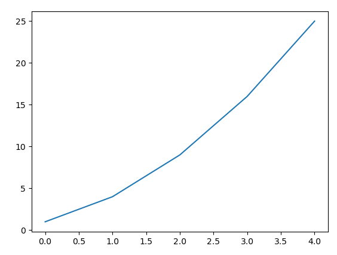

```python
import matplotlib.pyplot as plt

x = [1, 2, 3, 4, 5]
y = [1, 4, 9, 16, 25]

plt.plot(x, y)  # 根据坐标 x, y 值绘图
plt.show()  # 显示绘制结果
```


```python
import matplotlib.pyplot as plt

x = [1, 2, 3, 4, 5]
y = [i**3 for i in x]

plt.plot(x, y)  # 根据坐标 x, y 值绘图
plt.show()  # 显示绘制结果
```

<font face='楷体' color='red' size=5> 练一练 </font>

x取值1到100，模仿前面的代码，绘制$y=x^{1/2}$的曲线


```python
#  补充你的代码


```
颜色、线型、标记可以直接用参数值，也可以用fmt值

```python
import matplotlib.pyplot as plt

x = [1, 2, 3, 4, 5]
y = [1, 4, 9, 16, 25]  # N: 5个数
plt.plot(x, y, color='green', marker='o', linestyle='dashed',
         linewidth=2, markersize=12)   # 绿色，圆点，虚线

plt.show()   # 显示绘制结果
```


```python
import matplotlib.pyplot as plt

x = [1, 2, 3, 4, 5]
y = [1, 4, 9, 16, 25]  # N: 5个数
plt.plot(x, y, 'go--', linewidth=2, markersize=12)  # fmt-string

plt.show()   # 显示绘制结果
```

<font face='楷体' color='red' size=5> 练一练 </font>

参考以上代码，将线型改为实线，颜色设为蓝色。


```python
#  补充你的代码


```
利用range可以产生整数序列，利用列表推导式和math库中的函数，可以产生系列函数值的列表，绘制函数曲线。

```python
import matplotlib.pyplot as plt

x = range(1, 6)
y = [i ** 2 for i in x]

plt.plot(x, y)  # 根据坐标 x, y 值绘图
plt.show()  # 显示绘制结果
```

range只能产生整数序列，数据点较少时，只能绘制折线图，无法绘制圆滑曲线。


```python
import matplotlib.pyplot as plt
import math

x = range(0, 8)
sin_lsx = [math.sin(i) for i in x]  # 根据x值计算系列sin(x)值
cos_lsx = [math.cos(i) for i in x]  # 根据x值计算系列cos(x)值

plt.plot(x, sin_lsx)                # 根据坐标 x, sin_lsx 值绘sin(x)图
plt.plot(x, cos_lsx)                # 根据坐标 x, cos_lsx 值绘cos(x)图
plt.show()                          # 显示绘制结果
```
若希望绘制更平滑的函数曲线，可以利用numpy提供的函数产生系列浮点数的数组。 
## numpy数组运算

numpy提供的函数可以产生系列浮点数的数组，这些数据可以通过运算，直接得到数组中每个值对应的函数值构成的另一个数组。  


| 函数 | 描述 |
| :---- | :---- |
| array([x,y,x],dtype = int) | 将序列对象转换为数组，np.array([1, 2, 3, 4])返回数组 [1 2 3 4] |
| arange([x,]y[,i]) | 创建从x到y，步长为i的数组。np.**arange**(6) 返回数组[0 1 2 3 4 5] |
| linspace(x,y[,n]) | 参数为起始值、终止值和元素总数(默认50)，创建一维等差数组。
np.**linspace**(1, 5, 5) 返回数组 [1. 2. 3. 4. 5.] |
| logspace(x,y[,n]) | 参数为起始值、终止值和元素总数，创建一维等比数组。 |


```python
import matplotlib.pyplot as plt
import numpy as np

x = np.array(range(1, 6))  # 将序列转换为数组，元素默认整数
y = x ** 2     # 数组运算，每个元素平方，[1 4 9 16 25]
print(x)  # [1 2 3 4 5]
print(y)  # [ 1  4  9 16 25]
plt.plot(x, y)  # 根据坐标 x, y 值绘图
plt.show()  # 显示绘制结果
```

np.arange([x,] y [,i], dtype=int)
创建从x到y，步长为i的数组，步长可为小数


```python
numpy.arange([start, ]stop, [step, ]dtype=None, *, like=None)
```


```python
import matplotlib.pyplot as plt
import numpy as np

x = np.arange(1, 6, 0.1)  # 创建从1到6，步长为0.1的整数数组
y = x ** 2     # 数组运算，每个元素平方

plt.plot(x, y)  # 根据坐标 x, y 值绘图
plt.show()  # 显示绘制结果
```
np.linspace([x,] y [,i]）
创建从x到y，i个数的等差的数组

```python
numpy.linspace(start, stop, num=50, 
               endpoint=True, retstep=False, dtype=None, axis=0)
```


```python
import numpy as np

x = np.linspace(1, 10, 10)
print(x)  # [ 1.  2.  3.  4.  5.  6.  7.  8.  9. 10.]
```

<font face='楷体' color='red' size=5> 练一练 </font>

利用linspace()产生0到$2\pi$之间256个点的数据。


```python
# 补充你的代码
import numpy as np

x = np.linspace(1, 2*np.pi, 256)
print(x)  


```


```python
import matplotlib.pyplot as plt
import numpy as np

x = np.linspace(0, 5) # [0,5)，产生50个点的等差数组,x = np.linspace(0, 5, 50)
y1 = x
y2 = x ** 2           # 生成一系列x平方值的数组
y3 = x ** 3           # 生成一系列x立方值的数组
plt.plot(x, y1)       # 绘制二次函数曲线
plt.plot(x, y2)       # 绘制二次函数曲线
plt.plot(x, y3)       # 绘制三次函数曲线
plt.show()            # 显示创建的绘图对象
```

<font face='楷体' color='red' size=5> 练一练 </font>

参考上述代码，绘制-10到10之间，$y=x^3$的曲线


```python
# 补充你的代码


```


```python
import matplotlib.pyplot as plt
import numpy as np

def f(x):
    return 5*x**2-3*x-9


x = np.linspace(-10, 10)
y = [f(i) for i in x]

plt.plot(x, y)       # 绘制三次函数曲线
plt.show()            # 显示创建的绘图对象
```
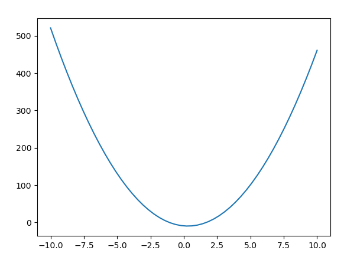
## 函数绘图

NumPy还提供了sin()、cos()、tan()等三角函数及反三角函数，exp()、log()等指数与对数函数，add()、power()、sqrt()和mod()等数学运算函数，这些函数可接受列表或数组为参数，返回包括系列函数值的数组。
下面利用np.linspace()产生包含50个x值的数组，利用np.sin()和np.cos()分别计算得到50个y值，绘制平滑的正余弦曲线图。


```python
import matplotlib.pyplot as plt  # 导入pyplot子库命名为plt
import numpy as np               # 导入numpy库命名为np

x_arr = np.linspace(0, 2*np.pi)  # 0到2pi之间产生50个等间距的点的数组
sin_arr = np.sin(x_arr)          # 根据x值计算50个sin(x)值，数组类型
cos_arr = np.cos(x_arr)          # 根据x值计算50个cos(x)值，数组类型

plt.plot(x_arr, sin_arr)         # 根据坐标 x, sin_lsx 值绘sin(x)曲线图
plt.plot(x_arr, cos_arr)         # 根据坐标 x, cos_lsx 值绘cos(x)曲线图
plt.show()                       # 显示绘制结果

```


```python
import matplotlib.pyplot as plt
import numpy as np


def plot_sin_cos(x): 
    sin_x = np.sin(x)   # 生成正弦值的数组
    cos_x = np.cos(x)   # 生成余弦值的数组

    plt.plot(x, sin_x)  # 绘制正弦函数曲线
    plt.plot(x, cos_x)  # 绘制余弦函数曲线


if __name__ == '__main__':
    x_data = np.linspace(0, 2 * np.pi)  # [0,2pi)，产生50个点为的等差数组
    plot_sin_cos(x_data)
    plt.show()          # 显示创建的绘图对象

```

<font face='楷体' color='red' size=5> 练一练 </font>

绘制正切函数曲线


```python
# 补充你的代码


```

<font face='楷体' color='red' size=5> 练一练 </font>

绘制-pi/2到pi/2之间正弦函数曲线和-1到1之间反正弦函数曲线


```python
# 补充你的代码


```

## 标注与美化

Matplotlib中支持对曲线进行各种标注与美化，规定线条颜色、线型、线标识、图名等操作。

plot([x], y, [fmt])                  # 绘制单条曲线
plot([x], y, [fmt], [x2], y2, [fmt2], ...)   # 同时绘制多条曲线

x,y：参数x,y可为数组类型数据或标量  
fmt：表示线条颜色、标记和线型的格式的字符串类型可选参数  
fmt = '[color][marker][line]'  
例如'go--'表示颜色为“green”、标记为“o”（圆点）、线型为破折线  
等价于“color= 'green', marker='*', linestyle= '--'”


```python
plt.plot(x, y, 'go--')    # 'go--'等价于color='green', marker='o', linestyle='dashed'
plt.plot(x, y, color='green', marker='o', linestyle='dashed')
```

plot()还可以通过以下参数设置线条属性：

线条属性：

| 属性 | 描述 |
| :---- | :---- |
| `color`或 c | 颜色 |
| `label` | 曲线标识 |
| `linestyle` 或 ls | 线型 |
| `linewidth` 或 lw | 线宽度 |
| `marker` | 数据点标记 |

线条风格（linestyle或ls）

| 线条风格 | 符号|描述| 
| :---- | :----  | :----  | 
|'solid'  | -  |实线     |
|'dashed' | -- |破折线    |
|'dotted' | :  |虚线     |
|'dashdot'| -. |点划线    |

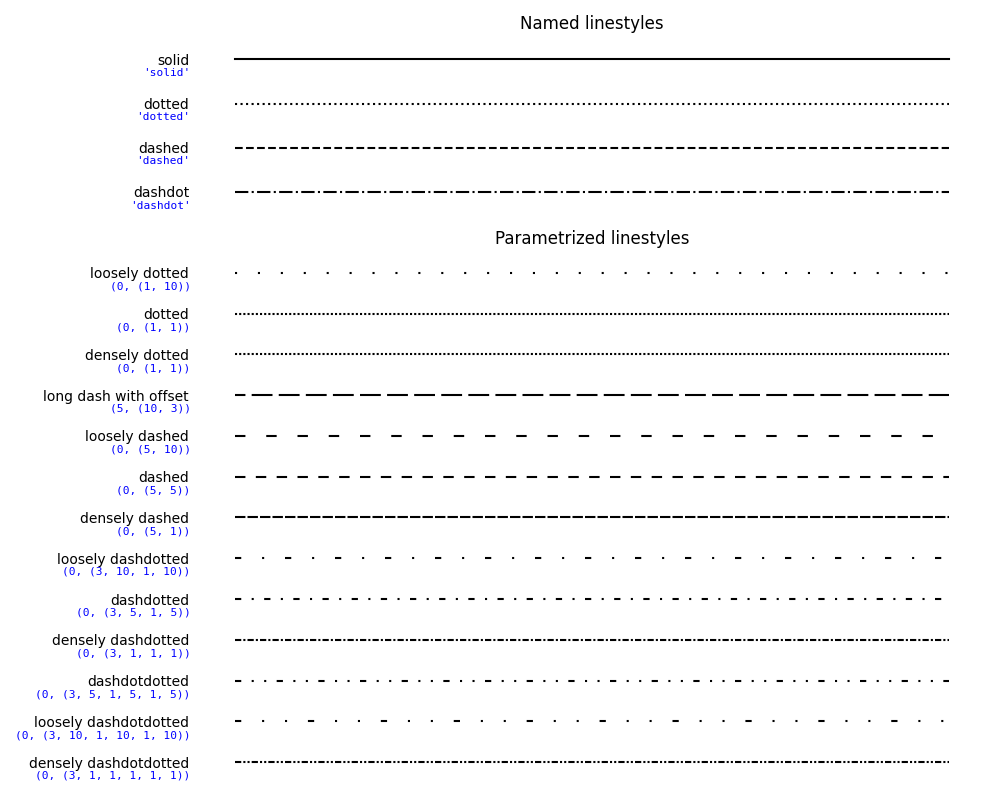


```python
plt.plot(x, y, '--')   
plt.plot(x, y, linestyle='--')
plt.plot(x, y, linestyle='dashed')
```

线条颜色（color 或 c）

| color | 别名 | 颜色 | color | 别名 | 颜色 |
| :---- | :---- | :---- | :---- | :---- | :---- |
| blue | b | 蓝色 | green | g | 绿色 |
| red | r | 红色 | yellow | y | 黄色 |
| cyan | c | 青色 | black | k | 黑色 |
| magenta | m | 洋红色 | white | w | 白色 |


```python
plt.plot(x, y, 'g')           # 'g'等价于color='green'l
plt.plot(x, y, color='green')
```

常用线条标记（marker）

| 标记 | 描述 | 标记 | 描述 |
| :---- | :---- | :---- | :---- |
| “,” | 像素 | “>” | 右三角形 |
| “. ” | 点 | “<” | 左三角形 |
| “o” | 圆 | “v” | 倒三角形 |
| “D” | 菱形 | “^” | 正三角形 |
| “d” | 小菱形 | “1” | 正三分支 |
| “s” | 正方形 | “2” | 倒三分支 |
| “p” | 五边形 | “3” | 左三分支 |
| “h” | 六边形 | “4” | 右三分支 |
| “H” | 六边形 | “*” | 星号 |
| “8” | 八边形 | “+” | 加号 |
| “&#124;” | 竖直线 | “P” | 填充的加号 |
| “_” | 水平线 | “x” | 乘号 |
| “None”, “  ” , “”  | 无标记 | '$...$' | 字符串转为数学文本描述 |


```python
plt.plot(x, y, 'o-')           # marker单用时无线，需指定线型
plt.plot(x, y, marker='o')
```

线条标记效果：
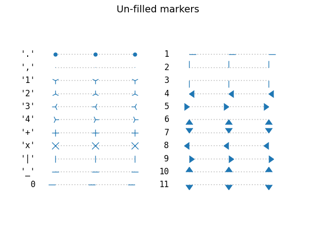
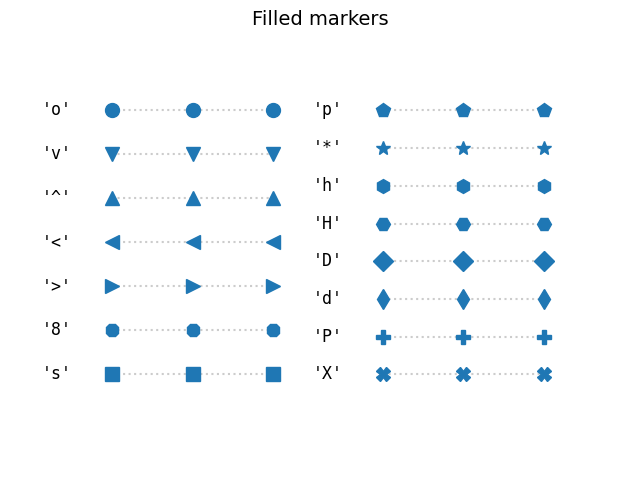
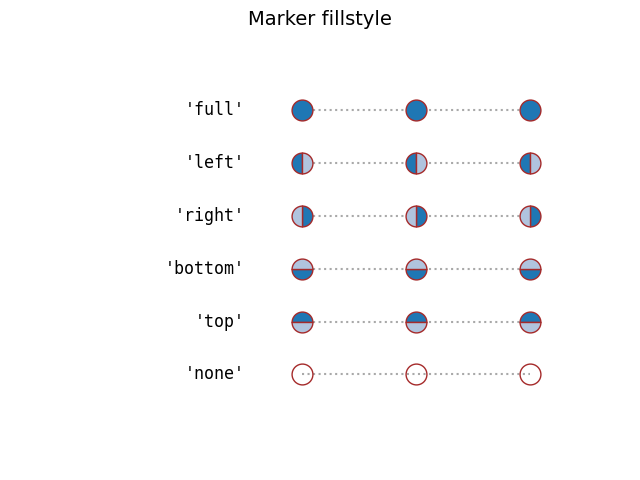
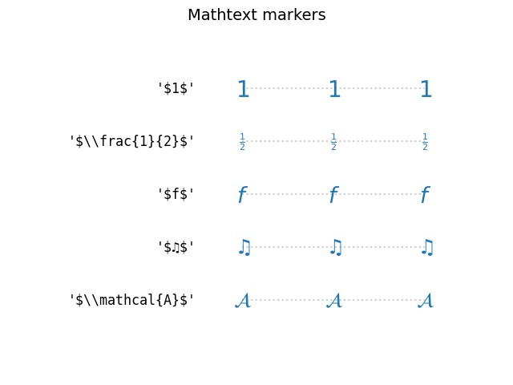
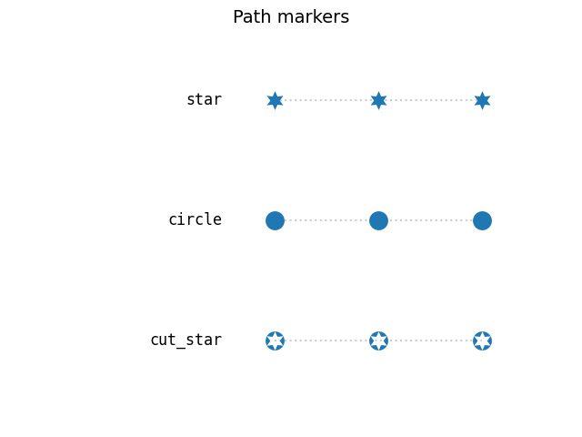
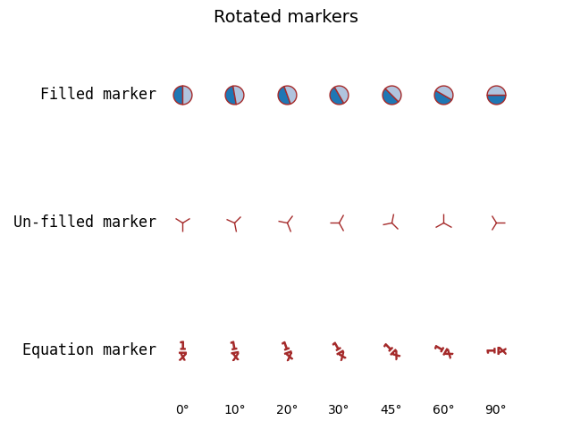
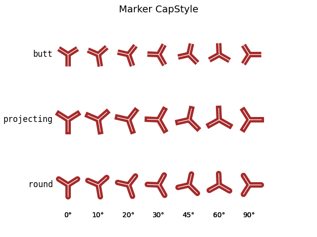


## 设置线型、宽度、颜色与标记

linewidth 或 lw：浮点数，线条宽度
label：设置用于显示的线的标签


```python
import matplotlib.pyplot as plt
import numpy as np


def plot_sin_cos(x):
    sin_x = np.sin(x)
    cos_x = np.cos(x)
    plt.plot(x, cos_x, color="blue", marker='o', linewidth=2, linestyle="-", label="cos(x)")
    plt.plot(x, sin_x, color="red", linewidth=2, linestyle="--", label="sin(x)")
    # 绘制正弦曲线，使用红色的、破折线，宽度为 2 像素的线条
    plt.legend(loc='lower left')


if __name__ == '__main__':
    x_data = np.linspace(0, 2 * np.pi)
    plot_sin_cos(x_data)
    plt.show()  # 显示创建的绘图对象

```
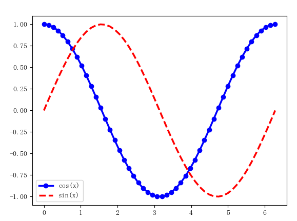
标签相关函数

| 函数 | 描述 |
| :---- | :---- |
| title() | 为当前绘图添加标题 |
| legend() | 为当前绘图放置图注 |
| annotate() | 为指定数据点创建注释 |
| xlabel(s) | 设置x轴标签 |
| ylabel(s) | 设置y轴标签 |
| xticks() | 设置x轴刻度位置和标签 |
| yticks() | 设置y轴刻度位置和标签 |


```python
matplotlib.pyplot.yticks(ticks=None, labels=None, **kwargs)
matplotlib.pyplot.xticks(ticks=None, labels=None, **kwargs)

ticks: array-like, optional
labels:array-like, optional

matplotlib.pyplot.axhline(y=0, xmin=0, xmax=1, **kwargs)
matplotlib.pyplot.axvline(x=0, ymin=0, ymax=1, **kwargs)
```

## 设定图名与线条标注


```python
import matplotlib.pyplot as plt
import numpy as np


def plot_sin_cos(x):
    sin_x = np.sin(x)
    cos_x = np.cos(x)
    plt.plot(x, cos_x, color="blue", marker='o', linewidth=2, linestyle="-", label="cos(x)")
    plt.plot(x, sin_x, color="red", linewidth=2, linestyle="--", label="sin(x)")
    # 绘制正弦曲线，使用红色的、破折线，宽度为 2 像素的线条
    plt.legend(loc='lower left')


def draw_label():
    plt.title('curve of sin and cos')
    plt.xlabel('x')
    plt.ylabel('y')

    
if __name__ == '__main__':
    x_data = np.linspace(0, 2 * np.pi)
    plot_sin_cos(x_data)
    draw_label()
    plt.show()  # 显示创建的绘图对象
```
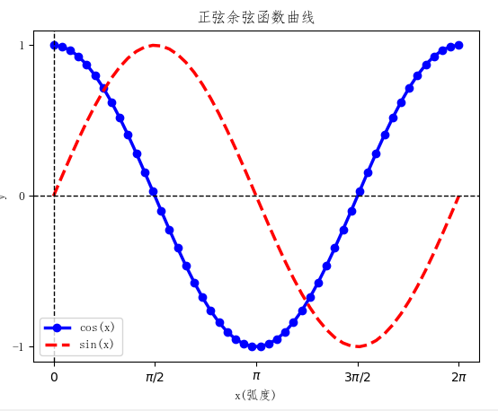
坐标轴相关函数

| 函数 | 描述 |
| :---- | :---- |
| xlim(xmin,xmax) | 设置当前x轴取值范围 |
| ylim(ymin,ymax) | 设置当前y轴取值范围 |


绘制直线相关函数

| 函数 | 描述 |
| :---- | :---- |
| axhline(x=0, ymin=0, ymax=1) | 绘制水平线，y取值从0到1为整个区间。 |
| hlines() | 绘制水平线 |
| axvline(x=0,   ymin=0, ymax=1) | 绘制垂直线，y取值从0到1为整个区间。 |
| vlines() | 绘制垂直线 |

## 设定坐标轴上下限


```python
def draw_lim():
    plt.ylim(-1.1, 1.1)  # 设置纵轴的上下限
    plt.yticks([-1, 0, +1])  # 设置纵轴刻度
    plt.xticks([0, np.pi / 2, np.pi, 3 * np.pi / 2, 2 * np.pi],
               [r'$0$', r'$\pi/2$', r'$\pi$', r'$3\pi/2$', r'$2\pi$'])  # 转数学表示
    plt.axhline(0, linestyle='--', color='black', linewidth=1)  # 绘制水平线x轴,0可省
    plt.axvline(0, linestyle='--', color='black', linewidth=1)  # 绘制垂直线y轴,0可省

```
[0, np.pi / 2, np.pi, 3 * np.pi / 2, 2 * np.pi] 需要显示的标记点

[r'$0$', r'$\pi/2$', r'$\pi$', r'$3\pi/2$', r'$2\pi$']
r 表示原生字符串
$$符号之间的字符串会转为数学表示

```python
import matplotlib.pyplot as plt
import numpy as np

plt.rcParams['font.sans-serif'] = ['SimSun']  # 在此页面上只可用此字体，本地可以使用'FangSong'和Simhei等字体
plt.rcParams['axes.unicode_minus'] = False


def plot_sin_cos(x):
    sin_x = np.sin(x)
    cos_x = np.cos(x)
    plt.plot(x, cos_x, color="blue", marker='o', linewidth=2, linestyle="-", label="cos(x)")
    plt.plot(x, sin_x, color="red", linewidth=2, linestyle="--", label="sin(x)")
    # 绘制正弦曲线，使用红色的、破折线，宽度为 2 像素的线条
    plt.legend(loc='lower left')


def draw_lim():
    plt.ylim(-1.1, 1.1)  # 设置纵轴的上下限
    plt.yticks([-1, 0, +1])  # 设置纵轴刻度
    plt.xticks([0, np.pi / 2, np.pi, 3 * np.pi / 2, 2 * np.pi],
               [r'$0$', r'$\pi/2$', r'$\pi$', r'$3\pi/2$', r'$2\pi$'])  # 转数学表示
    plt.axhline(0, linestyle='--', color='black', linewidth=1)  # 绘制水平线x轴,0可省
    plt.axvline(0, linestyle='--', color='black', linewidth=1)  # 绘制垂直线y轴,0可省
    # plt.axvline(np.pi,linestyle='--', color='black', linewidth=1)  # 绘制垂直线,pi


def draw_label():
    plt.title('curve of sin and cos')
    plt.xlabel('x')
    plt.ylabel('y')


if __name__ == '__main__':
    x_data = np.linspace(0, 2 * np.pi)
    plot_sin_cos(x_data)
    draw_label()
    draw_lim()
    plt.show()  # 显示创建的绘图

```
.png)
填充相关函数

| 函数 | 描述 |
| :---- | :---- |
| axhspan() | 水平区域 |
| axvspan() | 竖直区域 |
| fill_between() | 填充两条曲线围起的区域，区间由横坐标限定 |
| fill_betweenx() | 填充两条曲线围起的区域，区间由纵坐标限定 |

## 填充区域


```python
def fill_area(x):
    """填充pi/2与3*pi/2之间，x轴与cos(x)包围的区域"""
    plt.fill_between(x, np.cos(x), where=((x >= np.pi / 2) & (x <= 3 * np.pi / 2)), facecolor='grey', alpha=0.25)

```


```python
def fill_span_area():
    """填充x轴上方y值在(0.25,0.5)之间区域，绿色，透明度50%；
    填充x轴上方y值在(-0.5，-0.25)之间区域，绿色，透明度25%；
    填充x轴上方x值在(3*np.pi/2-0.3,3*np.pi/2+0.3)之间区域，红色，透明度25%
    填充x轴上方x值在(np.pi/2-0.3,np.pi/2+0.3)之间区域，红色，透明度50%
    """
    # 整个区间为0，1.0，此例中0,0.5表示取x轴前半部分区间，0.5,1.0表示取后半部区间
    plt.axhspan(0.25, 0.5, 0, 0.5, color='green', alpha=0.5)
    plt.axhspan(-0.5, -0.25, color='green', alpha=0.25)
    plt.axvspan(3 * np.pi / 2 - 0.3, 3 * np.pi / 2 + 0.3, color='red', alpha=0.25)
    # 整个区间为0，1.0，此例中0.5，1.0表示取x轴上部区间，0，0.5表示取x轴下部区间
    plt.axvspan(np.pi / 2 - 0.3, np.pi / 2 + 0.3, 0.5, 1.0, color='red', alpha=0.5)
```


```python
import matplotlib.pyplot as plt
import numpy as np

plt.rcParams['font.sans-serif'] = ['SimSun']  # 在此页面上只可用此字体，本地可以使用'FangSong'和Simhei等字体
plt.rcParams['axes.unicode_minus'] = False


def plot_sin_cos(x):
    sin_x = np.sin(x)
    cos_x = np.cos(x)
    plt.plot(x, cos_x, color="blue", marker='o', linewidth=2, linestyle="-", label="cos(x)")
    plt.plot(x, sin_x, color="red", linewidth=2, linestyle="--", label="sin(x)")
    # 绘制正弦曲线，使用红色的、破折线，宽度为 2 像素的线条
    plt.legend(loc='lower left')


def draw_lim():
    plt.ylim(-1.1, 1.1)  # 设置纵轴的上下限
    plt.yticks([-1, 0, +1])  # 设置纵轴刻度
    plt.xticks([0, np.pi / 2, np.pi, 3 * np.pi / 2, 2 * np.pi],
               [r'$0$', r'$\pi/2$', r'$\pi$', r'$3\pi/2$', r'$2\pi$'])  # 转数学表示
    plt.axhline(0, linestyle='--', color='black', linewidth=1)  # 绘制水平线x轴,0可省
    plt.axvline(0, linestyle='--', color='black', linewidth=1)  # 绘制垂直线y轴,0可省
    # plt.axvline(np.pi,linestyle='--', color='black', linewidth=1)  # 绘制垂直线,pi


def draw_label():
    plt.title('curve of sin and cos')
    plt.xlabel('x')
    plt.ylabel('y')


def fill_area(x):
    """填充pi/2与3*pi/2之间，x轴与cos(x)包围的区域"""
    plt.fill_between(x, np.cos(x), where=((x >= np.pi / 2) & (x <= 3 * np.pi / 2)), facecolor='grey', alpha=0.25)


if __name__ == '__main__':
    x_data = np.linspace(0, 2 * np.pi)
    plot_sin_cos(x_data)
    draw_label()
    draw_lim()
    fill_area(x_data)
    plt.show()  # 显示创建的绘图

```


```python
import matplotlib.pyplot as plt
import numpy as np

plt.rcParams['font.sans-serif'] = ['SimSun']  # 在此页面上只可用此字体，本地可以使用'FangSong'和Simhei等字体
plt.rcParams['axes.unicode_minus'] = False


def plot_sin_cos(x):
    sin_x = np.sin(x)
    cos_x = np.cos(x)
    plt.plot(x, cos_x, color="blue", marker='o', linewidth=2, linestyle="-", label="cos(x)")
    plt.plot(x, sin_x, color="red", linewidth=2, linestyle="--", label="sin(x)")
    # 绘制正弦曲线，使用红色的、破折线，宽度为 2 像素的线条
    plt.legend(loc='lower left')


def draw_lim():
    plt.ylim(-1.1, 1.1)  # 设置纵轴的上下限
    plt.yticks([-1, 0, +1])  # 设置纵轴刻度
    plt.xticks([0, np.pi / 2, np.pi, 3 * np.pi / 2, 2 * np.pi],
               [r'$0$', r'$\pi/2$', r'$\pi$', r'$3\pi/2$', r'$2\pi$'])  # 转数学表示
    plt.axhline(0, linestyle='--', color='black', linewidth=1)  # 绘制水平线x轴,0可省
    plt.axvline(0, linestyle='--', color='black', linewidth=1)  # 绘制垂直线y轴,0可省
    # plt.axvline(np.pi,linestyle='--', color='black', linewidth=1)  # 绘制垂直线,pi


def draw_label():
    plt.title('curve of sin and cos')
    plt.xlabel('x')
    plt.ylabel('y')


def fill_span_area():
    """填充x轴上方y值在(0.25,0.5)之间区域，绿色，透明度50%；
    填充x轴上方y值在(-0.5，-0.25)之间区域，绿色，透明度25%；
    填充x轴上方x值在(3*np.pi/2-0.3,3*np.pi/2+0.3)之间区域，红色，透明度25%
    填充x轴上方x值在(np.pi/2-0.3,np.pi/2+0.3)之间区域，红色，透明度50%
    """
    # 整个区间为0，1.0，此例中0,0.5表示取x轴前半部分区间，0.5,1.0表示取后半部区间
    plt.axhspan(0.25, 0.5, 0, 0.5, color='green', alpha=0.5)
    plt.axhspan(-0.5, -0.25, color='green', alpha=0.25)
    plt.axvspan(3 * np.pi / 2 - 0.3, 3 * np.pi / 2 + 0.3, color='red', alpha=0.25)
    # 整个区间为0，1.0，此例中0.5，1.0表示取x轴上部区间，0，0.5表示取x轴下部区间
    plt.axvspan(np.pi / 2 - 0.3, np.pi / 2 + 0.3, 0.5, 1.0, color='red', alpha=0.5)

if __name__ == '__main__':
    x_data = np.linspace(0, 2 * np.pi)
    plot_sin_cos(x_data)
    draw_label()
    draw_lim()
    fill_span_area()
    plt.show()  # 显示创建的绘图

```

保存与显示相关函数

| 函数 | 描述 |
| :---- | :---- |
| savefig('文件名') | 保存绘制的图像，必须置于绘制完成之后和show()之前<br />需先pip   install pillow库 |
| show() | 显示绘制的图像，同时清空缓冲区 |

## 保存图片文件

注意：savefig()函数必须置于绘制完成之后和show()之前


```python
import matplotlib.pyplot as plt
import numpy as np


def plot_sin_cos(x):
    sin_x = np.sin(x)
    cos_x = np.cos(x)
    plt.plot(x, cos_x, color="blue", marker='o', linewidth=2, linestyle="-", label="cos(x)")
    plt.plot(x, sin_x, color="red", linewidth=2, linestyle="--", label="sin(x)")
    # 绘制正弦曲线，使用红色的、破折线，宽度为 2 像素的线条
    plt.legend(loc='lower left')


if __name__ == '__main__':
    x_data = np.linspace(0, 2 * np.pi)
    plot_sin_cos(x_data)
    plt.savefig('sin_cos.jpg')
    plt.show()  # 显示创建的绘图对象
```

## 中文显示--rc参数

matplotlib默认字体由一组rcParams控制，默认使用安装在用户计算机上的英文字体系列，如Helvetica, Times等，中文无法正常显示。  
可以通过设置rcParams参数值来修改用于显示的中文字体。

在此页面上<font color=Red>__只可用SimSun__</font>字体，本地可以使用<font color=Red>__'FangSong'和Simhei等__</font>字体

| **序号** | **属性** | **说明** |
| :---- | :---- | :---- |
| 1 | plt.rcParams[**'**axes.unicode_minus**'**] = False | 字符显示 |
| 2 | plt.rcParams[**'**font.sans-serif**'**] = **'**SimHei**'** | 设置字体 |
| 3 | plt.rcParams[**'**lines.linestyle**'**] = **'**-.** '** | 线条样式 |
| 4 | plt.rcParams[**'**lines.linewidth**'**] = 3 | 线条宽度 |
| 5 | plt.rcParams[**'**lines.color**'**] = **'**blue**'** | 线条颜色 |
| 6 | plt.rcParams[**'**lines.marker**'**] = None | 默认标记 |
| 7 | plt.rcParams[**'**lines.markersize**'**] = 6 | 标记大小 |
| 8 | plt.rcParams[**'**lines.markeredgewidth**'**] = 0.5 | 标记附近的线宽 |
| 9 | plt.rcParams[**'**xtick.labelsize**'**] | 横轴字体大小 |
| 10 | plt.rcParams[**'**ytick.labelsize**'**] | 纵轴字体大小 |
| 11 | plt.rcParams[**'**xtick.major.size**'**] | x轴最大刻度 |
| 12 | plt.rcParams[**'**ytick.major.size**'**] | y轴最大刻度 |
| 13 | plt.rcParams[**'**axes.titlesize**'**] | 子图的标题大小 |
| 14 | plt.rcParams[**'**axes.labelsize**'**] | 子图的标签大小 |
| 15 | plt.rcParams[**'**figure.dpi**'**] | 图像分辨率 |
| 16 | plt.rcParams[**'**figure.figsize**'**] | 图像显示大小 |
| 17 | plt.rcParams[**'**savefig.dpi**'**] | 图片像素 |


```python
plt.rcParams['font.sans-serif'] = ['SimSun']  # 宋体
# Mac下面用：Heiti TC、Songti SC或Arial Unicode MS
plt.rcParams['axes.unicode_minus'] = False
# 解决保存图像是负号'-'显示为方块的问题

```
在需要显示中文的语句中fontproperties指定字体（不是所有plt方法都支持此属性）

```python
plt.title('正弦余弦图像',fontproperties="SimSun")
```


```python
import matplotlib.pyplot as plt
import numpy as np

plt.rcParams['font.sans-serif'] = ['SimSun']  # 宋体
plt.rcParams['axes.unicode_minus'] = False


def plot_sin_cos(x):
    sin_x = np.sin(x)
    cos_x = np.cos(x)
    plt.plot(x, cos_x, color="blue", marker='o', linewidth=2, linestyle="-", label="cos(x)")
    plt.plot(x, sin_x, color="red", linewidth=2, linestyle="--", label="sin(x)")
    # 绘制正弦曲线，使用红色的、破折线，宽度为 2 像素的线条
    plt.legend(loc='lower left')


def draw_label():
    plt.title('正弦余弦函数曲线')
    # plt.title('正弦余弦图像',fontproperties="SimSun")  # 可以在语句中指定中文字体
    plt.xlabel('x(弧度)')
    plt.ylabel('y')

    
if __name__ == '__main__':
    x_data = np.linspace(0, 2 * np.pi)
    plot_sin_cos(x_data)
    draw_label()
    plt.show()  # 显示创建的绘图对象
```
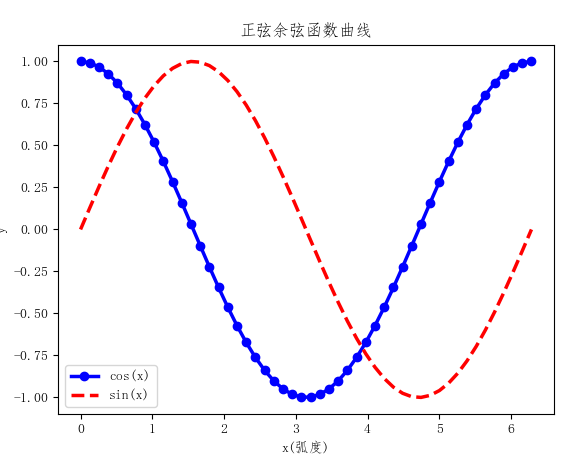
## 数据点标注
matplotlib.pyplot.annotate(text, xy, *args, **kwargs)
参数：
text：str，标注的文本

xy：(float, float)，(横坐标，纵坐标) 箭头尖端，需要加标注的点的坐标

xytext：(float, float), 缺省为 xy，(横坐标，纵坐标) 放置标注文本的点的坐标 (x, y) 

xycoords：被注释点的坐标系属性

textcoords ：注释文本的坐标系属性，默认与xycoords属性值相同，允许输入以下两种：
    'offset points'相对于被注释点xy的偏移量（单位是点）
    'offset pixels'相对于被注释点xy的偏移量（单位是像素）
    
arrowprops：箭头，字典类型，{facecolor= '颜色',shrink = '数字' <1 收缩箭头}

```python
import matplotlib.pyplot as plt
import numpy as np

plt.rcParams['font.sans-serif'] = ['SimSun']  # 在此页面上只可用此字体，本地可以使用'FangSong'和Simhei等字体
plt.rcParams['axes.unicode_minus'] = False


def plot_sin_cos(x):
    sin_x = np.sin(x)
    cos_x = np.cos(x)
    plt.plot(x, cos_x, color="blue", marker='o', linewidth=2, linestyle="-", label="cos(x)")
    plt.plot(x, sin_x, color="red", linewidth=2, linestyle="--", label="sin(x)")
    # 绘制正弦曲线，使用红色的、破折线，宽度为 2 像素的线条
    plt.legend(loc='lower right')


def draw_lim():
    plt.ylim(-1.1, 1.1)  # 设置纵轴的上下限
    plt.yticks([-1, 0, +1])  # 设置纵轴刻度
    plt.xticks([0, np.pi / 2, np.pi, 3 * np.pi / 2, 2 * np.pi],
               [r'$0$', r'$\pi/2$', r'$\pi$', r'$3\pi/2$', r'$2\pi$'])  # 转数学表示
    plt.axhline(0, linestyle='--', color='black', linewidth=1)  # 绘制水平线x轴,0可省
    plt.axvline(0, linestyle='--', color='black', linewidth=1)  # 绘制垂直线y轴,0可省
    # plt.axvline(np.pi,linestyle='--', color='black', linewidth=1)  # 绘制垂直线,pi


def draw_label():
    plt.title('正弦余弦函数曲线')
    plt.xlabel('x(弧度)')
    plt.ylabel('y')


def add_annotate_upper():
    """数据点标注"""
    t = 2 * np.pi / 3
    plt.plot([t, t], [0, np.sin(t)], color='red', linewidth=2.5, linestyle="--")  # 过(t,0),(t,sin(t))画线段，红色，破折线
    plt.scatter([t, ], [np.cos(t), ], 50, color='blue')  # 为 (t,cos(t))处画一个蓝色圆点
    # 为 sin(t)处加注释
    plt.annotate(r'$\sin(\frac{2\pi}{3})=\frac{\sqrt{3}}{2}$',
                 xy=(t, np.sin(t)), xycoords='data',
                 xytext=(+30, 0), textcoords='offset points', fontsize=16,
                 arrowprops=dict(arrowstyle="->", connectionstyle="arc3,rad=.2"))


if __name__ == '__main__':
    x_data = np.linspace(0, 2 * np.pi)
    plot_sin_cos(x_data)
    draw_label()
    draw_lim()
    add_annotate_upper()
    plt.show()  # 显示创建的绘图
```


```python
import matplotlib.pyplot as plt
import numpy as np

plt.rcParams['font.sans-serif'] = ['SimSun']  # 在此页面上只可用此字体，本地可以使用'FangSong'和Simhei等字体
plt.rcParams['axes.unicode_minus'] = False


def plot_sin_cos(x):
    sin_x = np.sin(x)
    cos_x = np.cos(x)
    plt.plot(x, cos_x, color="blue", marker='o', linewidth=2, linestyle="-", label="cos(x)")
    plt.plot(x, sin_x, color="red", linewidth=2, linestyle="--", label="sin(x)")
    # 绘制正弦曲线，使用红色的、破折线，宽度为 2 像素的线条
    plt.legend(loc='lower right')


def draw_lim():
    plt.ylim(-1.1, 1.1)  # 设置纵轴的上下限
    plt.yticks([-1, 0, +1])  # 设置纵轴刻度
    plt.xticks([0, np.pi / 2, np.pi, 3 * np.pi / 2, 2 * np.pi],
               [r'$0$', r'$\pi/2$', r'$\pi$', r'$3\pi/2$', r'$2\pi$'])  # 转数学表示
    plt.axhline(0, linestyle='--', color='black', linewidth=1)  # 绘制水平线x轴,0可省
    plt.axvline(0, linestyle='--', color='black', linewidth=1)  # 绘制垂直线y轴,0可省
    # plt.axvline(np.pi,linestyle='--', color='black', linewidth=1)  # 绘制垂直线,pi


def draw_label():
    plt.title('正弦余弦函数曲线')
    plt.xlabel('x(弧度)')
    plt.ylabel('y')


def add_annotate_lower():
    """数据点标注"""
    t = 2 * np.pi / 3
    plt.plot([t, t], [0, np.cos(t)], color='blue', linewidth=2.5, linestyle="--")  # 过(t,0),(t,cos(t))画线段，蓝色，破折线
    plt.scatter([t, ], [np.sin(t), ], 50, color='red')  # 为 (t,sin(t))处画一个红色圆点
    # 为 cos(t)处加注释
    plt.annotate(r'$\cos(\frac{2\pi}{3})=-\frac{1}{2}$',
                 xy=(t, np.cos(t)), xycoords='data',
                 xytext=(-90, -50), textcoords='offset points', fontsize=16,
                 arrowprops=dict(arrowstyle="->", connectionstyle="arc3,rad=.2"))


if __name__ == '__main__':
    x_data = np.linspace(0, 2 * np.pi)
    plot_sin_cos(x_data)
    draw_label()
    draw_lim()
    add_annotate_lower()
    plt.show()  # 显示创建的绘图
```

## 绘制多子图

Matplotlib提供将同一画布划分成多个子区域的方法，可以将多个图形在同一个画布上不同区域绘制。可应用subplot()函数实现，使用语法如下：


```python
subplot(nrows, ncols, index, **kwargs)
subplot(pos, **kwargs)
subplot(**kwargs)
subplot(ax)
```

参数nrows, ncols, index分别表示行数、列数和序号。  
当前画布被划分为nrows×ncols个子区域，index表示当前图绘制在第index个子区域。  
当行数、列数和序号全部小于10时，也可以将三个数字合并成一个三位数字来表示。  
例如subplot(2, 3, 3) 和subplot(233) 都可以创建一个2行3列的绘图区域，当前图占用序号为3的区域。

将一个画布分三个子图区域，第一行分两个子图，分别绘制正弦和余弦函数曲线，第二行为一个子图区域，绘制函数sin(6x)的曲线。


```python
import matplotlib.pyplot as plt               # 导入pyplot子库命名为plt
import numpy as np                            # 导入numpy库命名为np

x_arr = np.linspace(0, 2*np.pi, 256)          # 0到2pi之间产生256个等间距的点的数组
sin_arr = np.sin(x_arr)                       # 根据x值计算50个sin(x)值，数组类型
cos_arr = np.cos(x_arr)                       # 根据x值计算50个cos(x)值，数组类型
plt.subplot(2, 2, 1)                          # 分成2行2列，占用第1个位置
plt.plot(x_arr, sin_arr, '--r', lw=2)         # 红色破折线
plt.subplot(2, 2, 2)                          # 分成2行2列，占用第2个
plt.plot(x_arr, cos_arr, ':g')                # 绿色虚线
plt.subplot(2, 1, 2)                          # 分成2行1列，占用第2个
plt.plot(x_arr, np.sin(6*x_arr), '-b', lw=2)  # y="sin(6x)"函数曲线
plt.show()                                    # 显示绘制结果
```


```python
# 用函数实现结构更清晰

import matplotlib.pyplot as plt               # 导入pyplot子库命名为plt
import numpy as np                            # 导入numpy库命名为np

def sub_plot():
    plt.subplot(2, 2, 1)                          # 分成2行2列，占用第1个位置
    plt.plot(x_arr, sin_arr, '--r', lw=2)         # 红色破折线
    plt.subplot(2, 2, 2)                          # 分成2行2列，占用第2个
    plt.plot(x_arr, cos_arr, ':g')                # 绿色虚线
    plt.subplot(2, 1, 2)                          # 分成2行1列，占用第2个
    plt.plot(x_arr, np.sin(6*x_arr), '-b', lw=2)  # y="sin(6x)"函数曲线


if __name__ == '__main__':
    x_arr = np.linspace(0, 2 * np.pi, 256)  # 0到2pi之间产生256个等间距的点的数组
    sin_arr = np.sin(x_arr)  # 根据x值计算50个sin(x)值，数组类型
    cos_arr = np.cos(x_arr)  # 根据x值计算50个cos(x)值，数组类型
    sub_plot()
    plt.show()       # 显示绘制结果
```
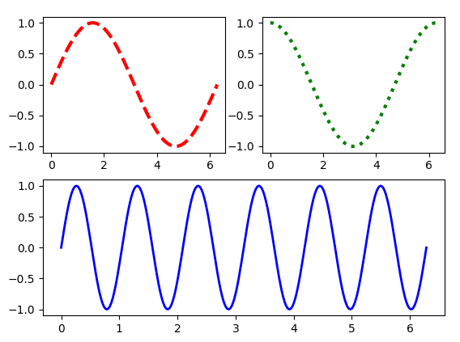