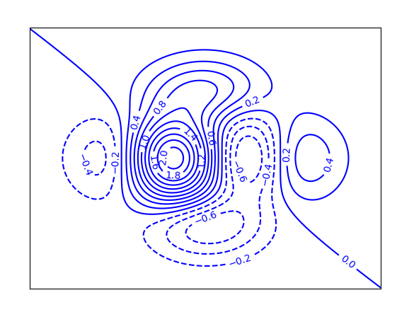

# 非线性图

## 饼图

饼图英文学名为Sector Graph，常用于统计学模块。2D饼图为圆形，手画时，常用圆规作图。  
仅排列在工作表的一列或一行中的数据可以绘制到饼图中。  
饼图显示一个数据系列中各项的大小与各项总和的比例。 
数据系列：在图表中绘制的相关数据点，这些数据源自数据表的行或列。  
图表中的每个数据系列具有唯一的颜色或图案并且在图表的图例中表示。  
可以在图表中绘制一个或多个数据系列。饼图只有一个数据系列。  
饼图中的数据点显示为整个饼图的百分比。  
数据点：在图表中绘制的单个值，这些值由条形、柱形、折线、饼图或圆环图的扇面、圆点和其他被称为数据标记的图形表示。  
相同颜色的数据标记组成一个数据系列。


绘制饼图使用pie()方法：


```python
pyplot.pie(x, explode=None, labels=None, colors=None, 
           autopct=None, pctdistance=0.6, shadow=False, 
           labeldistance=1.1, startangle=0, radius=1, 
           counterclock=True, wedgeprops=None, 
           textprops=None, center=(0, 0), frame=False, 
           rotatelabels=False, *, normalize=True, data=None)
```

最简单的饼图：


[tiobe_pie.txt](./数据集/tiobe_pie.txt)


```python
import matplotlib.pyplot as plt
import matplotlib as mpl

mpl.rcParams['figure.figsize'] = (12,6)  # 修改图片大小
plt.rcParams['figure.dpi'] = 300          # default for me was 75

with open('/data/bigfiles/7993db06-0ec3-4bfd-b683-ab87dcbb6a97.txt', 'r', encoding='utf-8') as fr:
    data_lst = [line.strip().split(',') for line in fr]  # 数据转列表
print(data_lst)
rank = [float(x[1]) for x in data_lst]  # 百分比的列表
plt.pie(rank)
plt.show()
```

用函数实现，方便扩展功能：


```python
import matplotlib.pyplot as plt


def read_txt(filename):
    """接收文件名为参数，读取文件中的数据到二维列表中，返回二维列表。"""
    with open(filename, 'r', encoding='utf-8') as fr:
        data_lst = [line.strip().split(',') for line in fr]  # 数据转列表
    return data_lst


def pie_of_programs(data_lst):
    """绘制饼图"""
    rank = [float(x[1]) for x in data_lst]  # 百分比的列表
    plt.pie(rank)


if __name__ == '__main__':
    file = '/data/bigfiles/7993db06-0ec3-4bfd-b683-ab87dcbb6a97.txt'
    data = read_txt(file)
    pie_of_programs(data)
    plt.show()
```

为饼图增加标签


```python
import matplotlib.pyplot as plt


def read_txt(filename):
    """接收文件名为参数，读取文件中的数据到二维列表中，返回二维列表。"""
    with open(filename, 'r', encoding='utf-8') as fr:
        data_lst = [line.strip().split(',') for line in fr]  # 数据转列表
    return data_lst

    
def pie_of_programs(data_lst):
    """绘制饼图，增加标签"""
    prog_name = [x[0] for x in data_lst]    # 语言名列表
    rank = [float(x[1]) for x in data_lst]  # 百分比的列表
    plt.pie(rank, labels=prog_name)
    

if __name__ == '__main__':
    file = '/data/bigfiles/7993db06-0ec3-4bfd-b683-ab87dcbb6a97.txt'
    data = read_txt(file)
    pie_of_programs(data)
    plt.show()


```


增加图注并设置突出显示：  
explode参数值设为列表为元组，元素数量与饼图块数相同，除需要突出的元素外都置0，需要突出的元素设一个大于0的小数，数值越大突出越多。
例如：


```python
exp = [0.1, 0, 0, 0, 0, 0, 0, 0, 0, 0, 0]
```


```python
import matplotlib.pyplot as plt


def read_txt(filename):
    """接收文件名为参数，读取文件中的数据到二维列表中，返回二维列表。"""
    with open(filename, 'r', encoding='utf-8') as fr:
        data_lst = [line.strip().split(',') for line in fr]  # 数据转列表
    return data_lst


def pie_of_programs(data_lst, program):  # program = 'Python'
    plt.axes(aspect=1)  # 设置参数为1使饼图是圆的
    prog_name = [x[0] for x in data_lst]    # 语言名列表
    rank = [float(x[1]) for x in data_lst]  # 百分比的列表
    exp = [0] * len(prog_name)      # 获得长度数据数量相同，元素为0的列表
    num = prog_name.index(program)  # 获得数据python的序号
    exp[num] = 0.1                  # 数据python突出显示
    plt.pie(rank, explode=exp, labels=prog_name, labeldistance=1.1,
            autopct='%2.1f%%', shadow=True, startangle=90,
            pctdistance=0.8)
    plt.legend(loc='lower right', bbox_to_anchor=(1.3, 0))  # 右下角例


if __name__ == '__main__':
    file = '/data/bigfiles/7993db06-0ec3-4bfd-b683-ab87dcbb6a97.txt'
    data = read_txt(file)
    pie_of_programs(data,'Python')
    plt.show()


```

修改图注位置与模式
读下面文件绘制饼图

[tiobe202208.txt](./数据集/tiobe202208.txt)


```python
def draw_pie(tiobe):
    plt.figure(figsize=(6, 6)) # 画布600*600
    lan_name = [list(line.keys())[0] for line in tiobe] + ['other']
    rank = [list(line.values())[-1][-1][-1] for line in tiobe]
    rank = rank + [100 - round(sum(rank), 2)]
    exp = [0.1, 0, 0, 0, 0, 0, 0, 0, 0, 0, 0]

    colors = cm.rainbow(np.arange(len(rank)) / len(rank))  # colormaps: Paired, autumn, rainbow, gray,spring,Darks
    plt.pie(rank, labels=lan_name, explode=exp, pctdistance=0.8,
            startangle=90, autopct='%2.1f%%', shadow=True,
            labeldistance=1.1, colors=colors)
    plt.legend(bbox_to_anchor=(0., 0.96, 1., 0.1), loc=3,
               ncol=3, mode="expand", borderaxespad=0.)
    
```

增加读文件的完整代码：


```python
# --------      -------    --------
# @File   : TIOBE_Index.py 
# @Author : 赵广辉   
# @Contact: vasp@qq.com
# @Company: 武汉理工大学
# @Version: 1.0
# @Modify : 2021/12/17 17:50
# Python程序设计基础，高等教育出版社
# --------      -------    --------
import matplotlib.pyplot as plt
from matplotlib import cm
import numpy as np

plt.rcParams['font.sans-serif'] = ['SimSun']
plt.rcParams['axes.unicode_minus'] = False

def read_txt(filename):
    """读数据文件，返回字符串"""
    with open(filename) as tiobe_index:
        return tiobe_index.read()

def draw_pie(tiobe):
    plt.figure(figsize=(6, 6))
    lan_name = [list(line.keys())[0] for line in tiobe] + ['other']
    rank = [list(line.values())[-1][-1][-1] for line in tiobe]
    rank = rank + [100 - round(sum(rank), 2)]
    exp = [0.1, 0, 0, 0, 0, 0, 0, 0, 0, 0, 0]

    colors = cm.rainbow(np.arange(len(rank)) / len(rank))  # colormaps: Paired, autumn, rainbow, gray,spring,Darks
    plt.pie(rank, labels=lan_name, explode=exp, pctdistance=0.8,
            startangle=90, autopct='%2.1f%%', shadow=True,
            labeldistance=1.1, colors=colors)
    plt.legend(bbox_to_anchor=(0., 0.96, 1., 0.1), loc=3,
               ncol=3, mode="expand", borderaxespad=0.)


if __name__ == '__main__':
    tiobe_index = read_txt('/data/bigfiles/b80c183a-f89b-4808-8e2c-b4d4d9a2e60e.txt')
    tiobe_index = eval(tiobe_index.replace('name : ', '').replace(',data ', '').replace('Date.UTC', ''))
    draw_pie(tiobe_index)
    plt.show()
```

## 直方图

直方图(Histogram)，又称质量分布图，是一种统计报告图，由一系列高度不等的纵向条纹或线段表示数据分布的情况。   
一般用横轴表示数据类型，纵轴表示分布情况。  
直方图是数值数据分布的精确图形表示。   


绘制直方图使用his()方法：


```python
pyplot.hist(x, bins=None, range=None, density=False, weights=None, 
            cumulative=False, bottom=None, histtype='bar', align='mid', 
            orientation='vertical', rwidth=None, log=False, color=None, 
            label=None, stacked=False, *, data=None, **kwargs)
```

其中参数 x：(n,) array or sequence of (n,) arrays  数组或序列的数组

如下格式文件中的数据为某门课程成绩，绘制直方图统计成绩分步。
95
68.25
99
100
94
98
97
84.5
84.5
92
89
77
74.5
......
94
85.5
88

[9.9 his.txt](./数据集/9.9%20his.txt)

```python
import matplotlib.pyplot as plt
import numpy as np

plt.rcParams['font.sans-serif'] = ['SimSun']  # 支持中文显示
plt.rcParams['axes.unicode_minus'] = False


def read_csv(filename):
    """接收文件名为参数，读取文件中的数据到二维列表中，返回二维列表。"""
    with open(filename, 'r', encoding='utf-8') as fr:
        amount = [float(line) for line in fr]
        return amount


def draw_hist(amount):
    """接收二维列表为参数，绘制数据曲线。"""
    amount_array = np.array(amount)  # 列表amount转数组
    plt.hist(amount_array, 10, color='g', edgecolor='b')


def draw_label():  # 加图名和轴标签
    plt.xlabel('成绩')
    plt.title('成绩直方图')
    plt.ylabel('数量')
    plt.xticks(np.arange(0, 101, 10))  # X轴刻度
    plt.grid()  # 显示网格线


if __name__ == '__main__':
    file = '/data/bigfiles/99b984ee-2f33-4cd1-b103-24d6898457ef.txt'
    score_lst = read_csv(file)
    draw_hist(score_lst)
    draw_label()
    plt.show()

```

## 散点图

散点图是指在回归分析中，数据点在直角坐标系平面上的分布图，散点图表示因变量随自变量而变化的大致趋势，据此可以选择合适的函数对数据点进行拟合。  
用两组数据构成多个坐标点，考察坐标点的分布，判断两变量之间是否存在某种关联或总结坐标点的分布模式。  
散点图将序列显示为一组点。值由点在图表中的位置表示。  
类别由图表中的不同标记表示。散点图通常用于比较跨类别的聚合数据。

散点图使用scatter()方法绘制：


```python
pyplot.scatter(x, y, s=None, c=None, marker=None, cmap=None, 
               norm=None, vmin=None, vmax=None, alpha=None, 
               linewidths=None, *, edgecolors=None, 
               plotnonfinite=False, data=None, **kwargs)
```

其中参数 :
x,y: 点的坐标，浮点数或类似数组的数据  
c:颜色  
marker:点的形式，默认为圆点  
edgecolors：轮廓颜色  


## 实例 9.11 身高体重散点图

文件“9.11 health.csv”中保存有某校学生身高和体重的数据，第1列为性别，“1”代表男生，“2”代表女生，第2和3列分别为身高和体重的数据，绘制身高和体重的散点图，男生和女生用不同标记区分。

[](./数据集/9.11%20health.csv)

```python
import matplotlib.pyplot as plt

def read_file(file):
    with open(file, 'r') as f:
        ls = [x.strip().split(',') for x in f]  # 读逗号分隔数据
    return ls


def plot_scatter(ls):
    # 分别取出男生身高和体重两列数据
    boy_height = [float(x[1]) for x in ls if int(x[0]) == 1]  # 男生身高数据
    boy_weight = [float(x[2]) for x in ls if int(x[0]) == 1]  # 男生体重数据
    plt.scatter(boy_height, boy_weight)


if __name__ == '__main__':
    filename = '/data/bigfiles/bdb90e8d-9bfd-41e3-be52-e49b05ba2fc1.csv'
    data_lst = read_file(filename)
    plot_scatter(data_lst)
    plt.show()
```


设定x,y取值范围，丢弃异常数据：


```python
import matplotlib.pyplot as plt

def read_file(file):
    with open(file, 'r') as f:
        ls = [x.strip().split(',') for x in f]  # 读逗号分隔数据
    return ls


def plot_scatter(ls):
    # 分别取出男生身高和体重两列数据
    boy_height = [float(x[1]) for x in ls if int(x[0]) == 1]  # 男生身高数据
    boy_weight = [float(x[2]) for x in ls if int(x[0]) == 1]  # 男生体重数据
    plt.scatter(boy_height, boy_weight)
    plt.xlim(105, 160)  # x取值范围设置
    plt.ylim(15, 50)    # y取值范围设置


if __name__ == '__main__':
    filename = '/data/bigfiles/bdb90e8d-9bfd-41e3-be52-e49b05ba2fc1.csv'
    data_lst = read_file(filename)
    plot_scatter(data_lst)
    plt.show()

```


用不同颜色和形状标记两类数据的点：


```python
import matplotlib.pyplot as plt


def read_file(file):
    with open(file, 'r') as f:
        ls = [x.strip().split(',') for x in f]  # 读逗号分隔数据
    return ls


def plot_scatter(ls):
    # 分别取出男生身高和体重两列数据
    boy_height = [float(x[1]) for x in ls if int(x[0]) == 1]   # 男生身高数据
    boy_weight = [float(x[2]) for x in ls if int(x[0]) == 1]   # 男生体重数据
    plt.scatter(boy_height, boy_weight, c='b', marker=(5, 1))  # 蓝颜色，五角星，同*
    girl_height = [float(x[1]) for x in ls if int(x[0]) == 2]  # 女生身高数据
    girl_weight = [float(x[2]) for x in ls if int(x[0]) == 2]  # 女生体重数据
    plt.scatter(girl_height, girl_weight, c='g')               # 绿颜色，默认圆点
    plt.xlim(105, 160)  # x取值范围设置
    plt.ylim(15, 50)    # y取值范围设置

if __name__ == '__main__':
    filename = '/data/bigfiles/bdb90e8d-9bfd-41e3-be52-e49b05ba2fc1.csv'
    data_lst = read_file(filename)
    plot_scatter(data_lst)
    plt.show()

```

## 等值线图

等值线图又称等量线图。是以相等数值点的连线表示连续分布且逐渐变化的数量特征的一种图型。  
是用数值相等各点联成的曲线（即等值线）在平面上的投影来表示被摄物体的外形和大小的图。  
等值线图是表示地形式面高低、矿体形状和品位、岩体应力等变化的图形。  
它包括地形等高线图、地层等厚度图、矿床有用成分品位等值线图等。  
等值线图的绘制方法有目估法、解析法和微机（微型电子计算机）系统绘图法等


```python
pyplot.contour(*args, data=None, **kwargs)
```

X, Yarray-like, optional类似数组的数据
用于获取 Z值的2D坐标.
Z(M, N) array-like 类似数组的数据


```python
import matplotlib.pyplot as plt
import numpy as np


def f(x, y):
    """接受两个数值类型数据为参数，计算表达式结果并返回。"""
    return (1 - 7 * x / 2 + x ** 5 + y ** 5) * np.exp(-x ** 2 - y ** 2)


def plot_contour():
    x0 = np.linspace(-3, 3, 256)
    y0 = np.linspace(-3, 3, 256)
    m, n = np.meshgrid(x0, y0)
    C = plt.contour(m, n, f(m, n), 18, colors='blue')  # 绘制等值线，蓝色
    plt.clabel(C, inline=1, fontsize=10)  # 在等高线上绘制高程值
    plt.xticks([])  # 设定x轴无刻度
    plt.yticks([])  # 设定y轴无刻度
    plt.show()


if __name__ == '__main__':
    plot_contour()
    plt.show()
```



## 曲线拟合

实际工作中，变量间未必都有线性关系，如服药后血药浓度与时间的关系；疾病疗效与疗程长短的关系；毒物剂量与致死率的关系等常呈曲线关系。  
曲线拟合（curve fitting）是指选择适当的曲线类型来拟合观测数据，并用拟合的曲线方程分析两变量间的关系。  
用连续曲线近似地刻画或比拟平面上离散点组所表示的坐标之间的函数关系的一种数据处理方法。用解析表达式逼近离散数据的一种方法。


```python
scipy.optimize.curve_fit(f,xdata,ydata,p0=None,sigma=None,
                         absolute_sigma=False,check_finite=True,
                         bounds=(-inf,inf),method=None,jac=None,**kwargs)
```


```python
# 曲线拟合
import numpy as np
import matplotlib.pyplot as plt
from scipy import optimize


# 直线方程函数
def fun1(x, A, B):
    return A * x + B


# 二次曲线方程
def fun2(x, A, B, C):
    return A * x * x + B * x + C


# 三次曲线方程
def fun3(x, A, B, C, D):
    return A * x * x * x + B * x * x + C * x + D


def plot_scatter():
    plt.scatter(x0[:], y0[:], 25, "red")  # 绘制散点


def linear_fit():    # 直线拟合与绘制
    A1, B1 = optimize.curve_fit(fun1, x0, y0)[0]
    x1 = np.arange(0, 6, 0.01)
    y1 = A1 * x1 + B1
    plt.plot(x1, y1, "blue")


def quadratic_fit():    # 二次曲线拟合与绘制
    A2, B2, C2 = optimize.curve_fit(fun2, x0, y0)[0]
    x2 = np.arange(0, 6, 0.01)
    y2 = A2 * x2 * x2 + B2 * x2 + C2
    plt.plot(x2, y2, "green")


def cubic_fit():    # 三次曲线拟合与绘制
    A3, B3, C3, D3 = optimize.curve_fit(fun3, x0, y0)[0]
    x3 = np.arange(0, 6, 0.01)
    y3 = A3 * x3 * x3 * x3 + B3 * x3 * x3 + C3 * x3 + D3
    plt.plot(x3, y3, "purple")


def add_label():
    plt.title("曲线拟合", fontproperties="SimHei")
    plt.xlabel('x')
    plt.ylabel('y')


if __name__ == '__main__':
    x0 = [1, 2, 3, 4, 5]
    y0 = [1, 3, 8, 18, 36]
    plot_scatter()
    linear_fit()
    quadratic_fit()
    cubic_fit()
    add_label()
    plt.show()

```


## 雷达图

雷达图是以从同一点开始的轴上表示的三个或更多个定量变量的二维图表的形式显示多变量数据的图形方法。  
轴的相对位置和角度通常是无信息的。   
雷达图也称为网络图，蜘蛛图，星图，蜘蛛网图，不规则多边形，极坐标图或Kiviat图。它相当于平行坐标图，轴径向排列。  
雷达图主要应用于企业经营状况——收益性、生产性、流动性、安全性和成长性的评价。上述指标的分布组合在一起非常象雷达的形状，因此而得名。

## 实例 9.10 成绩雷达图 

某学校进行了一次考试，三个专业的各门课程平均成绩数据如表10.13，我们要对这三个专业的整体成绩做出评估，为接下来的教学计划做出指导，绘制雷达图对数据进行展示。
专业	C语言	Java	Python	C#	Javascript
软件工程 	95	96	85	63	91
计算机科学与技术	75	93	66	85	88
网络工程 	86	76	96	93	67
[9.10 scoreRadar](./数据集/9.10%20scoreRadar.txt)


```python
import matplotlib.pyplot as plt
import numpy as np

# 支持中文显示
plt.rcParams['font.sans-serif'] = ['SimSun']  # 仿宋
plt.rcParams['axes.unicode_minus'] = False


def read_csv(file):  # 读文件为列表类型
    with open(file, 'r', encoding='utf-8') as data:
        ls = [line.strip().split('\t') for line in data]
        return ls


def plot_radar(score):
    """接收二维列表为参数，绘制雷达图曲线。"""
    labels = np.array(score)[0, 1:]  # 序号0的行中序号1以后的列作标签
    data_lenth = 5  # 数据个数
    cl = ['b', 'g', 'r']  # 线条颜色
    angles = np.linspace(0, 2 * np.pi, data_lenth, endpoint=False)  # [0,2]分5份
    angles = np.append(angles, [angles[0]])  # 加上起点，闭合折线
    fig = plt.figure()  # 创建画布
    ax = fig.add_subplot(111, polar=True)  # 创建子图，极坐标
    for i in range(1, 4):  # 逐条绘制各专业曲线
        score_new = np.array(score[i][1:]).astype(int)  # 第i个专业成绩
        data = np.append(score_new, [score_new[0]])  # 闭合曲线
        ax.plot(angles, data, color=cl[i - 1], linewidth=2)  # 画线
        ax.set_thetagrids(angles[:-1] * 180 / np.pi, labels)
    ax.set_title("成绩雷达图", va='bottom')
    ax.set_rlim(0, 100)  # 径向刻度标签
    ax.grid(True)  # 显示网格线


if __name__ == '__main__':
    file = '/data/bigfiles/9895434d-52d1-45b0-9712-38006773c894.txt'
    score_lst = read_csv(file)
    plot_radar(score_lst)
    plt.show()
```

## 柱形图

柱形图，又称长条图、柱状统计图（bar chart）亦称条图（bar graph）、条状图、棒形图，是一种以长方形的长度为变量的统计图表。  
长条图用来比较两个或以上的价值（不同时间或者不同条件），只有一个变量，通常利用于较小的数据集分析。  
长条图亦可横向排列，或用多维方式表达。

2021年末全国地铁里程排名：


```python
import matplotlib.pyplot as plt

plt.rcParams['font.sans-serif'] = ['FangSong']  # 支持中文显示
plt.rcParams['axes.unicode_minus'] = False
metro = {'上海': 825, '北京': 783, '广州': 590, '成都': 558, '武汉': 479, '深圳': 431, '南京': 427, '重庆': 402, '杭州': 401, '青岛': 293}

x = list(metro.keys())
y = list(metro.values())
plt.bar(x, y, width=1, edgecolor="white", linewidth=0.7)
plt.xticks(x)
plt.yticks(range(0, 950, 100))
for x, y in metro.items():
    plt.text(x, y + 10, "%s" % y)
plt.title('截至2022年5月全国轨道交通里程top 10')
plt.show()

```


```python

```
