# 数据绘图

## 二列数据绘图

根据文件中的数据绘制数据曲线，一般的做法是打开文件，读取文件中的数据到列表中，再绘制数据曲线。


```python
import matplotlib.pyplot as plt


1. 打开文件创建文件对象：
with open('文件路径/文件名', 'r', encoding='utf-8') as 文件对象名:
2. 遍历文件对象
for line in 文件对象名:
3.当前行切分为列表
line.strip().split('分隔符')
4.列表元素转数值类型： float(x)
5.绘制曲线：plt.plot(x, y)       
6. 显示绘制结果： plt.show()                              # 
```


```python
%matplotlib inline  # 使jupyter中可以使用matplotlib绘制图形
```

## 实例 9.4 读文件绘制数据曲线

有一包含两列数据的9.4 DOS.csv文件，两列数据分别代表x,y坐标，利用文件中的数据绘制数据曲线（数据文件可通过扫描二维码下载）。下面仅给出文件前几行数据：

[9.4 dos.csv](./数据集/9.4%20dos.csv)

-58.55742805,0
-58.54690537,0
-57.47359261,0.00011105
-57.46306993,0.000141095
-57.45254726,0.000178771
-57.44202458,0.000225883
......
20.78353541,0.000164749
20.79405809,0.000146059
20.80458076,0.000129131
20.81510343,0.000113849
20.82562611,0.000100099
欲利用文件中的数据绘制曲线，需打开并逐行读取文件中的数据。  
要注意读取每行数据时，行末有一个换行符“\n”需要用replace()替换掉或用strip()函数过滤掉。  
读取的数据是字符型，需要转换成float()函数或eval()函数转换为数字型。  
再将其附加到列表中，构建分别包含x和y坐标的两个列表，再利用matplotlib绘图。  
绘图结果如图所示。 


```python
import matplotlib.pyplot as plt

with open('/data/bigfiles/a2235822-b57f-414f-ace8-165906c888d1.csv', 'r', encoding='utf-8') as file:  # 打开文件创建文件对象file
    ls = [line.strip().split(',') for line in file]                   # 逐行读取文件中的数据创建二维列表
x_ls = [float(x[0]) for x in ls]        # 列表x_ls为ls子列表中序号为0的元素的浮点类型
y_ls = [float(x[1]) for x in ls]        # 列表y_ls为ls子列表中序号为1的元素的浮点类型
plt.plot(x_ls, y_ls, linewidth=2)       # 绘制数据曲线
plt.show()                              # 显示绘制结果
```
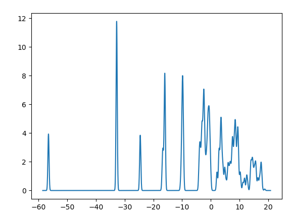
这种方法容易理解，但稍显繁琐，可利用列表推导式对其进行简化。  
打开文件后，先将每行数据去掉行末的换行符后切分为列表，存入列表ls中，再用列表推导式将ls中的元素分别放入lsx、lsy两个列表中。


```python
import matplotlib.pyplot as plt


def read_csv(file):
    with open(file) as data:
        ls = [line.strip().split(',') for line in data]  # 读文件到二维列表
    return ls


def plot_dos(ls):
    x = [float(x[0]) for x in ls]  # 列表推导式
    y = [float(x[1]) for x in ls]
    plt.plot(x, y)  # 绘制数据曲线


if __name__ == '__main__':
    lst = read_csv('/data/bigfiles/a2235822-b57f-414f-ace8-165906c888d1.csv')
    plot_dos(lst)
    plt.show()
```


```python
import matplotlib.pyplot as plt

# 支持中文显示
plt.rcParams['font.sans-serif'] = ['SimSun']    # 宋体
plt.rcParams['axes.unicode_minus'] = False      # 正常显示负号 -


def read_csv(file):
    """接受一个文件名变量为参数，读文件，每行切分为一个子列表。
    返回二维列表。
    """
    with open(file) as data:
        ls = [line.strip().split(',') for line in data]
    return ls


def plot_dos(ls):
    """接受二维列表为参数，绘制曲线，无返回值。"""
    x = [float(x[0]) for x in ls]
    y = [float(x[1]) for x in ls]
    plt.plot(x, y, linestyle='-', linewidth=1)  # 绘制数据曲线


def draw_label():
    """增加图名和轴标签"""
    plt.title('态密度（Density of States）曲线')
    plt.xlabel('能量/eV')
    plt.ylabel('态密度/eV')


# 函数调用与输入输出
if __name__ == '__main__':
    lst = read_csv('/data/bigfiles/a2235822-b57f-414f-ace8-165906c888d1.csv')
    plot_dos(lst)
    draw_label()
    plt.show()

```
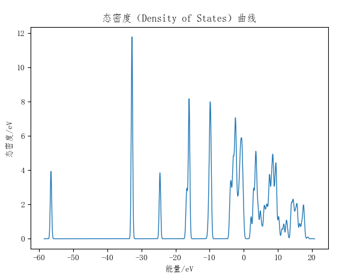
在NumPy中，使用loadtxt函数可以方便地读取csv或txt文件，delimiter=','表示用逗号作为分隔符自动切分字段，并将数据载入NumPy数组。


```python
# 利用numpy读文件绘制数据曲线
import matplotlib.pyplot as plt
import numpy as np

data = np.loadtxt('/data/bigfiles/a2235822-b57f-414f-ace8-165906c888d1.csv', delimiter=',')
plt.plot(data[0:, 0], data[0:, 1])  # 切片方法获取两列数据
plt.show()
```

对于有标题行的数据：


```python
plt.plot(data[1:, 0], data[1:, 1])
```

读数据到dataframe,用数据的列标题绘图


```python
plot('xlabel', 'ylabel', data=obj)
```
2d,Intensity,E
4,0,2.5
4.03,0,2.3
4.06,0,3.8
4.09,,4.2
4.12,,5.6
4.15,0,1.0
4.18,0
4.21,0
4.24,0
......
44.95,5.66224
44.98,6.46755
45.01,7.59091
[XRD_AFOtxtd.csv](./数据集/XRD_AFOtxtd.csv)
在Pandas库中，使用read_csv()函数可以方便地读取csv或txt文件，delimiter=','表示用逗号作为分隔符自动切分字段，并将数据载入为dataframe类型。  
可通过列标签获取其中第 i 列数据。


```python
import matplotlib.pyplot as plt
import pandas as pd

df = pd.read_csv('/data/bigfiles/3d72af89-ec6e-49f7-a847-34151c54ce6a.csv')
plt.plot('2d', 'Intensity', data=df)   # 根据列标题获取数据
plt.show()   # 显示绘制结果
```

在Pandas库中，使用read_csv()函数可以方便地读取csv或txt文件，delimiter=','表示用逗号作为分隔符自动切分字段，并将数据载入为dataframe类型。  
可通过dataframe.iloc[:,i]获取其中第 i 列数据。


```python
# 利用pandas读文件绘制数据曲线
import matplotlib.pyplot as plt
import pandas as pd

df = pd.read_csv('/data/bigfiles/3d72af89-ec6e-49f7-a847-34151c54ce6a.csv')
plt.plot(df.iloc[1:, 0], df.iloc[1:, 1])  # 索引两列数据为数组
plt.show()  # 显示绘制结果
```
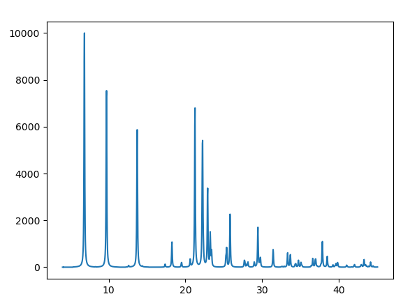
## 多列数据绘图

当数据文件中包括多列数据时，可用循环的方法，每次读两列数据绘图，重复执行，完成所有数据的读取和绘制。

## 实例 9.5 多列数据绘图

有一包含多列数据的PDOS.csv文件，8列数据分别代表4组x,y坐标，利用文件中的数据绘制数据曲线（数据文件可通过扫描二维码下载）。  
下面仅给出文件部分数据：
-58.55742805,0,-58.55742805,0,-58.55742805,0,-58.55742805,0
-58.54690537,0,-58.54690537,0,-58.54690537,0,-58.54690537,0
-57.47359261,0.000110663,-57.16843505,0.000112165,-57.04216296,0.000102657,-57.47359261,0.00011105
-57.46306993,0.000140603,-57.15791238,0.000131517,-57.03164029,0.000116436,-57.46306993,0.000141095
-57.45254726,0.000178149,-57.14738971,0.000153782,-57.02111761,0.0001317,-57.45254726,0.000178771
......
18.15286686,0.034078085,17.67934652,1.146470801,20.6256953,0.000119975,16.14303609,0.670546987
18.16338954,0.031011768,17.6898692,1.125145182,20.63621797,0.000110874,16.15355876,0.673103152
18.17391221,0.028196187,17.70039187,1.102515945,20.64674065,0.000102179,16.16408144,0.67741828
18.18443488,0.025618465,17.71091454,1.078811693,20.65726332,9.39E-05,16.17460411,0.683354996
18.19495756,0.023266078,17.72143722,1.054125932,22.33036852,0,16.18512679,0.690765294
[PDOS.csv](./数据集/PDOS.csv)
用循环的方法读取数据比较容易理解，每次读取相邻的2列数据作为一组坐标，取消10和11行的注释，可获得区域放大的效果，绘图结果如图9.11所示：


```python
import matplotlib.pyplot as plt


with open('/data/bigfiles/8ce0dbd0-ce9e-4c3b-b869-529febcdba74.csv', 'r', encoding='utf-8') as file:
    ls = [line.strip().split(',') for line in file]  # 逐行读取文件中的数据创建二维列表
    
for i in range(0, 8, 2):                # i取偶数0，2，4，6，i+1的值分别为1，3，5，7
    x_ls = [float(x[i]) for x in ls]    # 列表x_ls为ls子列表中序号为i的元素的浮点类型
    y_ls = [float(x[i+1]) for x in ls]  # 列表y_ls为ls子列表中序号为i+1的元素的浮点类型
    plt.plot(x_ls, y_ls, linewidth=2)  # 绘制当前数据的曲线，颜色通过索引获得

plt.show()
```

10和11行的的作用是获得区域放大的效果：


```python
import matplotlib.pyplot as plt


with open('/data/bigfiles/8ce0dbd0-ce9e-4c3b-b869-529febcdba74.csv', 'r', encoding='utf-8') as file:
    ls = [line.strip().split(',') for line in file]  # 逐行读取文件中的数据创建二维列表
for i in range(0, 8, 2):                # i取偶数0，2，4，6，i+1的值分别为1，3，5，7
    x_ls = [float(x[i]) for x in ls]    # 列表x_ls为ls子列表中序号为i的元素的浮点类型
    y_ls = [float(x[i+1]) for x in ls]  # 列表y_ls为ls子列表中序号为i+1的元素的浮点类型
    plt.plot(x_ls, y_ls,  linewidth=2)  # 绘制当前数据的曲线，颜色通过索引获得
    
plt.xlim(-5, 5)                         # 设置x轴的上下限，获得区域放大的曲线
plt.ylim(-0.5, 8)                       # 设置y轴的上下限，获得区域放大的曲线

plt.show()
```
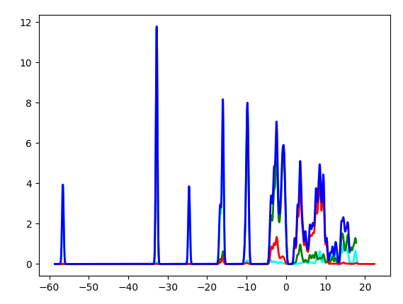
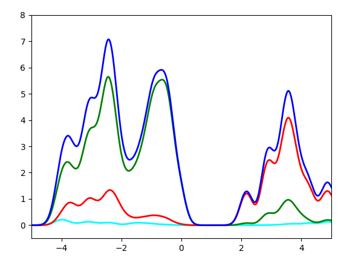
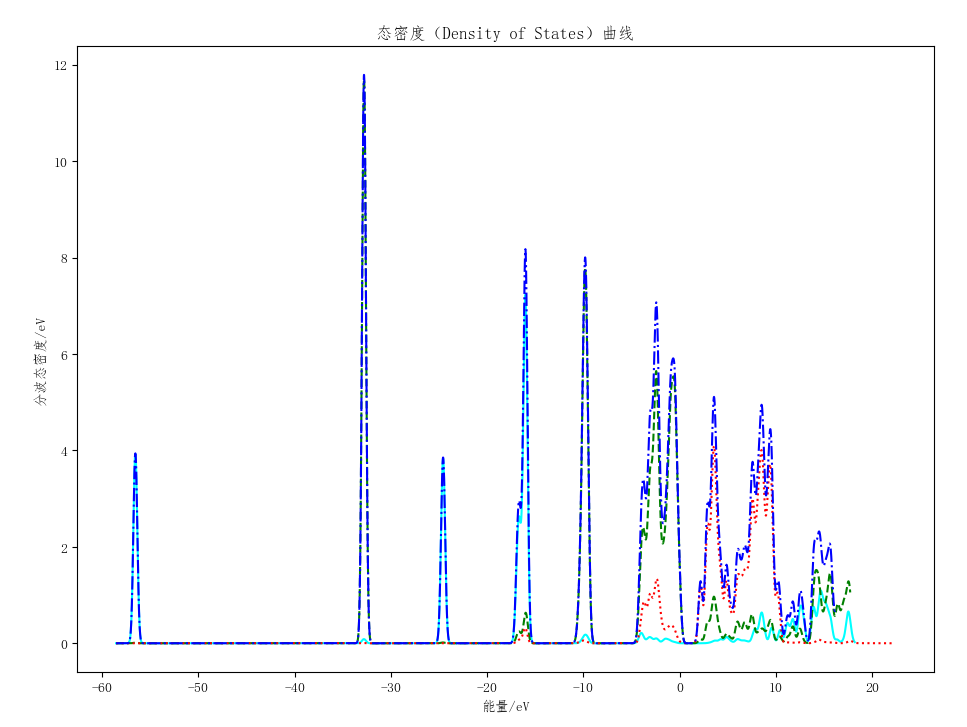
[9.5 PDOS.csv](./数据集/9.5%20PDOS.csv)

```python
import matplotlib.pyplot as plt

plt.rcParams['font.sans-serif'] = ['SimSun']  # 支持中文显示
plt.rcParams['axes.unicode_minus'] = False


def read_csv(filename):
    """接收文件名为参数，读取文件中的数据到二维列表中，返回二维列表。"""
    with open(filename, 'r', encoding='utf-8') as fr:
        data_lst = [line.strip().split(',') for line in fr]  # 数据转列表
    return data_lst


def draw_dos(data_lst):
    """接收二维列表为参数，绘制数据曲线。"""
    cl = ['cyan', 'green', 'red', 'blue']  # 创建颜色列表
    sty = ['-', '--', ':', '-.']
    for i in range(4):  # 每次循环读相邻两列数据绘制一条曲线
        x = [float(ls[2 * i]) for ls in data_lst]  # 生成x的列表
        y = [float(ls[2 * i + 1]) for ls in data_lst]  # 生成y的列表
        plt.plot(x, y, color=cl[i], linestyle=sty[i],linewidth=3)  # cl[i]根据i值取颜色


def draw_label():  # 加图名和轴标签
    plt.title('态密度（Density of States）曲线')
    plt.xlabel('能量/eV')
    plt.ylabel('分波态密度/eV')
    
    
def zoom_area():
    """只显示横坐标在-5到5之间的区域，局部放大，纵坐标根据曲线的最大值来设定为-0.5到8"""
    plt.xlim(-5, 5)                         # 设置x轴的上下限，获得区域放大的曲线
    plt.ylim(-0.5, 8)                       # 设置y轴的上下限，获得区域放大的曲线

    
if __name__ == '__main__':
    file = '/data/bigfiles/42a2fedc-9698-4455-a8db-8a0448c4483e.csv'
    dos_in_lst = read_csv(file)
    draw_dos(dos_in_lst)
    draw_label()
    zoom_area()
    plt.show()

```

### numpy读文件，利用数组绘图


```python
# 利用numpy读文件绘制数据曲线
import matplotlib.pyplot as plt
import numpy as np

data = np.loadtxt('/data/bigfiles/42a2fedc-9698-4455-a8db-8a0448c4483e.csv',delimiter=',')
for i in range(4):
    plt.plot(data[0:, 2*i], data[0:, 2*i+1])  # 切片方法获取两列数据
plt.show()
```

### pandas读文件，利用dataframe绘图


```python
# 利用pandas读文件绘制数据曲线
import matplotlib.pyplot as plt
import pandas as pd

data = pd.read_csv('/data/bigfiles/42a2fedc-9698-4455-a8db-8a0448c4483e.csv')
for i in range(4):
    plt.plot(data.iloc[0:, 2*i], data.iloc[0:, 2*i+1])  # 切片方法获取两列数据
plt.show()
```
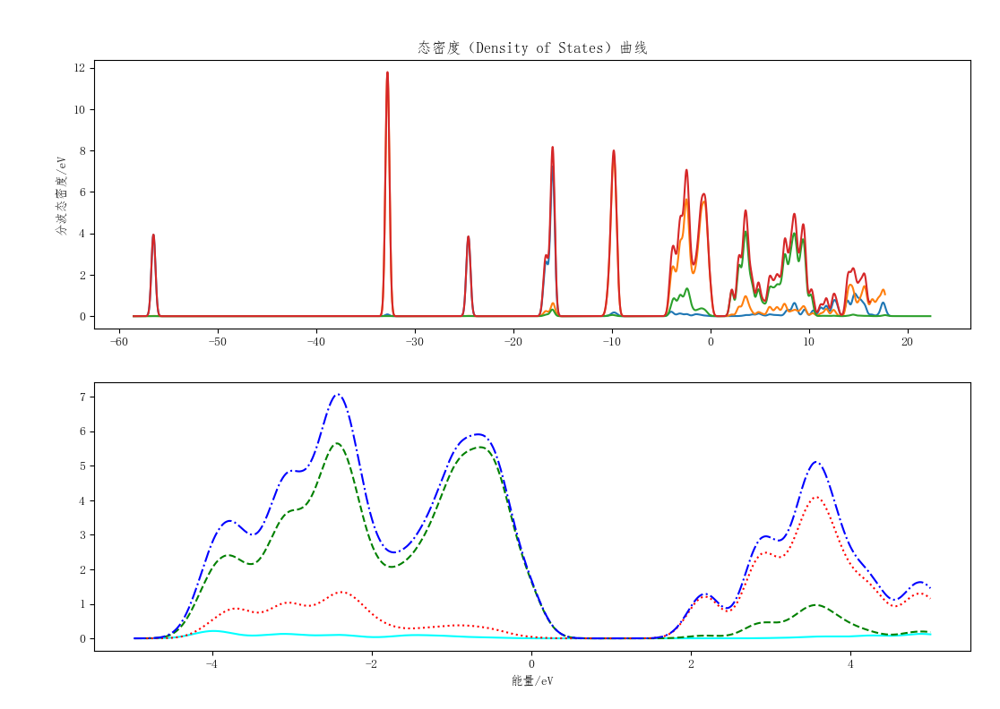
```python
import matplotlib.pyplot as plt

plt.rcParams['font.sans-serif'] = ['SimSun']  # 支持中文显示
plt.rcParams['axes.unicode_minus'] = False


def read_csv(filename):
    """接收文件名为参数，读取文件中的数据到二维列表中，返回二维列表。"""
    with open(filename, 'r', encoding='utf-8') as fr:
        data_lst = [line.strip().split(',') for line in fr]  # 数据转列表
    return data_lst


def draw_dos(data_lst):
    """接收二维列表为参数，绘制数据曲线。"""
    for i in range(4):  # 每次循环读相邻两列数据绘制一条曲线
        x = [float(ls[2 * i]) for ls in data_lst]  # 生成x的列表
        y = [float(ls[2 * i + 1]) for ls in data_lst]  # 生成y的列表
        plt.subplot(211)  # 分2x1，小于10的数可合成3位数
        plt.plot(x, y)
    plt.title('态密度（Density of States）曲线')
    plt.ylabel('分波态密度/eV')


def zoom_in_dos(data_lst):
    """接收二维列表为参数，绘制数据曲线。"""
    sty = ['-', '--', ':', '-.']
    for i in range(4):  # 每次循环读相邻两列数据绘制一条曲线
        x = [float(ls[2 * i]) for ls in data_lst if -5 < float(ls[2 * i]) < 5]  # 生成x的列表
        y = [float(ls[2 * i + 1]) for ls in data_lst if -5 < float(ls[2 * i]) < 5]  # 生成y的列表
        plt.subplot(212)  # 分2x1，小于10的数可合成3位数
        plt.plot(x, y, linestyle=sty[i])  # cl[i]根据i值取颜色
    plt.xlabel('能量/eV')


if __name__ == '__main__':
    file = '/data/bigfiles/42a2fedc-9698-4455-a8db-8a0448c4483e.csv'
    dos_in_lst = read_csv(file)
    draw_dos(dos_in_lst)
    zoom_in_dos(dos_in_lst)
    plt.show()

```
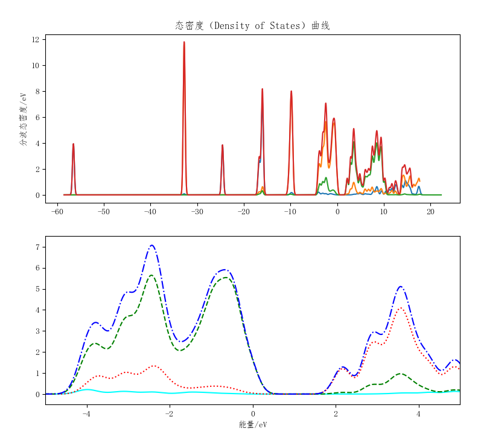

```python
def zoom_in_dos(data_lst):
    """接收二维列表为参数，绘制数据曲线。"""
    sty = ['-', '--', ':', '-.']
    for i in range(4):  # 每次循环读相邻两列数据绘制一条曲线
        x = [float(ls[2 * i]) for ls in data_lst]  # 生成x的列表
        y = [float(ls[2 * i + 1]) for ls in data_lst]  # 生成y的列表
        plt.subplot(212)  # 分2x1，小于10的数可合成3位数
        plt.plot(x, y, color=cl[i], linestyle=sty[i])  # cl[i]根据i值取颜色
    plt.xlim(-5, 5)  # 设置横轴的上下限
    plt.ylim(-0.5, 7.5)  # 设置纵轴的上下限
    plt.xlabel('能量/eV')
```

## 实例 9.7 两列数据绘制多条曲线

有一个数据文件band.txt，其中包括两列数据，分别代表坐标x,y的值，数据间用制表符分隔（'\t'），其中x值数据从0变化到1时表示一条曲线，整个文件包含多组这样的数据，请读取这个文件的数据并绘制相应的曲线。
0	-17.0916786423819
0.0211944262814081	-17.0751964353257
0.0423888474761543	-17.0264812561439
0.0635832737575624	-16.9477206279502
0.0847777000389705	-16.8426201969397
0.105972121233717	-16.7164274062928
......
0.933251465270729	-16.1766441729898
0.955500978923773	-16.0688718562406
0.977750486346955	-15.9960071184942
1	-15.9701767127752
0	-16.1625663637734
0.0211944262814081	-16.1595137907805
0.0423888474761543	-16.1505503610793
0.0635832737575624	-16.1361511854246
0.0847777000389705	-16.1171364149128
......
0.933251465270729	-16.0104068383765
0.955500978923773	-15.9889860373421
0.977750486346955	-15.9750252370744
1	-15.9701758964337
0	-15.9087935461524
0.0211944262814081	-15.916396678796
0.0423888474761543	-15.9373388315959
0.0635832737575624	-15.9665271220299
0.0847777000389705	-15.9972065962757
......
0.933251465270729	17.4571661619832
0.955500978923773	17.68681499974
0.977750486346955	17.7927935420937
1	17.811444496409
[9.7 band.txt](./数据集/9.7%20band.txt)
参考前述方法，将一条曲线的数据附加到一组列表中。  
因每条曲线的x值都是从0逐渐增加到1为止，因此可查看保存x值数据的列表的最后一个元素值是否是1，当该元素值为1时，利用列表中的数据绘制一条曲线。  然后清空列表，读取并附加下一组数据。  
重复操作，直至所有数据读取完毕。


```python
import matplotlib.pyplot as plt

plt.rcParams['font.sans-serif'] = ['SimSun']  # 支持中文显示
plt.rcParams['axes.unicode_minus'] = False


def read_csv(filename):
    """接收文件名为参数，读取文件中的数据到二维列表中，返回二维列表。"""
    with open(filename, 'r', encoding='utf-8') as fr:
        data_lst = [line.strip().split('\t') for line in fr]  # 数据转列表
        # data_lst = [line.strip().split() for line in fr]  # 数据转列表
    return data_lst


def draw_label():  # 加图名和轴标签
    plt.title('能带曲线')
    plt.ylabel('Energy/eV')


def draw_band(data_lst):
    """接收二维列表为参数，绘制数据曲线。"""
    x, y = [], []
    for xy in data_lst:
        x.append(float(xy[0]))  # 将数据转为浮点型附加到列表中
        y.append(float(xy[1]))
        if x[-1] == 1:  # 列表最后一个元素为1时
            plt.plot(x, y, '-',linewidth=2)  # 绘制曲线
            x, y = [], []  # 清空列表，准备接收下一条曲线的数据


if __name__ == '__main__':
    file = '/data/bigfiles/26d50dd0-810a-4d1d-907f-af703bb33cd9.txt'
    data_in_lst = read_csv(file)
    draw_band(data_in_lst)
    draw_label()
    plt.show()
```
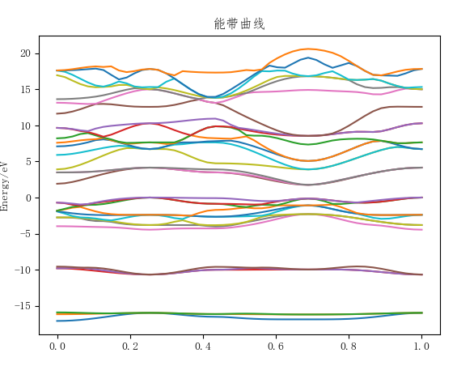

```python
import matplotlib.pyplot as plt

plt.rcParams['font.sans-serif'] = ['SimSun']  # 支持中文显示
plt.rcParams['axes.unicode_minus'] = False


def read_csv(filename):
    """接收文件名为参数，读取文件中的数据到二维列表中，返回二维列表。"""
    with open(filename, 'r', encoding='utf-8') as fr:
        data_lst = [line.strip().split() for line in fr]  # 数据转列表
    return data_lst


def draw_label():
    """加图名和轴标签"""
    plt.title('能带曲线')
    plt.ylabel('Energy/eV')


def draw_band(data_lst):
    """接收二维列表为参数，绘制数据曲线。"""
    x, y = [], []
    for xy in data_lst:
        x.append(float(xy[0]))  # 将数据转为浮点型附加到列表中
        y.append(float(xy[1]))
        if x[-1] == 1:  # 列表最后一个元素为1时
            plt.plot(x, y, '-')  # 绘制曲线
            x, y = [], []  # 清空列表，准备接收下一条曲线的数据
    
def draw_line():
    """绘制区间线"""
    xtick = [0, 0.25, 0.43, 0.69, 1]
    plt.xticks(xtick)  # 横轴刻度
    for i in xtick:    # 在刻度处绘制纵向破折线
        plt.axvline(i, linestyle='--', c='gray')
    plt.axhline(0, linestyle='--', c='gray')  # 绘制水平线
    

if __name__ == '__main__':
    file = '/data/bigfiles/26d50dd0-810a-4d1d-907f-af703bb33cd9.txt'
    data_in_lst = read_csv(file)
    plt.subplot(121)        # 一行两列第一个位置绘图
    draw_band(data_in_lst)  # 绘制完整数据图
    draw_label()
    draw_line()
    plt.subplot(122)        # 一行两列第二个位置绘图
    draw_band(data_in_lst)  # 绘制完整数据图
    plt.ylim(-5, 5)         # 显示纵坐标值在-5到5之间部分
    draw_label()
    draw_line()
    plt.show()

```


```python
import matplotlib.pyplot as plt

plt.rcParams['font.sans-serif'] = ['SimSun']  # 支持中文显示
plt.rcParams['axes.unicode_minus'] = False


def read_csv(filename):
    """接收文件名为参数，读取文件中的数据到二维列表中，返回二维列表。"""
    with open(filename, 'r', encoding='utf-8') as fr:
        data_lst = [line.strip().split() for line in fr]  # 数据转列表
    return data_lst


def draw_label():
    """加图名和轴标签"""
    plt.title('能带曲线')
    plt.ylabel('Energy/eV')


def draw_band(data_lst):
    """接收二维列表为参数，绘制数据曲线。"""
    x, y = [], []
    for xy in data_lst:
        x.append(float(xy[0]))  # 将数据转为浮点型附加到列表中
        y.append(float(xy[1]))
        if x[-1] == 1:  # 列表最后一个元素为1时
            plt.plot(x, y, '-')  # 绘制曲线
            x, y = [], []  # 清空列表，准备接收下一条曲线的数据
    
def draw_line():
    """绘制区间线"""
    xtick = [0, 0.25, 0.43, 0.69, 1]
    plt.xticks(xtick)  # 横轴刻度
    for i in xtick:    # 在刻度处绘制纵向破折线
        plt.axvline(i, linestyle='--', c='gray')
    plt.axhline(0, linestyle='--', c='gray')  # 绘制水平线
    
def zoom_area(m,n,data_lst):
    """接收二维列表为参数，只绘制满足区间条件的数据曲线，避免绘制的曲线不完整。"""
    lsx, lsy = [], []
    for x,y in data_lst:
        if m<=float(y)<=n:
            lsx.append(float(x))  # 将数据转为浮点型附加到列表中
            lsy.append(float(y))
            if lsx[-1] == 1:  # 列表最后一个元素为1时
                plt.plot(lsx, lsy, '-')  # 绘制曲线
                lsx, lsy = [], []  # 清空列表，准备接收下一条曲线的数据
    

if __name__ == '__main__':
    file = '/data/bigfiles/26d50dd0-810a-4d1d-907f-af703bb33cd9.txt'
    data_in_lst = read_csv(file)
    plt.subplot(121)        # 一行两列第一个位置绘图
    draw_band(data_in_lst)  # 绘制完整数据图
    draw_label()
    draw_line()
    plt.subplot(122)        # 一行两列第二个位置绘图
    zoom_area(-5,5,data_in_lst)
    draw_label()
    draw_line()
    plt.show()

```
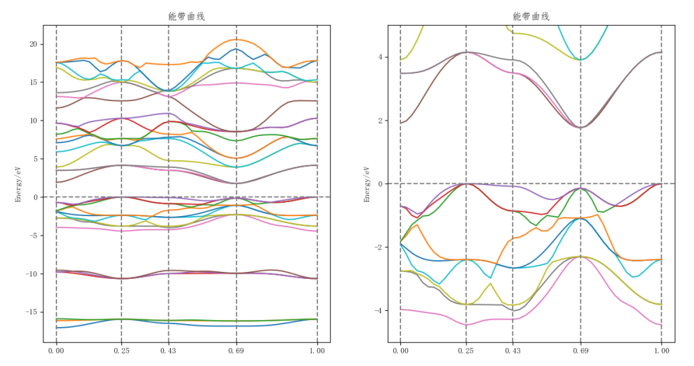
## 实例9.8 TIOBE 程序语言排行榜曲线

TIOBE排行榜 是根据互联网上有经验的程序员、课程和第三方厂商的数量，并使用搜索引擎（如Google、Bing、Yahoo!）以及Wikipedia、Amazon、YouTube和Baidu（百度）统计出排名数据，只是反映某个编程语言的热门程度，并不能说明一门编程语言好不好，或者一门语言所编写的代码数量多少。  
TIOBE开发语言排行榜每月更新一次，依据的指数是基于世界范围内的资深软件工程师和第三方供应商提供，其结果作为当前业内程序开发语言的流行使用程度的有效指标。  
该指数可以用来检阅开发者的编程技能能否跟上趋势，或是否有必要作出战略改变，以及什么编程语言是应该及时掌握的。观察认为，该指数反应的虽并非当前最流行或应用最广的语言，但对世界范围内开发语言的走势仍具有重要参考意义。

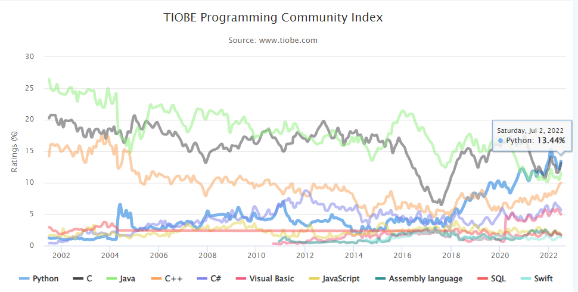

网页上右键查看网页源代码，搜索“series: ”，可看到数据：


```python
    series: [
    	{name : 'Python',data : [[Date.UTC(2001, 5, 30), 1.25], [Date.UTC(2001, 6, 30), 1.13], [Date.UTC(2001, 7, 30), 1.20], [Date.UTC(2001, 8, 28), 1.17], [Date.UTC(2001, 9, 26), 1.28], [Date.UTC(2001, 10, 28), 1.23], [Date.UTC(2001, 11, 31), 1.04], [Date.UTC(2002, 0, 30), 1.02], [Date.UTC(2002, 1, 27), 0.99], [Date.UTC(2002, 2, 29), 0.99], [Date.UTC(2002, 3, 29), 1.07], [Date.UTC(2002, 4, 29), 1.06], [Date.UTC(2002, 5, 29), 1.13], [Date.UTC(2002, 6, 31), 1.08], [Date.UTC(2002, 7, 29), 1.22], [Date.UTC(2002, 8, 29), 1.08], [Date.UTC(2002, 9, 30), 1.19], [Date.UTC(2002, 10, 29), 1.00], [Date.UTC(2002, 11, 31), 1.00], [Date.UTC(2003, 0, 31), 1.03], [Date.UTC(2003, 1, 28), 0.97], [Date.UTC(2003, 2, 31), 0.99], [Date.UTC(2003, 3, 30), 1.01], [Date.UTC(2003, 4, 30), 1.16], [Date.UTC(2003, 5, 30), 1.28], [Date.UTC(2003, 6, 31), 1.30], [Date.UTC(2003, 7, 31), 1.42], [Date.UTC(2003, 8, 30), 1.49], [Date.UTC(2003, 9, 31), 1.77], [Date.UTC(2003, 10, 30), 1.10], [Date.UTC(2003, 11, 31), 1.13], [Date.UTC(2004, 0, 31), 1.01], [Date.UTC(2004, 1, 29), 1.02], [Date.UTC(2004, 2, 31), 1.01], [Date.UTC(2004, 3, 30), 4.57], [Date.UTC(2004, 4, 30), 6.58], [Date.UTC(2004, 5, 30), 4.96], [Date.UTC(2004, 6, 31), 4.70], [Date.UTC(2004, 7, 30), 5.60], [Date.UTC(2004, 8, 30), 4.44], [Date.UTC(2004, 9, 31), 5.20], [Date.UTC(2004, 10, 30), 3.03], [Date.UTC(2004, 11, 31), 2.84], [Date.UTC(2005, 0, 31), 2.51], [Date.UTC(2005, 1, 28), 2.42], [Date.UTC(2005, 2, 31), 2.70], [Date.UTC(2005, 3, 30), 2.48], [Date.UTC(2005, 4, 31), 2.80], [Date.UTC(2005, 5, 30), 2.52], [Date.UTC(2005, 6, 31), 2.88], [Date.UTC(2005, 7, 31), 3.03], [Date.UTC(2005, 8, 30), 2.88], [Date.UTC(2005, 11, 3), 2.68], [Date.UTC(2006, 0, 4), 2.60], [Date.UTC(2006, 1, 2), 2.67], [Date.UTC(2006, 2, 1), 3.09], [Date.UTC(2006, 3, 2), 2.76], [Date.UTC(2006, 4, 1), 3.04], [Date.UTC(2006, 5, 1), 3.46], [Date.UTC(2006, 6, 2), 3.02], [Date.UTC(2006, 7, 2), 3.07], [Date.UTC(2006, 8, 2), 3.14], [Date.UTC(2006, 9, 1), 3.47], [Date.UTC(2006, 10, 2), 3.64], [Date.UTC(2006, 11, 1), 3.76], [Date.UTC(2007, 0, 2), 3.50], [Date.UTC(2007, 1, 3), 3.57], [Date.UTC(2007, 2, 3), 3.90], [Date.UTC(2007, 3, 1), 3.81], [Date.UTC(2007, 4, 5), 3.78], [Date.UTC(2007, 5, 2), 3.16], [Date.UTC(2007, 6, 2), 3.02], [Date.UTC(2007, 7, 5), 2.75], [Date.UTC(2007, 8, 2), 3.03], [Date.UTC(2007, 9, 4), 3.43], [Date.UTC(2007, 10, 4), 4.23], [Date.UTC(2007, 11, 3), 4.70], [Date.UTC(2008, 0, 3), 5.54], [Date.UTC(2008, 1, 7), 4.76], [Date.UTC(2008, 5, 1), 4.90], [Date.UTC(2008, 6, 2), 4.97], [Date.UTC(2008, 7, 3), 4.98], [Date.UTC(2008, 8, 3), 5.01], [Date.UTC(2008, 9, 6), 4.56], [Date.UTC(2008, 10, 2), 5.14], [Date.UTC(2008, 11, 3), 4.17], [Date.UTC(2009, 0, 2), 4.73], [Date.UTC(2009, 1, 1), 4.57], [Date.UTC(2009, 2, 5), 5.18], [Date.UTC(2009, 3, 7), 6.08], [Date.UTC(2009, 4, 1), 5.55], [Date.UTC(2009, 5, 4), 4.76], [Date.UTC(2009, 6, 2), 4.43], [Date.UTC(2009, 7, 1), 4.49], [Date.UTC(2009, 8, 5), 3.93], [Date.UTC(2009, 9, 2), 3.90], [Date.UTC(2009, 10, 2), 4.67], [Date.UTC(2009, 11, 2), 5.19], [Date.UTC(2010, 0, 5), 4.45], [Date.UTC(2010, 1, 7), 4.31], [Date.UTC(2010, 2, 7), 4.23], [Date.UTC(2010, 3, 5), 4.21], [Date.UTC(2010, 4, 15), 4.10], [Date.UTC(2010, 6, 6), 4.22], [Date.UTC(2010, 6, 30), 4.22], [Date.UTC(2010, 8, 11), 4.58], [Date.UTC(2010, 9, 2), 4.86], [Date.UTC(2010, 10, 3), 5.68], [Date.UTC(2010, 11, 7), 6.48], [Date.UTC(2011, 0, 2), 6.26], [Date.UTC(2011, 1, 8), 7.04], [Date.UTC(2011, 2, 8), 5.74], [Date.UTC(2011, 3, 3), 4.93], [Date.UTC(2011, 4, 2), 4.58], [Date.UTC(2011, 5, 5), 3.90], [Date.UTC(2011, 5, 27), 3.90], [Date.UTC(2011, 6, 8), 3.58], [Date.UTC(2011, 7, 3), 3.41], [Date.UTC(2011, 8, 10), 4.00], [Date.UTC(2011, 9, 9), 3.94], [Date.UTC(2011, 10, 7), 3.62], [Date.UTC(2011, 11, 4), 3.49], [Date.UTC(2012, 0, 8), 3.21], [Date.UTC(2012, 1, 5), 3.15], [Date.UTC(2012, 2, 11), 3.29], [Date.UTC(2012, 3, 8), 3.66], [Date.UTC(2012, 4, 9), 3.82], [Date.UTC(2012, 5, 10), 3.85], [Date.UTC(2012, 6, 4), 4.00], [Date.UTC(2012, 7, 10), 3.88], [Date.UTC(2012, 8, 2), 3.86], [Date.UTC(2012, 9, 5), 3.90], [Date.UTC(2012, 10, 4), 4.06], [Date.UTC(2012, 11, 2), 3.85], [Date.UTC(2013, 0, 5), 4.17], [Date.UTC(2013, 1, 8), 4.95], [Date.UTC(2013, 2, 11), 4.39], [Date.UTC(2013, 3, 7), 4.44], [Date.UTC(2013, 4, 8), 4.32], [Date.UTC(2013, 5, 9), 4.18], [Date.UTC(2013, 6, 7), 4.03], [Date.UTC(2013, 6, 12), 4.03], [Date.UTC(2013, 7, 4), 3.60], [Date.UTC(2013, 8, 11), 3.17], [Date.UTC(2013, 9, 10), 3.11], [Date.UTC(2013, 10, 9), 3.11], [Date.UTC(2013, 11, 6), 2.21], [Date.UTC(2014, 0, 1), 2.37], [Date.UTC(2014, 1, 8), 2.16], [Date.UTC(2014, 2, 3), 2.02], [Date.UTC(2014, 3, 10), 1.99], [Date.UTC(2014, 4, 7), 3.06], [Date.UTC(2014, 5, 8), 2.71], [Date.UTC(2014, 6, 6), 2.66], [Date.UTC(2014, 7, 11), 3.12], [Date.UTC(2014, 8, 1), 2.78], [Date.UTC(2014, 9, 3), 2.33], [Date.UTC(2014, 10, 8), 2.59], [Date.UTC(2014, 11, 7), 2.29], [Date.UTC(2015, 0, 6), 2.61], [Date.UTC(2015, 1, 5), 2.88], [Date.UTC(2015, 2, 7), 2.61], [Date.UTC(2015, 3, 13), 2.69], [Date.UTC(2015, 4, 13), 3.72], [Date.UTC(2015, 5, 6), 4.00], [Date.UTC(2015, 6, 12), 4.26], [Date.UTC(2015, 7, 6), 4.07], [Date.UTC(2015, 8, 5), 3.66], [Date.UTC(2015, 9, 4), 4.51], [Date.UTC(2015, 10, 7), 3.77], [Date.UTC(2015, 11, 4), 4.43], [Date.UTC(2016, 0, 2), 3.85], [Date.UTC(2016, 1, 2), 4.18], [Date.UTC(2016, 2, 3), 4.26], [Date.UTC(2016, 3, 7), 3.33], [Date.UTC(2016, 4, 6), 3.79], [Date.UTC(2016, 5, 5), 3.90], [Date.UTC(2016, 6, 4), 4.17], [Date.UTC(2016, 7, 6), 4.40], [Date.UTC(2016, 8, 8), 4.30], [Date.UTC(2016, 9, 7), 3.77], [Date.UTC(2016, 10, 5), 3.57], [Date.UTC(2016, 11, 4), 4.24], [Date.UTC(2017, 0, 7), 3.46], [Date.UTC(2017, 1, 8), 4.04], [Date.UTC(2017, 2, 7), 3.92], [Date.UTC(2017, 3, 9), 3.46], [Date.UTC(2017, 4, 6), 3.55], [Date.UTC(2017, 5, 3), 4.33], [Date.UTC(2017, 6, 7), 3.54], [Date.UTC(2017, 7, 2), 3.69], [Date.UTC(2017, 8, 6), 2.98], [Date.UTC(2017, 9, 5), 3.80], [Date.UTC(2017, 10, 12), 4.48], [Date.UTC(2017, 11, 9), 3.78], [Date.UTC(2018, 0, 3), 4.68], [Date.UTC(2018, 1, 8), 5.17], [Date.UTC(2018, 2, 7), 5.87], [Date.UTC(2018, 3, 1), 5.80], [Date.UTC(2018, 4, 6), 5.19], [Date.UTC(2018, 5, 10), 5.76], [Date.UTC(2018, 6, 7), 6.36], [Date.UTC(2018, 7, 1), 6.99], [Date.UTC(2018, 8, 3), 7.65], [Date.UTC(2018, 9, 5), 7.16], [Date.UTC(2018, 10, 8), 7.68], [Date.UTC(2018, 11, 2), 8.38], [Date.UTC(2019, 0, 4), 8.29], [Date.UTC(2019, 1, 6), 7.57], [Date.UTC(2019, 2, 2), 8.26], [Date.UTC(2019, 3, 7), 8.17], [Date.UTC(2019, 4, 4), 7.83], [Date.UTC(2019, 5, 9), 8.53], [Date.UTC(2019, 6, 6), 9.26], [Date.UTC(2019, 7, 5), 10.02], [Date.UTC(2019, 8, 9), 9.87], [Date.UTC(2019, 9, 5), 9.09], [Date.UTC(2019, 10, 3), 9.84], [Date.UTC(2019, 11, 6), 10.31], [Date.UTC(2020, 0, 5), 9.70], [Date.UTC(2020, 1, 4), 9.35], [Date.UTC(2020, 2, 4), 10.11], [Date.UTC(2020, 3, 2), 9.31], [Date.UTC(2020, 4, 2), 9.12], [Date.UTC(2020, 5, 1), 8.36], [Date.UTC(2020, 6, 4), 9.09], [Date.UTC(2020, 7, 2), 9.69], [Date.UTC(2020, 8, 6), 10.47], [Date.UTC(2020, 9, 4), 11.28], [Date.UTC(2020, 10, 3), 12.12], [Date.UTC(2020, 11, 3), 12.21], [Date.UTC(2021, 0, 2), 11.72], [Date.UTC(2021, 1, 6), 10.86], [Date.UTC(2021, 2, 4), 10.31], [Date.UTC(2021, 3, 4), 11.03], [Date.UTC(2021, 4, 2), 11.87], [Date.UTC(2021, 5, 5), 11.84], [Date.UTC(2021, 6, 4), 10.96], [Date.UTC(2021, 7, 3), 11.86], [Date.UTC(2021, 8, 11), 11.67], [Date.UTC(2021, 9, 6), 11.27], [Date.UTC(2021, 10, 6), 11.77], [Date.UTC(2021, 11, 5), 12.90]]}, {name : 'C',data : [[Date.UTC(2001, 5, 30), 20.24], [Date.UTC(2001, 6, 30), 20.77], [Date.UTC(2001, 7, 30), 20.75], [Date.UTC(2001, 8, 28), 20.77], [Date.UTC(2001, 9, 26), 19.75], [Date.UTC(2001, 10, 28), 19.21], [Date.UTC(2001, 11, 31), 20.14], [Date.UTC(2002, 0, 30), 18.83], [Date.UTC(2002, 1, 27), 19.89], [Date.UTC(2002, 2, 29), 19.85], [Date.UTC(2002, 3, 29), 19.82], [Date.UTC(2002, 4, 29), 19.99], [Date.UTC(2002, 5, 29), 19.57], [Date.UTC(2002, 6, 31), 19.25], [Date.UTC(2002, 7, 29), 18.16], [Date.UTC(2002, 8, 29), 18.70], [Date.UTC(2002, 9, 30), 18.73], [Date.UTC(2002, 10, 29), 17.50], [Date.UTC(2002, 11, 31), 17.26], [Date.UTC(2003, 0, 31), 18.25], [Date.UTC(2003, 1, 28), 18.54], [Date.UTC(2003, 2, 31), 17.21], [Date.UTC(2003, 3, 30), 18.02], [Date.UTC(2003, 4, 30), 18.50], [Date.UTC(2003, 5, 30), 18.52], [Date.UTC(2003, 6, 31), 17.97], [Date.UTC(2003, 7, 31), 17.78], [Date.UTC(2003, 8, 30), 18.31], [Date.UTC(2003, 9, 31), 17.00], [Date.UTC(2003, 10, 30), 18.47], [Date.UTC(2003, 11, 31), 18.60], [Date.UTC(2004, 0, 31), 18.20], [Date.UTC(2004, 1, 29), 18.93], [Date.UTC(2004, 2, 31), 17.75], [Date.UTC(2004, 3, 30), 17.95], [Date.UTC(2004, 4, 30), 18.29], [Date.UTC(2004, 5, 30), 17.14], [Date.UTC(2004, 6, 31), 16.33], [Date.UTC(2004, 7, 30), 17.12], [Date.UTC(2004, 8, 30), 18.17], [Date.UTC(2004, 9, 31), 17.99], [Date.UTC(2004, 10, 30), 19.70], [Date.UTC(2004, 11, 31), 20.71], [Date.UTC(2005, 0, 31), 19.82], [Date.UTC(2005, 1, 28), 19.47], [Date.UTC(2005, 2, 31), 18.63], [Date.UTC(2005, 3, 30), 18.52], [Date.UTC(2005, 4, 31), 19.37], [Date.UTC(2005, 5, 30), 19.85], [Date.UTC(2005, 6, 31), 19.47], [Date.UTC(2005, 7, 31), 19.16], [Date.UTC(2005, 8, 30), 18.77], [Date.UTC(2005, 11, 3), 19.63], [Date.UTC(2006, 0, 4), 19.01], [Date.UTC(2006, 1, 2), 18.33], [Date.UTC(2006, 2, 1), 17.79], [Date.UTC(2006, 3, 2), 17.69], [Date.UTC(2006, 4, 1), 17.69], [Date.UTC(2006, 5, 1), 18.25], [Date.UTC(2006, 6, 2), 17.83], [Date.UTC(2006, 7, 2), 17.43], [Date.UTC(2006, 8, 2), 18.06], [Date.UTC(2006, 9, 1), 17.66], [Date.UTC(2006, 10, 2), 17.20], [Date.UTC(2006, 11, 1), 16.62], [Date.UTC(2007, 0, 2), 15.81], [Date.UTC(2007, 1, 3), 16.10], [Date.UTC(2007, 2, 3), 15.63], [Date.UTC(2007, 3, 1), 14.94], [Date.UTC(2007, 4, 5), 15.15], [Date.UTC(2007, 5, 2), 15.97], [Date.UTC(2007, 6, 2), 16.36], [Date.UTC(2007, 7, 5), 15.70], [Date.UTC(2007, 8, 2), 14.91], [Date.UTC(2007, 9, 4), 14.59], [Date.UTC(2007, 10, 4), 13.97], [Date.UTC(2007, 11, 3), 13.17], [Date.UTC(2008, 0, 3), 13.92], [Date.UTC(2008, 1, 7), 14.86], [Date.UTC(2008, 5, 1), 15.51], [Date.UTC(2008, 6, 2), 15.95], [Date.UTC(2008, 7, 3), 16.18], [Date.UTC(2008, 8, 3), 15.38], [Date.UTC(2008, 9, 6), 15.57], [Date.UTC(2008, 10, 2), 15.28], [Date.UTC(2008, 11, 3), 15.02], [Date.UTC(2009, 0, 2), 15.93], [Date.UTC(2009, 1, 1), 15.84], [Date.UTC(2009, 2, 5), 15.86], [Date.UTC(2009, 3, 7), 15.47], [Date.UTC(2009, 4, 1), 16.13], [Date.UTC(2009, 5, 4), 16.78], [Date.UTC(2009, 6, 2), 17.32], [Date.UTC(2009, 7, 1), 17.22], [Date.UTC(2009, 8, 5), 16.86], [Date.UTC(2009, 9, 2), 16.84], [Date.UTC(2009, 10, 2), 17.32], [Date.UTC(2009, 11, 2), 16.28], [Date.UTC(2010, 0, 5), 16.22], [Date.UTC(2010, 1, 7), 16.60], [Date.UTC(2010, 2, 7), 17.28], [Date.UTC(2010, 3, 5), 18.06], [Date.UTC(2010, 4, 15), 18.19], [Date.UTC(2010, 6, 6), 18.48], [Date.UTC(2010, 6, 30), 17.87], [Date.UTC(2010, 8, 11), 17.15], [Date.UTC(2010, 9, 2), 17.18], [Date.UTC(2010, 10, 3), 16.72], [Date.UTC(2010, 11, 7), 16.08], [Date.UTC(2011, 0, 2), 15.82], [Date.UTC(2011, 1, 8), 14.99], [Date.UTC(2011, 2, 8), 15.26], [Date.UTC(2011, 3, 3), 16.16], [Date.UTC(2011, 4, 2), 16.17], [Date.UTC(2011, 5, 5), 16.28], [Date.UTC(2011, 5, 27), 16.28], [Date.UTC(2011, 6, 8), 17.28], [Date.UTC(2011, 7, 3), 17.39], [Date.UTC(2011, 8, 10), 18.00], [Date.UTC(2011, 9, 9), 17.71], [Date.UTC(2011, 10, 7), 17.32], [Date.UTC(2011, 11, 4), 17.06], [Date.UTC(2012, 0, 8), 16.97], [Date.UTC(2012, 1, 5), 16.52], [Date.UTC(2012, 2, 11), 17.09], [Date.UTC(2012, 3, 8), 17.55], [Date.UTC(2012, 4, 9), 17.35], [Date.UTC(2012, 5, 10), 17.72], [Date.UTC(2012, 6, 4), 18.33], [Date.UTC(2012, 7, 10), 18.94], [Date.UTC(2012, 8, 2), 19.30], [Date.UTC(2012, 9, 5), 19.82], [Date.UTC(2012, 10, 4), 19.22], [Date.UTC(2012, 11, 2), 18.70], [Date.UTC(2013, 0, 5), 17.85], [Date.UTC(2013, 1, 8), 17.08], [Date.UTC(2013, 2, 11), 17.14], [Date.UTC(2013, 3, 7), 17.86], [Date.UTC(2013, 4, 8), 18.73], [Date.UTC(2013, 5, 9), 17.81], [Date.UTC(2013, 6, 7), 17.63], [Date.UTC(2013, 6, 12), 17.63], [Date.UTC(2013, 7, 4), 15.97], [Date.UTC(2013, 8, 11), 16.98], [Date.UTC(2013, 9, 10), 17.25], [Date.UTC(2013, 10, 9), 18.16], [Date.UTC(2013, 11, 6), 17.89], [Date.UTC(2014, 0, 1), 17.94], [Date.UTC(2014, 1, 8), 18.33], [Date.UTC(2014, 2, 3), 17.53], [Date.UTC(2014, 3, 10), 17.63], [Date.UTC(2014, 4, 7), 16.93], [Date.UTC(2014, 5, 8), 16.19], [Date.UTC(2014, 6, 6), 17.14], [Date.UTC(2014, 7, 11), 16.40], [Date.UTC(2014, 8, 1), 16.72], [Date.UTC(2014, 9, 3), 17.66], [Date.UTC(2014, 10, 8), 17.47], [Date.UTC(2014, 11, 7), 17.59], [Date.UTC(2015, 0, 6), 16.70], [Date.UTC(2015, 1, 5), 16.49], [Date.UTC(2015, 2, 7), 16.64], [Date.UTC(2015, 3, 13), 15.75], [Date.UTC(2015, 4, 13), 16.85], [Date.UTC(2015, 5, 6), 16.79], [Date.UTC(2015, 6, 12), 16.15], [Date.UTC(2015, 7, 6), 14.73], [Date.UTC(2015, 8, 5), 15.62], [Date.UTC(2015, 9, 4), 16.19], [Date.UTC(2015, 10, 7), 17.15], [Date.UTC(2015, 11, 4), 16.46], [Date.UTC(2016, 0, 2), 16.04], [Date.UTC(2016, 1, 2), 15.59], [Date.UTC(2016, 2, 3), 14.60], [Date.UTC(2016, 3, 7), 13.91], [Date.UTC(2016, 4, 6), 13.22], [Date.UTC(2016, 5, 5), 12.38], [Date.UTC(2016, 6, 4), 12.24], [Date.UTC(2016, 7, 6), 11.30], [Date.UTC(2016, 8, 8), 10.95], [Date.UTC(2016, 9, 7), 9.84], [Date.UTC(2016, 10, 5), 9.20], [Date.UTC(2016, 11, 4), 8.73], [Date.UTC(2017, 0, 7), 9.35], [Date.UTC(2017, 1, 8), 8.44], [Date.UTC(2017, 2, 7), 7.74], [Date.UTC(2017, 3, 9), 6.97], [Date.UTC(2017, 4, 6), 7.00], [Date.UTC(2017, 5, 3), 6.85], [Date.UTC(2017, 6, 7), 7.32], [Date.UTC(2017, 7, 2), 6.48], [Date.UTC(2017, 8, 6), 7.38], [Date.UTC(2017, 9, 5), 8.37], [Date.UTC(2017, 10, 12), 9.29], [Date.UTC(2017, 11, 9), 10.16], [Date.UTC(2018, 0, 3), 11.04], [Date.UTC(2018, 1, 8), 11.86], [Date.UTC(2018, 2, 7), 12.76], [Date.UTC(2018, 3, 1), 13.59], [Date.UTC(2018, 4, 6), 14.00], [Date.UTC(2018, 5, 10), 14.94], [Date.UTC(2018, 6, 7), 14.66], [Date.UTC(2018, 7, 1), 14.97], [Date.UTC(2018, 8, 3), 15.45], [Date.UTC(2018, 9, 5), 15.38], [Date.UTC(2018, 10, 8), 14.40], [Date.UTC(2018, 11, 2), 14.28], [Date.UTC(2019, 0, 4), 13.34], [Date.UTC(2019, 1, 6), 12.42], [Date.UTC(2019, 2, 2), 13.31], [Date.UTC(2019, 3, 7), 14.08], [Date.UTC(2019, 4, 4), 14.24], [Date.UTC(2019, 5, 9), 13.30], [Date.UTC(2019, 6, 6), 14.21], [Date.UTC(2019, 7, 5), 15.15], [Date.UTC(2019, 8, 9), 15.21], [Date.UTC(2019, 9, 5), 16.18], [Date.UTC(2019, 10, 3), 16.04], [Date.UTC(2019, 11, 6), 16.09], [Date.UTC(2020, 0, 5), 15.77], [Date.UTC(2020, 1, 4), 16.77], [Date.UTC(2020, 2, 4), 16.33], [Date.UTC(2020, 3, 2), 16.72], [Date.UTC(2020, 4, 2), 17.07], [Date.UTC(2020, 5, 1), 17.19], [Date.UTC(2020, 6, 4), 16.45], [Date.UTC(2020, 7, 2), 16.98], [Date.UTC(2020, 8, 6), 15.95], [Date.UTC(2020, 9, 4), 16.95], [Date.UTC(2020, 10, 3), 16.21], [Date.UTC(2020, 11, 3), 16.48], [Date.UTC(2021, 0, 2), 17.38], [Date.UTC(2021, 1, 6), 16.34], [Date.UTC(2021, 2, 4), 15.33], [Date.UTC(2021, 3, 4), 14.32], [Date.UTC(2021, 4, 2), 13.38], [Date.UTC(2021, 5, 5), 12.54], [Date.UTC(2021, 6, 4), 11.63], [Date.UTC(2021, 7, 3), 12.57], [Date.UTC(2021, 8, 11), 11.83], [Date.UTC(2021, 9, 6), 11.16], [Date.UTC(2021, 10, 6), 10.72], [Date.UTC(2021, 11, 5), 11.80]]}, {name : 'Java',data : [[Date.UTC(2001, 5, 30), 26.49], [Date.UTC(2001, 6, 30), 25.03], [Date.UTC(2001, 7, 30), 24.66], [Date.UTC(2001, 8, 28), 24.82], [Date.UTC(2001, 9, 26), 25.68], [Date.UTC(2001, 10, 28), 24.37], [Date.UTC(2001, 11, 31), 24.20], [Date.UTC(2002, 0, 30), 24.06], [Date.UTC(2002, 1, 27), 24.01], [Date.UTC(2002, 2, 29), 24.41], [Date.UTC(2002, 3, 29), 25.05], [Date.UTC(2002, 4, 29), 25.19], [Date.UTC(2002, 5, 29), 24.20], [Date.UTC(2002, 6, 31), 24.53], [Date.UTC(2002, 7, 29), 22.89], [Date.UTC(2002, 8, 29), 24.48], [Date.UTC(2002, 9, 30), 24.20], [Date.UTC(2002, 10, 29), 24.12], [Date.UTC(2002, 11, 31), 24.23], [Date.UTC(2003, 0, 31), 24.79], [Date.UTC(2003, 1, 28), 24.78], [Date.UTC(2003, 2, 31), 24.60], [Date.UTC(2003, 3, 30), 24.66], [Date.UTC(2003, 4, 30), 23.11], [Date.UTC(2003, 5, 30), 22.34], [Date.UTC(2003, 6, 31), 23.21], [Date.UTC(2003, 7, 31), 22.24], [Date.UTC(2003, 8, 30), 21.90], [Date.UTC(2003, 9, 31), 23.08], [Date.UTC(2003, 10, 30), 25.01], [Date.UTC(2003, 11, 31), 23.57], [Date.UTC(2004, 0, 31), 22.56], [Date.UTC(2004, 1, 29), 23.17], [Date.UTC(2004, 2, 31), 24.24], [Date.UTC(2004, 3, 30), 18.69], [Date.UTC(2004, 4, 30), 17.54], [Date.UTC(2004, 5, 30), 17.05], [Date.UTC(2004, 6, 31), 17.00], [Date.UTC(2004, 7, 30), 15.90], [Date.UTC(2004, 8, 30), 17.05], [Date.UTC(2004, 9, 31), 14.80], [Date.UTC(2004, 10, 30), 16.33], [Date.UTC(2004, 11, 31), 17.48], [Date.UTC(2005, 0, 31), 18.34], [Date.UTC(2005, 1, 28), 18.87], [Date.UTC(2005, 2, 31), 16.98], [Date.UTC(2005, 3, 30), 17.40], [Date.UTC(2005, 4, 31), 18.57], [Date.UTC(2005, 5, 30), 19.66], [Date.UTC(2005, 6, 31), 21.21], [Date.UTC(2005, 7, 31), 22.44], [Date.UTC(2005, 8, 30), 21.87], [Date.UTC(2005, 11, 3), 22.13], [Date.UTC(2006, 0, 4), 22.25], [Date.UTC(2006, 1, 2), 22.43], [Date.UTC(2006, 2, 1), 21.89], [Date.UTC(2006, 3, 2), 21.28], [Date.UTC(2006, 4, 1), 21.32], [Date.UTC(2006, 5, 1), 21.13], [Date.UTC(2006, 6, 2), 21.85], [Date.UTC(2006, 7, 2), 22.38], [Date.UTC(2006, 8, 2), 21.53], [Date.UTC(2006, 9, 1), 21.17], [Date.UTC(2006, 10, 2), 20.40], [Date.UTC(2006, 11, 1), 19.91], [Date.UTC(2007, 0, 2), 19.16], [Date.UTC(2007, 1, 3), 18.98], [Date.UTC(2007, 2, 3), 18.04], [Date.UTC(2007, 3, 1), 18.36], [Date.UTC(2007, 4, 5), 19.14], [Date.UTC(2007, 5, 2), 20.03], [Date.UTC(2007, 6, 2), 21.01], [Date.UTC(2007, 7, 5), 21.77], [Date.UTC(2007, 8, 2), 21.70], [Date.UTC(2007, 9, 4), 21.62], [Date.UTC(2007, 10, 4), 20.54], [Date.UTC(2007, 11, 3), 20.05], [Date.UTC(2008, 0, 3), 20.85], [Date.UTC(2008, 1, 7), 21.48], [Date.UTC(2008, 5, 1), 20.89], [Date.UTC(2008, 6, 2), 21.34], [Date.UTC(2008, 7, 3), 21.57], [Date.UTC(2008, 8, 3), 20.71], [Date.UTC(2008, 9, 6), 20.95], [Date.UTC(2008, 10, 2), 20.30], [Date.UTC(2008, 11, 3), 17.92], [Date.UTC(2009, 0, 2), 19.02], [Date.UTC(2009, 1, 1), 19.40], [Date.UTC(2009, 2, 5), 19.80], [Date.UTC(2009, 3, 7), 19.34], [Date.UTC(2009, 4, 1), 19.54], [Date.UTC(2009, 5, 4), 20.15], [Date.UTC(2009, 6, 2), 20.45], [Date.UTC(2009, 7, 1), 19.53], [Date.UTC(2009, 8, 5), 19.38], [Date.UTC(2009, 9, 2), 18.65], [Date.UTC(2009, 10, 2), 18.37], [Date.UTC(2009, 11, 2), 17.06], [Date.UTC(2010, 0, 5), 17.48], [Date.UTC(2010, 1, 7), 17.35], [Date.UTC(2010, 2, 7), 17.51], [Date.UTC(2010, 3, 5), 18.05], [Date.UTC(2010, 4, 15), 17.96], [Date.UTC(2010, 6, 6), 18.67], [Date.UTC(2010, 6, 30), 17.99], [Date.UTC(2010, 8, 11), 17.92], [Date.UTC(2010, 9, 2), 18.17], [Date.UTC(2010, 10, 3), 18.51], [Date.UTC(2010, 11, 7), 18.00], [Date.UTC(2011, 0, 2), 17.77], [Date.UTC(2011, 1, 8), 18.48], [Date.UTC(2011, 2, 8), 19.71], [Date.UTC(2011, 3, 3), 19.04], [Date.UTC(2011, 4, 2), 18.16], [Date.UTC(2011, 5, 5), 18.58], [Date.UTC(2011, 5, 27), 18.58], [Date.UTC(2011, 6, 8), 19.25], [Date.UTC(2011, 7, 3), 19.41], [Date.UTC(2011, 8, 10), 18.76], [Date.UTC(2011, 9, 9), 17.91], [Date.UTC(2011, 10, 7), 17.87], [Date.UTC(2011, 11, 4), 17.56], [Date.UTC(2012, 0, 8), 17.47], [Date.UTC(2012, 1, 5), 17.05], [Date.UTC(2012, 2, 11), 17.11], [Date.UTC(2012, 3, 8), 17.03], [Date.UTC(2012, 4, 9), 16.60], [Date.UTC(2012, 5, 10), 16.26], [Date.UTC(2012, 6, 4), 16.09], [Date.UTC(2012, 7, 10), 16.35], [Date.UTC(2012, 8, 2), 16.27], [Date.UTC(2012, 9, 5), 17.19], [Date.UTC(2012, 10, 4), 17.46], [Date.UTC(2012, 11, 2), 17.57], [Date.UTC(2013, 0, 5), 17.42], [Date.UTC(2013, 1, 8), 18.39], [Date.UTC(2013, 2, 11), 18.16], [Date.UTC(2013, 3, 7), 17.68], [Date.UTC(2013, 4, 8), 16.91], [Date.UTC(2013, 5, 9), 16.66], [Date.UTC(2013, 6, 7), 15.91], [Date.UTC(2013, 6, 12), 15.91], [Date.UTC(2013, 7, 4), 15.98], [Date.UTC(2013, 8, 11), 16.15], [Date.UTC(2013, 9, 10), 16.11], [Date.UTC(2013, 10, 9), 16.52], [Date.UTC(2013, 11, 6), 17.31], [Date.UTC(2014, 0, 1), 16.52], [Date.UTC(2014, 1, 8), 17.32], [Date.UTC(2014, 2, 3), 16.41], [Date.UTC(2014, 3, 10), 17.35], [Date.UTC(2014, 4, 7), 16.91], [Date.UTC(2014, 5, 8), 16.11], [Date.UTC(2014, 6, 6), 15.69], [Date.UTC(2014, 7, 11), 14.98], [Date.UTC(2014, 8, 1), 14.14], [Date.UTC(2014, 9, 3), 13.51], [Date.UTC(2014, 10, 8), 14.39], [Date.UTC(2014, 11, 7), 14.96], [Date.UTC(2015, 0, 6), 15.53], [Date.UTC(2015, 1, 5), 15.34], [Date.UTC(2015, 2, 7), 15.58], [Date.UTC(2015, 3, 13), 16.04], [Date.UTC(2015, 4, 13), 16.87], [Date.UTC(2015, 5, 6), 17.82], [Date.UTC(2015, 6, 12), 17.73], [Date.UTC(2015, 7, 6), 19.27], [Date.UTC(2015, 8, 5), 19.56], [Date.UTC(2015, 9, 4), 19.54], [Date.UTC(2015, 10, 7), 20.40], [Date.UTC(2015, 11, 4), 20.97], [Date.UTC(2016, 0, 2), 21.47], [Date.UTC(2016, 1, 2), 21.14], [Date.UTC(2016, 2, 3), 20.53], [Date.UTC(2016, 3, 7), 20.85], [Date.UTC(2016, 4, 6), 20.96], [Date.UTC(2016, 5, 5), 20.79], [Date.UTC(2016, 6, 4), 19.80], [Date.UTC(2016, 7, 6), 19.01], [Date.UTC(2016, 8, 8), 18.24], [Date.UTC(2016, 9, 7), 18.80], [Date.UTC(2016, 10, 5), 18.75], [Date.UTC(2016, 11, 4), 17.86], [Date.UTC(2017, 0, 7), 17.28], [Date.UTC(2017, 1, 8), 16.68], [Date.UTC(2017, 2, 7), 16.38], [Date.UTC(2017, 3, 9), 15.57], [Date.UTC(2017, 4, 6), 14.64], [Date.UTC(2017, 5, 3), 14.49], [Date.UTC(2017, 6, 7), 13.77], [Date.UTC(2017, 7, 2), 12.96], [Date.UTC(2017, 8, 6), 12.69], [Date.UTC(2017, 9, 5), 12.43], [Date.UTC(2017, 10, 12), 13.23], [Date.UTC(2017, 11, 9), 13.27], [Date.UTC(2018, 0, 3), 14.22], [Date.UTC(2018, 1, 8), 14.99], [Date.UTC(2018, 2, 7), 14.94], [Date.UTC(2018, 3, 1), 15.78], [Date.UTC(2018, 4, 6), 16.38], [Date.UTC(2018, 5, 10), 15.37], [Date.UTC(2018, 6, 7), 16.14], [Date.UTC(2018, 7, 1), 16.88], [Date.UTC(2018, 8, 3), 17.44], [Date.UTC(2018, 9, 5), 17.80], [Date.UTC(2018, 10, 8), 16.75], [Date.UTC(2018, 11, 2), 15.93], [Date.UTC(2019, 0, 4), 16.90], [Date.UTC(2019, 1, 6), 15.88], [Date.UTC(2019, 2, 2), 14.88], [Date.UTC(2019, 3, 7), 15.04], [Date.UTC(2019, 4, 4), 16.00], [Date.UTC(2019, 5, 9), 15.00], [Date.UTC(2019, 6, 6), 15.06], [Date.UTC(2019, 7, 5), 16.03], [Date.UTC(2019, 8, 9), 16.66], [Date.UTC(2019, 9, 5), 16.88], [Date.UTC(2019, 10, 3), 16.25], [Date.UTC(2019, 11, 6), 17.25], [Date.UTC(2020, 0, 5), 16.90], [Date.UTC(2020, 1, 4), 17.36], [Date.UTC(2020, 2, 4), 17.78], [Date.UTC(2020, 3, 2), 16.73], [Date.UTC(2020, 4, 2), 16.28], [Date.UTC(2020, 5, 1), 16.10], [Date.UTC(2020, 6, 4), 15.10], [Date.UTC(2020, 7, 2), 14.43], [Date.UTC(2020, 8, 6), 13.48], [Date.UTC(2020, 9, 4), 12.56], [Date.UTC(2020, 10, 3), 11.68], [Date.UTC(2020, 11, 3), 12.53], [Date.UTC(2021, 0, 2), 11.96], [Date.UTC(2021, 1, 6), 11.29], [Date.UTC(2021, 2, 4), 10.45], [Date.UTC(2021, 3, 4), 11.23], [Date.UTC(2021, 4, 2), 11.74], [Date.UTC(2021, 5, 5), 11.54], [Date.UTC(2021, 6, 4), 11.20], [Date.UTC(2021, 7, 3), 10.43], [Date.UTC(2021, 8, 11), 11.12], [Date.UTC(2021, 9, 6), 10.46], [Date.UTC(2021, 10, 6), 10.72], [Date.UTC(2021, 11, 5), 10.12]]}, {name : 'C++',data : [[Date.UTC(2001, 5, 30), 14.20], [Date.UTC(2001, 6, 30), 16.11], [Date.UTC(2001, 7, 30), 16.12], [Date.UTC(2001, 8, 28), 15.85], [Date.UTC(2001, 9, 26), 16.10], [Date.UTC(2001, 10, 28), 15.67], [Date.UTC(2001, 11, 31), 14.96], [Date.UTC(2002, 0, 30), 15.18], [Date.UTC(2002, 1, 27), 15.54], [Date.UTC(2002, 2, 29), 15.91], [Date.UTC(2002, 3, 29), 15.37], [Date.UTC(2002, 4, 29), 14.86], [Date.UTC(2002, 5, 29), 14.18], [Date.UTC(2002, 6, 31), 14.94], [Date.UTC(2002, 7, 29), 14.77], [Date.UTC(2002, 8, 29), 15.90], [Date.UTC(2002, 9, 30), 15.03], [Date.UTC(2002, 10, 29), 13.64], [Date.UTC(2002, 11, 31), 13.19], [Date.UTC(2003, 0, 31), 14.63], [Date.UTC(2003, 1, 28), 15.53], [Date.UTC(2003, 2, 31), 14.57], [Date.UTC(2003, 3, 30), 15.80], [Date.UTC(2003, 4, 30), 15.58], [Date.UTC(2003, 5, 30), 16.72], [Date.UTC(2003, 6, 31), 16.58], [Date.UTC(2003, 7, 31), 17.53], [Date.UTC(2003, 8, 30), 16.17], [Date.UTC(2003, 9, 31), 16.31], [Date.UTC(2003, 10, 30), 17.42], [Date.UTC(2003, 11, 31), 16.08], [Date.UTC(2004, 0, 31), 15.71], [Date.UTC(2004, 1, 29), 14.50], [Date.UTC(2004, 2, 31), 15.99], [Date.UTC(2004, 3, 30), 12.27], [Date.UTC(2004, 4, 30), 12.55], [Date.UTC(2004, 5, 30), 13.44], [Date.UTC(2004, 6, 31), 15.31], [Date.UTC(2004, 7, 30), 14.92], [Date.UTC(2004, 8, 30), 15.02], [Date.UTC(2004, 9, 31), 13.86], [Date.UTC(2004, 10, 30), 11.91], [Date.UTC(2004, 11, 31), 11.93], [Date.UTC(2005, 0, 31), 11.34], [Date.UTC(2005, 1, 28), 11.63], [Date.UTC(2005, 2, 31), 10.19], [Date.UTC(2005, 3, 30), 9.90], [Date.UTC(2005, 4, 31), 9.72], [Date.UTC(2005, 5, 30), 11.06], [Date.UTC(2005, 6, 31), 10.51], [Date.UTC(2005, 7, 31), 11.17], [Date.UTC(2005, 8, 30), 11.82], [Date.UTC(2005, 11, 3), 11.03], [Date.UTC(2006, 0, 4), 11.46], [Date.UTC(2006, 1, 2), 11.30], [Date.UTC(2006, 2, 1), 11.16], [Date.UTC(2006, 3, 2), 10.90], [Date.UTC(2006, 4, 1), 10.94], [Date.UTC(2006, 5, 1), 10.67], [Date.UTC(2006, 6, 2), 9.78], [Date.UTC(2006, 7, 2), 10.25], [Date.UTC(2006, 8, 2), 10.75], [Date.UTC(2006, 9, 1), 11.06], [Date.UTC(2006, 10, 2), 11.05], [Date.UTC(2006, 11, 1), 10.41], [Date.UTC(2007, 0, 2), 10.42], [Date.UTC(2007, 1, 3), 10.77], [Date.UTC(2007, 2, 3), 11.11], [Date.UTC(2007, 3, 1), 10.72], [Date.UTC(2007, 4, 5), 10.11], [Date.UTC(2007, 5, 2), 11.12], [Date.UTC(2007, 6, 2), 10.50], [Date.UTC(2007, 7, 5), 10.11], [Date.UTC(2007, 8, 2), 9.94], [Date.UTC(2007, 9, 4), 9.58], [Date.UTC(2007, 10, 4), 8.75], [Date.UTC(2007, 11, 3), 7.87], [Date.UTC(2008, 0, 3), 8.73], [Date.UTC(2008, 1, 7), 9.27], [Date.UTC(2008, 5, 1), 10.81], [Date.UTC(2008, 6, 2), 10.69], [Date.UTC(2008, 7, 3), 10.06], [Date.UTC(2008, 8, 3), 10.72], [Date.UTC(2008, 9, 6), 10.95], [Date.UTC(2008, 10, 2), 10.36], [Date.UTC(2008, 11, 3), 10.10], [Date.UTC(2009, 0, 2), 10.12], [Date.UTC(2009, 1, 1), 9.63], [Date.UTC(2009, 2, 5), 10.36], [Date.UTC(2009, 3, 7), 10.74], [Date.UTC(2009, 4, 1), 11.07], [Date.UTC(2009, 5, 4), 10.59], [Date.UTC(2009, 6, 2), 10.42], [Date.UTC(2009, 7, 1), 10.50], [Date.UTC(2009, 8, 5), 9.99], [Date.UTC(2009, 9, 2), 9.88], [Date.UTC(2009, 10, 2), 10.00], [Date.UTC(2009, 11, 2), 9.18], [Date.UTC(2010, 0, 5), 9.71], [Date.UTC(2010, 1, 7), 9.45], [Date.UTC(2010, 2, 7), 9.61], [Date.UTC(2010, 3, 5), 9.71], [Date.UTC(2010, 4, 15), 10.38], [Date.UTC(2010, 6, 6), 10.47], [Date.UTC(2010, 6, 30), 9.66], [Date.UTC(2010, 8, 11), 9.81], [Date.UTC(2010, 9, 2), 9.80], [Date.UTC(2010, 10, 3), 9.50], [Date.UTC(2010, 11, 7), 9.01], [Date.UTC(2011, 0, 2), 8.78], [Date.UTC(2011, 1, 8), 8.19], [Date.UTC(2011, 2, 8), 8.75], [Date.UTC(2011, 3, 3), 9.23], [Date.UTC(2011, 4, 2), 9.15], [Date.UTC(2011, 5, 5), 9.83], [Date.UTC(2011, 5, 27), 9.83], [Date.UTC(2011, 6, 8), 9.02], [Date.UTC(2011, 7, 3), 8.43], [Date.UTC(2011, 8, 10), 8.85], [Date.UTC(2011, 9, 9), 9.07], [Date.UTC(2011, 10, 7), 8.08], [Date.UTC(2011, 11, 4), 8.25], [Date.UTC(2012, 0, 8), 8.05], [Date.UTC(2012, 1, 5), 7.85], [Date.UTC(2012, 2, 11), 8.05], [Date.UTC(2012, 3, 8), 8.90], [Date.UTC(2012, 4, 9), 9.82], [Date.UTC(2012, 5, 10), 9.36], [Date.UTC(2012, 6, 4), 9.12], [Date.UTC(2012, 7, 10), 9.33], [Date.UTC(2012, 8, 2), 9.15], [Date.UTC(2012, 9, 5), 9.26], [Date.UTC(2012, 10, 4), 9.70], [Date.UTC(2012, 11, 2), 9.20], [Date.UTC(2013, 0, 5), 9.14], [Date.UTC(2013, 1, 8), 8.76], [Date.UTC(2013, 2, 11), 9.11], [Date.UTC(2013, 3, 7), 9.71], [Date.UTC(2013, 4, 8), 9.20], [Date.UTC(2013, 5, 9), 8.82], [Date.UTC(2013, 6, 7), 8.75], [Date.UTC(2013, 6, 12), 8.75], [Date.UTC(2013, 7, 4), 9.37], [Date.UTC(2013, 8, 11), 8.66], [Date.UTC(2013, 9, 10), 8.66], [Date.UTC(2013, 10, 9), 8.37], [Date.UTC(2013, 11, 6), 8.27], [Date.UTC(2014, 0, 1), 7.56], [Date.UTC(2014, 1, 8), 6.89], [Date.UTC(2014, 2, 3), 6.31], [Date.UTC(2014, 3, 10), 6.14], [Date.UTC(2014, 4, 7), 5.99], [Date.UTC(2014, 5, 8), 6.43], [Date.UTC(2014, 6, 6), 5.52], [Date.UTC(2014, 7, 11), 4.70], [Date.UTC(2014, 8, 1), 4.67], [Date.UTC(2014, 9, 3), 4.87], [Date.UTC(2014, 10, 8), 6.10], [Date.UTC(2014, 11, 7), 6.10], [Date.UTC(2015, 0, 6), 6.70], [Date.UTC(2015, 1, 5), 6.61], [Date.UTC(2015, 2, 7), 6.64], [Date.UTC(2015, 3, 13), 6.96], [Date.UTC(2015, 4, 13), 7.87], [Date.UTC(2015, 5, 6), 7.76], [Date.UTC(2015, 6, 12), 8.64], [Date.UTC(2015, 7, 6), 7.74], [Date.UTC(2015, 8, 5), 6.78], [Date.UTC(2015, 9, 4), 5.75], [Date.UTC(2015, 10, 7), 6.20], [Date.UTC(2015, 11, 4), 5.94], [Date.UTC(2016, 0, 2), 6.91], [Date.UTC(2016, 1, 2), 6.91], [Date.UTC(2016, 2, 3), 6.72], [Date.UTC(2016, 3, 7), 5.92], [Date.UTC(2016, 4, 6), 6.70], [Date.UTC(2016, 5, 5), 6.20], [Date.UTC(2016, 6, 4), 6.31], [Date.UTC(2016, 7, 6), 5.80], [Date.UTC(2016, 8, 8), 6.66], [Date.UTC(2016, 9, 7), 5.80], [Date.UTC(2016, 10, 5), 5.41], [Date.UTC(2016, 11, 4), 5.34], [Date.UTC(2017, 0, 7), 6.30], [Date.UTC(2017, 1, 8), 5.43], [Date.UTC(2017, 2, 7), 5.18], [Date.UTC(2017, 3, 9), 4.55], [Date.UTC(2017, 4, 6), 4.75], [Date.UTC(2017, 5, 3), 5.72], [Date.UTC(2017, 6, 7), 5.58], [Date.UTC(2017, 7, 2), 5.55], [Date.UTC(2017, 8, 6), 5.56], [Date.UTC(2017, 9, 5), 5.01], [Date.UTC(2017, 10, 12), 5.34], [Date.UTC(2017, 11, 9), 4.72], [Date.UTC(2018, 0, 3), 5.60], [Date.UTC(2018, 1, 8), 5.73], [Date.UTC(2018, 2, 7), 6.45], [Date.UTC(2018, 3, 1), 7.22], [Date.UTC(2018, 4, 6), 7.67], [Date.UTC(2018, 5, 10), 8.34], [Date.UTC(2018, 6, 7), 7.62], [Date.UTC(2018, 7, 1), 7.47], [Date.UTC(2018, 8, 3), 7.39], [Date.UTC(2018, 9, 5), 7.59], [Date.UTC(2018, 10, 8), 8.28], [Date.UTC(2018, 11, 2), 7.56], [Date.UTC(2019, 0, 4), 8.16], [Date.UTC(2019, 1, 6), 7.44], [Date.UTC(2019, 2, 2), 8.13], [Date.UTC(2019, 3, 7), 8.84], [Date.UTC(2019, 4, 4), 8.10], [Date.UTC(2019, 5, 9), 7.38], [Date.UTC(2019, 6, 6), 6.70], [Date.UTC(2019, 7, 5), 6.06], [Date.UTC(2019, 8, 9), 5.64], [Date.UTC(2019, 9, 5), 6.23], [Date.UTC(2019, 10, 3), 5.60], [Date.UTC(2019, 11, 6), 6.20], [Date.UTC(2020, 0, 5), 5.57], [Date.UTC(2020, 1, 4), 6.16], [Date.UTC(2020, 2, 4), 6.79], [Date.UTC(2020, 3, 2), 6.78], [Date.UTC(2020, 4, 2), 6.13], [Date.UTC(2020, 5, 1), 5.95], [Date.UTC(2020, 6, 4), 6.21], [Date.UTC(2020, 7, 2), 6.84], [Date.UTC(2020, 8, 6), 7.11], [Date.UTC(2020, 9, 4), 6.94], [Date.UTC(2020, 10, 3), 7.60], [Date.UTC(2020, 11, 3), 6.91], [Date.UTC(2021, 0, 2), 7.56], [Date.UTC(2021, 1, 6), 6.88], [Date.UTC(2021, 2, 4), 6.52], [Date.UTC(2021, 3, 4), 7.14], [Date.UTC(2021, 4, 2), 7.81], [Date.UTC(2021, 5, 5), 7.36], [Date.UTC(2021, 6, 4), 8.02], [Date.UTC(2021, 7, 3), 7.36], [Date.UTC(2021, 8, 11), 7.13], [Date.UTC(2021, 9, 6), 7.50], [Date.UTC(2021, 10, 6), 8.28], [Date.UTC(2021, 11, 5), 7.73]]}, {name : 'C#',data : [[Date.UTC(2001, 5, 30), 0.38], [Date.UTC(2001, 6, 30), 0.43], [Date.UTC(2001, 7, 30), 0.38], [Date.UTC(2001, 8, 28), 0.39], [Date.UTC(2001, 9, 26), 0.42], [Date.UTC(2001, 10, 28), 0.76], [Date.UTC(2001, 11, 31), 0.59], [Date.UTC(2002, 0, 30), 0.62], [Date.UTC(2002, 1, 27), 0.74], [Date.UTC(2002, 2, 29), 0.74], [Date.UTC(2002, 3, 29), 1.18], [Date.UTC(2002, 4, 29), 1.16], [Date.UTC(2002, 5, 29), 1.46], [Date.UTC(2002, 6, 31), 1.36], [Date.UTC(2002, 7, 29), 1.46], [Date.UTC(2002, 8, 29), 1.65], [Date.UTC(2002, 9, 30), 1.78], [Date.UTC(2002, 10, 29), 2.38], [Date.UTC(2002, 11, 31), 2.45], [Date.UTC(2003, 0, 31), 1.99], [Date.UTC(2003, 1, 28), 1.98], [Date.UTC(2003, 2, 31), 2.38], [Date.UTC(2003, 3, 30), 1.88], [Date.UTC(2003, 4, 30), 1.94], [Date.UTC(2003, 5, 30), 1.78], [Date.UTC(2003, 6, 31), 2.00], [Date.UTC(2003, 7, 31), 2.06], [Date.UTC(2003, 8, 30), 1.94], [Date.UTC(2003, 9, 31), 1.90], [Date.UTC(2003, 10, 30), 1.71], [Date.UTC(2003, 11, 31), 1.80], [Date.UTC(2004, 0, 31), 2.18], [Date.UTC(2004, 1, 29), 2.24], [Date.UTC(2004, 2, 31), 2.14], [Date.UTC(2004, 3, 30), 1.88], [Date.UTC(2004, 4, 30), 1.65], [Date.UTC(2004, 5, 30), 1.67], [Date.UTC(2004, 6, 31), 1.63], [Date.UTC(2004, 7, 30), 1.63], [Date.UTC(2004, 8, 30), 1.64], [Date.UTC(2004, 9, 31), 1.50], [Date.UTC(2004, 10, 30), 1.95], [Date.UTC(2004, 11, 31), 2.20], [Date.UTC(2005, 0, 31), 2.36], [Date.UTC(2005, 1, 28), 2.53], [Date.UTC(2005, 2, 31), 2.82], [Date.UTC(2005, 3, 30), 2.77], [Date.UTC(2005, 4, 31), 2.78], [Date.UTC(2005, 5, 30), 3.14], [Date.UTC(2005, 6, 31), 3.48], [Date.UTC(2005, 7, 31), 3.29], [Date.UTC(2005, 8, 30), 3.46], [Date.UTC(2005, 11, 3), 3.31], [Date.UTC(2006, 0, 4), 3.55], [Date.UTC(2006, 1, 2), 3.97], [Date.UTC(2006, 2, 1), 3.15], [Date.UTC(2006, 3, 2), 3.95], [Date.UTC(2006, 4, 1), 3.27], [Date.UTC(2006, 5, 1), 3.24], [Date.UTC(2006, 6, 2), 3.40], [Date.UTC(2006, 7, 2), 2.68], [Date.UTC(2006, 8, 2), 2.99], [Date.UTC(2006, 9, 1), 3.06], [Date.UTC(2006, 10, 2), 3.02], [Date.UTC(2006, 11, 1), 3.17], [Date.UTC(2007, 0, 2), 3.52], [Date.UTC(2007, 1, 3), 3.19], [Date.UTC(2007, 2, 3), 3.37], [Date.UTC(2007, 3, 1), 3.55], [Date.UTC(2007, 4, 5), 3.66], [Date.UTC(2007, 5, 2), 3.48], [Date.UTC(2007, 6, 2), 3.71], [Date.UTC(2007, 7, 5), 3.99], [Date.UTC(2007, 8, 2), 3.58], [Date.UTC(2007, 9, 4), 3.74], [Date.UTC(2007, 10, 4), 3.92], [Date.UTC(2007, 11, 3), 3.99], [Date.UTC(2008, 0, 3), 4.86], [Date.UTC(2008, 1, 7), 4.51], [Date.UTC(2008, 5, 1), 4.06], [Date.UTC(2008, 6, 2), 4.00], [Date.UTC(2008, 7, 3), 3.70], [Date.UTC(2008, 8, 3), 4.33], [Date.UTC(2008, 9, 6), 3.77], [Date.UTC(2008, 10, 2), 4.03], [Date.UTC(2008, 11, 3), 4.58], [Date.UTC(2009, 0, 2), 5.61], [Date.UTC(2009, 1, 1), 5.06], [Date.UTC(2009, 2, 5), 4.32], [Date.UTC(2009, 3, 7), 4.06], [Date.UTC(2009, 4, 1), 4.27], [Date.UTC(2009, 5, 4), 4.54], [Date.UTC(2009, 6, 2), 4.54], [Date.UTC(2009, 7, 1), 4.44], [Date.UTC(2009, 8, 5), 4.19], [Date.UTC(2009, 9, 2), 4.42], [Date.UTC(2009, 10, 2), 5.35], [Date.UTC(2009, 11, 2), 6.26], [Date.UTC(2010, 0, 5), 5.77], [Date.UTC(2010, 1, 7), 5.01], [Date.UTC(2010, 2, 7), 4.26], [Date.UTC(2010, 3, 5), 4.43], [Date.UTC(2010, 4, 15), 4.78], [Date.UTC(2010, 6, 6), 5.73], [Date.UTC(2010, 6, 30), 4.99], [Date.UTC(2010, 8, 11), 5.02], [Date.UTC(2010, 9, 2), 4.96], [Date.UTC(2010, 10, 3), 5.71], [Date.UTC(2010, 11, 7), 6.69], [Date.UTC(2011, 0, 2), 6.23], [Date.UTC(2011, 1, 8), 6.81], [Date.UTC(2011, 2, 8), 7.21], [Date.UTC(2011, 3, 3), 7.19], [Date.UTC(2011, 4, 2), 7.54], [Date.UTC(2011, 5, 5), 6.84], [Date.UTC(2011, 5, 27), 6.84], [Date.UTC(2011, 6, 8), 6.22], [Date.UTC(2011, 7, 3), 6.04], [Date.UTC(2011, 8, 10), 6.82], [Date.UTC(2011, 9, 9), 6.72], [Date.UTC(2011, 10, 7), 7.32], [Date.UTC(2011, 11, 4), 8.21], [Date.UTC(2012, 0, 8), 8.76], [Date.UTC(2012, 1, 5), 8.65], [Date.UTC(2012, 2, 11), 8.24], [Date.UTC(2012, 3, 8), 7.35], [Date.UTC(2012, 4, 9), 6.82], [Date.UTC(2012, 5, 10), 7.03], [Date.UTC(2012, 6, 4), 6.67], [Date.UTC(2012, 7, 10), 6.59], [Date.UTC(2012, 8, 2), 6.60], [Date.UTC(2012, 9, 5), 6.53], [Date.UTC(2012, 10, 4), 5.59], [Date.UTC(2012, 11, 2), 5.55], [Date.UTC(2013, 0, 5), 6.20], [Date.UTC(2013, 1, 8), 6.68], [Date.UTC(2013, 2, 11), 6.60], [Date.UTC(2013, 3, 7), 6.15], [Date.UTC(2013, 4, 8), 6.12], [Date.UTC(2013, 5, 9), 5.78], [Date.UTC(2013, 6, 7), 6.21], [Date.UTC(2013, 6, 12), 6.21], [Date.UTC(2013, 7, 4), 6.12], [Date.UTC(2013, 8, 11), 5.56], [Date.UTC(2013, 9, 10), 5.72], [Date.UTC(2013, 10, 9), 6.02], [Date.UTC(2013, 11, 6), 5.62], [Date.UTC(2014, 0, 1), 5.85], [Date.UTC(2014, 1, 8), 6.45], [Date.UTC(2014, 2, 3), 5.57], [Date.UTC(2014, 3, 10), 4.82], [Date.UTC(2014, 4, 7), 3.75], [Date.UTC(2014, 5, 8), 3.94], [Date.UTC(2014, 6, 6), 4.05], [Date.UTC(2014, 7, 11), 3.41], [Date.UTC(2014, 8, 1), 4.35], [Date.UTC(2014, 9, 3), 4.75], [Date.UTC(2014, 10, 8), 4.98], [Date.UTC(2014, 11, 7), 4.33], [Date.UTC(2015, 0, 6), 5.05], [Date.UTC(2015, 1, 5), 5.74], [Date.UTC(2015, 2, 7), 4.92], [Date.UTC(2015, 3, 13), 4.95], [Date.UTC(2015, 4, 13), 5.26], [Date.UTC(2015, 5, 6), 5.06], [Date.UTC(2015, 6, 12), 5.65], [Date.UTC(2015, 7, 6), 4.84], [Date.UTC(2015, 8, 5), 4.91], [Date.UTC(2015, 9, 4), 4.82], [Date.UTC(2015, 10, 7), 4.32], [Date.UTC(2015, 11, 4), 4.11], [Date.UTC(2016, 0, 2), 4.71], [Date.UTC(2016, 1, 2), 4.40], [Date.UTC(2016, 2, 3), 4.27], [Date.UTC(2016, 3, 7), 3.80], [Date.UTC(2016, 4, 6), 4.48], [Date.UTC(2016, 5, 5), 3.79], [Date.UTC(2016, 6, 4), 3.92], [Date.UTC(2016, 7, 6), 4.91], [Date.UTC(2016, 8, 8), 5.49], [Date.UTC(2016, 9, 7), 4.37], [Date.UTC(2016, 10, 5), 3.66], [Date.UTC(2016, 11, 4), 3.17], [Date.UTC(2017, 0, 7), 4.04], [Date.UTC(2017, 1, 8), 4.90], [Date.UTC(2017, 2, 7), 4.41], [Date.UTC(2017, 3, 9), 3.58], [Date.UTC(2017, 4, 6), 3.46], [Date.UTC(2017, 5, 3), 3.53], [Date.UTC(2017, 6, 7), 3.52], [Date.UTC(2017, 7, 2), 4.20], [Date.UTC(2017, 8, 6), 4.78], [Date.UTC(2017, 9, 5), 3.86], [Date.UTC(2017, 10, 12), 3.01], [Date.UTC(2017, 11, 9), 2.82], [Date.UTC(2018, 0, 3), 3.75], [Date.UTC(2018, 1, 8), 4.45], [Date.UTC(2018, 2, 7), 5.07], [Date.UTC(2018, 3, 1), 5.27], [Date.UTC(2018, 4, 6), 4.40], [Date.UTC(2018, 5, 10), 4.31], [Date.UTC(2018, 6, 7), 3.79], [Date.UTC(2018, 7, 1), 3.54], [Date.UTC(2018, 8, 3), 3.30], [Date.UTC(2018, 9, 5), 3.49], [Date.UTC(2018, 10, 8), 3.95], [Date.UTC(2018, 11, 2), 3.45], [Date.UTC(2019, 0, 4), 3.28], [Date.UTC(2019, 1, 6), 2.85], [Date.UTC(2019, 2, 2), 3.27], [Date.UTC(2019, 3, 7), 3.52], [Date.UTC(2019, 4, 4), 3.98], [Date.UTC(2019, 5, 9), 4.48], [Date.UTC(2019, 6, 6), 4.36], [Date.UTC(2019, 7, 5), 3.84], [Date.UTC(2019, 8, 9), 3.40], [Date.UTC(2019, 9, 5), 3.86], [Date.UTC(2019, 10, 3), 4.32], [Date.UTC(2019, 11, 6), 4.80], [Date.UTC(2020, 0, 5), 5.35], [Date.UTC(2020, 1, 4), 5.93], [Date.UTC(2020, 2, 4), 5.32], [Date.UTC(2020, 3, 2), 4.74], [Date.UTC(2020, 4, 2), 4.29], [Date.UTC(2020, 5, 1), 4.73], [Date.UTC(2020, 6, 4), 5.25], [Date.UTC(2020, 7, 2), 4.68], [Date.UTC(2020, 8, 6), 4.58], [Date.UTC(2020, 9, 4), 4.16], [Date.UTC(2020, 10, 3), 4.67], [Date.UTC(2020, 11, 3), 4.20], [Date.UTC(2021, 0, 2), 3.95], [Date.UTC(2021, 1, 6), 4.44], [Date.UTC(2021, 2, 4), 4.97], [Date.UTC(2021, 3, 4), 4.91], [Date.UTC(2021, 4, 2), 4.41], [Date.UTC(2021, 5, 5), 4.33], [Date.UTC(2021, 6, 4), 4.84], [Date.UTC(2021, 7, 3), 5.14], [Date.UTC(2021, 8, 11), 5.78], [Date.UTC(2021, 9, 6), 5.26], [Date.UTC(2021, 10, 6), 6.06], [Date.UTC(2021, 11, 5), 6.40]]}, {name : 'Visual Basic',data : [[Date.UTC(2010, 8, 11), 0.33], [Date.UTC(2010, 9, 2), 0.33], [Date.UTC(2010, 10, 3), 0.32], [Date.UTC(2010, 11, 7), 0.26], [Date.UTC(2011, 0, 2), 0.26], [Date.UTC(2011, 1, 8), 0.59], [Date.UTC(2011, 2, 8), 0.56], [Date.UTC(2011, 3, 3), 0.34], [Date.UTC(2011, 4, 2), 0.48], [Date.UTC(2011, 5, 5), 0.43], [Date.UTC(2011, 5, 27), 0.43], [Date.UTC(2011, 6, 8), 0.48], [Date.UTC(2011, 7, 3), 0.46], [Date.UTC(2011, 8, 10), 0.31], [Date.UTC(2011, 9, 9), 0.48], [Date.UTC(2011, 10, 7), 0.53], [Date.UTC(2011, 11, 4), 0.36], [Date.UTC(2012, 0, 8), 0.48], [Date.UTC(2012, 1, 5), 0.80], [Date.UTC(2012, 2, 11), 0.78], [Date.UTC(2012, 3, 8), 0.98], [Date.UTC(2012, 4, 9), 1.27], [Date.UTC(2012, 5, 10), 1.22], [Date.UTC(2012, 6, 4), 0.92], [Date.UTC(2012, 7, 10), 0.88], [Date.UTC(2012, 8, 2), 0.84], [Date.UTC(2012, 9, 5), 0.60], [Date.UTC(2012, 10, 4), 0.77], [Date.UTC(2012, 11, 2), 0.89], [Date.UTC(2013, 0, 5), 1.04], [Date.UTC(2013, 1, 8), 1.01], [Date.UTC(2013, 2, 11), 0.89], [Date.UTC(2013, 3, 7), 1.10], [Date.UTC(2013, 4, 8), 1.13], [Date.UTC(2013, 5, 9), 1.07], [Date.UTC(2013, 6, 7), 1.25], [Date.UTC(2013, 6, 12), 1.25], [Date.UTC(2013, 7, 4), 1.32], [Date.UTC(2013, 8, 11), 1.84], [Date.UTC(2013, 9, 10), 1.93], [Date.UTC(2013, 10, 9), 1.97], [Date.UTC(2013, 11, 6), 1.69], [Date.UTC(2014, 0, 1), 1.56], [Date.UTC(2014, 1, 8), 1.80], [Date.UTC(2014, 2, 3), 1.86], [Date.UTC(2014, 3, 10), 1.75], [Date.UTC(2014, 4, 7), 1.26], [Date.UTC(2014, 5, 8), 1.91], [Date.UTC(2014, 6, 6), 1.49], [Date.UTC(2014, 7, 11), 2.01], [Date.UTC(2014, 8, 1), 1.27], [Date.UTC(2014, 9, 3), 1.56], [Date.UTC(2014, 10, 8), 1.66], [Date.UTC(2014, 11, 7), 1.80], [Date.UTC(2015, 0, 6), 1.07], [Date.UTC(2015, 1, 5), 1.72], [Date.UTC(2015, 2, 7), 1.95], [Date.UTC(2015, 3, 13), 2.20], [Date.UTC(2015, 4, 13), 1.89], [Date.UTC(2015, 5, 6), 1.84], [Date.UTC(2015, 6, 12), 1.95], [Date.UTC(2015, 7, 6), 1.78], [Date.UTC(2015, 8, 5), 1.53], [Date.UTC(2015, 9, 4), 1.51], [Date.UTC(2015, 10, 7), 1.68], [Date.UTC(2015, 11, 4), 1.65], [Date.UTC(2016, 0, 2), 1.68], [Date.UTC(2016, 1, 2), 1.86], [Date.UTC(2016, 2, 3), 1.67], [Date.UTC(2016, 3, 7), 1.61], [Date.UTC(2016, 4, 6), 1.83], [Date.UTC(2016, 5, 5), 2.25], [Date.UTC(2016, 6, 4), 2.01], [Date.UTC(2016, 7, 6), 2.05], [Date.UTC(2016, 8, 8), 1.76], [Date.UTC(2016, 9, 7), 1.99], [Date.UTC(2016, 10, 5), 1.92], [Date.UTC(2016, 11, 4), 1.97], [Date.UTC(2017, 0, 7), 1.91], [Date.UTC(2017, 1, 8), 1.88], [Date.UTC(2017, 2, 7), 2.01], [Date.UTC(2017, 3, 9), 2.06], [Date.UTC(2017, 4, 6), 2.35], [Date.UTC(2017, 5, 3), 2.01], [Date.UTC(2017, 6, 7), 2.10], [Date.UTC(2017, 7, 2), 1.81], [Date.UTC(2017, 8, 6), 1.75], [Date.UTC(2017, 9, 5), 1.42], [Date.UTC(2017, 10, 12), 1.49], [Date.UTC(2017, 11, 9), 1.35], [Date.UTC(2018, 0, 3), 2.31], [Date.UTC(2018, 1, 8), 2.18], [Date.UTC(2018, 2, 7), 1.74], [Date.UTC(2018, 3, 1), 1.80], [Date.UTC(2018, 4, 6), 0.91], [Date.UTC(2018, 5, 10), 1.15], [Date.UTC(2018, 6, 7), 0.89], [Date.UTC(2018, 7, 1), 0.92], [Date.UTC(2018, 8, 3), 0.68], [Date.UTC(2018, 9, 5), 0.65], [Date.UTC(2018, 10, 8), 0.85], [Date.UTC(2018, 11, 2), 0.98], [Date.UTC(2019, 0, 4), 1.03], [Date.UTC(2019, 1, 6), 0.99], [Date.UTC(2019, 2, 2), 0.95], [Date.UTC(2019, 3, 7), 1.06], [Date.UTC(2019, 4, 4), 1.32], [Date.UTC(2019, 5, 9), 1.07], [Date.UTC(2019, 6, 6), 1.01], [Date.UTC(2019, 7, 5), 1.02], [Date.UTC(2019, 8, 9), 1.08], [Date.UTC(2019, 9, 5), 1.23], [Date.UTC(2019, 10, 3), 0.96], [Date.UTC(2019, 11, 6), 0.93], [Date.UTC(2020, 0, 5), 0.83], [Date.UTC(2020, 1, 4), 0.60], [Date.UTC(2020, 2, 4), 0.77], [Date.UTC(2020, 3, 2), 4.72], [Date.UTC(2020, 4, 2), 4.18], [Date.UTC(2020, 5, 1), 4.69], [Date.UTC(2020, 6, 4), 5.23], [Date.UTC(2020, 7, 2), 4.66], [Date.UTC(2020, 8, 6), 4.12], [Date.UTC(2020, 9, 4), 3.97], [Date.UTC(2020, 10, 3), 4.01], [Date.UTC(2020, 11, 3), 3.92], [Date.UTC(2021, 0, 2), 3.84], [Date.UTC(2021, 1, 6), 4.33], [Date.UTC(2021, 2, 4), 4.85], [Date.UTC(2021, 3, 4), 4.55], [Date.UTC(2021, 4, 2), 4.02], [Date.UTC(2021, 5, 5), 4.01], [Date.UTC(2021, 6, 4), 4.50], [Date.UTC(2021, 7, 3), 4.67], [Date.UTC(2021, 8, 11), 4.62], [Date.UTC(2021, 9, 6), 5.24], [Date.UTC(2021, 10, 6), 5.72], [Date.UTC(2021, 11, 5), 5.40]]}, {name : 'JavaScript',data : [[Date.UTC(2001, 5, 30), 1.55], [Date.UTC(2001, 6, 30), 1.72], [Date.UTC(2001, 7, 30), 1.66], [Date.UTC(2001, 8, 28), 1.63], [Date.UTC(2001, 9, 26), 1.51], [Date.UTC(2001, 10, 28), 1.47], [Date.UTC(2001, 11, 31), 1.46], [Date.UTC(2002, 0, 30), 2.73], [Date.UTC(2002, 1, 27), 1.48], [Date.UTC(2002, 2, 29), 1.47], [Date.UTC(2002, 3, 29), 1.37], [Date.UTC(2002, 4, 29), 1.36], [Date.UTC(2002, 5, 29), 1.43], [Date.UTC(2002, 6, 31), 1.15], [Date.UTC(2002, 7, 29), 2.02], [Date.UTC(2002, 8, 29), 1.91], [Date.UTC(2002, 9, 30), 1.98], [Date.UTC(2002, 10, 29), 2.49], [Date.UTC(2002, 11, 31), 2.42], [Date.UTC(2003, 0, 31), 2.92], [Date.UTC(2003, 1, 28), 2.81], [Date.UTC(2003, 2, 31), 2.63], [Date.UTC(2003, 3, 30), 3.26], [Date.UTC(2003, 4, 30), 1.72], [Date.UTC(2003, 5, 30), 1.69], [Date.UTC(2003, 6, 31), 1.79], [Date.UTC(2003, 7, 31), 1.90], [Date.UTC(2003, 8, 30), 1.66], [Date.UTC(2003, 9, 31), 1.92], [Date.UTC(2003, 10, 30), 1.74], [Date.UTC(2003, 11, 31), 1.74], [Date.UTC(2004, 0, 31), 2.14], [Date.UTC(2004, 1, 29), 2.06], [Date.UTC(2004, 2, 31), 1.78], [Date.UTC(2004, 3, 30), 1.78], [Date.UTC(2004, 4, 30), 1.45], [Date.UTC(2004, 5, 30), 1.61], [Date.UTC(2004, 6, 31), 1.68], [Date.UTC(2004, 7, 30), 1.51], [Date.UTC(2004, 8, 30), 1.27], [Date.UTC(2004, 9, 31), 1.20], [Date.UTC(2004, 10, 30), 1.59], [Date.UTC(2004, 11, 31), 1.70], [Date.UTC(2005, 0, 31), 1.78], [Date.UTC(2005, 1, 28), 1.65], [Date.UTC(2005, 2, 31), 1.64], [Date.UTC(2005, 3, 30), 1.44], [Date.UTC(2005, 4, 31), 1.39], [Date.UTC(2005, 5, 30), 1.78], [Date.UTC(2005, 6, 31), 1.92], [Date.UTC(2005, 7, 31), 1.77], [Date.UTC(2005, 8, 30), 2.04], [Date.UTC(2005, 11, 3), 1.84], [Date.UTC(2006, 0, 4), 1.54], [Date.UTC(2006, 1, 2), 1.51], [Date.UTC(2006, 2, 1), 1.73], [Date.UTC(2006, 3, 2), 1.57], [Date.UTC(2006, 4, 1), 2.19], [Date.UTC(2006, 5, 1), 1.46], [Date.UTC(2006, 6, 2), 2.11], [Date.UTC(2006, 7, 2), 2.02], [Date.UTC(2006, 8, 2), 2.44], [Date.UTC(2006, 9, 1), 2.20], [Date.UTC(2006, 10, 2), 2.31], [Date.UTC(2006, 11, 1), 2.56], [Date.UTC(2007, 0, 2), 2.84], [Date.UTC(2007, 1, 3), 2.98], [Date.UTC(2007, 2, 3), 3.49], [Date.UTC(2007, 3, 1), 3.14], [Date.UTC(2007, 4, 5), 3.07], [Date.UTC(2007, 5, 2), 2.62], [Date.UTC(2007, 6, 2), 2.51], [Date.UTC(2007, 7, 5), 2.58], [Date.UTC(2007, 8, 2), 2.72], [Date.UTC(2007, 9, 4), 2.68], [Date.UTC(2007, 10, 4), 2.93], [Date.UTC(2007, 11, 3), 2.73], [Date.UTC(2008, 0, 3), 3.20], [Date.UTC(2008, 1, 7), 2.33], [Date.UTC(2008, 5, 1), 2.93], [Date.UTC(2008, 6, 2), 2.76], [Date.UTC(2008, 7, 3), 2.89], [Date.UTC(2008, 8, 3), 3.13], [Date.UTC(2008, 9, 6), 2.67], [Date.UTC(2008, 10, 2), 2.93], [Date.UTC(2008, 11, 3), 2.97], [Date.UTC(2009, 0, 2), 3.36], [Date.UTC(2009, 1, 1), 3.54], [Date.UTC(2009, 2, 5), 3.61], [Date.UTC(2009, 3, 7), 3.68], [Date.UTC(2009, 4, 1), 3.55], [Date.UTC(2009, 5, 4), 4.02], [Date.UTC(2009, 6, 2), 3.51], [Date.UTC(2009, 7, 1), 2.81], [Date.UTC(2009, 8, 5), 3.00], [Date.UTC(2009, 9, 2), 3.03], [Date.UTC(2009, 10, 2), 2.92], [Date.UTC(2009, 11, 2), 3.51], [Date.UTC(2010, 0, 5), 2.71], [Date.UTC(2010, 1, 7), 2.64], [Date.UTC(2010, 2, 7), 2.65], [Date.UTC(2010, 3, 5), 2.47], [Date.UTC(2010, 4, 15), 2.08], [Date.UTC(2010, 6, 6), 2.43], [Date.UTC(2010, 6, 30), 2.40], [Date.UTC(2010, 8, 11), 1.66], [Date.UTC(2010, 9, 2), 1.66], [Date.UTC(2010, 10, 3), 1.66], [Date.UTC(2010, 11, 7), 1.51], [Date.UTC(2011, 0, 2), 1.59], [Date.UTC(2011, 1, 8), 2.56], [Date.UTC(2011, 2, 8), 1.87], [Date.UTC(2011, 3, 3), 1.51], [Date.UTC(2011, 4, 2), 1.39], [Date.UTC(2011, 5, 5), 1.50], [Date.UTC(2011, 5, 27), 1.50], [Date.UTC(2011, 6, 8), 2.24], [Date.UTC(2011, 7, 3), 1.56], [Date.UTC(2011, 8, 10), 1.47], [Date.UTC(2011, 9, 9), 2.19], [Date.UTC(2011, 10, 7), 2.56], [Date.UTC(2011, 11, 4), 2.20], [Date.UTC(2012, 0, 8), 2.32], [Date.UTC(2012, 1, 5), 2.46], [Date.UTC(2012, 2, 11), 3.39], [Date.UTC(2012, 3, 8), 2.88], [Date.UTC(2012, 4, 9), 2.13], [Date.UTC(2012, 5, 10), 1.47], [Date.UTC(2012, 6, 4), 1.45], [Date.UTC(2012, 7, 10), 1.37], [Date.UTC(2012, 8, 2), 1.33], [Date.UTC(2012, 9, 5), 1.26], [Date.UTC(2012, 10, 4), 1.28], [Date.UTC(2012, 11, 2), 1.32], [Date.UTC(2013, 0, 5), 1.98], [Date.UTC(2013, 1, 8), 1.42], [Date.UTC(2013, 2, 11), 1.37], [Date.UTC(2013, 3, 7), 1.51], [Date.UTC(2013, 4, 8), 1.54], [Date.UTC(2013, 5, 9), 1.65], [Date.UTC(2013, 6, 7), 1.84], [Date.UTC(2013, 6, 12), 1.84], [Date.UTC(2013, 7, 4), 2.09], [Date.UTC(2013, 8, 11), 2.01], [Date.UTC(2013, 9, 10), 2.04], [Date.UTC(2013, 10, 9), 2.05], [Date.UTC(2013, 11, 6), 1.85], [Date.UTC(2014, 0, 1), 1.58], [Date.UTC(2014, 1, 8), 1.93], [Date.UTC(2014, 2, 3), 1.90], [Date.UTC(2014, 3, 10), 1.75], [Date.UTC(2014, 4, 7), 1.79], [Date.UTC(2014, 5, 8), 2.00], [Date.UTC(2014, 6, 6), 1.81], [Date.UTC(2014, 7, 11), 2.17], [Date.UTC(2014, 8, 1), 2.45], [Date.UTC(2014, 9, 3), 1.77], [Date.UTC(2014, 10, 8), 2.09], [Date.UTC(2014, 11, 7), 2.43], [Date.UTC(2015, 0, 6), 3.27], [Date.UTC(2015, 1, 5), 3.51], [Date.UTC(2015, 2, 7), 3.63], [Date.UTC(2015, 3, 13), 3.30], [Date.UTC(2015, 4, 13), 3.13], [Date.UTC(2015, 5, 6), 2.30], [Date.UTC(2015, 6, 12), 2.19], [Date.UTC(2015, 7, 6), 2.16], [Date.UTC(2015, 8, 5), 2.34], [Date.UTC(2015, 9, 4), 2.29], [Date.UTC(2015, 10, 7), 2.47], [Date.UTC(2015, 11, 4), 2.36], [Date.UTC(2016, 0, 2), 2.57], [Date.UTC(2016, 1, 2), 2.20], [Date.UTC(2016, 2, 3), 2.33], [Date.UTC(2016, 3, 7), 2.57], [Date.UTC(2016, 4, 6), 2.34], [Date.UTC(2016, 5, 5), 2.58], [Date.UTC(2016, 6, 4), 2.64], [Date.UTC(2016, 7, 6), 2.71], [Date.UTC(2016, 8, 8), 2.93], [Date.UTC(2016, 9, 7), 2.75], [Date.UTC(2016, 10, 5), 2.71], [Date.UTC(2016, 11, 4), 2.86], [Date.UTC(2017, 0, 7), 2.85], [Date.UTC(2017, 1, 8), 2.87], [Date.UTC(2017, 2, 7), 2.67], [Date.UTC(2017, 3, 9), 2.85], [Date.UTC(2017, 4, 6), 3.07], [Date.UTC(2017, 5, 3), 3.02], [Date.UTC(2017, 6, 7), 2.61], [Date.UTC(2017, 7, 2), 2.10], [Date.UTC(2017, 8, 6), 2.02], [Date.UTC(2017, 9, 5), 3.01], [Date.UTC(2017, 10, 12), 2.97], [Date.UTC(2017, 11, 9), 2.47], [Date.UTC(2018, 0, 3), 3.47], [Date.UTC(2018, 1, 8), 3.16], [Date.UTC(2018, 2, 7), 3.92], [Date.UTC(2018, 3, 1), 3.49], [Date.UTC(2018, 4, 6), 2.92], [Date.UTC(2018, 5, 10), 2.50], [Date.UTC(2018, 6, 7), 2.83], [Date.UTC(2018, 7, 1), 2.41], [Date.UTC(2018, 8, 3), 2.13], [Date.UTC(2018, 9, 5), 2.28], [Date.UTC(2018, 10, 8), 2.66], [Date.UTC(2018, 11, 2), 3.06], [Date.UTC(2019, 0, 4), 3.30], [Date.UTC(2019, 1, 6), 2.85], [Date.UTC(2019, 2, 2), 2.43], [Date.UTC(2019, 3, 7), 2.51], [Date.UTC(2019, 4, 4), 2.69], [Date.UTC(2019, 5, 9), 2.72], [Date.UTC(2019, 6, 6), 2.30], [Date.UTC(2019, 7, 5), 2.26], [Date.UTC(2019, 8, 9), 2.13], [Date.UTC(2019, 9, 5), 2.08], [Date.UTC(2019, 10, 3), 1.93], [Date.UTC(2019, 11, 6), 2.09], [Date.UTC(2020, 0, 5), 2.45], [Date.UTC(2020, 1, 4), 2.06], [Date.UTC(2020, 2, 4), 2.05], [Date.UTC(2020, 3, 2), 2.38], [Date.UTC(2020, 4, 2), 2.68], [Date.UTC(2020, 5, 1), 2.27], [Date.UTC(2020, 6, 4), 2.48], [Date.UTC(2020, 7, 2), 2.87], [Date.UTC(2020, 8, 6), 2.54], [Date.UTC(2020, 9, 4), 2.14], [Date.UTC(2020, 10, 3), 2.03], [Date.UTC(2020, 11, 3), 2.35], [Date.UTC(2021, 0, 2), 2.20], [Date.UTC(2021, 1, 6), 2.27], [Date.UTC(2021, 2, 4), 2.11], [Date.UTC(2021, 3, 4), 2.44], [Date.UTC(2021, 4, 2), 2.45], [Date.UTC(2021, 5, 5), 2.33], [Date.UTC(2021, 6, 4), 2.71], [Date.UTC(2021, 7, 3), 2.95], [Date.UTC(2021, 8, 11), 2.55], [Date.UTC(2021, 9, 6), 2.19], [Date.UTC(2021, 10, 6), 2.66], [Date.UTC(2021, 11, 5), 2.30]]}, {name : 'Assembly language',data : [[Date.UTC(2010, 11, 7), 0.66], [Date.UTC(2011, 0, 2), 0.86], [Date.UTC(2011, 1, 8), 1.27], [Date.UTC(2011, 2, 8), 1.34], [Date.UTC(2011, 3, 3), 0.97], [Date.UTC(2011, 4, 2), 1.04], [Date.UTC(2011, 5, 5), 0.67], [Date.UTC(2011, 5, 27), 0.67], [Date.UTC(2011, 6, 8), 0.62], [Date.UTC(2011, 7, 3), 0.60], [Date.UTC(2011, 8, 10), 0.59], [Date.UTC(2011, 9, 9), 0.62], [Date.UTC(2011, 10, 7), 0.53], [Date.UTC(2011, 11, 4), 0.56], [Date.UTC(2012, 0, 8), 0.54], [Date.UTC(2012, 1, 5), 0.52], [Date.UTC(2012, 2, 11), 0.43], [Date.UTC(2012, 3, 8), 0.47], [Date.UTC(2012, 4, 9), 0.52], [Date.UTC(2012, 5, 10), 0.54], [Date.UTC(2012, 6, 4), 0.55], [Date.UTC(2012, 7, 10), 0.50], [Date.UTC(2012, 8, 2), 0.53], [Date.UTC(2012, 9, 5), 0.57], [Date.UTC(2012, 10, 4), 0.59], [Date.UTC(2012, 11, 2), 0.58], [Date.UTC(2013, 0, 5), 0.63], [Date.UTC(2013, 1, 8), 0.64], [Date.UTC(2013, 2, 11), 0.63], [Date.UTC(2013, 3, 7), 0.71], [Date.UTC(2013, 4, 8), 0.64], [Date.UTC(2013, 5, 9), 0.50], [Date.UTC(2013, 6, 7), 0.58], [Date.UTC(2013, 6, 12), 0.58], [Date.UTC(2013, 7, 4), 0.62], [Date.UTC(2013, 8, 11), 0.48], [Date.UTC(2013, 9, 10), 0.47], [Date.UTC(2013, 10, 9), 0.53], [Date.UTC(2013, 11, 6), 0.58], [Date.UTC(2014, 0, 1), 0.49], [Date.UTC(2014, 1, 8), 0.40], [Date.UTC(2014, 2, 3), 0.73], [Date.UTC(2014, 3, 10), 0.85], [Date.UTC(2014, 4, 7), 0.77], [Date.UTC(2014, 5, 8), 0.77], [Date.UTC(2014, 6, 6), 0.78], [Date.UTC(2014, 7, 11), 0.65], [Date.UTC(2014, 8, 1), 0.58], [Date.UTC(2014, 9, 3), 0.41], [Date.UTC(2014, 10, 8), 0.60], [Date.UTC(2014, 11, 7), 0.52], [Date.UTC(2015, 0, 6), 1.17], [Date.UTC(2015, 1, 5), 0.75], [Date.UTC(2015, 2, 7), 0.62], [Date.UTC(2015, 3, 13), 0.66], [Date.UTC(2015, 4, 13), 0.76], [Date.UTC(2015, 5, 6), 0.75], [Date.UTC(2015, 6, 12), 1.54], [Date.UTC(2015, 7, 6), 1.76], [Date.UTC(2015, 8, 5), 1.81], [Date.UTC(2015, 9, 4), 1.57], [Date.UTC(2015, 10, 7), 1.88], [Date.UTC(2015, 11, 4), 1.93], [Date.UTC(2016, 0, 2), 2.09], [Date.UTC(2016, 1, 2), 1.83], [Date.UTC(2016, 2, 3), 1.85], [Date.UTC(2016, 3, 7), 2.19], [Date.UTC(2016, 4, 6), 1.88], [Date.UTC(2016, 5, 5), 2.12], [Date.UTC(2016, 6, 4), 2.28], [Date.UTC(2016, 7, 6), 2.36], [Date.UTC(2016, 8, 8), 2.42], [Date.UTC(2016, 9, 7), 2.23], [Date.UTC(2016, 10, 5), 2.44], [Date.UTC(2016, 11, 4), 2.54], [Date.UTC(2017, 0, 7), 2.70], [Date.UTC(2017, 1, 8), 2.11], [Date.UTC(2017, 2, 7), 2.23], [Date.UTC(2017, 3, 9), 2.17], [Date.UTC(2017, 4, 6), 2.86], [Date.UTC(2017, 5, 3), 2.25], [Date.UTC(2017, 6, 7), 2.24], [Date.UTC(2017, 7, 2), 1.81], [Date.UTC(2017, 8, 6), 1.64], [Date.UTC(2017, 9, 5), 2.37], [Date.UTC(2017, 10, 12), 1.72], [Date.UTC(2017, 11, 9), 1.47], [Date.UTC(2018, 0, 3), 2.06], [Date.UTC(2018, 1, 8), 1.83], [Date.UTC(2018, 2, 7), 1.71], [Date.UTC(2018, 3, 1), 1.65], [Date.UTC(2018, 4, 6), 1.00], [Date.UTC(2018, 5, 10), 0.92], [Date.UTC(2018, 6, 7), 1.15], [Date.UTC(2018, 7, 1), 1.41], [Date.UTC(2018, 8, 3), 1.23], [Date.UTC(2018, 9, 5), 1.25], [Date.UTC(2018, 10, 8), 1.11], [Date.UTC(2018, 11, 2), 1.37], [Date.UTC(2019, 0, 4), 1.20], [Date.UTC(2019, 1, 6), 1.38], [Date.UTC(2019, 2, 2), 1.41], [Date.UTC(2019, 3, 7), 1.71], [Date.UTC(2019, 4, 4), 1.82], [Date.UTC(2019, 5, 9), 1.48], [Date.UTC(2019, 6, 6), 1.39], [Date.UTC(2019, 7, 5), 1.11], [Date.UTC(2019, 8, 9), 1.38], [Date.UTC(2019, 9, 5), 1.31], [Date.UTC(2019, 10, 3), 1.02], [Date.UTC(2019, 11, 6), 1.07], [Date.UTC(2020, 0, 5), 0.88], [Date.UTC(2020, 1, 4), 1.11], [Date.UTC(2020, 2, 4), 1.25], [Date.UTC(2020, 3, 2), 1.16], [Date.UTC(2020, 4, 2), 1.12], [Date.UTC(2020, 5, 1), 0.97], [Date.UTC(2020, 6, 4), 0.94], [Date.UTC(2020, 7, 2), 1.04], [Date.UTC(2020, 8, 6), 1.30], [Date.UTC(2020, 9, 4), 1.08], [Date.UTC(2020, 10, 3), 1.17], [Date.UTC(2020, 11, 3), 1.35], [Date.UTC(2021, 0, 2), 1.64], [Date.UTC(2021, 1, 6), 1.65], [Date.UTC(2021, 2, 4), 1.97], [Date.UTC(2021, 3, 4), 2.32], [Date.UTC(2021, 4, 2), 2.43], [Date.UTC(2021, 5, 5), 2.05], [Date.UTC(2021, 6, 4), 2.40], [Date.UTC(2021, 7, 3), 2.03], [Date.UTC(2021, 8, 11), 2.42], [Date.UTC(2021, 9, 6), 2.06], [Date.UTC(2021, 10, 6), 2.52], [Date.UTC(2021, 11, 5), 2.25]]}, {name : 'SQL',data : [[Date.UTC(2001, 5, 30), 2.96], [Date.UTC(2001, 6, 30), 2.77], [Date.UTC(2001, 7, 30), 2.38], [Date.UTC(2001, 8, 28), 2.36], [Date.UTC(2001, 9, 26), 2.24], [Date.UTC(2001, 10, 28), 1.84], [Date.UTC(2001, 11, 31), 1.87], [Date.UTC(2002, 0, 30), 1.94], [Date.UTC(2002, 1, 27), 2.09], [Date.UTC(2002, 2, 29), 2.06], [Date.UTC(2002, 3, 29), 2.33], [Date.UTC(2002, 4, 29), 2.36], [Date.UTC(2002, 5, 29), 2.53], [Date.UTC(2002, 6, 31), 2.66], [Date.UTC(2002, 7, 29), 2.65], [Date.UTC(2002, 8, 29), 2.54], [Date.UTC(2002, 9, 30), 2.64], [Date.UTC(2002, 10, 29), 2.38], [Date.UTC(2002, 11, 31), 2.52], [Date.UTC(2003, 0, 31), 2.56], [Date.UTC(2003, 1, 28), 2.51], [Date.UTC(2003, 2, 31), 2.56], [Date.UTC(2003, 3, 30), 2.65], [Date.UTC(2003, 4, 30), 3.12], [Date.UTC(2003, 5, 30), 3.04], [Date.UTC(2003, 6, 31), 2.99], [Date.UTC(2003, 7, 31), 3.24], [Date.UTC(2003, 8, 30), 3.72], [Date.UTC(2003, 9, 31), 3.70], [Date.UTC(2003, 10, 30), 2.93], [Date.UTC(2003, 11, 31), 3.10], [Date.UTC(2004, 0, 31), 3.51], [Date.UTC(2004, 1, 29), 3.10], [Date.UTC(2004, 2, 31), 2.97], [Date.UTC(2004, 3, 30), 2.44], [Date.UTC(2018, 1, 8), 2.36], [Date.UTC(2018, 2, 7), 2.69], [Date.UTC(2018, 3, 1), 2.65], [Date.UTC(2018, 4, 6), 1.99], [Date.UTC(2018, 5, 10), 2.34], [Date.UTC(2018, 6, 7), 2.33], [Date.UTC(2018, 7, 1), 2.32], [Date.UTC(2018, 8, 3), 2.06], [Date.UTC(2018, 9, 5), 2.04], [Date.UTC(2018, 10, 8), 1.84], [Date.UTC(2018, 11, 2), 2.18], [Date.UTC(2019, 0, 4), 2.28], [Date.UTC(2019, 1, 6), 1.90], [Date.UTC(2019, 2, 2), 1.93], [Date.UTC(2019, 3, 7), 2.27], [Date.UTC(2019, 4, 4), 2.56], [Date.UTC(2019, 5, 9), 2.22], [Date.UTC(2019, 6, 6), 1.98], [Date.UTC(2019, 7, 5), 1.63], [Date.UTC(2019, 8, 9), 1.94], [Date.UTC(2019, 9, 5), 1.93], [Date.UTC(2019, 10, 3), 1.69], [Date.UTC(2019, 11, 6), 1.84], [Date.UTC(2020, 0, 5), 1.50], [Date.UTC(2020, 1, 4), 1.53], [Date.UTC(2020, 2, 4), 1.83], [Date.UTC(2020, 3, 2), 2.17], [Date.UTC(2020, 4, 2), 2.09], [Date.UTC(2020, 5, 1), 1.73], [Date.UTC(2020, 6, 4), 1.40], [Date.UTC(2020, 7, 2), 1.46], [Date.UTC(2020, 8, 6), 1.76], [Date.UTC(2020, 9, 4), 1.57], [Date.UTC(2020, 10, 3), 1.54], [Date.UTC(2020, 11, 3), 1.53], [Date.UTC(2021, 0, 2), 1.61], [Date.UTC(2021, 1, 6), 1.72], [Date.UTC(2021, 2, 4), 1.87], [Date.UTC(2021, 3, 4), 1.83], [Date.UTC(2021, 4, 2), 1.71], [Date.UTC(2021, 5, 5), 1.88], [Date.UTC(2021, 6, 4), 1.53], [Date.UTC(2021, 7, 3), 1.47], [Date.UTC(2021, 8, 11), 1.80], [Date.UTC(2021, 9, 6), 2.17], [Date.UTC(2021, 10, 6), 2.11], [Date.UTC(2021, 11, 5), 1.79]]}, {name : 'Swift',data : [[Date.UTC(2014, 6, 6), 1.05], [Date.UTC(2014, 7, 11), 0.67], [Date.UTC(2014, 8, 1), 0.85], [Date.UTC(2014, 9, 3), 0.76], [Date.UTC(2014, 10, 8), 0.83], [Date.UTC(2014, 11, 7), 1.06], [Date.UTC(2015, 0, 6), 0.75], [Date.UTC(2015, 1, 5), 0.72], [Date.UTC(2015, 2, 7), 0.82], [Date.UTC(2015, 3, 13), 0.88], [Date.UTC(2015, 4, 13), 1.12], [Date.UTC(2015, 5, 6), 1.44], [Date.UTC(2015, 6, 12), 1.23], [Date.UTC(2015, 7, 6), 1.18], [Date.UTC(2015, 8, 5), 1.19], [Date.UTC(2015, 9, 4), 1.28], [Date.UTC(2015, 10, 7), 1.24], [Date.UTC(2015, 11, 4), 1.41], [Date.UTC(2016, 0, 2), 1.36], [Date.UTC(2016, 1, 2), 1.38], [Date.UTC(2016, 2, 3), 1.59], [Date.UTC(2016, 3, 7), 1.48], [Date.UTC(2016, 4, 6), 1.59], [Date.UTC(2016, 5, 5), 1.83], [Date.UTC(2016, 6, 4), 1.96], [Date.UTC(2016, 7, 6), 1.98], [Date.UTC(2016, 8, 8), 1.93], [Date.UTC(2016, 9, 7), 2.00], [Date.UTC(2016, 10, 5), 2.04], [Date.UTC(2016, 11, 4), 2.13], [Date.UTC(2017, 0, 7), 1.93], [Date.UTC(2017, 1, 8), 2.13], [Date.UTC(2017, 2, 7), 2.27], [Date.UTC(2017, 3, 9), 2.29], [Date.UTC(2017, 4, 6), 2.27], [Date.UTC(2017, 5, 3), 2.21], [Date.UTC(2017, 6, 7), 2.25], [Date.UTC(2017, 7, 2), 1.83], [Date.UTC(2017, 8, 6), 1.76], [Date.UTC(2017, 9, 5), 1.67], [Date.UTC(2017, 10, 12), 1.39], [Date.UTC(2017, 11, 9), 1.57], [Date.UTC(2018, 0, 3), 2.38], [Date.UTC(2018, 1, 8), 1.79], [Date.UTC(2018, 2, 7), 2.14], [Date.UTC(2018, 3, 1), 1.53], [Date.UTC(2018, 4, 6), 0.91], [Date.UTC(2018, 5, 10), 1.14], [Date.UTC(2018, 6, 7), 1.41], [Date.UTC(2018, 7, 1), 1.38], [Date.UTC(2018, 8, 3), 1.22], [Date.UTC(2018, 9, 5), 1.50], [Date.UTC(2018, 10, 8), 1.45], [Date.UTC(2018, 11, 2), 1.22], [Date.UTC(2019, 0, 4), 1.19], [Date.UTC(2019, 1, 6), 0.92], [Date.UTC(2019, 2, 2), 1.16], [Date.UTC(2019, 3, 7), 0.98], [Date.UTC(2019, 4, 4), 1.15], [Date.UTC(2019, 5, 9), 1.42], [Date.UTC(2019, 6, 6), 1.12], [Date.UTC(2019, 7, 5), 0.89], [Date.UTC(2019, 8, 9), 1.10], [Date.UTC(2019, 9, 5), 1.36], [Date.UTC(2019, 10, 3), 1.65], [Date.UTC(2019, 11, 6), 1.49], [Date.UTC(2020, 0, 5), 1.80], [Date.UTC(2020, 1, 4), 1.46], [Date.UTC(2020, 2, 4), 1.24], [Date.UTC(2020, 3, 2), 1.52], [Date.UTC(2020, 4, 2), 1.79], [Date.UTC(2020, 5, 1), 1.46], [Date.UTC(2020, 6, 4), 1.43], [Date.UTC(2020, 7, 2), 1.42], [Date.UTC(2020, 8, 6), 1.38], [Date.UTC(2020, 9, 4), 1.09], [Date.UTC(2020, 10, 3), 1.35], [Date.UTC(2020, 11, 3), 1.22], [Date.UTC(2021, 0, 2), 1.43], [Date.UTC(2021, 1, 6), 1.13], [Date.UTC(2021, 2, 4), 0.95], [Date.UTC(2021, 3, 4), 1.19], [Date.UTC(2021, 4, 2), 1.14], [Date.UTC(2021, 5, 5), 1.10], [Date.UTC(2021, 6, 4), 1.07], [Date.UTC(2021, 7, 3), 0.98], [Date.UTC(2021, 8, 11), 1.07], [Date.UTC(2021, 9, 6), 1.11], [Date.UTC(2021, 10, 6), 1.43], [Date.UTC(2021, 11, 5), 1.76]]}
    ]
```

[tiobe202208.txt](./数据集/tiobe202208.txt)

复制方括号中的部分放到双引号中，转为字符串类型
替换掉'name : '、',data '、'Date.UTC'为空字符串，再用 eval()函数将字符串写为元素为字典的列表，每个字典中只有一个元素。
替换后的数据如下：


```python
tiobe = [
{name : 'Python',data : [[Date.UTC(2001, 5, 30), 1.25], [Date.UTC(2001, 6, 30), 1.13], [Date.UTC(2001, 7, 30), 1.20], [Date.UTC(2001, 8, 28), 1.17], [Date.UTC(2001, 9, 26), 1.28], [Date.UTC(2001, 10, 28), 1.23], [Date.UTC(2001, 11, 31), 1.04], [Date.UTC(2002, 0, 30), 1.02], [Date.UTC(2002, 1, 27), 0.99], [Date.UTC(2002, 2, 29), 0.99], [Date.UTC(2002, 3, 29), 1.07], [Date.UTC(2002, 4, 29), 1.06], [Date.UTC(2002, 5, 29), 1.13], [Date.UTC(2002, 6, 31), 1.08], [Date.UTC(2002, 7, 29), 1.22], [Date.UTC(2002, 8, 29), 1.08], [Date.UTC(2002, 9, 30), 1.19], [Date.UTC(2002, 10, 29), 1.00], [Date.UTC(2002, 11, 31), 1.00], [Date.UTC(2003, 0, 31), 1.03], [Date.UTC(2003, 1, 28), 0.97], [Date.UTC(2003, 2, 31), 0.99], [Date.UTC(2003, 3, 30), 1.01], [Date.UTC(2003, 4, 30), 1.16], [Date.UTC(2003, 5, 30), 1.28], [Date.UTC(2003, 6, 31), 1.30], [Date.UTC(2003, 7, 31), 1.42], [Date.UTC(2003, 8, 30), 1.49], [Date.UTC(2003, 9, 31), 1.77], [Date.UTC(2003, 10, 30), 1.10], [Date.UTC(2003, 11, 31), 1.13], [Date.UTC(2004, 0, 31), 1.01], [Date.UTC(2004, 1, 29), 1.02], [Date.UTC(2004, 2, 31), 1.01], [Date.UTC(2004, 3, 30), 4.57], [Date.UTC(2004, 4, 30), 6.58], [Date.UTC(2004, 5, 30), 4.96], [Date.UTC(2004, 6, 31), 4.70], [Date.UTC(2004, 7, 30), 5.60], [Date.UTC(2004, 8, 30), 4.44], [Date.UTC(2004, 9, 31), 5.20], [Date.UTC(2004, 10, 30), 3.03], [Date.UTC(2004, 11, 31), 2.84], [Date.UTC(2005, 0, 31), 2.51], [Date.UTC(2005, 1, 28), 2.42], [Date.UTC(2005, 2, 31), 2.70], [Date.UTC(2005, 3, 30), 2.48], [Date.UTC(2005, 4, 31), 2.80], [Date.UTC(2005, 5, 30), 2.52], [Date.UTC(2005, 6, 31), 2.88], [Date.UTC(2005, 7, 31), 3.03], [Date.UTC(2005, 8, 30), 2.88], [Date.UTC(2005, 11, 3), 2.68], [Date.UTC(2006, 0, 4), 2.60], [Date.UTC(2006, 1, 2), 2.67], [Date.UTC(2006, 2, 1), 3.09], [Date.UTC(2006, 3, 2), 2.76], [Date.UTC(2006, 4, 1), 3.04], [Date.UTC(2006, 5, 1), 3.46], [Date.UTC(2006, 6, 2), 3.02], [Date.UTC(2006, 7, 2), 3.07], [Date.UTC(2006, 8, 2), 3.14], [Date.UTC(2006, 9, 1), 3.47], [Date.UTC(2006, 10, 2), 3.64], [Date.UTC(2006, 11, 1), 3.76], [Date.UTC(2007, 0, 2), 3.50], [Date.UTC(2007, 1, 3), 3.57], [Date.UTC(2007, 2, 3), 3.90], [Date.UTC(2007, 3, 1), 3.81], [Date.UTC(2007, 4, 5), 3.78], [Date.UTC(2007, 5, 2), 3.16], [Date.UTC(2007, 6, 2), 3.02], [Date.UTC(2007, 7, 5), 2.75], [Date.UTC(2007, 8, 2), 3.03], [Date.UTC(2007, 9, 4), 3.43], [Date.UTC(2007, 10, 4), 4.23], [Date.UTC(2007, 11, 3), 4.70], [Date.UTC(2008, 0, 3), 5.54], [Date.UTC(2008, 1, 7), 4.76], [Date.UTC(2008, 5, 1), 4.90], [Date.UTC(2008, 6, 2), 4.97], [Date.UTC(2008, 7, 3), 4.98], [Date.UTC(2008, 8, 3), 5.01], [Date.UTC(2008, 9, 6), 4.56], [Date.UTC(2008, 10, 2), 5.14], [Date.UTC(2008, 11, 3), 4.17], [Date.UTC(2009, 0, 2), 4.73], [Date.UTC(2009, 1, 1), 4.57], [Date.UTC(2009, 2, 5), 5.18], [Date.UTC(2009, 3, 7), 6.08], [Date.UTC(2009, 4, 1), 5.55], [Date.UTC(2009, 5, 4), 4.76], [Date.UTC(2009, 6, 2), 4.43], [Date.UTC(2009, 7, 1), 4.49], [Date.UTC(2009, 8, 5), 3.93], [Date.UTC(2009, 9, 2), 3.90], [Date.UTC(2009, 10, 2), 4.67], [Date.UTC(2009, 11, 2), 5.19], [Date.UTC(2010, 0, 5), 4.45], [Date.UTC(2010, 1, 7), 4.31], [Date.UTC(2010, 2, 7), 4.23], [Date.UTC(2010, 3, 5), 4.21], [Date.UTC(2010, 4, 15), 4.10], [Date.UTC(2010, 6, 6), 4.22], [Date.UTC(2010, 6, 30), 4.22], [Date.UTC(2010, 8, 11), 4.58], [Date.UTC(2010, 9, 2), 4.86], [Date.UTC(2010, 10, 3), 5.68], [Date.UTC(2010, 11, 7), 6.48], [Date.UTC(2011, 0, 2), 6.26], [Date.UTC(2011, 1, 8), 7.04], [Date.UTC(2011, 2, 8), 5.74], [Date.UTC(2011, 3, 3), 4.93], [Date.UTC(2011, 4, 2), 4.58], [Date.UTC(2011, 5, 5), 3.90], [Date.UTC(2011, 5, 27), 3.90], [Date.UTC(2011, 6, 8), 3.58], [Date.UTC(2011, 7, 3), 3.41], [Date.UTC(2011, 8, 10), 4.00], [Date.UTC(2011, 9, 9), 3.94], [Date.UTC(2011, 10, 7), 3.62], [Date.UTC(2011, 11, 4), 3.49], [Date.UTC(2012, 0, 8), 3.21], [Date.UTC(2012, 1, 5), 3.15], [Date.UTC(2012, 2, 11), 3.29], [Date.UTC(2012, 3, 8), 3.66], [Date.UTC(2012, 4, 9), 3.82], [Date.UTC(2012, 5, 10), 3.85], [Date.UTC(2012, 6, 4), 4.00], [Date.UTC(2012, 7, 10), 3.88], [Date.UTC(2012, 8, 2), 3.86], [Date.UTC(2012, 9, 5), 3.90], [Date.UTC(2012, 10, 4), 4.06], [Date.UTC(2012, 11, 2), 3.85], [Date.UTC(2013, 0, 5), 4.17], [Date.UTC(2013, 1, 8), 4.95], [Date.UTC(2013, 2, 11), 4.39], [Date.UTC(2013, 3, 7), 4.44], [Date.UTC(2013, 4, 8), 4.32], [Date.UTC(2013, 5, 9), 4.18], [Date.UTC(2013, 6, 7), 4.03], [Date.UTC(2013, 6, 12), 4.03], [Date.UTC(2013, 7, 4), 3.60], [Date.UTC(2013, 8, 11), 3.17], [Date.UTC(2013, 9, 10), 3.11], [Date.UTC(2013, 10, 9), 3.11], [Date.UTC(2013, 11, 6), 2.21], [Date.UTC(2014, 0, 1), 2.37], [Date.UTC(2014, 1, 8), 2.16], [Date.UTC(2014, 2, 3), 2.02], [Date.UTC(2014, 3, 10), 1.99], [Date.UTC(2014, 4, 7), 3.06], [Date.UTC(2014, 5, 8), 2.71], [Date.UTC(2014, 6, 6), 2.66], [Date.UTC(2014, 7, 11), 3.12], [Date.UTC(2014, 8, 1), 2.78], [Date.UTC(2014, 9, 3), 2.33], [Date.UTC(2014, 10, 8), 2.59], [Date.UTC(2014, 11, 7), 2.29], [Date.UTC(2015, 0, 6), 2.61], [Date.UTC(2015, 1, 5), 2.88], [Date.UTC(2015, 2, 7), 2.61], [Date.UTC(2015, 3, 13), 2.69], [Date.UTC(2015, 4, 13), 3.72], [Date.UTC(2015, 5, 6), 4.00], [Date.UTC(2015, 6, 12), 4.26], [Date.UTC(2015, 7, 6), 4.07], [Date.UTC(2015, 8, 5), 3.66], [Date.UTC(2015, 9, 4), 4.51], [Date.UTC(2015, 10, 7), 3.77], [Date.UTC(2015, 11, 4), 4.43], [Date.UTC(2016, 0, 2), 3.85], [Date.UTC(2016, 1, 2), 4.18], [Date.UTC(2016, 2, 3), 4.26], [Date.UTC(2016, 3, 7), 3.33], [Date.UTC(2016, 4, 6), 3.79], [Date.UTC(2016, 5, 5), 3.90], [Date.UTC(2016, 6, 4), 4.17], [Date.UTC(2016, 7, 6), 4.40], [Date.UTC(2016, 8, 8), 4.30], [Date.UTC(2016, 9, 7), 3.77], [Date.UTC(2016, 10, 5), 3.57], [Date.UTC(2016, 11, 4), 4.24], [Date.UTC(2017, 0, 7), 3.46], [Date.UTC(2017, 1, 8), 4.04], [Date.UTC(2017, 2, 7), 3.92], [Date.UTC(2017, 3, 9), 3.46], [Date.UTC(2017, 4, 6), 3.55], [Date.UTC(2017, 5, 3), 4.33], [Date.UTC(2017, 6, 7), 3.54], [Date.UTC(2017, 7, 2), 3.69], [Date.UTC(2017, 8, 6), 2.98], [Date.UTC(2017, 9, 5), 3.80], [Date.UTC(2017, 10, 12), 4.48], [Date.UTC(2017, 11, 9), 3.78], [Date.UTC(2018, 0, 3), 4.68], [Date.UTC(2018, 1, 8), 5.17], [Date.UTC(2018, 2, 7), 5.87], [Date.UTC(2018, 3, 1), 5.80], [Date.UTC(2018, 4, 6), 5.19], [Date.UTC(2018, 5, 10), 5.76], [Date.UTC(2018, 6, 7), 6.36], [Date.UTC(2018, 7, 1), 6.99], [Date.UTC(2018, 8, 3), 7.65], [Date.UTC(2018, 9, 5), 7.16], [Date.UTC(2018, 10, 8), 7.68], [Date.UTC(2018, 11, 2), 8.38], [Date.UTC(2019, 0, 4), 8.29], [Date.UTC(2019, 1, 6), 7.57], [Date.UTC(2019, 2, 2), 8.26], [Date.UTC(2019, 3, 7), 8.17], [Date.UTC(2019, 4, 4), 7.83], [Date.UTC(2019, 5, 9), 8.53], [Date.UTC(2019, 6, 6), 9.26], [Date.UTC(2019, 7, 5), 10.02], [Date.UTC(2019, 8, 9), 9.87], [Date.UTC(2019, 9, 5), 9.09], [Date.UTC(2019, 10, 3), 9.84], [Date.UTC(2019, 11, 6), 10.31], [Date.UTC(2020, 0, 5), 9.70], [Date.UTC(2020, 1, 4), 9.35], [Date.UTC(2020, 2, 4), 10.11], [Date.UTC(2020, 3, 2), 9.31], [Date.UTC(2020, 4, 2), 9.12], [Date.UTC(2020, 5, 1), 8.36], [Date.UTC(2020, 6, 4), 9.09], [Date.UTC(2020, 7, 2), 9.69], [Date.UTC(2020, 8, 6), 10.47], [Date.UTC(2020, 9, 4), 11.28], [Date.UTC(2020, 10, 3), 12.12], [Date.UTC(2020, 11, 3), 12.21], [Date.UTC(2021, 0, 2), 11.72], [Date.UTC(2021, 1, 6), 10.86], [Date.UTC(2021, 2, 4), 10.31], [Date.UTC(2021, 3, 4), 11.03], [Date.UTC(2021, 4, 2), 11.87], [Date.UTC(2021, 5, 5), 11.84], [Date.UTC(2021, 6, 4), 10.96], [Date.UTC(2021, 7, 3), 11.86], [Date.UTC(2021, 8, 11), 11.67], [Date.UTC(2021, 9, 6), 11.27], [Date.UTC(2021, 10, 6), 11.77], [Date.UTC(2021, 11, 5), 12.90], [Date.UTC(2022, 0, 1), 13.58], [Date.UTC(2022, 1, 2), 15.33], [Date.UTC(2022, 2, 2), 14.26], [Date.UTC(2022, 3, 5), 13.92], [Date.UTC(2022, 4, 3), 12.74], [Date.UTC(2022, 5, 4), 12.20], [Date.UTC(2022, 6, 2), 13.44], [Date.UTC(2022, 7, 2), 15.42]]}, 
{name : 'C',data : [[Date.UTC(2001, 5, 30), 20.24], [Date.UTC(2001, 6, 30), 20.77], [Date.UTC(2001, 7, 30), 20.75], [Date.UTC(2001, 8, 28), 20.77], [Date.UTC(2001, 9, 26), 19.75], [Date.UTC(2001, 10, 28), 19.21], [Date.UTC(2001, 11, 31), 20.14], [Date.UTC(2002, 0, 30), 18.83], [Date.UTC(2002, 1, 27), 19.89], [Date.UTC(2002, 2, 29), 19.85], [Date.UTC(2002, 3, 29), 19.82], [Date.UTC(2002, 4, 29), 19.99], [Date.UTC(2002, 5, 29), 19.57], [Date.UTC(2002, 6, 31), 19.25], [Date.UTC(2002, 7, 29), 18.16], [Date.UTC(2002, 8, 29), 18.70], [Date.UTC(2002, 9, 30), 18.73], [Date.UTC(2002, 10, 29), 17.50], [Date.UTC(2002, 11, 31), 17.26], [Date.UTC(2003, 0, 31), 18.25], [Date.UTC(2003, 1, 28), 18.54], [Date.UTC(2003, 2, 31), 17.21], [Date.UTC(2003, 3, 30), 18.02], [Date.UTC(2003, 4, 30), 18.50], [Date.UTC(2003, 5, 30), 18.52], [Date.UTC(2003, 6, 31), 17.97], [Date.UTC(2003, 7, 31), 17.78], [Date.UTC(2003, 8, 30), 18.31], [Date.UTC(2003, 9, 31), 17.00], [Date.UTC(2003, 10, 30), 18.47], [Date.UTC(2003, 11, 31), 18.60], [Date.UTC(2004, 0, 31), 18.20], [Date.UTC(2004, 1, 29), 18.93], [Date.UTC(2004, 2, 31), 17.75], [Date.UTC(2004, 3, 30), 17.95], [Date.UTC(2004, 4, 30), 18.29], [Date.UTC(2004, 5, 30), 17.14], [Date.UTC(2004, 6, 31), 16.33], [Date.UTC(2004, 7, 30), 17.12], [Date.UTC(2004, 8, 30), 18.17], [Date.UTC(2004, 9, 31), 17.99], [Date.UTC(2004, 10, 30), 19.70], [Date.UTC(2004, 11, 31), 20.71], [Date.UTC(2005, 0, 31), 19.82], [Date.UTC(2005, 1, 28), 19.47], [Date.UTC(2005, 2, 31), 18.63], [Date.UTC(2005, 3, 30), 18.52], [Date.UTC(2005, 4, 31), 19.37], [Date.UTC(2005, 5, 30), 19.85], [Date.UTC(2005, 6, 31), 19.47], [Date.UTC(2005, 7, 31), 19.16], [Date.UTC(2005, 8, 30), 18.77], [Date.UTC(2005, 11, 3), 19.63], [Date.UTC(2006, 0, 4), 19.01], [Date.UTC(2006, 1, 2), 18.33], [Date.UTC(2006, 2, 1), 17.79], [Date.UTC(2006, 3, 2), 17.69], [Date.UTC(2006, 4, 1), 17.69], [Date.UTC(2006, 5, 1), 18.25], [Date.UTC(2006, 6, 2), 17.83], [Date.UTC(2006, 7, 2), 17.43], [Date.UTC(2006, 8, 2), 18.06], [Date.UTC(2006, 9, 1), 17.66], [Date.UTC(2006, 10, 2), 17.20], [Date.UTC(2006, 11, 1), 16.62], [Date.UTC(2007, 0, 2), 15.81], [Date.UTC(2007, 1, 3), 16.10], [Date.UTC(2007, 2, 3), 15.63], [Date.UTC(2007, 3, 1), 14.94], [Date.UTC(2007, 4, 5), 15.15], [Date.UTC(2007, 5, 2), 15.97], [Date.UTC(2007, 6, 2), 16.36], [Date.UTC(2007, 7, 5), 15.70], [Date.UTC(2007, 8, 2), 14.91], [Date.UTC(2007, 9, 4), 14.59], [Date.UTC(2007, 10, 4), 13.97], [Date.UTC(2007, 11, 3), 13.17], [Date.UTC(2008, 0, 3), 13.92], [Date.UTC(2008, 1, 7), 14.86], [Date.UTC(2008, 5, 1), 15.51], [Date.UTC(2008, 6, 2), 15.95], [Date.UTC(2008, 7, 3), 16.18], [Date.UTC(2008, 8, 3), 15.38], [Date.UTC(2008, 9, 6), 15.57], [Date.UTC(2008, 10, 2), 15.28], [Date.UTC(2008, 11, 3), 15.02], [Date.UTC(2009, 0, 2), 15.93], [Date.UTC(2009, 1, 1), 15.84], [Date.UTC(2009, 2, 5), 15.86], [Date.UTC(2009, 3, 7), 15.47], [Date.UTC(2009, 4, 1), 16.13], [Date.UTC(2009, 5, 4), 16.78], [Date.UTC(2009, 6, 2), 17.32], [Date.UTC(2009, 7, 1), 17.22], [Date.UTC(2009, 8, 5), 16.86], [Date.UTC(2009, 9, 2), 16.84], [Date.UTC(2009, 10, 2), 17.32], [Date.UTC(2009, 11, 2), 16.28], [Date.UTC(2010, 0, 5), 16.22], [Date.UTC(2010, 1, 7), 16.60], [Date.UTC(2010, 2, 7), 17.28], [Date.UTC(2010, 3, 5), 18.06], [Date.UTC(2010, 4, 15), 18.19], [Date.UTC(2010, 6, 6), 18.48], [Date.UTC(2010, 6, 30), 17.87], [Date.UTC(2010, 8, 11), 17.15], [Date.UTC(2010, 9, 2), 17.18], [Date.UTC(2010, 10, 3), 16.72], [Date.UTC(2010, 11, 7), 16.08], [Date.UTC(2011, 0, 2), 15.82], [Date.UTC(2011, 1, 8), 14.99], [Date.UTC(2011, 2, 8), 15.26], [Date.UTC(2011, 3, 3), 16.16], [Date.UTC(2011, 4, 2), 16.17], [Date.UTC(2011, 5, 5), 16.28], [Date.UTC(2011, 5, 27), 16.28], [Date.UTC(2011, 6, 8), 17.28], [Date.UTC(2011, 7, 3), 17.39], [Date.UTC(2011, 8, 10), 18.00], [Date.UTC(2011, 9, 9), 17.71], [Date.UTC(2011, 10, 7), 17.32], [Date.UTC(2011, 11, 4), 17.06], [Date.UTC(2012, 0, 8), 16.97], [Date.UTC(2012, 1, 5), 16.52], [Date.UTC(2012, 2, 11), 17.09], [Date.UTC(2012, 3, 8), 17.55], [Date.UTC(2012, 4, 9), 17.35], [Date.UTC(2012, 5, 10), 17.72], [Date.UTC(2012, 6, 4), 18.33], [Date.UTC(2012, 7, 10), 18.94], [Date.UTC(2012, 8, 2), 19.30], [Date.UTC(2012, 9, 5), 19.82], [Date.UTC(2012, 10, 4), 19.22], [Date.UTC(2012, 11, 2), 18.70], [Date.UTC(2013, 0, 5), 17.85], [Date.UTC(2013, 1, 8), 17.08], [Date.UTC(2013, 2, 11), 17.14], [Date.UTC(2013, 3, 7), 17.86], [Date.UTC(2013, 4, 8), 18.73], [Date.UTC(2013, 5, 9), 17.81], [Date.UTC(2013, 6, 7), 17.63], [Date.UTC(2013, 6, 12), 17.63], [Date.UTC(2013, 7, 4), 15.97], [Date.UTC(2013, 8, 11), 16.98], [Date.UTC(2013, 9, 10), 17.25], [Date.UTC(2013, 10, 9), 18.16], [Date.UTC(2013, 11, 6), 17.89], [Date.UTC(2014, 0, 1), 17.94], [Date.UTC(2014, 1, 8), 18.33], [Date.UTC(2014, 2, 3), 17.53], [Date.UTC(2014, 3, 10), 17.63], [Date.UTC(2014, 4, 7), 16.93], [Date.UTC(2014, 5, 8), 16.19], [Date.UTC(2014, 6, 6), 17.14], [Date.UTC(2014, 7, 11), 16.40], [Date.UTC(2014, 8, 1), 16.72], [Date.UTC(2014, 9, 3), 17.66], [Date.UTC(2014, 10, 8), 17.47], [Date.UTC(2014, 11, 7), 17.59], [Date.UTC(2015, 0, 6), 16.70], [Date.UTC(2015, 1, 5), 16.49], [Date.UTC(2015, 2, 7), 16.64], [Date.UTC(2015, 3, 13), 15.75], [Date.UTC(2015, 4, 13), 16.85], [Date.UTC(2015, 5, 6), 16.79], [Date.UTC(2015, 6, 12), 16.15], [Date.UTC(2015, 7, 6), 14.73], [Date.UTC(2015, 8, 5), 15.62], [Date.UTC(2015, 9, 4), 16.19], [Date.UTC(2015, 10, 7), 17.15], [Date.UTC(2015, 11, 4), 16.46], [Date.UTC(2016, 0, 2), 16.04], [Date.UTC(2016, 1, 2), 15.59], [Date.UTC(2016, 2, 3), 14.60], [Date.UTC(2016, 3, 7), 13.91], [Date.UTC(2016, 4, 6), 13.22], [Date.UTC(2016, 5, 5), 12.38], [Date.UTC(2016, 6, 4), 12.24], [Date.UTC(2016, 7, 6), 11.30], [Date.UTC(2016, 8, 8), 10.95], [Date.UTC(2016, 9, 7), 9.84], [Date.UTC(2016, 10, 5), 9.20], [Date.UTC(2016, 11, 4), 8.73], [Date.UTC(2017, 0, 7), 9.35], [Date.UTC(2017, 1, 8), 8.44], [Date.UTC(2017, 2, 7), 7.74], [Date.UTC(2017, 3, 9), 6.97], [Date.UTC(2017, 4, 6), 7.00], [Date.UTC(2017, 5, 3), 6.85], [Date.UTC(2017, 6, 7), 7.32], [Date.UTC(2017, 7, 2), 6.48], [Date.UTC(2017, 8, 6), 7.38], [Date.UTC(2017, 9, 5), 8.37], [Date.UTC(2017, 10, 12), 9.29], [Date.UTC(2017, 11, 9), 10.16], [Date.UTC(2018, 0, 3), 11.04], [Date.UTC(2018, 1, 8), 11.86], [Date.UTC(2018, 2, 7), 12.76], [Date.UTC(2018, 3, 1), 13.59], [Date.UTC(2018, 4, 6), 14.00], [Date.UTC(2018, 5, 10), 14.94], [Date.UTC(2018, 6, 7), 14.66], [Date.UTC(2018, 7, 1), 14.97], [Date.UTC(2018, 8, 3), 15.45], [Date.UTC(2018, 9, 5), 15.38], [Date.UTC(2018, 10, 8), 14.40], [Date.UTC(2018, 11, 2), 14.28], [Date.UTC(2019, 0, 4), 13.34], [Date.UTC(2019, 1, 6), 12.42], [Date.UTC(2019, 2, 2), 13.31], [Date.UTC(2019, 3, 7), 14.08], [Date.UTC(2019, 4, 4), 14.24], [Date.UTC(2019, 5, 9), 13.30], [Date.UTC(2019, 6, 6), 14.21], [Date.UTC(2019, 7, 5), 15.15], [Date.UTC(2019, 8, 9), 15.21], [Date.UTC(2019, 9, 5), 16.18], [Date.UTC(2019, 10, 3), 16.04], [Date.UTC(2019, 11, 6), 16.09], [Date.UTC(2020, 0, 5), 15.77], [Date.UTC(2020, 1, 4), 16.77], [Date.UTC(2020, 2, 4), 16.33], [Date.UTC(2020, 3, 2), 16.72], [Date.UTC(2020, 4, 2), 17.07], [Date.UTC(2020, 5, 1), 17.19], [Date.UTC(2020, 6, 4), 16.45], [Date.UTC(2020, 7, 2), 16.98], [Date.UTC(2020, 8, 6), 15.95], [Date.UTC(2020, 9, 4), 16.95], [Date.UTC(2020, 10, 3), 16.21], [Date.UTC(2020, 11, 3), 16.48], [Date.UTC(2021, 0, 2), 17.38], [Date.UTC(2021, 1, 6), 16.34], [Date.UTC(2021, 2, 4), 15.33], [Date.UTC(2021, 3, 4), 14.32], [Date.UTC(2021, 4, 2), 13.38], [Date.UTC(2021, 5, 5), 12.54], [Date.UTC(2021, 6, 4), 11.63], [Date.UTC(2021, 7, 3), 12.57], [Date.UTC(2021, 8, 11), 11.83], [Date.UTC(2021, 9, 6), 11.16], [Date.UTC(2021, 10, 6), 10.72], [Date.UTC(2021, 11, 5), 11.80], [Date.UTC(2022, 0, 1), 12.44], [Date.UTC(2022, 1, 2), 14.08], [Date.UTC(2022, 2, 2), 13.06], [Date.UTC(2022, 3, 5), 12.71], [Date.UTC(2022, 4, 3), 11.59], [Date.UTC(2022, 5, 4), 11.91], [Date.UTC(2022, 6, 2), 13.13], [Date.UTC(2022, 7, 2), 14.59]]}, 
{name : 'Java',data : [[Date.UTC(2001, 5, 30), 26.49], [Date.UTC(2001, 6, 30), 25.03], [Date.UTC(2001, 7, 30), 24.66], [Date.UTC(2001, 8, 28), 24.82], [Date.UTC(2001, 9, 26), 25.68], [Date.UTC(2001, 10, 28), 24.37], [Date.UTC(2001, 11, 31), 24.20], [Date.UTC(2002, 0, 30), 24.06], [Date.UTC(2002, 1, 27), 24.01], [Date.UTC(2002, 2, 29), 24.41], [Date.UTC(2002, 3, 29), 25.05], [Date.UTC(2002, 4, 29), 25.19], [Date.UTC(2002, 5, 29), 24.20], [Date.UTC(2002, 6, 31), 24.53], [Date.UTC(2002, 7, 29), 22.89], [Date.UTC(2002, 8, 29), 24.48], [Date.UTC(2002, 9, 30), 24.20], [Date.UTC(2002, 10, 29), 24.12], [Date.UTC(2002, 11, 31), 24.23], [Date.UTC(2003, 0, 31), 24.79], [Date.UTC(2003, 1, 28), 24.78], [Date.UTC(2003, 2, 31), 24.60], [Date.UTC(2003, 3, 30), 24.66], [Date.UTC(2003, 4, 30), 23.11], [Date.UTC(2003, 5, 30), 22.34], [Date.UTC(2003, 6, 31), 23.21], [Date.UTC(2003, 7, 31), 22.24], [Date.UTC(2003, 8, 30), 21.90], [Date.UTC(2003, 9, 31), 23.08], [Date.UTC(2003, 10, 30), 25.01], [Date.UTC(2003, 11, 31), 23.57], [Date.UTC(2004, 0, 31), 22.56], [Date.UTC(2004, 1, 29), 23.17], [Date.UTC(2004, 2, 31), 24.24], [Date.UTC(2004, 3, 30), 18.69], [Date.UTC(2004, 4, 30), 17.54], [Date.UTC(2004, 5, 30), 17.05], [Date.UTC(2004, 6, 31), 17.00], [Date.UTC(2004, 7, 30), 15.90], [Date.UTC(2004, 8, 30), 17.05], [Date.UTC(2004, 9, 31), 14.80], [Date.UTC(2004, 10, 30), 16.33], [Date.UTC(2004, 11, 31), 17.48], [Date.UTC(2005, 0, 31), 18.34], [Date.UTC(2005, 1, 28), 18.87], [Date.UTC(2005, 2, 31), 16.98], [Date.UTC(2005, 3, 30), 17.40], [Date.UTC(2005, 4, 31), 18.57], [Date.UTC(2005, 5, 30), 19.66], [Date.UTC(2005, 6, 31), 21.21], [Date.UTC(2005, 7, 31), 22.44], [Date.UTC(2005, 8, 30), 21.87], [Date.UTC(2005, 11, 3), 22.13], [Date.UTC(2006, 0, 4), 22.25], [Date.UTC(2006, 1, 2), 22.43], [Date.UTC(2006, 2, 1), 21.89], [Date.UTC(2006, 3, 2), 21.28], [Date.UTC(2006, 4, 1), 21.32], [Date.UTC(2006, 5, 1), 21.13], [Date.UTC(2006, 6, 2), 21.85], [Date.UTC(2006, 7, 2), 22.38], [Date.UTC(2006, 8, 2), 21.53], [Date.UTC(2006, 9, 1), 21.17], [Date.UTC(2006, 10, 2), 20.40], [Date.UTC(2006, 11, 1), 19.91], [Date.UTC(2007, 0, 2), 19.16], [Date.UTC(2007, 1, 3), 18.98], [Date.UTC(2007, 2, 3), 18.04], [Date.UTC(2007, 3, 1), 18.36], [Date.UTC(2007, 4, 5), 19.14], [Date.UTC(2007, 5, 2), 20.03], [Date.UTC(2007, 6, 2), 21.01], [Date.UTC(2007, 7, 5), 21.77], [Date.UTC(2007, 8, 2), 21.70], [Date.UTC(2007, 9, 4), 21.62], [Date.UTC(2007, 10, 4), 20.54], [Date.UTC(2007, 11, 3), 20.05], [Date.UTC(2008, 0, 3), 20.85], [Date.UTC(2008, 1, 7), 21.48], [Date.UTC(2008, 5, 1), 20.89], [Date.UTC(2008, 6, 2), 21.34], [Date.UTC(2008, 7, 3), 21.57], [Date.UTC(2008, 8, 3), 20.71], [Date.UTC(2008, 9, 6), 20.95], [Date.UTC(2008, 10, 2), 20.30], [Date.UTC(2008, 11, 3), 17.92], [Date.UTC(2009, 0, 2), 19.02], [Date.UTC(2009, 1, 1), 19.40], [Date.UTC(2009, 2, 5), 19.80], [Date.UTC(2009, 3, 7), 19.34], [Date.UTC(2009, 4, 1), 19.54], [Date.UTC(2009, 5, 4), 20.15], [Date.UTC(2009, 6, 2), 20.45], [Date.UTC(2009, 7, 1), 19.53], [Date.UTC(2009, 8, 5), 19.38], [Date.UTC(2009, 9, 2), 18.65], [Date.UTC(2009, 10, 2), 18.37], [Date.UTC(2009, 11, 2), 17.06], [Date.UTC(2010, 0, 5), 17.48], [Date.UTC(2010, 1, 7), 17.35], [Date.UTC(2010, 2, 7), 17.51], [Date.UTC(2010, 3, 5), 18.05], [Date.UTC(2010, 4, 15), 17.96], [Date.UTC(2010, 6, 6), 18.67], [Date.UTC(2010, 6, 30), 17.99], [Date.UTC(2010, 8, 11), 17.92], [Date.UTC(2010, 9, 2), 18.17], [Date.UTC(2010, 10, 3), 18.51], [Date.UTC(2010, 11, 7), 18.00], [Date.UTC(2011, 0, 2), 17.77], [Date.UTC(2011, 1, 8), 18.48], [Date.UTC(2011, 2, 8), 19.71], [Date.UTC(2011, 3, 3), 19.04], [Date.UTC(2011, 4, 2), 18.16], [Date.UTC(2011, 5, 5), 18.58], [Date.UTC(2011, 5, 27), 18.58], [Date.UTC(2011, 6, 8), 19.25], [Date.UTC(2011, 7, 3), 19.41], [Date.UTC(2011, 8, 10), 18.76], [Date.UTC(2011, 9, 9), 17.91], [Date.UTC(2011, 10, 7), 17.87], [Date.UTC(2011, 11, 4), 17.56], [Date.UTC(2012, 0, 8), 17.47], [Date.UTC(2012, 1, 5), 17.05], [Date.UTC(2012, 2, 11), 17.11], [Date.UTC(2012, 3, 8), 17.03], [Date.UTC(2012, 4, 9), 16.60], [Date.UTC(2012, 5, 10), 16.26], [Date.UTC(2012, 6, 4), 16.09], [Date.UTC(2012, 7, 10), 16.35], [Date.UTC(2012, 8, 2), 16.27], [Date.UTC(2012, 9, 5), 17.19], [Date.UTC(2012, 10, 4), 17.46], [Date.UTC(2012, 11, 2), 17.57], [Date.UTC(2013, 0, 5), 17.42], [Date.UTC(2013, 1, 8), 18.39], [Date.UTC(2013, 2, 11), 18.16], [Date.UTC(2013, 3, 7), 17.68], [Date.UTC(2013, 4, 8), 16.91], [Date.UTC(2013, 5, 9), 16.66], [Date.UTC(2013, 6, 7), 15.91], [Date.UTC(2013, 6, 12), 15.91], [Date.UTC(2013, 7, 4), 15.98], [Date.UTC(2013, 8, 11), 16.15], [Date.UTC(2013, 9, 10), 16.11], [Date.UTC(2013, 10, 9), 16.52], [Date.UTC(2013, 11, 6), 17.31], [Date.UTC(2014, 0, 1), 16.52], [Date.UTC(2014, 1, 8), 17.32], [Date.UTC(2014, 2, 3), 16.41], [Date.UTC(2014, 3, 10), 17.35], [Date.UTC(2014, 4, 7), 16.91], [Date.UTC(2014, 5, 8), 16.11], [Date.UTC(2014, 6, 6), 15.69], [Date.UTC(2014, 7, 11), 14.98], [Date.UTC(2014, 8, 1), 14.14], [Date.UTC(2014, 9, 3), 13.51], [Date.UTC(2014, 10, 8), 14.39], [Date.UTC(2014, 11, 7), 14.96], [Date.UTC(2015, 0, 6), 15.53], [Date.UTC(2015, 1, 5), 15.34], [Date.UTC(2015, 2, 7), 15.58], [Date.UTC(2015, 3, 13), 16.04], [Date.UTC(2015, 4, 13), 16.87], [Date.UTC(2015, 5, 6), 17.82], [Date.UTC(2015, 6, 12), 17.73], [Date.UTC(2015, 7, 6), 19.27], [Date.UTC(2015, 8, 5), 19.56], [Date.UTC(2015, 9, 4), 19.54], [Date.UTC(2015, 10, 7), 20.40], [Date.UTC(2015, 11, 4), 20.97], [Date.UTC(2016, 0, 2), 21.47], [Date.UTC(2016, 1, 2), 21.14], [Date.UTC(2016, 2, 3), 20.53], [Date.UTC(2016, 3, 7), 20.85], [Date.UTC(2016, 4, 6), 20.96], [Date.UTC(2016, 5, 5), 20.79], [Date.UTC(2016, 6, 4), 19.80], [Date.UTC(2016, 7, 6), 19.01], [Date.UTC(2016, 8, 8), 18.24], [Date.UTC(2016, 9, 7), 18.80], [Date.UTC(2016, 10, 5), 18.75], [Date.UTC(2016, 11, 4), 17.86], [Date.UTC(2017, 0, 7), 17.28], [Date.UTC(2017, 1, 8), 16.68], [Date.UTC(2017, 2, 7), 16.38], [Date.UTC(2017, 3, 9), 15.57], [Date.UTC(2017, 4, 6), 14.64], [Date.UTC(2017, 5, 3), 14.49], [Date.UTC(2017, 6, 7), 13.77], [Date.UTC(2017, 7, 2), 12.96], [Date.UTC(2017, 8, 6), 12.69], [Date.UTC(2017, 9, 5), 12.43], [Date.UTC(2017, 10, 12), 13.23], [Date.UTC(2017, 11, 9), 13.27], [Date.UTC(2018, 0, 3), 14.22], [Date.UTC(2018, 1, 8), 14.99], [Date.UTC(2018, 2, 7), 14.94], [Date.UTC(2018, 3, 1), 15.78], [Date.UTC(2018, 4, 6), 16.38], [Date.UTC(2018, 5, 10), 15.37], [Date.UTC(2018, 6, 7), 16.14], [Date.UTC(2018, 7, 1), 16.88], [Date.UTC(2018, 8, 3), 17.44], [Date.UTC(2018, 9, 5), 17.80], [Date.UTC(2018, 10, 8), 16.75], [Date.UTC(2018, 11, 2), 15.93], [Date.UTC(2019, 0, 4), 16.90], [Date.UTC(2019, 1, 6), 15.88], [Date.UTC(2019, 2, 2), 14.88], [Date.UTC(2019, 3, 7), 15.04], [Date.UTC(2019, 4, 4), 16.00], [Date.UTC(2019, 5, 9), 15.00], [Date.UTC(2019, 6, 6), 15.06], [Date.UTC(2019, 7, 5), 16.03], [Date.UTC(2019, 8, 9), 16.66], [Date.UTC(2019, 9, 5), 16.88], [Date.UTC(2019, 10, 3), 16.25], [Date.UTC(2019, 11, 6), 17.25], [Date.UTC(2020, 0, 5), 16.90], [Date.UTC(2020, 1, 4), 17.36], [Date.UTC(2020, 2, 4), 17.78], [Date.UTC(2020, 3, 2), 16.73], [Date.UTC(2020, 4, 2), 16.28], [Date.UTC(2020, 5, 1), 16.10], [Date.UTC(2020, 6, 4), 15.10], [Date.UTC(2020, 7, 2), 14.43], [Date.UTC(2020, 8, 6), 13.48], [Date.UTC(2020, 9, 4), 12.56], [Date.UTC(2020, 10, 3), 11.68], [Date.UTC(2020, 11, 3), 12.53], [Date.UTC(2021, 0, 2), 11.96], [Date.UTC(2021, 1, 6), 11.29], [Date.UTC(2021, 2, 4), 10.45], [Date.UTC(2021, 3, 4), 11.23], [Date.UTC(2021, 4, 2), 11.74], [Date.UTC(2021, 5, 5), 11.54], [Date.UTC(2021, 6, 4), 11.20], [Date.UTC(2021, 7, 3), 10.43], [Date.UTC(2021, 8, 11), 11.12], [Date.UTC(2021, 9, 6), 10.46], [Date.UTC(2021, 10, 6), 10.72], [Date.UTC(2021, 11, 5), 10.12], [Date.UTC(2022, 0, 1), 10.66], [Date.UTC(2022, 1, 2), 12.13], [Date.UTC(2022, 2, 2), 11.19], [Date.UTC(2022, 3, 5), 10.82], [Date.UTC(2022, 4, 3), 10.99], [Date.UTC(2022, 5, 4), 10.47], [Date.UTC(2022, 6, 2), 11.59], [Date.UTC(2022, 7, 2), 12.40]]}, 
{name : 'C++',data : [[Date.UTC(2001, 5, 30), 14.20], [Date.UTC(2001, 6, 30), 16.11], [Date.UTC(2001, 7, 30), 16.12], [Date.UTC(2001, 8, 28), 15.85], [Date.UTC(2001, 9, 26), 16.10], [Date.UTC(2001, 10, 28), 15.67], [Date.UTC(2001, 11, 31), 14.96], [Date.UTC(2002, 0, 30), 15.18], [Date.UTC(2002, 1, 27), 15.54], [Date.UTC(2002, 2, 29), 15.91], [Date.UTC(2002, 3, 29), 15.37], [Date.UTC(2002, 4, 29), 14.86], [Date.UTC(2002, 5, 29), 14.18], [Date.UTC(2002, 6, 31), 14.94], [Date.UTC(2002, 7, 29), 14.77], [Date.UTC(2002, 8, 29), 15.90], [Date.UTC(2002, 9, 30), 15.03], [Date.UTC(2002, 10, 29), 13.64], [Date.UTC(2002, 11, 31), 13.19], [Date.UTC(2003, 0, 31), 14.63], [Date.UTC(2003, 1, 28), 15.53], [Date.UTC(2003, 2, 31), 14.57], [Date.UTC(2003, 3, 30), 15.80], [Date.UTC(2003, 4, 30), 15.58], [Date.UTC(2003, 5, 30), 16.72], [Date.UTC(2003, 6, 31), 16.58], [Date.UTC(2003, 7, 31), 17.53], [Date.UTC(2003, 8, 30), 16.17], [Date.UTC(2003, 9, 31), 16.31], [Date.UTC(2003, 10, 30), 17.42], [Date.UTC(2003, 11, 31), 16.08], [Date.UTC(2004, 0, 31), 15.71], [Date.UTC(2004, 1, 29), 14.50], [Date.UTC(2004, 2, 31), 15.99], [Date.UTC(2004, 3, 30), 12.27], [Date.UTC(2004, 4, 30), 12.55], [Date.UTC(2004, 5, 30), 13.44], [Date.UTC(2004, 6, 31), 15.31], [Date.UTC(2004, 7, 30), 14.92], [Date.UTC(2004, 8, 30), 15.02], [Date.UTC(2004, 9, 31), 13.86], [Date.UTC(2004, 10, 30), 11.91], [Date.UTC(2004, 11, 31), 11.93], [Date.UTC(2005, 0, 31), 11.34], [Date.UTC(2005, 1, 28), 11.63], [Date.UTC(2005, 2, 31), 10.19], [Date.UTC(2005, 3, 30), 9.90], [Date.UTC(2005, 4, 31), 9.72], [Date.UTC(2005, 5, 30), 11.06], [Date.UTC(2005, 6, 31), 10.51], [Date.UTC(2005, 7, 31), 11.17], [Date.UTC(2005, 8, 30), 11.82], [Date.UTC(2005, 11, 3), 11.03], [Date.UTC(2006, 0, 4), 11.46], [Date.UTC(2006, 1, 2), 11.30], [Date.UTC(2006, 2, 1), 11.16], [Date.UTC(2006, 3, 2), 10.90], [Date.UTC(2006, 4, 1), 10.94], [Date.UTC(2006, 5, 1), 10.67], [Date.UTC(2006, 6, 2), 9.78], [Date.UTC(2006, 7, 2), 10.25], [Date.UTC(2006, 8, 2), 10.75], [Date.UTC(2006, 9, 1), 11.06], [Date.UTC(2006, 10, 2), 11.05], [Date.UTC(2006, 11, 1), 10.41], [Date.UTC(2007, 0, 2), 10.42], [Date.UTC(2007, 1, 3), 10.77], [Date.UTC(2007, 2, 3), 11.11], [Date.UTC(2007, 3, 1), 10.72], [Date.UTC(2007, 4, 5), 10.11], [Date.UTC(2007, 5, 2), 11.12], [Date.UTC(2007, 6, 2), 10.50], [Date.UTC(2007, 7, 5), 10.11], [Date.UTC(2007, 8, 2), 9.94], [Date.UTC(2007, 9, 4), 9.58], [Date.UTC(2007, 10, 4), 8.75], [Date.UTC(2007, 11, 3), 7.87], [Date.UTC(2008, 0, 3), 8.73], [Date.UTC(2008, 1, 7), 9.27], [Date.UTC(2008, 5, 1), 10.81], [Date.UTC(2008, 6, 2), 10.69], [Date.UTC(2008, 7, 3), 10.06], [Date.UTC(2008, 8, 3), 10.72], [Date.UTC(2008, 9, 6), 10.95], [Date.UTC(2008, 10, 2), 10.36], [Date.UTC(2008, 11, 3), 10.10], [Date.UTC(2009, 0, 2), 10.12], [Date.UTC(2009, 1, 1), 9.63], [Date.UTC(2009, 2, 5), 10.36], [Date.UTC(2009, 3, 7), 10.74], [Date.UTC(2009, 4, 1), 11.07], [Date.UTC(2009, 5, 4), 10.59], [Date.UTC(2009, 6, 2), 10.42], [Date.UTC(2009, 7, 1), 10.50], [Date.UTC(2009, 8, 5), 9.99], [Date.UTC(2009, 9, 2), 9.88], [Date.UTC(2009, 10, 2), 10.00], [Date.UTC(2009, 11, 2), 9.18], [Date.UTC(2010, 0, 5), 9.71], [Date.UTC(2010, 1, 7), 9.45], [Date.UTC(2010, 2, 7), 9.61], [Date.UTC(2010, 3, 5), 9.71], [Date.UTC(2010, 4, 15), 10.38], [Date.UTC(2010, 6, 6), 10.47], [Date.UTC(2010, 6, 30), 9.66], [Date.UTC(2010, 8, 11), 9.81], [Date.UTC(2010, 9, 2), 9.80], [Date.UTC(2010, 10, 3), 9.50], [Date.UTC(2010, 11, 7), 9.01], [Date.UTC(2011, 0, 2), 8.78], [Date.UTC(2011, 1, 8), 8.19], [Date.UTC(2011, 2, 8), 8.75], [Date.UTC(2011, 3, 3), 9.23], [Date.UTC(2011, 4, 2), 9.15], [Date.UTC(2011, 5, 5), 9.83], [Date.UTC(2011, 5, 27), 9.83], [Date.UTC(2011, 6, 8), 9.02], [Date.UTC(2011, 7, 3), 8.43], [Date.UTC(2011, 8, 10), 8.85], [Date.UTC(2011, 9, 9), 9.07], [Date.UTC(2011, 10, 7), 8.08], [Date.UTC(2011, 11, 4), 8.25], [Date.UTC(2012, 0, 8), 8.05], [Date.UTC(2012, 1, 5), 7.85], [Date.UTC(2012, 2, 11), 8.05], [Date.UTC(2012, 3, 8), 8.90], [Date.UTC(2012, 4, 9), 9.82], [Date.UTC(2012, 5, 10), 9.36], [Date.UTC(2012, 6, 4), 9.12], [Date.UTC(2012, 7, 10), 9.33], [Date.UTC(2012, 8, 2), 9.15], [Date.UTC(2012, 9, 5), 9.26], [Date.UTC(2012, 10, 4), 9.70], [Date.UTC(2012, 11, 2), 9.20], [Date.UTC(2013, 0, 5), 9.14], [Date.UTC(2013, 1, 8), 8.76], [Date.UTC(2013, 2, 11), 9.11], [Date.UTC(2013, 3, 7), 9.71], [Date.UTC(2013, 4, 8), 9.20], [Date.UTC(2013, 5, 9), 8.82], [Date.UTC(2013, 6, 7), 8.75], [Date.UTC(2013, 6, 12), 8.75], [Date.UTC(2013, 7, 4), 9.37], [Date.UTC(2013, 8, 11), 8.66], [Date.UTC(2013, 9, 10), 8.66], [Date.UTC(2013, 10, 9), 8.37], [Date.UTC(2013, 11, 6), 8.27], [Date.UTC(2014, 0, 1), 7.56], [Date.UTC(2014, 1, 8), 6.89], [Date.UTC(2014, 2, 3), 6.31], [Date.UTC(2014, 3, 10), 6.14], [Date.UTC(2014, 4, 7), 5.99], [Date.UTC(2014, 5, 8), 6.43], [Date.UTC(2014, 6, 6), 5.52], [Date.UTC(2014, 7, 11), 4.70], [Date.UTC(2014, 8, 1), 4.67], [Date.UTC(2014, 9, 3), 4.87], [Date.UTC(2014, 10, 8), 6.10], [Date.UTC(2014, 11, 7), 6.10], [Date.UTC(2015, 0, 6), 6.70], [Date.UTC(2015, 1, 5), 6.61], [Date.UTC(2015, 2, 7), 6.64], [Date.UTC(2015, 3, 13), 6.96], [Date.UTC(2015, 4, 13), 7.87], [Date.UTC(2015, 5, 6), 7.76], [Date.UTC(2015, 6, 12), 8.64], [Date.UTC(2015, 7, 6), 7.74], [Date.UTC(2015, 8, 5), 6.78], [Date.UTC(2015, 9, 4), 5.75], [Date.UTC(2015, 10, 7), 6.20], [Date.UTC(2015, 11, 4), 5.94], [Date.UTC(2016, 0, 2), 6.91], [Date.UTC(2016, 1, 2), 6.91], [Date.UTC(2016, 2, 3), 6.72], [Date.UTC(2016, 3, 7), 5.92], [Date.UTC(2016, 4, 6), 6.70], [Date.UTC(2016, 5, 5), 6.20], [Date.UTC(2016, 6, 4), 6.31], [Date.UTC(2016, 7, 6), 5.80], [Date.UTC(2016, 8, 8), 6.66], [Date.UTC(2016, 9, 7), 5.80], [Date.UTC(2016, 10, 5), 5.41], [Date.UTC(2016, 11, 4), 5.34], [Date.UTC(2017, 0, 7), 6.30], [Date.UTC(2017, 1, 8), 5.43], [Date.UTC(2017, 2, 7), 5.18], [Date.UTC(2017, 3, 9), 4.55], [Date.UTC(2017, 4, 6), 4.75], [Date.UTC(2017, 5, 3), 5.72], [Date.UTC(2017, 6, 7), 5.58], [Date.UTC(2017, 7, 2), 5.55], [Date.UTC(2017, 8, 6), 5.56], [Date.UTC(2017, 9, 5), 5.01], [Date.UTC(2017, 10, 12), 5.34], [Date.UTC(2017, 11, 9), 4.72], [Date.UTC(2018, 0, 3), 5.60], [Date.UTC(2018, 1, 8), 5.73], [Date.UTC(2018, 2, 7), 6.45], [Date.UTC(2018, 3, 1), 7.22], [Date.UTC(2018, 4, 6), 7.67], [Date.UTC(2018, 5, 10), 8.34], [Date.UTC(2018, 6, 7), 7.62], [Date.UTC(2018, 7, 1), 7.47], [Date.UTC(2018, 8, 3), 7.39], [Date.UTC(2018, 9, 5), 7.59], [Date.UTC(2018, 10, 8), 8.28], [Date.UTC(2018, 11, 2), 7.56], [Date.UTC(2019, 0, 4), 8.16], [Date.UTC(2019, 1, 6), 7.44], [Date.UTC(2019, 2, 2), 8.13], [Date.UTC(2019, 3, 7), 8.84], [Date.UTC(2019, 4, 4), 8.10], [Date.UTC(2019, 5, 9), 7.38], [Date.UTC(2019, 6, 6), 6.70], [Date.UTC(2019, 7, 5), 6.06], [Date.UTC(2019, 8, 9), 5.64], [Date.UTC(2019, 9, 5), 6.23], [Date.UTC(2019, 10, 3), 5.60], [Date.UTC(2019, 11, 6), 6.20], [Date.UTC(2020, 0, 5), 5.57], [Date.UTC(2020, 1, 4), 6.16], [Date.UTC(2020, 2, 4), 6.79], [Date.UTC(2020, 3, 2), 6.78], [Date.UTC(2020, 4, 2), 6.13], [Date.UTC(2020, 5, 1), 5.95], [Date.UTC(2020, 6, 4), 6.21], [Date.UTC(2020, 7, 2), 6.84], [Date.UTC(2020, 8, 6), 7.11], [Date.UTC(2020, 9, 4), 6.94], [Date.UTC(2020, 10, 3), 7.60], [Date.UTC(2020, 11, 3), 6.91], [Date.UTC(2021, 0, 2), 7.56], [Date.UTC(2021, 1, 6), 6.88], [Date.UTC(2021, 2, 4), 6.52], [Date.UTC(2021, 3, 4), 7.14], [Date.UTC(2021, 4, 2), 7.81], [Date.UTC(2021, 5, 5), 7.36], [Date.UTC(2021, 6, 4), 8.02], [Date.UTC(2021, 7, 3), 7.36], [Date.UTC(2021, 8, 11), 7.13], [Date.UTC(2021, 9, 6), 7.50], [Date.UTC(2021, 10, 6), 8.28], [Date.UTC(2021, 11, 5), 7.73], [Date.UTC(2022, 0, 1), 8.29], [Date.UTC(2022, 1, 2), 8.01], [Date.UTC(2022, 2, 2), 8.66], [Date.UTC(2022, 3, 5), 8.28], [Date.UTC(2022, 4, 3), 8.83], [Date.UTC(2022, 5, 4), 9.63], [Date.UTC(2022, 6, 2), 10.00], [Date.UTC(2022, 7, 2), 10.17]]}, 
{name : 'C#',data : [[Date.UTC(2001, 5, 30), 0.38], [Date.UTC(2001, 6, 30), 0.43], [Date.UTC(2001, 7, 30), 0.38], [Date.UTC(2001, 8, 28), 0.39], [Date.UTC(2001, 9, 26), 0.42], [Date.UTC(2001, 10, 28), 0.76], [Date.UTC(2001, 11, 31), 0.59], [Date.UTC(2002, 0, 30), 0.62], [Date.UTC(2002, 1, 27), 0.74], [Date.UTC(2002, 2, 29), 0.74], [Date.UTC(2002, 3, 29), 1.18], [Date.UTC(2002, 4, 29), 1.16], [Date.UTC(2002, 5, 29), 1.46], [Date.UTC(2002, 6, 31), 1.36], [Date.UTC(2002, 7, 29), 1.46], [Date.UTC(2002, 8, 29), 1.65], [Date.UTC(2002, 9, 30), 1.78], [Date.UTC(2002, 10, 29), 2.38], [Date.UTC(2002, 11, 31), 2.45], [Date.UTC(2003, 0, 31), 1.99], [Date.UTC(2003, 1, 28), 1.98], [Date.UTC(2003, 2, 31), 2.38], [Date.UTC(2003, 3, 30), 1.88], [Date.UTC(2003, 4, 30), 1.94], [Date.UTC(2003, 5, 30), 1.78], [Date.UTC(2003, 6, 31), 2.00], [Date.UTC(2003, 7, 31), 2.06], [Date.UTC(2003, 8, 30), 1.94], [Date.UTC(2003, 9, 31), 1.90], [Date.UTC(2003, 10, 30), 1.71], [Date.UTC(2003, 11, 31), 1.80], [Date.UTC(2004, 0, 31), 2.18], [Date.UTC(2004, 1, 29), 2.24], [Date.UTC(2004, 2, 31), 2.14], [Date.UTC(2004, 3, 30), 1.88], [Date.UTC(2004, 4, 30), 1.65], [Date.UTC(2004, 5, 30), 1.67], [Date.UTC(2004, 6, 31), 1.63], [Date.UTC(2004, 7, 30), 1.63], [Date.UTC(2004, 8, 30), 1.64], [Date.UTC(2004, 9, 31), 1.50], [Date.UTC(2004, 10, 30), 1.95], [Date.UTC(2004, 11, 31), 2.20], [Date.UTC(2005, 0, 31), 2.36], [Date.UTC(2005, 1, 28), 2.53], [Date.UTC(2005, 2, 31), 2.82], [Date.UTC(2005, 3, 30), 2.77], [Date.UTC(2005, 4, 31), 2.78], [Date.UTC(2005, 5, 30), 3.14], [Date.UTC(2005, 6, 31), 3.48], [Date.UTC(2005, 7, 31), 3.29], [Date.UTC(2005, 8, 30), 3.46], [Date.UTC(2005, 11, 3), 3.31], [Date.UTC(2006, 0, 4), 3.55], [Date.UTC(2006, 1, 2), 3.97], [Date.UTC(2006, 2, 1), 3.15], [Date.UTC(2006, 3, 2), 3.95], [Date.UTC(2006, 4, 1), 3.27], [Date.UTC(2006, 5, 1), 3.24], [Date.UTC(2006, 6, 2), 3.40], [Date.UTC(2006, 7, 2), 2.68], [Date.UTC(2006, 8, 2), 2.99], [Date.UTC(2006, 9, 1), 3.06], [Date.UTC(2006, 10, 2), 3.02], [Date.UTC(2006, 11, 1), 3.17], [Date.UTC(2007, 0, 2), 3.52], [Date.UTC(2007, 1, 3), 3.19], [Date.UTC(2007, 2, 3), 3.37], [Date.UTC(2007, 3, 1), 3.55], [Date.UTC(2007, 4, 5), 3.66], [Date.UTC(2007, 5, 2), 3.48], [Date.UTC(2007, 6, 2), 3.71], [Date.UTC(2007, 7, 5), 3.99], [Date.UTC(2007, 8, 2), 3.58], [Date.UTC(2007, 9, 4), 3.74], [Date.UTC(2007, 10, 4), 3.92], [Date.UTC(2007, 11, 3), 3.99], [Date.UTC(2008, 0, 3), 4.86], [Date.UTC(2008, 1, 7), 4.51], [Date.UTC(2008, 5, 1), 4.06], [Date.UTC(2008, 6, 2), 4.00], [Date.UTC(2008, 7, 3), 3.70], [Date.UTC(2008, 8, 3), 4.33], [Date.UTC(2008, 9, 6), 3.77], [Date.UTC(2008, 10, 2), 4.03], [Date.UTC(2008, 11, 3), 4.58], [Date.UTC(2009, 0, 2), 5.61], [Date.UTC(2009, 1, 1), 5.06], [Date.UTC(2009, 2, 5), 4.32], [Date.UTC(2009, 3, 7), 4.06], [Date.UTC(2009, 4, 1), 4.27], [Date.UTC(2009, 5, 4), 4.54], [Date.UTC(2009, 6, 2), 4.54], [Date.UTC(2009, 7, 1), 4.44], [Date.UTC(2009, 8, 5), 4.19], [Date.UTC(2009, 9, 2), 4.42], [Date.UTC(2009, 10, 2), 5.35], [Date.UTC(2009, 11, 2), 6.26], [Date.UTC(2010, 0, 5), 5.77], [Date.UTC(2010, 1, 7), 5.01], [Date.UTC(2010, 2, 7), 4.26], [Date.UTC(2010, 3, 5), 4.43], [Date.UTC(2010, 4, 15), 4.78], [Date.UTC(2010, 6, 6), 5.73], [Date.UTC(2010, 6, 30), 4.99], [Date.UTC(2010, 8, 11), 5.02], [Date.UTC(2010, 9, 2), 4.96], [Date.UTC(2010, 10, 3), 5.71], [Date.UTC(2010, 11, 7), 6.69], [Date.UTC(2011, 0, 2), 6.23], [Date.UTC(2011, 1, 8), 6.81], [Date.UTC(2011, 2, 8), 7.21], [Date.UTC(2011, 3, 3), 7.19], [Date.UTC(2011, 4, 2), 7.54], [Date.UTC(2011, 5, 5), 6.84], [Date.UTC(2011, 5, 27), 6.84], [Date.UTC(2011, 6, 8), 6.22], [Date.UTC(2011, 7, 3), 6.04], [Date.UTC(2011, 8, 10), 6.82], [Date.UTC(2011, 9, 9), 6.72], [Date.UTC(2011, 10, 7), 7.32], [Date.UTC(2011, 11, 4), 8.21], [Date.UTC(2012, 0, 8), 8.76], [Date.UTC(2012, 1, 5), 8.65], [Date.UTC(2012, 2, 11), 8.24], [Date.UTC(2012, 3, 8), 7.35], [Date.UTC(2012, 4, 9), 6.82], [Date.UTC(2012, 5, 10), 7.03], [Date.UTC(2012, 6, 4), 6.67], [Date.UTC(2012, 7, 10), 6.59], [Date.UTC(2012, 8, 2), 6.60], [Date.UTC(2012, 9, 5), 6.53], [Date.UTC(2012, 10, 4), 5.59], [Date.UTC(2012, 11, 2), 5.55], [Date.UTC(2013, 0, 5), 6.20], [Date.UTC(2013, 1, 8), 6.68], [Date.UTC(2013, 2, 11), 6.60], [Date.UTC(2013, 3, 7), 6.15], [Date.UTC(2013, 4, 8), 6.12], [Date.UTC(2013, 5, 9), 5.78], [Date.UTC(2013, 6, 7), 6.21], [Date.UTC(2013, 6, 12), 6.21], [Date.UTC(2013, 7, 4), 6.12], [Date.UTC(2013, 8, 11), 5.56], [Date.UTC(2013, 9, 10), 5.72], [Date.UTC(2013, 10, 9), 6.02], [Date.UTC(2013, 11, 6), 5.62], [Date.UTC(2014, 0, 1), 5.85], [Date.UTC(2014, 1, 8), 6.45], [Date.UTC(2014, 2, 3), 5.57], [Date.UTC(2014, 3, 10), 4.82], [Date.UTC(2014, 4, 7), 3.75], [Date.UTC(2014, 5, 8), 3.94], [Date.UTC(2014, 6, 6), 4.05], [Date.UTC(2014, 7, 11), 3.41], [Date.UTC(2014, 8, 1), 4.35], [Date.UTC(2014, 9, 3), 4.75], [Date.UTC(2014, 10, 8), 4.98], [Date.UTC(2014, 11, 7), 4.33], [Date.UTC(2015, 0, 6), 5.05], [Date.UTC(2015, 1, 5), 5.74], [Date.UTC(2015, 2, 7), 4.92], [Date.UTC(2015, 3, 13), 4.95], [Date.UTC(2015, 4, 13), 5.26], [Date.UTC(2015, 5, 6), 5.06], [Date.UTC(2015, 6, 12), 5.65], [Date.UTC(2015, 7, 6), 4.84], [Date.UTC(2015, 8, 5), 4.91], [Date.UTC(2015, 9, 4), 4.82], [Date.UTC(2015, 10, 7), 4.32], [Date.UTC(2015, 11, 4), 4.11], [Date.UTC(2016, 0, 2), 4.71], [Date.UTC(2016, 1, 2), 4.40], [Date.UTC(2016, 2, 3), 4.27], [Date.UTC(2016, 3, 7), 3.80], [Date.UTC(2016, 4, 6), 4.48], [Date.UTC(2016, 5, 5), 3.79], [Date.UTC(2016, 6, 4), 3.92], [Date.UTC(2016, 7, 6), 4.91], [Date.UTC(2016, 8, 8), 5.49], [Date.UTC(2016, 9, 7), 4.37], [Date.UTC(2016, 10, 5), 3.66], [Date.UTC(2016, 11, 4), 3.17], [Date.UTC(2017, 0, 7), 4.04], [Date.UTC(2017, 1, 8), 4.90], [Date.UTC(2017, 2, 7), 4.41], [Date.UTC(2017, 3, 9), 3.58], [Date.UTC(2017, 4, 6), 3.46], [Date.UTC(2017, 5, 3), 3.53], [Date.UTC(2017, 6, 7), 3.52], [Date.UTC(2017, 7, 2), 4.20], [Date.UTC(2017, 8, 6), 4.78], [Date.UTC(2017, 9, 5), 3.86], [Date.UTC(2017, 10, 12), 3.01], [Date.UTC(2017, 11, 9), 2.82], [Date.UTC(2018, 0, 3), 3.75], [Date.UTC(2018, 1, 8), 4.45], [Date.UTC(2018, 2, 7), 5.07], [Date.UTC(2018, 3, 1), 5.27], [Date.UTC(2018, 4, 6), 4.40], [Date.UTC(2018, 5, 10), 4.31], [Date.UTC(2018, 6, 7), 3.79], [Date.UTC(2018, 7, 1), 3.54], [Date.UTC(2018, 8, 3), 3.30], [Date.UTC(2018, 9, 5), 3.49], [Date.UTC(2018, 10, 8), 3.95], [Date.UTC(2018, 11, 2), 3.45], [Date.UTC(2019, 0, 4), 3.28], [Date.UTC(2019, 1, 6), 2.85], [Date.UTC(2019, 2, 2), 3.27], [Date.UTC(2019, 3, 7), 3.52], [Date.UTC(2019, 4, 4), 3.98], [Date.UTC(2019, 5, 9), 4.48], [Date.UTC(2019, 6, 6), 4.36], [Date.UTC(2019, 7, 5), 3.84], [Date.UTC(2019, 8, 9), 3.40], [Date.UTC(2019, 9, 5), 3.86], [Date.UTC(2019, 10, 3), 4.32], [Date.UTC(2019, 11, 6), 4.80], [Date.UTC(2020, 0, 5), 5.35], [Date.UTC(2020, 1, 4), 5.93], [Date.UTC(2020, 2, 4), 5.32], [Date.UTC(2020, 3, 2), 4.74], [Date.UTC(2020, 4, 2), 4.29], [Date.UTC(2020, 5, 1), 4.73], [Date.UTC(2020, 6, 4), 5.25], [Date.UTC(2020, 7, 2), 4.68], [Date.UTC(2020, 8, 6), 4.58], [Date.UTC(2020, 9, 4), 4.16], [Date.UTC(2020, 10, 3), 4.67], [Date.UTC(2020, 11, 3), 4.20], [Date.UTC(2021, 0, 2), 3.95], [Date.UTC(2021, 1, 6), 4.44], [Date.UTC(2021, 2, 4), 4.97], [Date.UTC(2021, 3, 4), 4.91], [Date.UTC(2021, 4, 2), 4.41], [Date.UTC(2021, 5, 5), 4.33], [Date.UTC(2021, 6, 4), 4.84], [Date.UTC(2021, 7, 3), 5.14], [Date.UTC(2021, 8, 11), 5.78], [Date.UTC(2021, 9, 6), 5.26], [Date.UTC(2021, 10, 6), 6.06], [Date.UTC(2021, 11, 5), 6.40], [Date.UTC(2022, 0, 1), 5.68], [Date.UTC(2022, 1, 2), 5.37], [Date.UTC(2022, 2, 2), 5.92], [Date.UTC(2022, 3, 5), 6.82], [Date.UTC(2022, 4, 3), 6.39], [Date.UTC(2022, 5, 4), 6.12], [Date.UTC(2022, 6, 2), 5.65], [Date.UTC(2022, 7, 2), 5.59]]}, 
{name : 'Visual Basic',data : [[Date.UTC(2010, 8, 11), 0.33], [Date.UTC(2010, 9, 2), 0.33], [Date.UTC(2010, 10, 3), 0.32], [Date.UTC(2010, 11, 7), 0.26], [Date.UTC(2011, 0, 2), 0.26], [Date.UTC(2011, 1, 8), 0.59], [Date.UTC(2011, 2, 8), 0.56], [Date.UTC(2011, 3, 3), 0.34], [Date.UTC(2011, 4, 2), 0.48], [Date.UTC(2011, 5, 5), 0.43], [Date.UTC(2011, 5, 27), 0.43], [Date.UTC(2011, 6, 8), 0.48], [Date.UTC(2011, 7, 3), 0.46], [Date.UTC(2011, 8, 10), 0.31], [Date.UTC(2011, 9, 9), 0.48], [Date.UTC(2011, 10, 7), 0.53], [Date.UTC(2011, 11, 4), 0.36], [Date.UTC(2012, 0, 8), 0.48], [Date.UTC(2012, 1, 5), 0.80], [Date.UTC(2012, 2, 11), 0.78], [Date.UTC(2012, 3, 8), 0.98], [Date.UTC(2012, 4, 9), 1.27], [Date.UTC(2012, 5, 10), 1.22], [Date.UTC(2012, 6, 4), 0.92], [Date.UTC(2012, 7, 10), 0.88], [Date.UTC(2012, 8, 2), 0.84], [Date.UTC(2012, 9, 5), 0.60], [Date.UTC(2012, 10, 4), 0.77], [Date.UTC(2012, 11, 2), 0.89], [Date.UTC(2013, 0, 5), 1.04], [Date.UTC(2013, 1, 8), 1.01], [Date.UTC(2013, 2, 11), 0.89], [Date.UTC(2013, 3, 7), 1.10], [Date.UTC(2013, 4, 8), 1.13], [Date.UTC(2013, 5, 9), 1.07], [Date.UTC(2013, 6, 7), 1.25], [Date.UTC(2013, 6, 12), 1.25], [Date.UTC(2013, 7, 4), 1.32], [Date.UTC(2013, 8, 11), 1.84], [Date.UTC(2013, 9, 10), 1.93], [Date.UTC(2013, 10, 9), 1.97], [Date.UTC(2013, 11, 6), 1.69], [Date.UTC(2014, 0, 1), 1.56], [Date.UTC(2014, 1, 8), 1.80], [Date.UTC(2014, 2, 3), 1.86], [Date.UTC(2014, 3, 10), 1.75], [Date.UTC(2014, 4, 7), 1.26], [Date.UTC(2014, 5, 8), 1.91], [Date.UTC(2014, 6, 6), 1.49], [Date.UTC(2014, 7, 11), 2.01], [Date.UTC(2014, 8, 1), 1.27], [Date.UTC(2014, 9, 3), 1.56], [Date.UTC(2014, 10, 8), 1.66], [Date.UTC(2014, 11, 7), 1.80], [Date.UTC(2015, 0, 6), 1.07], [Date.UTC(2015, 1, 5), 1.72], [Date.UTC(2015, 2, 7), 1.95], [Date.UTC(2015, 3, 13), 2.20], [Date.UTC(2015, 4, 13), 1.89], [Date.UTC(2015, 5, 6), 1.84], [Date.UTC(2015, 6, 12), 1.95], [Date.UTC(2015, 7, 6), 1.78], [Date.UTC(2015, 8, 5), 1.53], [Date.UTC(2015, 9, 4), 1.51], [Date.UTC(2015, 10, 7), 1.68], [Date.UTC(2015, 11, 4), 1.65], [Date.UTC(2016, 0, 2), 1.68], [Date.UTC(2016, 1, 2), 1.86], [Date.UTC(2016, 2, 3), 1.67], [Date.UTC(2016, 3, 7), 1.61], [Date.UTC(2016, 4, 6), 1.83], [Date.UTC(2016, 5, 5), 2.25], [Date.UTC(2016, 6, 4), 2.01], [Date.UTC(2016, 7, 6), 2.05], [Date.UTC(2016, 8, 8), 1.76], [Date.UTC(2016, 9, 7), 1.99], [Date.UTC(2016, 10, 5), 1.92], [Date.UTC(2016, 11, 4), 1.97], [Date.UTC(2017, 0, 7), 1.91], [Date.UTC(2017, 1, 8), 1.88], [Date.UTC(2017, 2, 7), 2.01], [Date.UTC(2017, 3, 9), 2.06], [Date.UTC(2017, 4, 6), 2.35], [Date.UTC(2017, 5, 3), 2.01], [Date.UTC(2017, 6, 7), 2.10], [Date.UTC(2017, 7, 2), 1.81], [Date.UTC(2017, 8, 6), 1.75], [Date.UTC(2017, 9, 5), 1.42], [Date.UTC(2017, 10, 12), 1.49], [Date.UTC(2017, 11, 9), 1.35], [Date.UTC(2018, 0, 3), 2.31], [Date.UTC(2018, 1, 8), 2.18], [Date.UTC(2018, 2, 7), 1.74], [Date.UTC(2018, 3, 1), 1.80], [Date.UTC(2018, 4, 6), 0.91], [Date.UTC(2018, 5, 10), 1.15], [Date.UTC(2018, 6, 7), 0.89], [Date.UTC(2018, 7, 1), 0.92], [Date.UTC(2018, 8, 3), 0.68], [Date.UTC(2018, 9, 5), 0.65], [Date.UTC(2018, 10, 8), 0.85], [Date.UTC(2018, 11, 2), 0.98], [Date.UTC(2019, 0, 4), 1.03], [Date.UTC(2019, 1, 6), 0.99], [Date.UTC(2019, 2, 2), 0.95], [Date.UTC(2019, 3, 7), 1.06], [Date.UTC(2019, 4, 4), 1.32], [Date.UTC(2019, 5, 9), 1.07], [Date.UTC(2019, 6, 6), 1.01], [Date.UTC(2019, 7, 5), 1.02], [Date.UTC(2019, 8, 9), 1.08], [Date.UTC(2019, 9, 5), 1.23], [Date.UTC(2019, 10, 3), 0.96], [Date.UTC(2019, 11, 6), 0.93], [Date.UTC(2020, 0, 5), 0.83], [Date.UTC(2020, 1, 4), 0.60], [Date.UTC(2020, 2, 4), 0.77], [Date.UTC(2020, 3, 2), 4.72], [Date.UTC(2020, 4, 2), 4.18], [Date.UTC(2020, 5, 1), 4.69], [Date.UTC(2020, 6, 4), 5.23], [Date.UTC(2020, 7, 2), 4.66], [Date.UTC(2020, 8, 6), 4.12], [Date.UTC(2020, 9, 4), 3.97], [Date.UTC(2020, 10, 3), 4.01], [Date.UTC(2020, 11, 3), 3.92], [Date.UTC(2021, 0, 2), 3.84], [Date.UTC(2021, 1, 6), 4.33], [Date.UTC(2021, 2, 4), 4.85], [Date.UTC(2021, 3, 4), 4.55], [Date.UTC(2021, 4, 2), 4.02], [Date.UTC(2021, 5, 5), 4.01], [Date.UTC(2021, 6, 4), 4.50], [Date.UTC(2021, 7, 3), 4.67], [Date.UTC(2021, 8, 11), 4.62], [Date.UTC(2021, 9, 6), 5.24], [Date.UTC(2021, 10, 6), 5.72], [Date.UTC(2021, 11, 5), 5.40], [Date.UTC(2022, 0, 1), 4.74], [Date.UTC(2022, 1, 2), 5.23], [Date.UTC(2022, 2, 2), 5.77], [Date.UTC(2022, 3, 5), 5.40], [Date.UTC(2022, 4, 3), 5.86], [Date.UTC(2022, 5, 4), 5.42], [Date.UTC(2022, 6, 2), 4.97], [Date.UTC(2022, 7, 2), 4.99]]}, 
{name : 'JavaScript',data : [[Date.UTC(2001, 5, 30), 1.55], [Date.UTC(2001, 6, 30), 1.72], [Date.UTC(2001, 7, 30), 1.66], [Date.UTC(2001, 8, 28), 1.63], [Date.UTC(2001, 9, 26), 1.51], [Date.UTC(2001, 10, 28), 1.47], [Date.UTC(2001, 11, 31), 1.46], [Date.UTC(2002, 0, 30), 2.73], [Date.UTC(2002, 1, 27), 1.48], [Date.UTC(2002, 2, 29), 1.47], [Date.UTC(2002, 3, 29), 1.37], [Date.UTC(2002, 4, 29), 1.36], [Date.UTC(2002, 5, 29), 1.43], [Date.UTC(2002, 6, 31), 1.15], [Date.UTC(2002, 7, 29), 2.02], [Date.UTC(2002, 8, 29), 1.91], [Date.UTC(2002, 9, 30), 1.98], [Date.UTC(2002, 10, 29), 2.49], [Date.UTC(2002, 11, 31), 2.42], [Date.UTC(2003, 0, 31), 2.92], [Date.UTC(2003, 1, 28), 2.81], [Date.UTC(2003, 2, 31), 2.63], [Date.UTC(2003, 3, 30), 3.26], [Date.UTC(2003, 4, 30), 1.72], [Date.UTC(2003, 5, 30), 1.69], [Date.UTC(2003, 6, 31), 1.79], [Date.UTC(2003, 7, 31), 1.90], [Date.UTC(2003, 8, 30), 1.66], [Date.UTC(2003, 9, 31), 1.92], [Date.UTC(2003, 10, 30), 1.74], [Date.UTC(2003, 11, 31), 1.74], [Date.UTC(2004, 0, 31), 2.14], [Date.UTC(2004, 1, 29), 2.06], [Date.UTC(2004, 2, 31), 1.78], [Date.UTC(2004, 3, 30), 1.78], [Date.UTC(2004, 4, 30), 1.45], [Date.UTC(2004, 5, 30), 1.61], [Date.UTC(2004, 6, 31), 1.68], [Date.UTC(2004, 7, 30), 1.51], [Date.UTC(2004, 8, 30), 1.27], [Date.UTC(2004, 9, 31), 1.20], [Date.UTC(2004, 10, 30), 1.59], [Date.UTC(2004, 11, 31), 1.70], [Date.UTC(2005, 0, 31), 1.78], [Date.UTC(2005, 1, 28), 1.65], [Date.UTC(2005, 2, 31), 1.64], [Date.UTC(2005, 3, 30), 1.44], [Date.UTC(2005, 4, 31), 1.39], [Date.UTC(2005, 5, 30), 1.78], [Date.UTC(2005, 6, 31), 1.92], [Date.UTC(2005, 7, 31), 1.77], [Date.UTC(2005, 8, 30), 2.04], [Date.UTC(2005, 11, 3), 1.84], [Date.UTC(2006, 0, 4), 1.54], [Date.UTC(2006, 1, 2), 1.51], [Date.UTC(2006, 2, 1), 1.73], [Date.UTC(2006, 3, 2), 1.57], [Date.UTC(2006, 4, 1), 2.19], [Date.UTC(2006, 5, 1), 1.46], [Date.UTC(2006, 6, 2), 2.11], [Date.UTC(2006, 7, 2), 2.02], [Date.UTC(2006, 8, 2), 2.44], [Date.UTC(2006, 9, 1), 2.20], [Date.UTC(2006, 10, 2), 2.31], [Date.UTC(2006, 11, 1), 2.56], [Date.UTC(2007, 0, 2), 2.84], [Date.UTC(2007, 1, 3), 2.98], [Date.UTC(2007, 2, 3), 3.49], [Date.UTC(2007, 3, 1), 3.14], [Date.UTC(2007, 4, 5), 3.07], [Date.UTC(2007, 5, 2), 2.62], [Date.UTC(2007, 6, 2), 2.51], [Date.UTC(2007, 7, 5), 2.58], [Date.UTC(2007, 8, 2), 2.72], [Date.UTC(2007, 9, 4), 2.68], [Date.UTC(2007, 10, 4), 2.93], [Date.UTC(2007, 11, 3), 2.73], [Date.UTC(2008, 0, 3), 3.20], [Date.UTC(2008, 1, 7), 2.33], [Date.UTC(2008, 5, 1), 2.93], [Date.UTC(2008, 6, 2), 2.76], [Date.UTC(2008, 7, 3), 2.89], [Date.UTC(2008, 8, 3), 3.13], [Date.UTC(2008, 9, 6), 2.67], [Date.UTC(2008, 10, 2), 2.93], [Date.UTC(2008, 11, 3), 2.97], [Date.UTC(2009, 0, 2), 3.36], [Date.UTC(2009, 1, 1), 3.54], [Date.UTC(2009, 2, 5), 3.61], [Date.UTC(2009, 3, 7), 3.68], [Date.UTC(2009, 4, 1), 3.55], [Date.UTC(2009, 5, 4), 4.02], [Date.UTC(2009, 6, 2), 3.51], [Date.UTC(2009, 7, 1), 2.81], [Date.UTC(2009, 8, 5), 3.00], [Date.UTC(2009, 9, 2), 3.03], [Date.UTC(2009, 10, 2), 2.92], [Date.UTC(2009, 11, 2), 3.51], [Date.UTC(2010, 0, 5), 2.71], [Date.UTC(2010, 1, 7), 2.64], [Date.UTC(2010, 2, 7), 2.65], [Date.UTC(2010, 3, 5), 2.47], [Date.UTC(2010, 4, 15), 2.08], [Date.UTC(2010, 6, 6), 2.43], [Date.UTC(2010, 6, 30), 2.40], [Date.UTC(2010, 8, 11), 1.66], [Date.UTC(2010, 9, 2), 1.66], [Date.UTC(2010, 10, 3), 1.66], [Date.UTC(2010, 11, 7), 1.51], [Date.UTC(2011, 0, 2), 1.59], [Date.UTC(2011, 1, 8), 2.56], [Date.UTC(2011, 2, 8), 1.87], [Date.UTC(2011, 3, 3), 1.51], [Date.UTC(2011, 4, 2), 1.39], [Date.UTC(2011, 5, 5), 1.50], [Date.UTC(2011, 5, 27), 1.50], [Date.UTC(2011, 6, 8), 2.24], [Date.UTC(2011, 7, 3), 1.56], [Date.UTC(2011, 8, 10), 1.47], [Date.UTC(2011, 9, 9), 2.19], [Date.UTC(2011, 10, 7), 2.56], [Date.UTC(2011, 11, 4), 2.20], [Date.UTC(2012, 0, 8), 2.32], [Date.UTC(2012, 1, 5), 2.46], [Date.UTC(2012, 2, 11), 3.39], [Date.UTC(2012, 3, 8), 2.88], [Date.UTC(2012, 4, 9), 2.13], [Date.UTC(2012, 5, 10), 1.47], [Date.UTC(2012, 6, 4), 1.45], [Date.UTC(2012, 7, 10), 1.37], [Date.UTC(2012, 8, 2), 1.33], [Date.UTC(2012, 9, 5), 1.26], [Date.UTC(2012, 10, 4), 1.28], [Date.UTC(2012, 11, 2), 1.32], [Date.UTC(2013, 0, 5), 1.98], [Date.UTC(2013, 1, 8), 1.42], [Date.UTC(2013, 2, 11), 1.37], [Date.UTC(2013, 3, 7), 1.51], [Date.UTC(2013, 4, 8), 1.54], [Date.UTC(2013, 5, 9), 1.65], [Date.UTC(2013, 6, 7), 1.84], [Date.UTC(2013, 6, 12), 1.84], [Date.UTC(2013, 7, 4), 2.09], [Date.UTC(2013, 8, 11), 2.01], [Date.UTC(2013, 9, 10), 2.04], [Date.UTC(2013, 10, 9), 2.05], [Date.UTC(2013, 11, 6), 1.85], [Date.UTC(2014, 0, 1), 1.58], [Date.UTC(2014, 1, 8), 1.93], [Date.UTC(2014, 2, 3), 1.90], [Date.UTC(2014, 3, 10), 1.75], [Date.UTC(2014, 4, 7), 1.79], [Date.UTC(2014, 5, 8), 2.00], [Date.UTC(2014, 6, 6), 1.81], [Date.UTC(2014, 7, 11), 2.17], [Date.UTC(2014, 8, 1), 2.45], [Date.UTC(2014, 9, 3), 1.77], [Date.UTC(2014, 10, 8), 2.09], [Date.UTC(2014, 11, 7), 2.43], [Date.UTC(2015, 0, 6), 3.27], [Date.UTC(2015, 1, 5), 3.51], [Date.UTC(2015, 2, 7), 3.63], [Date.UTC(2015, 3, 13), 3.30], [Date.UTC(2015, 4, 13), 3.13], [Date.UTC(2015, 5, 6), 2.30], [Date.UTC(2015, 6, 12), 2.19], [Date.UTC(2015, 7, 6), 2.16], [Date.UTC(2015, 8, 5), 2.34], [Date.UTC(2015, 9, 4), 2.29], [Date.UTC(2015, 10, 7), 2.47], [Date.UTC(2015, 11, 4), 2.36], [Date.UTC(2016, 0, 2), 2.57], [Date.UTC(2016, 1, 2), 2.20], [Date.UTC(2016, 2, 3), 2.33], [Date.UTC(2016, 3, 7), 2.57], [Date.UTC(2016, 4, 6), 2.34], [Date.UTC(2016, 5, 5), 2.58], [Date.UTC(2016, 6, 4), 2.64], [Date.UTC(2016, 7, 6), 2.71], [Date.UTC(2016, 8, 8), 2.93], [Date.UTC(2016, 9, 7), 2.75], [Date.UTC(2016, 10, 5), 2.71], [Date.UTC(2016, 11, 4), 2.86], [Date.UTC(2017, 0, 7), 2.85], [Date.UTC(2017, 1, 8), 2.87], [Date.UTC(2017, 2, 7), 2.67], [Date.UTC(2017, 3, 9), 2.85], [Date.UTC(2017, 4, 6), 3.07], [Date.UTC(2017, 5, 3), 3.02], [Date.UTC(2017, 6, 7), 2.61], [Date.UTC(2017, 7, 2), 2.10], [Date.UTC(2017, 8, 6), 2.02], [Date.UTC(2017, 9, 5), 3.01], [Date.UTC(2017, 10, 12), 2.97], [Date.UTC(2017, 11, 9), 2.47], [Date.UTC(2018, 0, 3), 3.47], [Date.UTC(2018, 1, 8), 3.16], [Date.UTC(2018, 2, 7), 3.92], [Date.UTC(2018, 3, 1), 3.49], [Date.UTC(2018, 4, 6), 2.92], [Date.UTC(2018, 5, 10), 2.50], [Date.UTC(2018, 6, 7), 2.83], [Date.UTC(2018, 7, 1), 2.41], [Date.UTC(2018, 8, 3), 2.13], [Date.UTC(2018, 9, 5), 2.28], [Date.UTC(2018, 10, 8), 2.66], [Date.UTC(2018, 11, 2), 3.06], [Date.UTC(2019, 0, 4), 3.30], [Date.UTC(2019, 1, 6), 2.85], [Date.UTC(2019, 2, 2), 2.43], [Date.UTC(2019, 3, 7), 2.51], [Date.UTC(2019, 4, 4), 2.69], [Date.UTC(2019, 5, 9), 2.72], [Date.UTC(2019, 6, 6), 2.30], [Date.UTC(2019, 7, 5), 2.26], [Date.UTC(2019, 8, 9), 2.13], [Date.UTC(2019, 9, 5), 2.08], [Date.UTC(2019, 10, 3), 1.93], [Date.UTC(2019, 11, 6), 2.09], [Date.UTC(2020, 0, 5), 2.45], [Date.UTC(2020, 1, 4), 2.06], [Date.UTC(2020, 2, 4), 2.05], [Date.UTC(2020, 3, 2), 2.38], [Date.UTC(2020, 4, 2), 2.68], [Date.UTC(2020, 5, 1), 2.27], [Date.UTC(2020, 6, 4), 2.48], [Date.UTC(2020, 7, 2), 2.87], [Date.UTC(2020, 8, 6), 2.54], [Date.UTC(2020, 9, 4), 2.14], [Date.UTC(2020, 10, 3), 2.03], [Date.UTC(2020, 11, 3), 2.35], [Date.UTC(2021, 0, 2), 2.20], [Date.UTC(2021, 1, 6), 2.27], [Date.UTC(2021, 2, 4), 2.11], [Date.UTC(2021, 3, 4), 2.44], [Date.UTC(2021, 4, 2), 2.45], [Date.UTC(2021, 5, 5), 2.33], [Date.UTC(2021, 6, 4), 2.71], [Date.UTC(2021, 7, 3), 2.95], [Date.UTC(2021, 8, 11), 2.55], [Date.UTC(2021, 9, 6), 2.19], [Date.UTC(2021, 10, 6), 2.66], [Date.UTC(2021, 11, 5), 2.30], [Date.UTC(2022, 0, 1), 2.09], [Date.UTC(2022, 1, 2), 1.83], [Date.UTC(2022, 2, 2), 2.09], [Date.UTC(2022, 3, 5), 2.41], [Date.UTC(2022, 4, 3), 2.12], [Date.UTC(2022, 5, 4), 2.09], [Date.UTC(2022, 6, 2), 1.78], [Date.UTC(2022, 7, 2), 2.33]]}, 
{name : 'Assembly language',data : [[Date.UTC(2010, 11, 7), 0.66], [Date.UTC(2011, 0, 2), 0.86], [Date.UTC(2011, 1, 8), 1.27], [Date.UTC(2011, 2, 8), 1.34], [Date.UTC(2011, 3, 3), 0.97], [Date.UTC(2011, 4, 2), 1.04], [Date.UTC(2011, 5, 5), 0.67], [Date.UTC(2011, 5, 27), 0.67], [Date.UTC(2011, 6, 8), 0.62], [Date.UTC(2011, 7, 3), 0.60], [Date.UTC(2011, 8, 10), 0.59], [Date.UTC(2011, 9, 9), 0.62], [Date.UTC(2011, 10, 7), 0.53], [Date.UTC(2011, 11, 4), 0.56], [Date.UTC(2012, 0, 8), 0.54], [Date.UTC(2012, 1, 5), 0.52], [Date.UTC(2012, 2, 11), 0.43], [Date.UTC(2012, 3, 8), 0.47], [Date.UTC(2012, 4, 9), 0.52], [Date.UTC(2012, 5, 10), 0.54], [Date.UTC(2012, 6, 4), 0.55], [Date.UTC(2012, 7, 10), 0.50], [Date.UTC(2012, 8, 2), 0.53], [Date.UTC(2012, 9, 5), 0.57], [Date.UTC(2012, 10, 4), 0.59], [Date.UTC(2012, 11, 2), 0.58], [Date.UTC(2013, 0, 5), 0.63], [Date.UTC(2013, 1, 8), 0.64], [Date.UTC(2013, 2, 11), 0.63], [Date.UTC(2013, 3, 7), 0.71], [Date.UTC(2013, 4, 8), 0.64], [Date.UTC(2013, 5, 9), 0.50], [Date.UTC(2013, 6, 7), 0.58], [Date.UTC(2013, 6, 12), 0.58], [Date.UTC(2013, 7, 4), 0.62], [Date.UTC(2013, 8, 11), 0.48], [Date.UTC(2013, 9, 10), 0.47], [Date.UTC(2013, 10, 9), 0.53], [Date.UTC(2013, 11, 6), 0.58], [Date.UTC(2014, 0, 1), 0.49], [Date.UTC(2014, 1, 8), 0.40], [Date.UTC(2014, 2, 3), 0.73], [Date.UTC(2014, 3, 10), 0.85], [Date.UTC(2014, 4, 7), 0.77], [Date.UTC(2014, 5, 8), 0.77], [Date.UTC(2014, 6, 6), 0.78], [Date.UTC(2014, 7, 11), 0.65], [Date.UTC(2014, 8, 1), 0.58], [Date.UTC(2014, 9, 3), 0.41], [Date.UTC(2014, 10, 8), 0.60], [Date.UTC(2014, 11, 7), 0.52], [Date.UTC(2015, 0, 6), 1.17], [Date.UTC(2015, 1, 5), 0.75], [Date.UTC(2015, 2, 7), 0.62], [Date.UTC(2015, 3, 13), 0.66], [Date.UTC(2015, 4, 13), 0.76], [Date.UTC(2015, 5, 6), 0.75], [Date.UTC(2015, 6, 12), 1.54], [Date.UTC(2015, 7, 6), 1.76], [Date.UTC(2015, 8, 5), 1.81], [Date.UTC(2015, 9, 4), 1.57], [Date.UTC(2015, 10, 7), 1.88], [Date.UTC(2015, 11, 4), 1.93], [Date.UTC(2016, 0, 2), 2.09], [Date.UTC(2016, 1, 2), 1.83], [Date.UTC(2016, 2, 3), 1.85], [Date.UTC(2016, 3, 7), 2.19], [Date.UTC(2016, 4, 6), 1.88], [Date.UTC(2016, 5, 5), 2.12], [Date.UTC(2016, 6, 4), 2.28], [Date.UTC(2016, 7, 6), 2.36], [Date.UTC(2016, 8, 8), 2.42], [Date.UTC(2016, 9, 7), 2.23], [Date.UTC(2016, 10, 5), 2.44], [Date.UTC(2016, 11, 4), 2.54], [Date.UTC(2017, 0, 7), 2.70], [Date.UTC(2017, 1, 8), 2.11], [Date.UTC(2017, 2, 7), 2.23], [Date.UTC(2017, 3, 9), 2.17], [Date.UTC(2017, 4, 6), 2.86], [Date.UTC(2017, 5, 3), 2.25], [Date.UTC(2017, 6, 7), 2.24], [Date.UTC(2017, 7, 2), 1.81], [Date.UTC(2017, 8, 6), 1.64], [Date.UTC(2017, 9, 5), 2.37], [Date.UTC(2017, 10, 12), 1.72], [Date.UTC(2017, 11, 9), 1.47], [Date.UTC(2018, 0, 3), 2.06], [Date.UTC(2018, 1, 8), 1.83], [Date.UTC(2018, 2, 7), 1.71], [Date.UTC(2018, 3, 1), 1.65], [Date.UTC(2018, 4, 6), 1.00], [Date.UTC(2018, 5, 10), 0.92], [Date.UTC(2018, 6, 7), 1.15], [Date.UTC(2018, 7, 1), 1.41], [Date.UTC(2018, 8, 3), 1.23], [Date.UTC(2018, 9, 5), 1.25], [Date.UTC(2018, 10, 8), 1.11], [Date.UTC(2018, 11, 2), 1.37], [Date.UTC(2019, 0, 4), 1.20], [Date.UTC(2019, 1, 6), 1.38], [Date.UTC(2019, 2, 2), 1.41], [Date.UTC(2019, 3, 7), 1.71], [Date.UTC(2019, 4, 4), 1.82], [Date.UTC(2019, 5, 9), 1.48], [Date.UTC(2019, 6, 6), 1.39], [Date.UTC(2019, 7, 5), 1.11], [Date.UTC(2019, 8, 9), 1.38], [Date.UTC(2019, 9, 5), 1.31], [Date.UTC(2019, 10, 3), 1.02], [Date.UTC(2019, 11, 6), 1.07], [Date.UTC(2020, 0, 5), 0.88], [Date.UTC(2020, 1, 4), 1.11], [Date.UTC(2020, 2, 4), 1.25], [Date.UTC(2020, 3, 2), 1.16], [Date.UTC(2020, 4, 2), 1.12], [Date.UTC(2020, 5, 1), 0.97], [Date.UTC(2020, 6, 4), 0.94], [Date.UTC(2020, 7, 2), 1.04], [Date.UTC(2020, 8, 6), 1.30], [Date.UTC(2020, 9, 4), 1.08], [Date.UTC(2020, 10, 3), 1.17], [Date.UTC(2020, 11, 3), 1.35], [Date.UTC(2021, 0, 2), 1.64], [Date.UTC(2021, 1, 6), 1.65], [Date.UTC(2021, 2, 4), 1.97], [Date.UTC(2021, 3, 4), 2.32], [Date.UTC(2021, 4, 2), 2.43], [Date.UTC(2021, 5, 5), 2.05], [Date.UTC(2021, 6, 4), 2.40], [Date.UTC(2021, 7, 3), 2.03], [Date.UTC(2021, 8, 11), 2.42], [Date.UTC(2021, 9, 6), 2.06], [Date.UTC(2021, 10, 6), 2.52], [Date.UTC(2021, 11, 5), 2.25], [Date.UTC(2022, 0, 1), 1.85], [Date.UTC(2022, 1, 2), 1.60], [Date.UTC(2022, 2, 2), 1.90], [Date.UTC(2022, 3, 5), 2.35], [Date.UTC(2022, 4, 3), 1.92], [Date.UTC(2022, 5, 4), 1.85], [Date.UTC(2022, 6, 2), 1.65], [Date.UTC(2022, 7, 2), 2.17]]}, 
{name : 'SQL',data : [[Date.UTC(2001, 5, 30), 2.96], [Date.UTC(2001, 6, 30), 2.77], [Date.UTC(2001, 7, 30), 2.38], [Date.UTC(2001, 8, 28), 2.36], [Date.UTC(2001, 9, 26), 2.24], [Date.UTC(2001, 10, 28), 1.84], [Date.UTC(2001, 11, 31), 1.87], [Date.UTC(2002, 0, 30), 1.94], [Date.UTC(2002, 1, 27), 2.09], [Date.UTC(2002, 2, 29), 2.06], [Date.UTC(2002, 3, 29), 2.33], [Date.UTC(2002, 4, 29), 2.36], [Date.UTC(2002, 5, 29), 2.53], [Date.UTC(2002, 6, 31), 2.66], [Date.UTC(2002, 7, 29), 2.65], [Date.UTC(2002, 8, 29), 2.54], [Date.UTC(2002, 9, 30), 2.64], [Date.UTC(2002, 10, 29), 2.38], [Date.UTC(2002, 11, 31), 2.52], [Date.UTC(2003, 0, 31), 2.56], [Date.UTC(2003, 1, 28), 2.51], [Date.UTC(2003, 2, 31), 2.56], [Date.UTC(2003, 3, 30), 2.65], [Date.UTC(2003, 4, 30), 3.12], [Date.UTC(2003, 5, 30), 3.04], [Date.UTC(2003, 6, 31), 2.99], [Date.UTC(2003, 7, 31), 3.24], [Date.UTC(2003, 8, 30), 3.72], [Date.UTC(2003, 9, 31), 3.70], [Date.UTC(2003, 10, 30), 2.93], [Date.UTC(2003, 11, 31), 3.10], [Date.UTC(2004, 0, 31), 3.51], [Date.UTC(2004, 1, 29), 3.10], [Date.UTC(2004, 2, 31), 2.97], [Date.UTC(2004, 3, 30), 2.44], [Date.UTC(2018, 1, 8), 2.36], [Date.UTC(2018, 2, 7), 2.69], [Date.UTC(2018, 3, 1), 2.65], [Date.UTC(2018, 4, 6), 1.99], [Date.UTC(2018, 5, 10), 2.34], [Date.UTC(2018, 6, 7), 2.33], [Date.UTC(2018, 7, 1), 2.32], [Date.UTC(2018, 8, 3), 2.06], [Date.UTC(2018, 9, 5), 2.04], [Date.UTC(2018, 10, 8), 1.84], [Date.UTC(2018, 11, 2), 2.18], [Date.UTC(2019, 0, 4), 2.28], [Date.UTC(2019, 1, 6), 1.90], [Date.UTC(2019, 2, 2), 1.93], [Date.UTC(2019, 3, 7), 2.27], [Date.UTC(2019, 4, 4), 2.56], [Date.UTC(2019, 5, 9), 2.22], [Date.UTC(2019, 6, 6), 1.98], [Date.UTC(2019, 7, 5), 1.63], [Date.UTC(2019, 8, 9), 1.94], [Date.UTC(2019, 9, 5), 1.93], [Date.UTC(2019, 10, 3), 1.69], [Date.UTC(2019, 11, 6), 1.84], [Date.UTC(2020, 0, 5), 1.50], [Date.UTC(2020, 1, 4), 1.53], [Date.UTC(2020, 2, 4), 1.83], [Date.UTC(2020, 3, 2), 2.17], [Date.UTC(2020, 4, 2), 2.09], [Date.UTC(2020, 5, 1), 1.73], [Date.UTC(2020, 6, 4), 1.40], [Date.UTC(2020, 7, 2), 1.46], [Date.UTC(2020, 8, 6), 1.76], [Date.UTC(2020, 9, 4), 1.57], [Date.UTC(2020, 10, 3), 1.54], [Date.UTC(2020, 11, 3), 1.53], [Date.UTC(2021, 0, 2), 1.61], [Date.UTC(2021, 1, 6), 1.72], [Date.UTC(2021, 2, 4), 1.87], [Date.UTC(2021, 3, 4), 1.83], [Date.UTC(2021, 4, 2), 1.71], [Date.UTC(2021, 5, 5), 1.88], [Date.UTC(2021, 6, 4), 1.53], [Date.UTC(2021, 7, 3), 1.47], [Date.UTC(2021, 8, 11), 1.80], [Date.UTC(2021, 9, 6), 2.17], [Date.UTC(2021, 10, 6), 2.11], [Date.UTC(2021, 11, 5), 1.79], [Date.UTC(2022, 0, 1), 1.80], [Date.UTC(2022, 1, 2), 1.55], [Date.UTC(2022, 2, 2), 1.85], [Date.UTC(2022, 3, 5), 2.28], [Date.UTC(2022, 4, 3), 1.87], [Date.UTC(2022, 5, 4), 1.94], [Date.UTC(2022, 6, 2), 1.64], [Date.UTC(2022, 7, 2), 1.70]]}, 
{name : 'PHP',data : [[Date.UTC(2001, 5, 30), 1.90], [Date.UTC(2001, 6, 30), 1.38], [Date.UTC(2001, 7, 30), 1.55], [Date.UTC(2001, 8, 28), 1.55], [Date.UTC(2001, 9, 26), 1.78], [Date.UTC(2001, 10, 28), 4.87], [Date.UTC(2001, 11, 31), 7.27], [Date.UTC(2002, 0, 30), 8.27], [Date.UTC(2002, 1, 27), 7.44], [Date.UTC(2002, 2, 29), 7.03], [Date.UTC(2002, 3, 29), 5.05], [Date.UTC(2002, 4, 29), 5.22], [Date.UTC(2002, 5, 29), 5.18], [Date.UTC(2002, 6, 31), 6.50], [Date.UTC(2002, 7, 29), 5.35], [Date.UTC(2002, 8, 29), 4.96], [Date.UTC(2002, 9, 30), 5.28], [Date.UTC(2002, 10, 29), 7.30], [Date.UTC(2002, 11, 31), 7.61], [Date.UTC(2003, 0, 31), 4.49], [Date.UTC(2003, 1, 28), 4.01], [Date.UTC(2003, 2, 31), 4.61], [Date.UTC(2003, 3, 30), 4.53], [Date.UTC(2003, 4, 30), 4.78], [Date.UTC(2003, 5, 30), 3.83], [Date.UTC(2003, 6, 31), 4.68], [Date.UTC(2003, 7, 31), 5.44], [Date.UTC(2003, 8, 30), 5.80], [Date.UTC(2003, 9, 31), 3.57], [Date.UTC(2003, 10, 30), 5.74], [Date.UTC(2003, 11, 31), 6.31], [Date.UTC(2004, 0, 31), 7.26], [Date.UTC(2004, 1, 29), 7.63], [Date.UTC(2004, 2, 31), 9.76], [Date.UTC(2004, 3, 30), 7.17], [Date.UTC(2004, 4, 30), 8.71], [Date.UTC(2004, 5, 30), 10.32], [Date.UTC(2004, 6, 31), 10.43], [Date.UTC(2004, 7, 30), 8.23], [Date.UTC(2004, 8, 30), 7.42], [Date.UTC(2004, 9, 31), 7.59], [Date.UTC(2004, 10, 30), 11.45], [Date.UTC(2004, 11, 31), 9.48], [Date.UTC(2005, 0, 31), 10.28], [Date.UTC(2005, 1, 28), 9.41], [Date.UTC(2005, 2, 31), 8.72], [Date.UTC(2005, 3, 30), 9.20], [Date.UTC(2005, 4, 31), 7.97], [Date.UTC(2005, 5, 30), 9.17], [Date.UTC(2005, 6, 31), 7.87], [Date.UTC(2005, 7, 31), 8.89], [Date.UTC(2005, 8, 30), 9.67], [Date.UTC(2005, 11, 3), 9.63], [Date.UTC(2006, 0, 4), 9.40], [Date.UTC(2006, 1, 2), 8.92], [Date.UTC(2006, 2, 1), 9.95], [Date.UTC(2006, 3, 2), 10.88], [Date.UTC(2006, 4, 1), 10.22], [Date.UTC(2006, 5, 1), 9.59], [Date.UTC(2006, 6, 2), 10.35], [Date.UTC(2006, 7, 2), 9.64], [Date.UTC(2006, 8, 2), 9.13], [Date.UTC(2006, 9, 1), 9.86], [Date.UTC(2006, 10, 2), 9.21], [Date.UTC(2006, 11, 1), 8.54], [Date.UTC(2007, 0, 2), 7.94], [Date.UTC(2007, 1, 3), 8.85], [Date.UTC(2007, 2, 3), 9.46], [Date.UTC(2007, 3, 1), 8.64], [Date.UTC(2007, 4, 5), 8.74], [Date.UTC(2007, 5, 2), 8.87], [Date.UTC(2007, 6, 2), 8.65], [Date.UTC(2007, 7, 5), 9.70], [Date.UTC(2007, 8, 2), 10.20], [Date.UTC(2007, 9, 4), 9.50], [Date.UTC(2007, 10, 4), 8.69], [Date.UTC(2007, 11, 3), 8.39], [Date.UTC(2008, 0, 3), 9.20], [Date.UTC(2008, 1, 7), 9.89], [Date.UTC(2008, 5, 1), 10.21], [Date.UTC(2008, 6, 2), 9.52], [Date.UTC(2008, 7, 3), 9.35], [Date.UTC(2008, 8, 3), 9.24], [Date.UTC(2008, 9, 6), 8.61], [Date.UTC(2008, 10, 2), 8.94], [Date.UTC(2008, 11, 3), 9.13], [Date.UTC(2009, 0, 2), 8.88], [Date.UTC(2009, 1, 1), 8.78], [Date.UTC(2009, 2, 5), 9.48], [Date.UTC(2009, 3, 7), 9.89], [Date.UTC(2009, 4, 1), 9.92], [Date.UTC(2009, 5, 4), 9.67], [Date.UTC(2009, 6, 2), 9.27], [Date.UTC(2009, 7, 1), 9.39], [Date.UTC(2009, 8, 5), 10.16], [Date.UTC(2009, 9, 2), 10.36], [Date.UTC(2009, 10, 2), 10.18], [Date.UTC(2009, 11, 2), 9.77], [Date.UTC(2010, 0, 5), 10.07], [Date.UTC(2010, 1, 7), 10.00], [Date.UTC(2010, 2, 7), 9.91], [Date.UTC(2010, 3, 5), 9.66], [Date.UTC(2010, 4, 15), 9.07], [Date.UTC(2010, 6, 6), 8.57], [Date.UTC(2010, 6, 30), 9.18], [Date.UTC(2010, 8, 11), 8.37], [Date.UTC(2010, 9, 2), 8.32], [Date.UTC(2010, 10, 3), 7.81], [Date.UTC(2010, 11, 7), 7.51], [Date.UTC(2011, 0, 2), 7.83], [Date.UTC(2011, 1, 8), 6.97], [Date.UTC(2011, 2, 8), 6.57], [Date.UTC(2011, 3, 3), 6.58], [Date.UTC(2011, 4, 2), 6.51], [Date.UTC(2011, 5, 5), 6.60], [Date.UTC(2011, 5, 27), 6.60], [Date.UTC(2011, 6, 8), 6.18], [Date.UTC(2011, 7, 3), 6.13], [Date.UTC(2011, 8, 10), 6.60], [Date.UTC(2011, 9, 9), 6.82], [Date.UTC(2011, 10, 7), 6.10], [Date.UTC(2011, 11, 4), 6.00], [Date.UTC(2012, 0, 8), 5.70], [Date.UTC(2012, 1, 5), 5.64], [Date.UTC(2012, 2, 11), 5.55], [Date.UTC(2012, 3, 8), 5.29], [Date.UTC(2012, 4, 9), 5.71], [Date.UTC(2012, 5, 10), 5.29], [Date.UTC(2012, 6, 4), 5.01], [Date.UTC(2012, 7, 10), 5.52], [Date.UTC(2012, 8, 2), 5.61], [Date.UTC(2012, 9, 5), 5.67], [Date.UTC(2012, 10, 4), 5.73], [Date.UTC(2012, 11, 2), 5.54], [Date.UTC(2013, 0, 5), 5.55], [Date.UTC(2013, 1, 8), 5.07], [Date.UTC(2013, 2, 11), 4.81], [Date.UTC(2013, 3, 7), 5.43], [Date.UTC(2013, 4, 8), 5.78], [Date.UTC(2013, 5, 9), 5.99], [Date.UTC(2013, 6, 7), 7.19], [Date.UTC(2013, 6, 12), 7.19], [Date.UTC(2013, 7, 4), 6.69], [Date.UTC(2013, 8, 11), 6.43], [Date.UTC(2013, 9, 10), 6.09], [Date.UTC(2013, 10, 9), 5.38], [Date.UTC(2013, 11, 6), 5.28], [Date.UTC(2014, 0, 1), 4.61], [Date.UTC(2014, 1, 8), 4.22], [Date.UTC(2014, 2, 3), 3.70], [Date.UTC(2014, 3, 10), 2.77], [Date.UTC(2014, 4, 7), 3.39], [Date.UTC(2014, 5, 8), 2.85], [Date.UTC(2014, 6, 6), 2.92], [Date.UTC(2014, 7, 11), 2.86], [Date.UTC(2014, 8, 1), 3.12], [Date.UTC(2014, 9, 3), 2.94], [Date.UTC(2014, 10, 8), 3.04], [Date.UTC(2014, 11, 7), 2.75], [Date.UTC(2015, 0, 6), 3.78], [Date.UTC(2015, 1, 5), 3.17], [Date.UTC(2015, 2, 7), 4.00], [Date.UTC(2015, 3, 13), 3.01], [Date.UTC(2015, 4, 13), 2.72], [Date.UTC(2015, 5, 6), 2.87], [Date.UTC(2015, 6, 12), 2.89], [Date.UTC(2015, 7, 6), 2.73], [Date.UTC(2015, 8, 5), 2.53], [Date.UTC(2015, 9, 4), 2.56], [Date.UTC(2015, 10, 7), 3.25], [Date.UTC(2015, 11, 4), 2.79], [Date.UTC(2016, 0, 2), 2.71], [Date.UTC(2016, 1, 2), 2.77], [Date.UTC(2016, 2, 3), 2.77], [Date.UTC(2016, 3, 7), 2.99], [Date.UTC(2016, 4, 6), 2.99], [Date.UTC(2016, 5, 5), 3.23], [Date.UTC(2016, 6, 4), 3.27], [Date.UTC(2016, 7, 6), 3.17], [Date.UTC(2016, 8, 8), 2.85], [Date.UTC(2016, 9, 7), 2.74], [Date.UTC(2016, 10, 5), 3.13], [Date.UTC(2016, 11, 4), 2.92], [Date.UTC(2017, 0, 7), 2.56], [Date.UTC(2017, 1, 8), 3.07], [Date.UTC(2017, 2, 7), 3.01], [Date.UTC(2017, 3, 9), 3.38], [Date.UTC(2017, 4, 6), 2.69], [Date.UTC(2017, 5, 3), 2.77], [Date.UTC(2017, 6, 7), 3.09], [Date.UTC(2017, 7, 2), 2.29], [Date.UTC(2017, 8, 6), 2.21], [Date.UTC(2017, 9, 5), 2.79], [Date.UTC(2017, 10, 12), 1.90], [Date.UTC(2017, 11, 9), 1.59], [Date.UTC(2018, 0, 3), 2.53], [Date.UTC(2018, 1, 8), 3.42], [Date.UTC(2018, 2, 7), 4.01], [Date.UTC(2018, 3, 1), 4.22], [Date.UTC(2018, 4, 6), 3.32], [Date.UTC(2018, 5, 10), 2.88], [Date.UTC(2018, 6, 7), 2.83], [Date.UTC(2018, 7, 1), 2.93], [Date.UTC(2018, 8, 3), 2.78], [Date.UTC(2018, 9, 5), 2.79], [Date.UTC(2018, 10, 8), 2.38], [Date.UTC(2018, 11, 2), 2.44], [Date.UTC(2019, 0, 4), 2.68], [Date.UTC(2019, 1, 6), 2.27], [Date.UTC(2019, 2, 2), 2.42], [Date.UTC(2019, 3, 7), 2.24], [Date.UTC(2019, 4, 4), 2.49], [Date.UTC(2019, 5, 9), 2.57], [Date.UTC(2019, 6, 6), 2.17], [Date.UTC(2019, 7, 5), 2.08], [Date.UTC(2019, 8, 9), 1.86], [Date.UTC(2019, 9, 5), 1.91], [Date.UTC(2019, 10, 3), 1.72], [Date.UTC(2019, 11, 6), 2.05], [Date.UTC(2020, 0, 5), 2.41], [Date.UTC(2020, 1, 4), 2.02], [Date.UTC(2020, 2, 4), 2.02], [Date.UTC(2020, 3, 2), 2.37], [Date.UTC(2020, 4, 2), 2.49], [Date.UTC(2020, 5, 1), 2.26], [Date.UTC(2020, 6, 4), 1.90], [Date.UTC(2020, 7, 2), 2.24], [Date.UTC(2020, 8, 6), 2.49], [Date.UTC(2020, 9, 4), 2.09], [Date.UTC(2020, 10, 3), 1.79], [Date.UTC(2020, 11, 3), 2.12], [Date.UTC(2021, 0, 2), 1.99], [Date.UTC(2021, 1, 6), 1.75], [Date.UTC(2021, 2, 4), 2.07], [Date.UTC(2021, 3, 4), 1.84], [Date.UTC(2021, 4, 2), 1.86], [Date.UTC(2021, 5, 5), 2.21], [Date.UTC(2021, 6, 4), 2.58], [Date.UTC(2021, 7, 3), 2.19], [Date.UTC(2021, 8, 11), 1.85], [Date.UTC(2021, 9, 6), 2.10], [Date.UTC(2021, 10, 6), 1.81], [Date.UTC(2021, 11, 5), 1.50], [Date.UTC(2022, 0, 1), 1.40], [Date.UTC(2022, 1, 2), 1.79], [Date.UTC(2022, 2, 2), 1.92], [Date.UTC(2022, 3, 5), 1.64], [Date.UTC(2022, 4, 3), 1.52], [Date.UTC(2022, 5, 4), 1.25], [Date.UTC(2022, 6, 2), 1.20], [Date.UTC(2022, 7, 2), 1.39]]}]
```

遍历列表，将日期部分拼接为一个字符串，根据日期和当月热度可绘制折线图：


```python
import matplotlib.pyplot as plt

with open('/data/bigfiles/0aa17cd5-9be7-4c69-a413-3482db106ca9.txt', 'r', encoding='utf-8') as fr:
        tiobe = fr.read()  # 读文件到字符会串
tiobe = eval(tiobe.replace('name : ', '').replace(',data ', '').replace('Date.UTC', ''))

# print(tiobe)
for line in tiobe:
    lan_name = list(line.keys())[0]  # 当前处理的语言名，字符串
    data = line[lan_name]  # 当前处理的语言的热度数据列表
    date_of_lan = [f'{x[0][0]}-{x[0][1]:02}-{x[0][2]:02}' for x in data]
    rank = [x[1] for x in data]
    plt.plot(date_of_lan, rank, label=lan_name)
    plt.legend(loc='lower left')
plt.xticks(
    ['2002-00-30', '2004-00-31', '2006-00-04', '2008-00-03', '2010-00-05', '2012-00-08', '2014-00-01', '2016-00-02', '2018-00-03', '2020-00-05', '2022-00-01'],
    ['2002', '2004', '2006', '2008', '2010', '2012', '2014', '2016', '2018', '2020', '2022'])  # , rotation=-45
plt.show()

```


```python
import matplotlib.pyplot as plt
import matplotlib as mpl

mpl.rcParams['figure.figsize'] = (20,10)  # 修改图片大小
plt.rcParams['figure.dpi'] = 300          # default for me was 75

def read_txt():
    """读文本文件中的数据为字符串，替换转为字典，返回字典"""
    with open('/data/bigfiles/0aa17cd5-9be7-4c69-a413-3482db106ca9.txt', 'r', encoding='utf-8') as fr:
        tiobe_str = fr.read()  # 读文件到字符会串
    tiobe_dic = eval(tiobe_str.replace('name : ', '').replace(',data ', '').replace('Date.UTC', ''))
    return tiobe_dic


def plot_ranking_curve(tiobe_dic):
    for line in tiobe_dic:               # 遍历字典，逐条绘制
        lan_name = list(line.keys())[0]  # 当前处理的语言名，字符串
        data = line[lan_name]            # 当前处理的语言的热度数据列表
        date_of_lan = [f'{x[0][0]}-{x[0][1]:02}-{x[0][2]:02}' for x in data]  # 格式化日期，月和日用2位数，不足时补0
        rank = [x[1] for x in data]
        plt.plot(date_of_lan, rank, label=lan_name, linewidth=2)


def draw_label():
    plt.title('TIOBE Programming Community index')
    plt.xlabel('year')
    plt.ylabel('Ratings(%)')
    plt.legend(loc='lower left')
    plt.xticks(
    ['2002-00-30', '2004-00-31', '2006-00-04', '2008-00-03', '2010-00-05', '2012-00-08', '2014-00-01', '2016-00-02', '2018-00-03', '2020-00-05', '2022-00-01'],
    ['2002', '2004', '2006', '2008', '2010', '2012', '2014', '2016', '2018', '2020', '2022'])  # , rotation=-45
    


if __name__ == '__main__':
    tiobe_dict = read_txt()
    plot_ranking_curve(tiobe_dict)
    draw_label()
    plt.show()

```
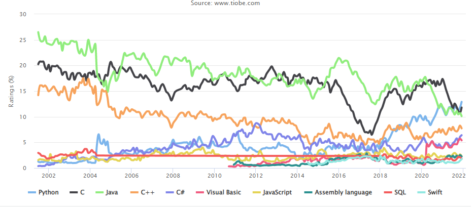

```python
plt.xticks(date_of_lan[::12],[x[:4] for x in date_of_lan[::12]],rotation=-45)
```


```python
# 修改x刻度
plt.xticks(
    ['2002-00-30', '2004-00-31', '2006-00-04', '2008-00-03', '2010-00-05', '2012-00-08', '2014-00-01', '2016-00-02', '2018-00-03', '2020-00-05', '2022-00-01'],
    ['2002', '2004', '2006', '2008', '2010', '2012', '2014', '2016', '2018', '2020', '2022'])  # , rotation=-45

# 改变图例位置
plt.legend(bbox_to_anchor=(0., -0.13, 1., -.13), loc=8,
           ncol=5, mode="expand", borderaxespad=0.)
# 增加横向主网格
plt.grid(which='major', axis='y', color='k', linestyle='-.', linewidth=0.7)

```


```python
import matplotlib.pyplot as plt
import matplotlib as mpl

mpl.rcParams['figure.figsize'] = (20,10)  # 修改图片大小
plt.rcParams['figure.dpi'] = 300          # default for me was 75

def read_txt():
    """读文本文件中的数据为字符串，替换转为字典，返回字典"""
    with open('/data/bigfiles/0aa17cd5-9be7-4c69-a413-3482db106ca9.txt', 'r', encoding='utf-8') as fr:
        tiobe_str = fr.read()  # 读文件到字符会串
    tiobe_dic = eval(tiobe_str.replace('name : ', '').replace(',data ', '').replace('Date.UTC', ''))
    return tiobe_dic


def plot_ranking_curve(tiobe_dic):
    for line in tiobe_dic:
        lan_name = list(line.keys())[0]  # 当前处理的语言名，字符串
        data = line[lan_name]  # 当前处理的语言的热度数据列表
        date_of_lan = [f'{x[0][0]}-{x[0][1]:02}-{x[0][2]:02}' for x in data]
        rank = [x[1] for x in data]
        plt.plot(date_of_lan, rank, label=lan_name, linewidth=2)


def draw_label():
    plt.title('TIOBE Programming Community index')
    plt.xlabel('year')
    plt.ylabel('Ratings(%)')

    # 修改x刻度
    plt.xticks(
    ['2002-00-30', '2004-00-31', '2006-00-04', '2008-00-03', '2010-00-05', '2012-00-08', '2014-00-01', '2016-00-02', '2018-00-03', '2020-00-05', '2022-00-01'],
    ['2002', '2004', '2006', '2008', '2010', '2012', '2014', '2016', '2018', '2020', '2022'])  # , rotation=-45
    
    # 改变图例位置
    plt.legend(bbox_to_anchor=(0., -0.13, 1., -.13), loc=8, ncol=5, mode="expand", borderaxespad=0.)
    
    # 增加横向主网格
    plt.grid(which='major', axis='y', color='k', linestyle='-.', linewidth=0.7)


if __name__ == '__main__':
    tiobe_dict = read_txt()
    plot_ranking_curve(tiobe_dict)
    draw_label()
    plt.show()

```


```python
import matplotlib.pyplot as plt
import matplotlib as mpl

mpl.rcParams['figure.figsize'] = (20,10)  # 修改图片大小
plt.rcParams['figure.dpi'] = 300          # default for me was 75

def read_txt():
    """读文本文件中的数据为字符串，替换转为字典，返回字典"""
    with open('/data/bigfiles/0aa17cd5-9be7-4c69-a413-3482db106ca9.txt', 'r', encoding='utf-8') as fr:
        tiobe_str = fr.read()  # 读文件到字符会串
    tiobe_dic = eval(tiobe_str.replace('name : ', '').replace(',data ', '').replace('Date.UTC', ''))
    return tiobe_dic


def plot_ranking_curve(tiobe_dic):
    """逐条绘制排名前4的程序设计语言曲线，Python语言曲线宽度设为4，突出显示"""    
    for line in tiobe_dic[:4]:  # 只绘制排名前4的语言
        lan_name = list(line.keys())[0]  # 当前处理的语言名，字符串
        if lan_name == 'Python':
            width = 4
        else:
            width = 2
        data = line[lan_name]  # 当前处理的语言的热度数据列表
        date_of_lan = [f'{x[0][0]}-{x[0][1]:02}-{x[0][2]:02}' for x in data]
        rank = [x[1] for x in data]
        plt.plot(date_of_lan, rank, label=lan_name, linewidth=width)


def draw_label():
    plt.title('TIOBE Programming Community index')
    plt.xlabel('year')
    plt.ylabel('Ratings(%)')

    # 修改x刻度
    plt.xticks(
    ['2002-00-30', '2004-00-31', '2006-00-04', '2008-00-03', '2010-00-05', '2012-00-08', '2014-00-01', '2016-00-02', '2018-00-03', '2020-00-05', '2022-00-01'],
    ['2002', '2004', '2006', '2008', '2010', '2012', '2014', '2016', '2018', '2020', '2022'])  # , rotation=-45
    
    # 改变图例位置
    plt.legend(bbox_to_anchor=(0., -0.13, 1., -.13), loc=8, ncol=5, mode="expand", borderaxespad=0.)
    
    # 增加横向主网格
    plt.grid(which='major', axis='y', color='k', linestyle='-.', linewidth=0.7)


if __name__ == '__main__':
    tiobe_dict = read_txt()
    plot_ranking_curve(tiobe_dict)
    draw_label()
    plt.show()

```


```python

```
