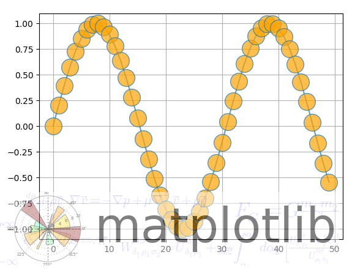

# 图片水印

利用png图片制作水印


```python
figimage(X, xo=0, yo=0, alpha=None, norm=None, cmap=None, vmin=None, vmax=None, origin=None, resize=False, **kwargs)
```

将未重新采样的图像添加到图片。

图像附着在左下角或左上角，具体取决于原点。

参数:
X：
图像数据。这是以下形状之一的数组：
（M，N）：具有标量数据的图像。颜色映射由cmap、norm、vmin和vmax控制。
（M，N，3）：具有RGB值（0-1浮点或0-255 int）的图像。
（M，N，4）：具有RGBA值（0-1浮点或0-255 int）的图像，即包括透明度。

xo, yo：整数，x/y图像偏移（以像素为单位）。

alpha：None or float，alpha混合值。


cmap：str 或 Colormap
default: rcParams["image.cmap"] (default: 'viridis')
用于将标量数据映射到颜色的Colormap实例或注册的Colormap名称。
如果X是RGB（A），则忽略此参数。

norm：str 或 Normalize, 可选参数
在使用cmap映射到颜色之前，用于将标量数据缩放到[0，1]范围的归一化方法。默认情况下，使用线性缩放，将最小值映射到0，将最大值映射到1。
如果给定，可以是以下之一：
规格化的实例或其子类之一（请参见颜色贴图规格化）。
刻度名称，即“linear”、“log”、“symlog”和“logit”等之一。有关可用刻度的列表，请调用matplotlib.scale.get_scale_names（）。在这种情况下，会动态生成并实例化一个合适的Normalize子类。
如果X是RGB（A），则忽略此参数。

vmin, vmax：float,可选
当使用标量数据而不使用显式范数时，vmin和vmax定义了颜色映射覆盖的数据范围。默认情况下，颜色映射覆盖所提供数据的整个值范围。在给定规范实例时使用vmin/vmax是错误的（但可以将str规范名称与vmin/vmmax一起使用）。
如果X是RGB（A），则忽略此参数。

origin：{'upper', 'lower'}, 缺省: rcParams["image.origin"] (default: 'upper')
指示数组的[0，0]索引位于轴的左上角或左下角。

resizebool
如果为True，则调整图形大小以匹配给定的图像大小。


```python
import numpy as np
import matplotlib.cbook as cbook
import matplotlib.image as image
import matplotlib.pyplot as plt


with cbook.get_sample_data('logo2.png') as file:
    im = image.imread(file)

fig, ax = plt.subplots()
ax.plot(np.sin(10 * np.linspace(0, 1)), '-o', ms=20, alpha=0.7, mfc='orange')
ax.grid()
fig.figimage(im, 10, 10, zorder=3, alpha=.5)

plt.show()
```




```python

```


```python
import numpy as np
import matplotlib.cbook as cbook
import matplotlib.image as image
import matplotlib.pyplot as plt


im = image.imread("/data/bigfiles/webchat.png")
fig, ax = plt.subplots()
ax.plot(np.sin(10 * np.linspace(0, 1)), '-o', ms=20, alpha=0.7, mfc='orange')
ax.grid()
fig.figimage(im, 40, 20, zorder=3)

plt.show()
```


```python

```
