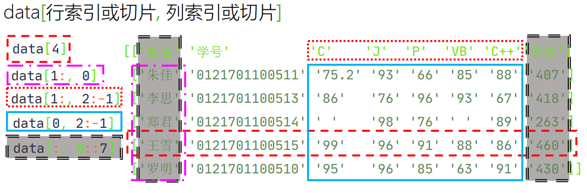

# 散点图

```python
Axes.scatter(x, y, s=None, c=None, marker=None, cmap=None, norm=None, vmin=None, vmax=None, alpha=None, linewidths=None, *, edgecolors=None, plotnonfinite=False, data=None, **kwargs)
```

x, y:float or array-like, shape (n, ),数据位置。

s:float or array-like, shape (n, ), optional
标记大小以点**2为单位（印刷点为1/72英寸）。默认值为rcParams['lines.markrsize']**2。

c:array-like or list of colors or color, optional
标记颜色。可能值：
使用cmap和范数将n个数字的标量或序列映射到颜色。
行为RGB或RGBA的2D阵列。
长度为n的一系列颜色。
单色格式字符串。
请注意，c不应该是单个数字RGB或RGBA序列，因为这与要进行颜色映射的值数组无法区分。如果要为所有点指定相同的RGB或RGBA值，请使用具有单行的2D阵列。否则，如果大小与x和y匹配，则值匹配优先。
如果希望为所有点指定单一颜色，则首选颜色关键字参数。
默认为“无”。在这种情况下，标记颜色由颜色、面部颜色或面部颜色的值确定。如果未指定或无，则标记颜色由轴当前“形状和填充”颜色周期的下一种颜色决定。此循环默认为rcParams[“axs.prop_cycle”]（默认值：cycler（'color'，['#1f77b4'，'#ff7f0e'，'#2ca02c'，'#d62728'，'#9467bd'，'#8c564b'，'#3377c2'，'#17f7f7f'，''#bcbd22'，'17becf']））。

marker:MarkerStyle, default: rcParams["scatter.marker"] (default: 'o')
标记样式。标记可以是类的实例，也可以是特定标记的文本简写。请参见matplotlib。有关标记样式的详细信息。

cmap:str or Colormap, default: rcParams["image.cmap"] (default: 'viridis')
用于将标量数据映射到颜色的Colormap实例或注册的Colormap名称。
如果c为RGB（A），则忽略此参数。

norm:str or Normalize, optional
在使用cmap映射到颜色之前，用于将标量数据缩放到[0，1]范围的归一化方法。默认情况下，使用线性缩放，将最小值映射到0，将最大值映射到1。
如果给定，可以是以下之一：
规格化的实例或其子类之一（请参见颜色贴图规格化）。
刻度名称，即“linear”、“log”、“symlog”和“logit”等之一。有关可用刻度的列表，请调用matplotlib.scale.get_scale_names（）。在这种情况下，会动态生成并实例化一个合适的Normalize子类。
如果c为RGB（A），则忽略此参数。

vmin, vmax:float, optional
当使用标量数据而不使用显式范数时，vmin和vmax定义了颜色映射覆盖的数据范围。默认情况下，颜色映射覆盖所提供数据的整个值范围。在给定规范实例时使用vmin/vmax是错误的（但可以将str规范名称与vmin/vmmax一起使用）。
如果c为RGB（A），则忽略此参数。

alpha:float, default: None
alpha混合值，介于0（透明）和1（不透明）之间。

lineidths:float或类似数组，默认值：rcParams[“lines.linewidth”]（默认值：1.5）
标记边的线宽。注意：默认边缘颜色为“face”。你可能也想改变这一点。

edgecolors:{'face', 'none', None} or color or sequence of color, default: rcParams["scatter.edgecolors"] (default: 'face')
标记的边缘颜色。可能值：
“face”：边缘颜色始终与面部颜色相同。
“none”：不会绘制面片边界。
颜色或颜色序列。
对于非填充标记，边颜色将被忽略。相反，颜色与“face”类似，即从c、colors或facecolors确定。

plotnonfinite:bool, default: False
是否使用非限定c（即inf、-inf或nan）绘制点。如果为True，则使用错误的颜色贴图颜色绘制点（请参见colormap.set_bad）。

## 1. 身高体重散点图

文件中保存身高体重数据<a href="https://data.educoder.net/api/attachments/4196544?type=office&disposition=inline" target="_blank">9.11 health.csv</a>  
数据格式如下：

```python

1 ,120.0 ,23.5 
1 ,119.0 ,21.6 
1 ,123.0 ,21.6 
2 ,118.0 ,17.1 
2 ,115.0 ,17.1 
1 ,113.0 ,18.8 
1 ,114.0 ,20.6 
2 ,112.0 ,16.5 
1 ,116.0 ,23.7 
```

首列的“1”代表男生，“2”代码女生。第2列表示身高，第3列表示体重。  
绘制身高体重的散点图，男生和女生用不同的标记区分。


```python
def read_file(file:str)->list:
    """读文件，返回二维列表"""
    data_ls = []
    with open(file,'r',encoding='utf-8') as fr:
        for x in fr:  # 遍历文件对象
            data_ls.append(x.strip().split(','))  # 当前行切分的列表加入到二维列表中
    return data_ls


if __name__ == '__main__':
    filename='/data/bigfiles/9,11 health.csv'
    data_lst = read_file(filename)
    print(data_lst)
```

查看数据格式是字符串，可以将其映射为数值类型，因性别用整数表示，身高和体重用浮点数，可以用eval实现。


```python
def read_file(file:str)->list:
    """读文件，返回二维列表"""
    data_ls = []
    with open(file,'r',encoding='utf-8') as fr:
        for x in fr:  # 遍历文件对象
            ls = list(map(eval,x.strip().split(',')))  # 当前行切分为列表，元素转数值型
            data_ls.append(ls)  # 当前行切分的列表加入到二维列表中
    return data_ls


if __name__ == '__main__':
    filename='/data/bigfiles/9,11 health.csv'
    data_lst = read_file(filename)
    print(data_lst)
```

将男生 和女生 的身高和体重数据分别提取置于一个列表中，


```python
def read_file(file: str) -> list:
    """读文件，返回二维列表"""
    data_ls = []
    with open(file, 'r', encoding='utf-8') as fr:
        for x in fr:  # 遍历文件对象
            ls = list(map(eval, x.strip().split(',')))  # 当前行切分为列表，元素转数值型
            data_ls.append(ls)  # 当前行切分的列表加入到二维列表中
    return data_ls


def separate(data_ls: list) -> list:
    """接收二维列表，将男生、女生的身高、体重数据分别提取出来
    将男又生身高体重列表做为元组的元素，返回元组"""
    boy_height = [x[1] for x in data_ls if x[0] == 1]
    boy_weight = [x[2] for x in data_ls if x[0] == 1]
    girl_height = [x[1] for x in data_ls if x[0] == 2]
    girl_weight = [x[2] for x in data_ls if x[0] == 2]
#     print(boy_height,boy_weight,girl_height,girl_weight)
    return boy_height,boy_weight,girl_height,girl_weight


if __name__ == '__main__':
    filename = '/data/bigfiles/9,11 health.csv'
    data_lst = read_file(filename)
    data_classfy = separate(data_lst)
    # print(data_lst)

```

根据男生身高体重数据绘制散点图


```python
import matplotlib.pyplot as plt

def read_file(file: str) -> list:
    """读文件，返回二维列表"""
    data_ls = []
    with open(file, 'r', encoding='utf-8') as fr:
        for x in fr:  # 遍历文件对象
            ls = list(map(eval, x.strip().split(',')))  # 当前行切分为列表，元素转数值型
            data_ls.append(ls)  # 当前行切分的列表加入到二维列表中
    return data_ls


def separate(data_ls: list) -> list:
    """接收二维列表，将男生、女生的身高、体重数据分别提取出来
    将男又生身高体重列表做为元组的元素，返回元组"""
    boy_height = [x[1] for x in data_ls if x[0] == 1]
    boy_weight = [x[2] for x in data_ls if x[0] == 1]
    girl_height = [x[1] for x in data_ls if x[0] == 2]
    girl_weight = [x[2] for x in data_ls if x[0] == 2]
#     print(boy_height,boy_weight,girl_height,girl_weight)
    return boy_height,boy_weight,girl_height,girl_weight


def plot_scatter(classify_ls:tuple)->None:
    """根据男生身高体重数据绘制散点图"""
    plt.scatter(classify_ls[0], classify_ls[1])


if __name__ == '__main__':
    filename = '/data/bigfiles/9,11 health.csv'
    data_lst = read_file(filename)
    data_classify = separate(data_lst)
    plot_scatter(data_classify)
    plt.show()


```

根据男生女生身高体重数据绘制散点图


```python
import matplotlib.pyplot as plt

def read_file(file: str) -> list:
    """读文件，返回二维列表"""
    data_ls = []
    with open(file, 'r', encoding='utf-8') as fr:
        for x in fr:  # 遍历文件对象
            ls = list(map(eval, x.strip().split(',')))  # 当前行切分为列表，元素转数值型
            data_ls.append(ls)  # 当前行切分的列表加入到二维列表中
    return data_ls


def separate(data_ls: list) -> list:
    """接收二维列表，将男生、女生的身高、体重数据分别提取出来
    将男又生身高体重列表做为元组的元素，返回元组"""
    boy_height = [x[1] for x in data_ls if x[0] == 1]
    boy_weight = [x[2] for x in data_ls if x[0] == 1]
    girl_height = [x[1] for x in data_ls if x[0] == 2]
    girl_weight = [x[2] for x in data_ls if x[0] == 2]
#     print(boy_height,boy_weight,girl_height,girl_weight)
    return boy_height,boy_weight,girl_height,girl_weight


def plot_scatter(classify_ls:tuple)->None:
    """根据男生女生身高体重数据绘制散点图"""
    plt.scatter(classify_ls[0], classify_ls[1])
    plt.xlim(105, 160)  # x取值范围设置
    plt.ylim(15, 50)    # y取值范围设置


if __name__ == '__main__':
    filename = '/data/bigfiles/9,11 health.csv'
    data_lst = read_file(filename)
    data_classify = separate(data_lst)
    plot_scatter(data_classify)
    plt.show()


```

根据男生女生身高体重数据绘制散点图，用不同标记区分数据点。


```python
import matplotlib.pyplot as plt

def read_file(file: str) -> list:
    """读文件，返回二维列表"""
    data_ls = []
    with open(file, 'r', encoding='utf-8') as fr:
        for x in fr:  # 遍历文件对象
            ls = list(map(eval, x.strip().split(',')))  # 当前行切分为列表，元素转数值型
            data_ls.append(ls)  # 当前行切分的列表加入到二维列表中
    return data_ls


def separate(data_ls: list) -> list:
    """接收二维列表，将男生、女生的身高、体重数据分别提取出来
    将男又生身高体重列表做为元组的元素，返回元组"""
    boy_height = [x[1] for x in data_ls if x[0] == 1]
    boy_weight = [x[2] for x in data_ls if x[0] == 1]
    girl_height = [x[1] for x in data_ls if x[0] == 2]
    girl_weight = [x[2] for x in data_ls if x[0] == 2]
#     print(boy_height,boy_weight,girl_height,girl_weight)
    return boy_height,boy_weight,girl_height,girl_weight


def plot_scatter(classify_ls:tuple)->None:
    """根据男生女生身高体重数据绘制散点图"""
    plt.scatter(classify_ls[0], classify_ls[1], c='b', marker=(5, 1))
    plt.scatter(classify_ls[2], classify_ls[3], c='g')
    plt.xlim(105, 160)  # x取值范围设置
    plt.ylim(15, 50)    # y取值范围设置


if __name__ == '__main__':
    filename = '/data/bigfiles/9,11 health.csv'
    data_lst = read_file(filename)
    data_classify = separate(data_lst)
    plot_scatter(data_classify)
    plt.show()


```

用numpy读文件，通过数组切片获取数据（多维数组切片查看教材214页）：




```python
import matplotlib.pyplot as plt
import numpy as np


def read_file(file: str) -> list:
    """读文件，将男生、女生的身高、体重数据分别提取出来
    将男又生身高体重列表做为元组的元素，返回元组"""
    data_arr = np.loadtxt(file, delimiter=',')
    boy_height = data_arr[:, 1][np.where(data_arr[:, 0] == 1)]
    boy_weight = data_arr[:, 2][np.where(data_arr[:, 0] == 1)]
    girl_height = data_arr[:, 1][np.where(data_arr[:, 0] == 2)]
    girl_weight = data_arr[:, 2][np.where(data_arr[:, 0] == 2)]
    return boy_height, boy_weight, girl_height, girl_weight


def plot_scatter(classify_ls: tuple) -> None:
    """根据男生女生身高体重数据绘制散点图"""
    plt.scatter(classify_ls[0], classify_ls[1], c='b', marker=(5, 1))
    plt.scatter(classify_ls[2], classify_ls[3], c='g')
    plt.xlim(105, 160)  # x取值范围设置
    plt.ylim(15, 50)  # y取值范围设置


if __name__ == '__main__':
    filename = '/data/bigfiles/9,11 health.csv'
    data_classify = read_file(filename)
    plot_scatter(data_classify)
    plt.show()

```


```python
用pandas读文件，通过dataframe切片获取数据
```


```python
import matplotlib.pyplot as plt
import pandas as pd


def read_file(file: str) -> list:
    """读文件，将男生、女生的身高、体重数据分别提取出来
    将男又生身高体重列表做为元组的元素，返回元组"""
    data_df = pd.read_csv(file,names=['gender','height','weight'])  # 为数据增加标题，方便后面根据标题索引数据
    boy_height = data_df[data_df['gender'] == 1]['height']  # 前面筛选男生数据，['height']为索引数据列
    boy_weight = data_df[data_df['gender'] == 1]['weight']
    girl_height = data_df[data_df['gender'] == 2]['height']
    girl_weight = data_df[data_df['gender'] == 2]['weight']
    return boy_height, boy_weight, girl_height, girl_weight


def plot_scatter(classify_ls: tuple) -> None:
    """根据男生女生身高体重数据绘制散点图"""
    plt.scatter(classify_ls[0], classify_ls[1], c='b', marker=(5, 1))
    plt.scatter(classify_ls[2], classify_ls[3], c='g')
    plt.xlim(105, 160)  # x取值范围设置
    plt.ylim(15, 50)  # y取值范围设置


if __name__ == '__main__':
    filename = '/data/bigfiles/9,11 health.csv'
    data_classify = read_file(filename)
    plot_scatter(data_classify)
    plt.show()

```

# 2. 带有自定义符号的散点图

## 使用TeX符号

自定义散点符号的一种简单方法是传递一个TeX符号名称，该名称包含在$符号中作为标记。
下面我们使用`marker=r'$\clubsuit$'`


```python
import matplotlib.pyplot as plt
import numpy as np

# Fixing random state for reproducibility
np.random.seed(19680801)


x = np.arange(0.0, 50.0, 2.0)
y = x ** 1.3 + np.random.rand(*x.shape) * 30.0
sizes = np.random.rand(*x.shape) * 800 + 500

fig, ax = plt.subplots()
ax.scatter(x, y, sizes, c="green", alpha=0.5, marker=r'$\clubsuit$',
           label="Luck")
ax.set_xlabel("Leprechauns")
ax.set_ylabel("Gold")
ax.legend()
plt.show()
```

## 使用自定义路径

或者，也可以将N个顶点的自定义路径作为x，y值的Nx2数组作为标记传递。


```python
import matplotlib.pyplot as plt
import numpy as np

# unit area ellipse
rx, ry = 3., 1.
area = rx * ry * np.pi
theta = np.arange(0, 2 * np.pi + 0.01, 0.1)
verts = np.column_stack([rx / area * np.cos(theta), ry / area * np.sin(theta)])

x, y, s, c = np.random.rand(4, 30)
s *= 10**2.

fig, ax = plt.subplots()
ax.scatter(x, y, s, c, marker=verts)

plt.show()
```

## 散点演示2

演示具有不同标记颜色和大小的散点图。


```python
import numpy as np
import matplotlib.pyplot as plt
import matplotlib.cbook as cbook

# Load a numpy record array from yahoo csv data with fields date, open, high,
# low, close, volume, adj_close from the mpl-data/sample_data directory. The
# record array stores the date as an np.datetime64 with a day unit ('D') in
# the date column.
price_data = (cbook.get_sample_data('goog.npz', np_load=True)['price_data']
              .view(np.recarray))
price_data = price_data[-250:]  # get the most recent 250 trading days

delta1 = np.diff(price_data.adj_close) / price_data.adj_close[:-1]

# Marker size in units of points^2
volume = (15 * price_data.volume[:-2] / price_data.volume[0])**2
close = 0.003 * price_data.close[:-2] / 0.003 * price_data.open[:-2]

fig, ax = plt.subplots()
ax.scatter(delta1[:-1], delta1[1:], c=close, s=volume, alpha=0.5)

ax.set_xlabel(r'$\Delta_i$', fontsize=15)
ax.set_ylabel(r'$\Delta_{i+1}$', fontsize=15)
ax.set_title('Volume and percent change')

ax.grid(True)
fig.tight_layout()

plt.show()
```

## 带直方图的散点图

将散点图的边缘分布显示为图两侧的直方图。

为了使主轴与边缘对齐，下面显示了两个选项：

而`Axes.inset_axes `可能有点复杂，它允许以固定的纵横比正确处理主轴。

使用axes_grid1工具包生成类似图形的另一种方法如散点直方图（可定位轴）示例所示。最后，也可以使用图.add_axes（此处未显示）在绝对坐标中定位所有轴。

让我们首先定义一个函数，该函数将x和y数据作为输入，以及三个轴、散射的主轴和两个边缘轴。然后，它将在提供的轴内创建散点图和直方图。
将散点图的边缘分布显示为图两侧的直方图。


```python
import numpy as np
import matplotlib.pyplot as plt
from mpl_toolkits.axes_grid1 import make_axes_locatable

# Fixing random state for reproducibility
np.random.seed(19680801)

# the random data
x = np.random.randn(1000)
y = np.random.randn(1000)


fig, ax = plt.subplots(figsize=(5.5, 5.5))

# the scatter plot:
ax.scatter(x, y)

# Set aspect of the main axes.
ax.set_aspect(1.)

# create new axes on the right and on the top of the current axes
divider = make_axes_locatable(ax)
# below height and pad are in inches
ax_histx = divider.append_axes("top", 1.2, pad=0.1, sharex=ax)
ax_histy = divider.append_axes("right", 1.2, pad=0.1, sharey=ax)

# make some labels invisible
ax_histx.xaxis.set_tick_params(labelbottom=False)
ax_histy.yaxis.set_tick_params(labelleft=False)

# now determine nice limits by hand:
binwidth = 0.25
xymax = max(np.max(np.abs(x)), np.max(np.abs(y)))
lim = (int(xymax/binwidth) + 1)*binwidth

bins = np.arange(-lim, lim + binwidth, binwidth)
ax_histx.hist(x, bins=bins)
ax_histy.hist(y, bins=bins, orientation='horizontal')

# the xaxis of ax_histx and yaxis of ax_histy are shared with ax,
# thus there is no need to manually adjust the xlim and ylim of these
# axis.

ax_histx.set_yticks([0, 50, 100])
ax_histy.set_xticks([0, 50, 100])

plt.show()
```

## 使用网格定义轴位置

我们定义了一个具有不等宽高比的网格，以实现所需的布局。


```python
import numpy as np
import matplotlib.pyplot as plt

# Start with a square Figure.
fig = plt.figure(figsize=(6, 6))
# Add a gridspec with two rows and two columns and a ratio of 1 to 4 between
# the size of the marginal axes and the main axes in both directions.
# Also adjust the subplot parameters for a square plot.
gs = fig.add_gridspec(2, 2,  width_ratios=(4, 1), height_ratios=(1, 4),
                      left=0.1, right=0.9, bottom=0.1, top=0.9,
                      wspace=0.05, hspace=0.05)
# Create the Axes.
ax = fig.add_subplot(gs[1, 0])
ax_histx = fig.add_subplot(gs[0, 0], sharex=ax)
ax_histy = fig.add_subplot(gs[1, 1], sharey=ax)
# Draw the scatter plot and marginals.
scatter_hist(x, y, ax, ax_histx, ax_histy)
```

## 使用inset_axis定义轴位置

inset_axis可用于将边缘定位在主轴之外。这样做的优点是可以固定主轴的纵横比，并且始终相对于轴的位置绘制边缘。


```python
# Create a Figure, which doesn't have to be square.
fig = plt.figure(constrained_layout=True)

# Create the main axes, leaving 25% of the figure space at the top and on the
# right to position marginals.
ax = fig.add_gridspec(top=0.75, right=0.75).subplots()

# The main axes' aspect can be fixed.
ax.set(aspect=1)

# Create marginal axes, which have 25% of the size of the main axes.  Note that
# the inset axes are positioned *outside* (on the right and the top) of the
# main axes, by specifying axes coordinates greater than 1.  Axes coordinates
# less than 0 would likewise specify positions on the left and the bottom of
# the main axes.
ax_histx = ax.inset_axes([0, 1.05, 1, 0.25], sharex=ax)
ax_histy = ax.inset_axes([1.05, 0, 0.25, 1], sharey=ax)
# Draw the scatter plot and marginals.
scatter_hist(x, y, ax, ax_histx, ax_histy)

plt.show()
```

## Scatter Masked蒙版散点图

屏蔽一些数据点，并添加一条线，对屏蔽区域进行去标记。


```python
import matplotlib.pyplot as plt
import numpy as np

# Fixing random state for reproducibility
np.random.seed(19680801)


N = 100
r0 = 0.6
x = 0.9 * np.random.rand(N)
y = 0.9 * np.random.rand(N)
area = (20 * np.random.rand(N))**2  # 0 to 10 point radii
c = np.sqrt(area)
r = np.sqrt(x ** 2 + y ** 2)
area1 = np.ma.masked_where(r < r0, area)
area2 = np.ma.masked_where(r >= r0, area)
plt.scatter(x, y, s=area1, marker='^', c=c)
plt.scatter(x, y, s=area2, marker='o', c=c)
# Show the boundary between the regions:
theta = np.arange(0, np.pi / 2, 0.01)
plt.plot(r0 * np.cos(theta), r0 * np.sin(theta))

plt.show()
```

## Marker examples 标记示例

.png)


```python
import numpy as np
import matplotlib.pyplot as plt

# Fixing random state for reproducibility
np.random.seed(19680801)

x = np.random.rand(10)
y = np.random.rand(10)
z = np.sqrt(x**2 + y**2)

fig, axs = plt.subplots(2, 3, sharex=True, sharey=True)

# marker symbol
axs[0, 0].scatter(x, y, s=80, c=z, marker=">")
axs[0, 0].set_title("marker='>'")

# marker from TeX
axs[0, 1].scatter(x, y, s=80, c=z, marker=r'$\alpha$')
axs[0, 1].set_title(r"marker=r'\$\alpha\$'")

# marker from path
verts = [[-1, -1], [1, -1], [1, 1], [-1, -1]]
axs[0, 2].scatter(x, y, s=80, c=z, marker=verts)
axs[0, 2].set_title("marker=verts")

# regular polygon marker
axs[1, 0].scatter(x, y, s=80, c=z, marker=(5, 0))
axs[1, 0].set_title("marker=(5, 0)")

# regular star marker
axs[1, 1].scatter(x, y, s=80, c=z, marker=(5, 1))
axs[1, 1].set_title("marker=(5, 1)")

# regular asterisk marker
axs[1, 2].scatter(x, y, s=80, c=z, marker=(5, 2))
axs[1, 2].set_title("marker=(5, 2)")

plt.tight_layout()
plt.show()

```

## 带有图例的散点图Scatter plots with a legend

要创建带有图例的散点图，可以使用循环并为每个项目创建一个散点图以显示在图例中，并相应地设置标签。
下面还演示了如何通过为alpha设置介于0和1之间的值来调整标记的透明度。


```python
import numpy as np
import matplotlib.pyplot as plt

np.random.seed(19680801)


fig, ax = plt.subplots()
for color in ['tab:blue', 'tab:orange', 'tab:green']:
    n = 750
    x, y = np.random.rand(2, n)
    scale = 200.0 * np.random.rand(n)
    ax.scatter(x, y, c=color, s=scale, label=color,
               alpha=0.3, edgecolors='none')

ax.legend()
ax.grid(True)

plt.show()
```

## 自动化图例创建Automated legend creation

为散布创建图例的另一个选项是使用PathCollection.legend_elements方法。它将自动尝试确定要显示的图例条目的有用数量，并返回句柄和标签的元组。这些可以传递给legend的调用。


```python
N = 45
x, y = np.random.rand(2, N)
c = np.random.randint(1, 5, size=N)
s = np.random.randint(10, 220, size=N)

fig, ax = plt.subplots()

scatter = ax.scatter(x, y, c=c, s=s)

# produce a legend with the unique colors from the scatter
legend1 = ax.legend(*scatter.legend_elements(),
                    loc="lower left", title="Classes")
ax.add_artist(legend1)

# produce a legend with a cross section of sizes from the scatter
handles, labels = scatter.legend_elements(prop="sizes", alpha=0.6)
legend2 = ax.legend(handles, labels, loc="upper right", title="Sizes")

plt.show()
```

对于PathCollection.legend_elements方法的其他参数可用于控制要创建多少图例条目以及如何标记它们。下面介绍其中的一些如何使用。


```python
volume = np.random.rayleigh(27, size=40)
amount = np.random.poisson(10, size=40)
ranking = np.random.normal(size=40)
price = np.random.uniform(1, 10, size=40)

fig, ax = plt.subplots()

# Because the price is much too small when being provided as size for ``s``,
# we normalize it to some useful point sizes, s=0.3*(price*3)**2
scatter = ax.scatter(volume, amount, c=ranking, s=0.3*(price*3)**2,
                     vmin=-3, vmax=3, cmap="Spectral")

# Produce a legend for the ranking (colors). Even though there are 40 different
# rankings, we only want to show 5 of them in the legend.
legend1 = ax.legend(*scatter.legend_elements(num=5),
                    loc="upper left", title="Ranking")
ax.add_artist(legend1)

# Produce a legend for the price (sizes). Because we want to show the prices
# in dollars, we use the *func* argument to supply the inverse of the function
# used to calculate the sizes from above. The *fmt* ensures to show the price
# in dollars. Note how we target at 5 elements here, but obtain only 4 in the
# created legend due to the automatic round prices that are chosen for us.
kw = dict(prop="sizes", num=5, color=scatter.cmap(0.7), fmt="$ {x:.2f}",
          func=lambda s: np.sqrt(s/.3)/3)
legend2 = ax.legend(*scatter.legend_elements(**kw),
                    loc="lower right", title="Price")

plt.show()
```


```python
## 注释文本箭头
```


```python
import numpy as np
import matplotlib.pyplot as plt


# Fixing random state for reproducibility
np.random.seed(19680801)

fig, ax = plt.subplots(figsize=(5, 5))
ax.set_aspect(1)

x1 = -1 + np.random.randn(100)
y1 = -1 + np.random.randn(100)
x2 = 1. + np.random.randn(100)
y2 = 1. + np.random.randn(100)

ax.scatter(x1, y1, color="r")
ax.scatter(x2, y2, color="g")

bbox_props = dict(boxstyle="round", fc="w", ec="0.5", alpha=0.9)
ax.text(-2, -2, "Sample A", ha="center", va="center", size=20,
        bbox=bbox_props)
ax.text(2, 2, "Sample B", ha="center", va="center", size=20,
        bbox=bbox_props)


bbox_props = dict(boxstyle="rarrow", fc=(0.8, 0.9, 0.9), ec="b", lw=2)
t = ax.text(0, 0, "Direction", ha="center", va="center", rotation=45,
            size=15,
            bbox=bbox_props)

bb = t.get_bbox_patch()
bb.set_boxstyle("rarrow", pad=0.6)

ax.set_xlim(-4, 4)
ax.set_ylim(-4, 4)

plt.show()
```


```python

```
