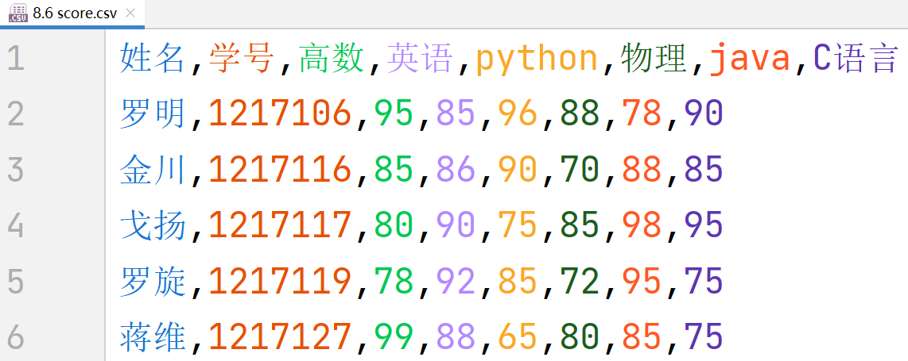

# NumPy中的数据统计与分析

描述性统计是用于概括、表述事物完整状况，以及事物间关联、类属关系的统计方法。数值型特征的描述性统计主要包括计算数值型数据的完整情况、最小值、最大值、均值、中位数、四分位数、极差、标准差、方差、协方差和变异系数等。NumPy中提供了很多统计函数，部分统计函数如下表所示。

| 函数     | 描述               | 函数      | 描述         |
| :--------: | :------------------ | :---------: | :------------ |
| min()    | 最小值             | max()     | 最大值       |
| argmax() | 最大值索引         | argmin()  | 最小值索引   |
| cumsum() | 所有元素累加       | cumprod() | 所有元素累乘 |
| sum()    | 对数组元素进行求和 |    median()       |    中位数           |
| mean()   | 均值               |   average()  | 加权平均值         |
|   ptp()|      极差       |   var()   |    方差    |
|   std()  | 标准差               | cov()     | 协方差       |

下面对常用统计函数做简单介绍，未涉及到的函数或参数的含义与用法，可自行查看相关文档。

+ ### 最大值和最小值

max()方法或min()方法分别可用于获取数组中的最大值或最小值。函数原型为：
```python
ndarray.max(axis=None, out=None, keepdims=False, initial=<no value>, where=True)
ndarray.min(axis=None, out=None, keepdims=False, initial=<no value>, where=True)
```


```python
import numpy as np

np.random.seed(10)   # 设置随机数种子
a = np.random.randint(1, 100, size=(3, 3))  # 生成一个值在区间[1,100)之间的3 x 3的二维数组
print(a)
print('数组中的最大值：', a.max(), '数组中的最小值：',a.min())
print('数组中每行的最大值：', a.max(axis=1), '数组中每行的最小值：',a.min(axis=1))
print('数组中每列的最大值：', a.max(axis=0), '数组中每列的最小值：',a.min(axis=0))
```

+ ### 最大值索引和最小值索引

argmax()方法或argmin()方法分别可用于获取数组中的最大值的索引或最小值的索引。函数原型为：
```python
ndarray.argmax(axis=None, out=None, *, keepdims=False)
ndarray.argmin(axis=None, out=None, *, keepdims=False)
```


```python
import numpy as np

np.random.seed(10)   # 设置随机数种子
a = np.random.randint(1, 100, size=(3, 3))  # 生成一个值在区间[1,100)之间的3 x 3的二维数组
print(a)
print('数组中的最大值的索引：', a.argmax(), '数组中的最小值的索引：',a.argmin())    # 展开为一维数组后的索引
print('数组中每行最大值的列索引：', a.argmax(axis=1), '数组中每行最小值的列索引：',a.argmin(axis=1))
print('数组中每列最大值的行索引：', a.argmax(axis=0), '数组中每列最小值的行索引：',a.argmin(axis=0))
```

+ ### 累加和累乘

cumsum()或cumprod()方法分别可用于求对数组中的给定轴的元素的累加总和或累乘总积。函数原型为：
```python
ndarray.cumsum(axis=None, dtype=None, out=None)
ndarray.cumprod(axis=None, dtype=None, out=None)
```


```python
import numpy as np

a = np.arange(1, 10).reshape(3, 3)  # 生成一个3 x 3的二维数组
print(a)
print('数组元素逐个累加结果：', a.cumsum())     # 展开为一维数组后的累加
print('数组元素逐个累乘结果：', a.cumprod())    # 展开为一维数组后的累乘
print('数组逐行累加结果：', a.cumsum(axis=0), '数组逐列累加结果：',a.cumsum(axis=1), sep='\n')
print('数组逐行累乘结果：', a.cumprod(axis=0), '数组逐列累乘结果：',a.cumprod(axis=1), sep='\n')
```

+ ### 求和

sum()方法返回给定轴上数组元素的总和。函数原型为：
```python
ndarray.sum(axis=None, dtype=None, out=None, keepdims=False, initial=0, where=True)
```


```python
import numpy as np

a = np.arange(1, 10).reshape(3, 3)  # 生成一个3 x 3的二维数组
print(a)
print('数组元素之和：', a.sum())     # 展开为一维数组后的求和
print('数组每行元素的和：', a.sum(axis=1))
print('数组每列元素的和：', a.sum(axis=0))
```

+ ### 中位数

median()函数用于沿指定轴计算并返回数组元素的中位数。函数原型为：
```python
numpy.median(a, axis=None, out=None, overwrite_input=False, keepdims=False)
```


```python
import numpy as np

a = np.arange(1, 13).reshape(3, 4)  # 生成一个3 x 4的二维数组
print(a)
print('数组元素中位数：', np.median(a))          # 展开为一维数组后的求中位数
print('数组每行中位数：', np.median(a, axis=1))  # 元素个数为偶数时，中位数是排序后中间两个数的平均值
print('数组每列中位数：', np.median(a, axis=0))  # 元素个数为奇数时，中位数是排序后中间那个数
```

+ ### 均值与加权平均

mean()方法用于返回数组元素沿给定轴的平均值；average()函数计算并返回沿指定轴的加权平均值。函数原型为：
```python
ndarray.mean(axis=None, dtype=None, out=None, keepdims=False, *, where=True)
numpy.average（a， axis=None， weights=None， return=False， *， keepdims=<no value>)
```
$$均值=\frac{a_1+a_2+a_3+ \cdots \cdots +a_n}{n} \qquad 加权均值=\frac{a_1\times b_1+a_2\times b_2+a_3\times b_3+ \cdots \cdots +a_n\times b_n}{b_1+b_2+b_3+ \cdots \cdots +b_n}$$


```python
import numpy as np

a = np.arange(1, 10).reshape(3, 3)  # 生成一个3 x 3的二维数组
np.random.seed(10)   # 设置随机数种子
b = np.random.randint(1, 10, size=(3, 3))  # 生成一个值在区间[1,10)之间的3 x 3的二维权重数组
print(a)
print('数组元素平均值：', round(a.mean(), 2))          # 展开为一维数组后求平均
print('数组每行平均值：', a.mean(axis=1).round(2))     # 元素个数为偶数时，中位数是排序后中间两个数的平均值
print('数组每列中位数：', np.median(a, axis=0))        # 元素个数为奇数时，中位数是排序后中间那个数
print('数组元素加权（权值均为1）平均值：', round(np.average(a), 2))  # 缺省weights，权值都为1时，结果与mean()方法相同
print('权重数组b：\n', b)
print('数组元素加权平均值：', round(np.average(a, weights=b), 2))   # a与b对位相乘后求和，再除以数组b的和，等价于(a*b).sum()/b.sum()
# print((a*b).sum()/b.sum())
```

+ ### 极差

ptp()函数计算并返回沿指定轴的极差（最大值减最小值）。函数原型为：
```python
numpy.ptp(a, axis=None, out=None, keepdims=<no value>)
```


```python
import numpy as np

np.random.seed(10)   # 设置随机数种子
a = np.random.randint(1, 10, size=(3, 3))  # 生成一个值在区间[1,10)之间的3 x 3的二维权重数组
print(a)
print('数组元素极差：', np.ptp(a))              # 展开为一维数组后求极差
print('数组每行元素极差：', np.ptp(a, axis=1))  
print('数组每列元素极差：', np.ptp(a, axis=0))
```

+ ### 方差

var()函数计算并返回沿指定轴的方差。函数原型为：
```python
numpy.var（a， axis=None， dtype=None， out=None， ddof=0， keepdims=<no value>， *， where=<no value>)
```
方差是在概率论和统计方差衡量随机变量或一组数据时离散程度的度量。统计中的方差（样本方差）是各个数据分别与其平均数之差的平方的和的平均数。


```python
import numpy as np

a = np.arange(1, 10).reshape(3, 3)  # 生成一个3 x 3的二维数组
print(a)
print('数组元素有偏方差：', np.var(a))     # ddof参数默认为0，求得的是有偏方差（求方差时除以n）
print('数组元素无偏方差：', np.var(a, ddof=1))   # 若要求的是无偏方差（求方差时除以n-1），需设置ddof参数为1
print('数组每行元素有偏方差：', np.var(a, axis=1))  
print('数组每列元素无偏方差：', np.var(a, ddof=1, axis=0))
```

+ ### 标准差

std()函数计算并返回沿指定轴的标准差。函数原型为：
```python
numpy.std（a， axis=None， dtype=None， out=None， ddof=0， keepdims=<no value>， *， where=<no value>)
```
标准差也称均方差，为方差的算术平方根，也能反映一个数据集的离散程度。较大的标准差，代表大部分数值和其平均值之间差异较大；较小的标准差，代表这些数值较接近平均值。比如在投资上，标准差可作为量度回报稳定性的指标。标准差数值越大，代表回报远离过去平均数值，回报较不稳定，风险较高；相反，标准差数值越小，代表回报较为稳定，风险亦较小。


```python
import numpy as np

a = np.arange(1, 10).reshape(3, 3)  # 生成一个3 x 3的二维数组
print(a)
print('数组元素有偏标准差：', np.std(a))     # ddof参数默认为0，求得的是有偏标准差（求标准差时除以n）
print('数组元素无偏标准差：', np.std(a, ddof=1))   # 若要求的是无偏标准差（求标准差时除以n-1），需设置ddof参数为1
print('数组每行元素有偏标准差：', np.std(a, axis=1))  
print('数组每列元素无偏标准差：', np.std(a, ddof=1, axis=0))
```

### 实例：利用 NumPy进行成绩统计分析
文件[8.6 score.csv](./数据集/8.6%20score.csv)保存学生成绩数据，中文编码类型为utf-8，分隔符为英文逗号“,”，文件的内容如下，按要求完成以下操作：

1. 求Python平均成绩并输出，
2. 求Python中位数成绩并输出，
3. 求Python成绩标准差并输出，
4. 求罗明的平均成绩并输出。




```python
!tar -xvf /data/bigfiles/7351c4c6-a166-4999-9575-69601c56139e.tar
```


```python
import numpy as np

scoreAll=np.loadtxt('8.6 score.csv', str, delimiter=',', encoding='utf-8')   # 读取文件数据到数组
print(scoreAll)  # 输出数组
scoreNum = scoreAll[1:, 2:].astype(int)  # 数组切片，仅保留成绩部分，并全部转化为整形
print(scoreNum)  # 输出数组c
scorePython = scoreNum[:, 2]  # 从成绩数组中切片分离出Python成绩
scoreStu = scoreNum[0]        # 从成绩数组中切片分离出罗明的成绩
nameStu = scoreAll[1, 0]      # 从总数组中索引获得人名
print('python成绩数组：', scorePython)                # 输出python成绩数组
print('python平均成绩：', np.average(scorePython))    # 输出python的平均成绩
print('python成绩中位数：', np.median(scorePython))   # 输出python成绩中位数
print('python成绩标准差：', round(np.std(scorePython), 2))  # 输出python成绩标准差
print(f'{nameStu}同学成绩数组： {scoreStu}')  # 输出罗明成绩数组
print(f'{nameStu}同学的平均成绩： {np.average(scoreStu):.2f}')  # 输出罗明平均成绩
```

<font face='楷体' color='red' size=5> 练一练 </font>
### 利用 NumPy分析花萼数据

文件[iris_sepal_length.csv](./数据集/iris_sepal_length.csv)中有一列数据，保存着若干花萼的长度，编码类型为utf-8。编程按要求完成以下操作：

1. 读取文件iris_sepal_length.csv中的花萼数据到数组。‪‬‪‬‪‬‪‬‪‬‮‬‪‬‫‬‪‬‪‬‪‬‪‬‪‬‮‬‫‬‮‬‪‬‪‬‪‬‪‬‪‬‮‬‪‬‭‬‪‬‪‬‪‬‪‬‪‬‮‬‪‬‪‬‪‬‪‬‪‬‪‬‪‬‮‬‪‬‭‬‪‬‪‬‪‬‪‬‪‬‮‬‪‬‫‬‪‬‪‬‪‬‪‬‪‬‮‬‪‬‫‬‪‬‪‬‪‬‪‬‪‬‮‬‫‬‮‬‪‬‪‬‪‬‪‬‪‬‮‬‪‬‭‬‪‬‪‬‪‬‪‬‪‬‮‬‪‬‪‬‪‬‪‬‪‬‪‬‪‬‮‬‪‬‭‬‪‬‪‬‪‬‪‬‪‬‮‬‪‬‫‬
2. 去掉重复的花萼数据。‪‬‪‬‪‬‪‬‪‬‮‬‪‬‫‬‪‬‪‬‪‬‪‬‪‬‮‬‫‬‮‬‪‬‪‬‪‬‪‬‪‬‮‬‪‬‭‬‪‬‪‬‪‬‪‬‪‬‮‬‪‬‪‬‪‬‪‬‪‬‪‬‪‬‮‬‪‬‭‬‪‬‪‬‪‬‪‬‪‬‮‬‪‬‫‬‪‬‪‬‪‬‪‬‪‬‮‬‪‬‫‬‪‬‪‬‪‬‪‬‪‬‮‬‫‬‮‬‪‬‪‬‪‬‪‬‪‬‮‬‪‬‭‬‪‬‪‬‪‬‪‬‪‬‮‬‪‬‪‬‪‬‪‬‪‬‪‬‪‬‮‬‪‬‭‬‪‬‪‬‪‬‪‬‪‬‮‬‪‬‫‬
3. 统计并按如下输出格式输出花萼长度的最大值、最小值、均值、标准差、方差。

**提示：**
1. 所有输出保留两位小数。
2. 计算方差时，使用有偏方差（ddof=0）
3. 计算标准差时，使用无偏标准差（ddof=1）
4. 去重可使用numpy.unique()函数，例如：
```python
a = np.array([1, 1, 2, 3, 2])
print(np.unique(a)) # 输出去重后的数组[1 2 3]
```

**期望输出：**

花萼长度的最大值是：7.90<br>
花萼长度的最小值是：4.30<br>
花萼长度的均值是：6.01<br>
花萼长度的方差是：1.06<br>
花萼长度的标准差是：1.04<br>


```python
!tar -xvf /data/bigfiles/ced9cee3-c0ea-4195-aeb5-785fa58fa586.tar
```


```python
# 此处编写代码，完成题目要求

```
