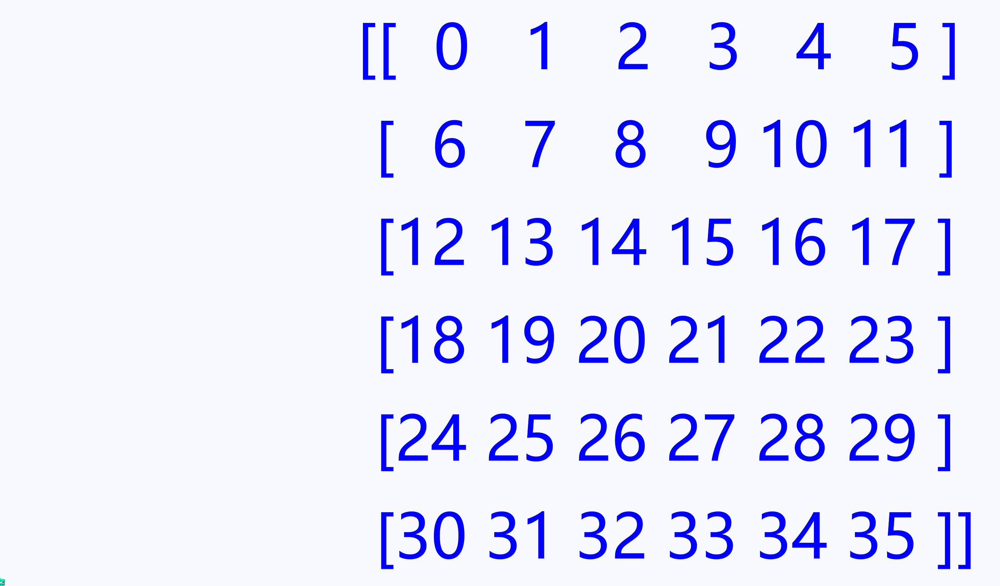

# 数组的基本操作

### 1. 数组的属性

数组属性反映了数组本身固有的信息，NumPy 的数组中比较重要的ndarray对象属性如下表：

|        属性	        | 说明                            |
|:-----------------:|:------------------------------|
|   ndarray.ndim	   | 秩，即轴的数量或维度的数量                 |
|  ndarray.shape	   | 数组的维度，对于矩阵，n 行 m 列            |
|   ndarray.size	   | 数组元素的总个数，相当于 .shape 中 n\*m 的值 |
|  ndarray.dtype	   | ndarray 对象的元素类型               |
| ndarray.itemsize	 | ndarray 对象中每个元素的大小，以字节为单位     |
|  ndarray.nbytes	  | 数组元素消耗的总字节数                   |
|   ndarray.real	   | ndarray 元素的实部（复数的实部）          |
|   ndarray.imag	   | ndarray 元素的虚部（复数的虚部）          |
|    ndarray.T	     | 转置数组                          |
|   ndarray.flat	   | 数组上的一维迭代器                     |
|  ndarray.flags	   | ndarray 对象的内存信息               |
|  ndarray.strides  | 	遍历数组时每个维度中的字节元组              |

```python
import numpy as np

a = np.arange(10)
b = np.array([[1, 2, 3], [4, 5, 6], [7, 8, 9]])
c = np.array([[1 + 2j, 3 + 4j], [5 + 6j, 7 + 8j]])
print(f'a.ndim={a.ndim}, b.ndim={b.ndim}, c.ndim={c.ndim}')  # 返回a、b、c三个数组的秩（维度）
print(f'a.dtype={a.dtype}, b.dtype={b.dtype}, c.dtype={c.dtype}')  # 返回a、b、c三个数组的元素类型
print(f'a.shape={a.shape}, b.shape={b.shape}, c.shape={c.shape}')  # 元组形式返回a、b、c三个数组的形状
print(f'a.size={a.size}, b.size={b.size}, c.size={c.size}')  # 返回a、b、c三个数组的元素的总个数
print(f'a.itemsize={a.itemsize}, b.itemsize={b.itemsize}, c.itemsize={c.itemsize}')  # 返回a、b、c三个数组每个元素占字节数
print(f'a.nbytes={a.nbytes}, b.nbytes={b.nbytes}, c.nbytes={c.nbytes}')  # 返回a、b、c三个每个数组所有元素占字节数
print(f'c.real:\n{c.real}\nc.imag:\n{c.imag}')  # 分别返回c数组的实部和虚部构成的新数组
```

ndarray.T可以获得ndarray数组的转置数组（行列互换）。

```python
import numpy as np

b = np.array([[1, 2, 3], [4, 5, 6], [7, 8, 9]])
print(f'b:\n{b},\nb.t:\n{b.T}')
```

ndarray.flat可以获得ndarray数组的一维迭代器，可使用array()函数将其转换为对应的一维数组。

```python
import numpy as np

b = np.array([[1, 2, 3], [4, 5, 6], [7, 8, 9]])
print(f'b:\n{b},\nb.flat:\n{np.array(b.flat)}')
```

### 2. 数组的索引和切片

+ ##### 基本切片和索引

数组支持索引与切片，操作与列表的操作类似，但更灵活，从一维拓展到多维。

一维数组的索引和切片基本和Python中的列表一致。

```python
import numpy as np

a = np.arange(0, 10)
print(a)
print(a[5])  # 获取索引为1的元素，结果为5
print(a[-5])  # 支持负索引，结果为5
print(a[1:5:2])  # 切片，结果为[1 3]
print(a[1:5])  # 切片步长为1，可省略，结果为[1 2 3 4]
print(a[:5])  # 省略起始值，结果为[0 1 2 3 4]
print(a[5:])  # 省略终结值，结果为[5 6 7 8 9]
print(a[:])  # 全部省略，返回[0 1 2 3 4 5 6 7 8 9]
print(a[::-1])  # 利用负数下标翻转数组，[9 8 7 6 5 4 3 2 1 0]
```

对于多维数组，其每一个维度都有一个索引，各索引之间使用逗号间隔。下面以二维数组为例。

```python
import numpy as np

a = np.arange(36).reshape(6, 6)  # 生成一个6行6列的二维数组
print(a)
print(a[2, 0])  # 返回数组第3行第1列的元素，结果为12
print(a[0])  # 返回数组第1行，结果为[ 0  1  2  3  4  5]
print(a[0, 3:5])  # 返回数组第1行的4至5列，结果为[3 4]
print(a[4:, 4:])  # 行列同时切片，结果为[[28 29] [34 35]]
print(a[:, 2])  # 返回第3列，结果为[ 2  8 14 20 26 32]
print(a[2::2, ::2])  # 带步长切片，结果为[[12 14 16] [24 26 28]]
```



与列表切片不同，NumPy中数组**切片的结果都是数组的视图**，对视图的修改会引起原有数组的改变。

```python
import numpy as np

a = np.arange(36).reshape(6, 6)  # 生成一个6行6列的二维数组
print(a)
t = a[0, 3:5]  # 数组切片赋值给t
print(t)
t[1] = 999  # 修改t中的元素，t为数组a的视图，a中的元素也会变化
print(t)
print(a)
```

+ ##### 布尔索引

通过布尔数组或列表索引目标数组，能够只输出布尔数组中值为True对应的位置的原数组的值。

```python
import numpy as np

a = np.arange(0, 6)
b = np.arange(36).reshape(6, 6)
c = np.array([True, False, False, True, False, True])  # 一维布尔数组
d = np.array([c, c, c, c, c, c])  # 二维布尔数组
print(a[c])  # 一维布尔数组做索引，输出一维数组中True对应的值
print(b[c])  # 一维布尔数组做索引，输出二维数组中True对应的行
print(d)
print(b[d])  # 二维布尔数组做索引，输出二维数组中True对应的值
```

**布尔索引返回的是数据的副本**，对其的修改不会引起原有数组的改变。

```python
import numpy as np

a = np.arange(0, 6)
c = np.array([True, False, False, True, False, True])  # 一维布尔数组
print(a)
t = a[c]  # 数组切片赋值给t
print(t)
t[1] = 999  # 修改t中的元素，t为数组a的副本，a中的元素不会受到影响
print(t)
print(a)
```

+ ##### 花式索引

花式索引（Fancy indexing）是指利用整数数组进行索引，这里的整数数组可以是Numpy数组也可以是Python中列表、元组等可迭代类型。花式索引根据索引整型数组的值作为目标数组的下标来取值。

```python
import numpy as np

a = np.arange(0, 6)
b = np.arange(36).reshape(6, 6)
c = np.array([1, 3, 5])  # 一维整数数组
d = np.array([0, 2, 4])  # 一维整数数组
print(a[c])  # 一维整数数组做索引数组，输出一维数组中对应索引的元素
print(b[c])  # 一维整数数组做索引数组，输出二维数组中对应的行
print(b[c, d])  # 两个一维整数数组c、d做索引，输出二维数组中c、d对应位元素组成的行列索引对应的值
```

与布尔索引相同，数组索引返回的是数据的副本，对其的修改不会引起原有数组的改变。

```python
import numpy as np

a = np.arange(0, 6)
c = np.array([1, 3, 5])  # 一维整数数组
print(a)
t = a[c]  # 数组切片赋值给t
print(t)
t[1] = 999  # 修改t中的元素，t为数组a的副本，a中的元素不会受到影响
print(t)
print(a)
```

### 3. 其他数组常用操作

+ ##### 重塑数组——reshape()方法

该方法用于重塑数组，即改变数组的形状。新的形状应该与原始形状兼容，数组中的元素值不改变。该方法返回原始数组的视图，对其的修改会引起原始数组的改变。函数原型为：

```python
ndarray.reshape(shape, order='C')
```

```python
import numpy as np

a = np.arange(12)  # 创建一维数组，共12个元素
print(a)
b = a.reshape(3, 4)  # 重塑为3 x 4的二维数组
print(b)
b[1, 2] = 999  # 修改b中元素值，a也会变化
print(b)
print(a)
```

+ ##### 修改数组类型——astype()方法

该方法用于转换数组中元素的类型，该方法返回原始数组的经过类型转化后的新数组，使用时通常只需给出需转换为的类型。函数原型为：

```python
ndarray.astype(dtype, order='K', casting='unsafe', subok=True, copy=True)
```

```python
import numpy as np

a = np.array(list('1234567890'))  # 创建一维数组，共10个元素
print(a)
b = a.astype(float)  # 修改数据类型为float
print(b)
c = a.astype(np.int8)  # 修改数据类型为np.int8（单字节整数）
print(c)
```

+ ##### 数组复制——copy()方法

该方法用于返回一个指定数组的副本，对副本的修改不影响原数组。函数原型为：

```python
ndarray.copy(order='C')
```

```python
import numpy as np

a = np.arange(5)
b = a  # 对象赋值，b为a的视图
c = a.copy()  # copy，c为a的副本
print('a:', a, 'id_a:', id(a))
print('b:', b, 'id_b:', id(b))  # b与a的id相同
print('c:', c, 'id_c:', id(c))  # c与a的id不同
b[2] = 999  # 修改b中元素值将导致a变化
c[3] = 100  # 修改c中元素值对a无影响
print('b:', b)
print('c:', c)
print('a:', a)  
```

+ ##### 数组拼接——vstack()与hstack()方法

用于将多个数组拼接成一个新的数组，hstack是水平方向拼接数组，vstack是垂直方向拼接数组。函数原型为：

```python
numpy.hstack(tup)
numpy.vstack(tup)
```

```python
import numpy as np

a = np.arange(1, 13).reshape(3, 4)
b = np.arange(101, 107).reshape(3, 2)
c = np.arange(201, 209).reshape(2, 4)
print(np.hstack((a, b)))
print(np.vstack((a, c)))
```

.png)

+ ##### 数组分割——vsplit()与hsplit()方法

用于将一个数组分割成多个新数组，hsplit()对数组按列进行分割，vsplit()对数组按行进行分割。函数原型为：

```python
numpy.hsplit(ary, indices_or_sections)
numpy.vsplit(ary, indices_or_sections)
```

```python
import numpy as np

a = np.arange(1, 17).reshape(4, 4)
h1, h2 = np.hsplit(a, [2])
v1, v2 = np.vsplit(a, [2])
print(h1, h2, sep='\n')  # 从原数组第3列拆分
print(v1, v2, sep='\n')  # 从原数组第3行拆分
```

.png)

+ ##### 数值删除行列——delete()方法

用于删除数组中指定行或列，并返回删除后的新数组。删除的行列下标切片由参数obj指定。参数axis默认为None，原数组展开为一维数组后删除指定元素；axis为0，则删除指定列；axis为1，则删除指定行。函数原型为：

```python
numpy.delete(arr, obj, axis=None)
```

```python
import numpy as np

a = np.arange(36).reshape(6, 6)
dh_1 = np.delete(a, 0, axis=0)  # 删除一行
print(dh_1)
dh_2 = np.delete(a, [1, 3], axis=0)  # 删除多行
print(dh_2)
dv_1 = np.delete(a, 0, axis=1)  # 删除一列
print(dv_1)
dv_2 = np.delete(a, [1, 3], axis=1)  # 删除多列
print(dv_2)
dp = np.delete(a, [1, 3])  # axis为None，展开为一维数组后按索引删除指定元素
print(dp)
```

+ ##### 数组插入行列——insert()方法

用于在数组指定位置上将向量插入行或列，并返回插入后的新数组。。插入点的行列下标切片由参数obj指定。参数axis的作用与delete()
方法中一致。函数原型为：

```python
numpy.insert(arr, obj, values, axis=None)
```

```python
import numpy as np

a = np.arange(9).reshape(3, 3)
ih_1 = np.insert(a, 0, np.zeros(3), axis=0)  # 插入一行
print(ih_1)
ih_2 = np.insert(a, [1, 2], [np.zeros(3), np.ones(3)], axis=0)  # 插入多行
print(ih_2)
iv_1 = np.insert(a, 0, np.zeros(3), axis=1)  # 插入一列
print(iv_1)
iv_2 = np.insert(a, [1, 2], np.array([[0, 1], [0, 1], [0, 1]]), axis=1)  # 插入多列
print(iv_2)
ip = np.insert(a, [1, 3], (0, 1))  # axis为None，展开为一维数组后按索引删除指定元素
print(ip)
```

* ##### 数组的条件查询——where()方法

该方法有两种用法：

1. 三个参数时：满足condition条件，输出x，不满足输出y。

2. 一个参数时：输出数组中‘真’值的坐标。
   函数原型为：

```python
numpy.where(condition, [x, y, ] /)
```

```python
import numpy as np

a = np.arange(9).reshape(3, 3)
b = np.zeros((3, 3))
c = np.ones((3, 3))
print(a)
print(np.where(a > 5))  # 单参数形式，输出数组a中所有大于5的元素的行列索引
print(np.where((a > 5), b, c))  # 三参数形式，输出替换后的数组，满足条件的用对应的b值替换，反之用对应的c值替换
print(np.where((a < 3) | (a > 6), b, c))  # 多条件组合时，每个条件用括号括起来，再用逻辑运算（与&、或|）连接
```

+ ##### 数组排序——sort()方法

该方法用于对数组按值进行排序。axis为None，展开为一维数组排序；axis为0，则按列为单元排序；axis为1，则按行为单元排序。函数原型为：

```python
numpy.sort(a, axis=- 1, kind=None, order=None)
```

kind参数可取值‘quicksort’、‘mergesort’、‘heapsort’或‘stable’，分别代表快速排序、归并排序、堆排序、稳定排序。默认为快速排序，可根据排序需要选择。

```python
import numpy as np

a = np.array([[0, 12, 48], [4, 18, 14], [7, 1, 99]])
print(np.sort(a, axis=0))  # 以列为单位排序，所有列均为从小到大排列
print(np.sort(a, axis=1))  # 以行为单位排序，所有行均为从小到大排列
print(np.sort(a))  # axis取默认值-1，等价于按最后轴排序，对于二维数组等价于axis=1
print(np.sort(a, axis=None))  # 展开为一维数组排序
```

```python

```

```python

```
