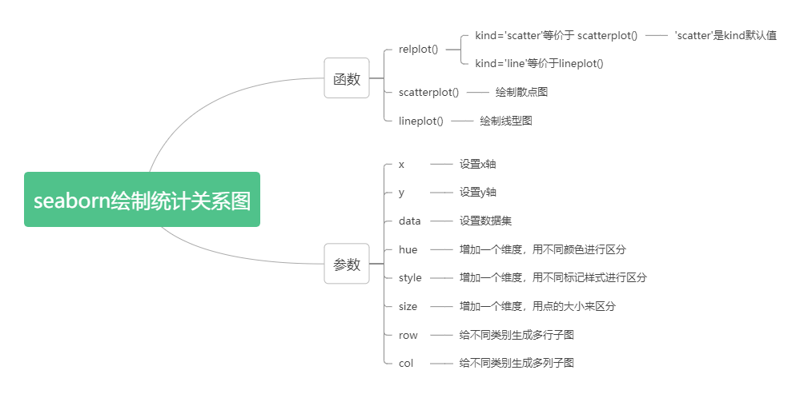

# 1. 统计分析与可视化

<font color=Red>__统计分析（Statistical Analysis）__</font>法是通过对研究对象的规模、速度、范围、程度等数量关系的分析研究，认识和揭示事物间的相互关系、变化规律和发展趋势，从而达到对事物的正确解释和预测的一种研究方法。

<font color=Red>__可视化__</font>是统计分析的重要组成部分，数据集被正确可视化后，人类凭肉眼就能直观看出数据关系里隐含的趋势和模式。

seaborn库通过二维<font color=Red>__散点图__</font>和<font color=Red>__线型图__</font>来揭示多变量之间的相关性，主要用到三个函数：<font color=Red>__scatterplot()、lineplot()、relplot()__</font>。

* #### 1. scatterplot()：axes级函数，绘制<font color=Red>__散点图__</font>
* #### 2. lineplot()：axes级函数，绘制<font color=Red>__折线图__</font>
* #### 3. relplot()：figure级函数，既可以绘制散点图又可以绘制折线图，通过设置参数<font color=Red>__kind='scatter'__</font>绘制<font color=Red>__散点图__</font>，等价于scatterplot(), 'scatter'是kind参数的默认值；通过设置参数<font color=Red>__kind='line'__</font>绘制<font color=Red>__折线图__</font>，等价于lineplot()。

下图列举了这三个函数的主要参数：



scatterplot和lineplot()的使用与relplot绘制散点图和折线图类似，主要区别在于少了kind、row、col参数。增加了ax参数。下面将以relplot()为例，讲解散点图和折线图的绘制方法，其函数原型为：
```python
seaborn.relplot(data=None, *, x=None, y=None, hue=None, size=None, style=None, units=None, row=None, col=None, col_wrap=None, row_order=None, col_order=None, palette=None, hue_order=None, hue_norm=None, sizes=None, size_order=None, size_norm=None, markers=None, dashes=None, style_order=None, legend='auto', kind='scatter', height=5, aspect=1, facet_kws=None, **kwargs)
```

# 2. 绘制散点图

散点图是统计可视化的主要图形，它通过绘制点云来揭示两个变量的联合分布。
上一节我们介绍了tips数据集，它保存在tips.csv文件里，该数据集包括账单金额、小费金额、性别、是否抽烟、星期几、就餐时间和就餐人数这7个属性。下面的例子基于tips数据集。

[fmri.csv](./数据集/fmri.csv)
[tips.csv](./数据集/tips.csv)

* ### 简单的关系绘图


```python
import seaborn as sns
import pandas as pd
import matplotlib.pyplot as plt

sns.set_theme(style="darkgrid")  #设置seaborn主题，使用darkgrid风格
tips = pd.read_csv("/data/bigfiles/tips.csv")  #读入tips数据集
sns.relplot(x="total_bill", y="tip", data=tips)

plt.show()
```

* ### 颜色(hue)分组绘图

上面的散点图揭示了账单金额total_bill和小费金额tip这两个维度的关系，如果需要增加第三个维度（例如smoker属性，表示是否抽烟），使用hue参数，让不同的smoker值有不同的着色。

在二维的散点图里，根据第三个变量的值将这些点着色，从而将第三个维度加到了图里。在seaborn里，这个被称为<font color=Red>__“色调语义”hue semantic__</font>，因为点的颜色获得了意义。

此时，用palette参数可以指定hue映射的颜色。palette参数可以是字符串、列表、字典或者colormap。


```python
import seaborn as sns
import pandas as pd
import matplotlib.pyplot as plt

sns.set_theme(style="darkgrid")  #设置seaborn主题，使用darkgrid风格
tips = pd.read_csv("/data/bigfiles/tips.csv")  #读入tips数据集
sns.relplot(x="total_bill", y="tip", hue= "smoker", data=tips, palette='husl')

plt.show()
```

* ### 样式(style)分组绘图

为了强调不同类别之间的差异，可以使用标志样式参数style，如下代码设置style='time'，即不同就餐时间使用不同的标记样式。

通常style的每个分组的点样式有系统自行决定。也可用marker可以自行指定，但是比较麻烦，且有一定限制，


```python
import seaborn as sns
import pandas as pd
import matplotlib.pyplot as plt

sns.set_theme(style="darkgrid")  #设置seaborn主题，使用darkgrid风格
tips = pd.read_csv("/data/bigfiles/tips.csv")  #读入tips数据集
sns.relplot(x="total_bill", y="tip", hue= "smoker",style='time',data=tips)

plt.show()
```

* ### 大小(size)分组绘图

size参数可以直接用于设置点大小，但是size数据的大小不太适合显示，比如都特别小，或者差异不明显不便于观看，可用sizes参数可以把size映射到一个指定的区间。

下面的代码在xy这两个维度的基础上增加了hue='smoker'（根据"是否抽烟"给出不同的着色）、style='time'（“就餐时间”是中餐还是晚餐分别用不同的样式来标记：圆点标记晚餐，星号标记中餐）、size='size'（即“就餐人数”的值决定点或星的大小）这三个维度。


```python
import seaborn as sns
import pandas as pd
import numpy as np
import matplotlib.pyplot as plt

sns.set_theme(style="darkgrid")  #设置seaborn主题，使用darkgrid风格
tips = pd.read_csv("/data/bigfiles/tips.csv")  #读入tips数据集
sns.relplot(x="total_bill", y="tip", hue= "smoker",style='time',size='size', sizes=[50,70,90,110,130,150], data=tips)

plt.show()
```

* ### 多子图绘图

根据row和col参数值，可以把图形绘制到多个子图。每行表达row数据的一个值，每列表达col数据的一个值。

下面的代码在xy这两个维度的基础上增加了hue='smoker'（根据"是否抽烟"给出不同的着色）、style='time'（“就餐时间”是中餐还是晚餐分别用不同的样式来标记：圆点标记晚餐，星号标记中餐）、size='size'（即“就餐人数”的值决定点或星的大小）这三个维度，同时设置col='sex'，给出了sex = Female和sex = Male两列子图。


```python
import seaborn as sns
import pandas as pd
import matplotlib.pyplot as plt

sns.set_theme(style="darkgrid", context='poster')  #设置seaborn主题，使用darkgrid风格
tips = pd.read_csv("/data/bigfiles/tips.csv")  #读入tips数据集
sns.relplot(x="total_bill", y="tip", hue= "smoker",style='time',size='size', col='day', row='sex', data=tips)

plt.show()
```

# 3.绘制折线图

散点图非常有效，但不是万能的，在数据可视化方面，根本就不存在万能的最佳类型。

在对某些数据集进行可视化时，如果你需要了解的是某个变量随时间的变化规律或类似的连续型变量的变化趋势，折线图是一个更好的选择。

seaborn可以使用lineplot()函数绘制折线图，也可以通过设置relplot()的参数kind="line"来实现。

在绘制线型图之前先来了解一下fmri数据集，它保存在fmri.csv文件中，包括subject,timepoint,event,region,signal这五个属性，后面的几个示例都设置x为timepoint、y为signal。


```python
import pandas as pd
fmri = pd.read_csv("/data/bigfiles/fmri.csv")
print(fmri.head(10))
```

可以看到timepoint的值不是递增的，如果使用matplotlib来绘制线型图，图形混乱。另外同一个timepoint，有多个signal，例如timepoint为18时，signal有多个不同的值。


```python
import pandas as pd
import matplotlib.pyplot as plt

sns.set_theme(context='notebook')
fmri = pd.read_csv("/data/bigfiles/fmri.csv")
plt.plot(fmri["timepoint"], fmri["signal"])
plt.show()
```

使用seaborn的relplot()函数，设置kind='line'来绘制线型图，其参数sort的默认值是True，会按照x的值升序排列。对于同一个x(timepoint)有的多个y(signal)的情况，seaborn的默认行为是通过绘制平均值及95%的置信区间，在每个x周围聚合多个y值。


```python
import pandas as pd
import seaborn as sns

fmri = pd.read_csv("/data/bigfiles/fmri.csv")
sns.relplot(x = "timepoint",y= "signal",data = fmri, kind='line')
plt.show()
```

relplot()函数通过ci参数来设置置信区间，置信区间是通过bootstrapping来计算的，可以设置ci=None来禁用置信区间，或者设置ci='sd'即使用标准差来代替置信区间，绘制每个x点上y的分布范围。


```python
import pandas as pd
import seaborn as sns
sns.set(style = 'darkgrid')
fmri = pd.read_csv("/data/bigfiles/fmri.csv")
sns.relplot(x = "timepoint",y= "signal",data = fmri, kind='line',ci='sd')
plt.show()
```

estimator=None可以关闭聚合设置，直接用x,y点绘图。该参数也可以设置为聚合函数(如sum，mean，max等)，用聚合函数将一个x值对应的多个y值计算成一个值来绘图


```python
import pandas as pd
import seaborn as sns
sns.set(style = 'darkgrid')
fmri = pd.read_csv("/data/bigfiles/fmri.csv")
sns.relplot(x = "timepoint",y= "signal",data = fmri, kind='line', estimator=sum)
plt.show()
```

和散点图一样，线型图也可以通过hue、size、style参数来增加数据的观察维度。hue分组可以用palette设置颜色样式；style分组可以用markers设置点样式，用dashes设置线样式；size分组可以用sizes设置线粗细


```python
import matplotlib.pyplot as plt
import pandas as pd
import seaborn as sns
sns.set(style = 'darkgrid')
fmri = pd.read_csv("/data/bigfiles/fmri.csv")

sns.relplot(x="timepoint", y="signal", hue="region", style="event",
            dashes=True, markers=True, kind="line", data=fmri)
plt.show()

```

# 4. 使用多切面来显示更多关系

使用relplot()、scatterplot()、lineplot()函数绘制统计关系图时，如果需要揭示两个变量（xy）的相互关系如何依赖于其它变量，尽管可以通过hue、size、style等参数增加语义，但是更好的方法是绘制多个子图。

要显示某个附加变量对xy关系的影响，除了将其分配给某个语义角色（hue、size、style等）外，更优的选择是以这个附加变量作切面来绘制子图。这意味着你可以创建多个轴，并在每个轴上对数据子集绘图。


```python
import matplotlib.pyplot as plt
import pandas as pd
import seaborn as sns
sns.set(style = 'darkgrid')
fmri = pd.read_csv("/data/bigfiles/fmri.csv")
sns.relplot(x="timepoint", y="signal", hue="event", style="event",
            col="subject", col_wrap=5,             # col_wrap设置同一行子图上最多有多少列
            height=3, aspect=.75, linewidth=2.5,   # height设置子图高度，单位为英寸
            kind="line", data=fmri.query("region == 'frontal'"))
plt.show()
```

上面的可视化常常被称为“格子”图或者“小倍数”图，使用这种可视化方法，就算是肉眼都能很方便观测出整体模式或者各模式的偏差。

在使用relplot()等函数做可视化时，尽管应该利用其提供的灵活性，但是我们应该始终记住，几个简单图往往比单个复杂图更有效。
