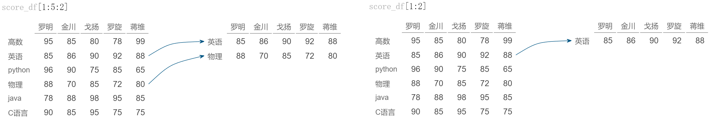

#  DataFrame对象的基本操作
## 创建DataFrame

```python
pandas.DataFrame(data=None, index=None, columns=None, dtype=None, copy=None)
```
其中参数的含义与pandas.Series()方法相同，增加了一个参数columns，用于设置列标签。


```python
import pandas as pd
import numpy as np

pd.set_option('display.unicode.east_asian_width', True) # 设置输出时列对齐
df1 = pd.DataFrame({'Tom': [100, 88, 99], 'John': [89, 97, 100], 'Alice': [88, 99, 100]})  # 字典方式建立，键为列标签
print('-'*10+'df1'+'-'*10)
print(df1)
# 嵌套字典方式建立，外层键为列标签，内层键位行标签
df2=pd.DataFrame({'罗明': {'高数': 95, '英语': 85, 'python': 96, '物理': 88, 'java': 78, 'C语言': 90},
                  '金川': {'高数': 85, '英语': 86, 'python': 90, '物理': 70, 'java': 88, 'C语言': 85}, 
                  '戈扬': {'高数': 80, '英语': 90, 'python': 75, '物理': 85, 'java': 98, 'C语言': 95}, 
                  '罗旋': {'高数': 78, '英语': 92, 'python': 85, '物理': 72, 'java': 95, 'C语言': 75}, 
                  '蒋维': {'高数': 99, '英语': 88, 'python': 65, '物理': 80, 'java': 85, 'C语言': 75}})
print('-'*10+'df2'+'-'*10)
print(df2)
s1 = pd.Series(np.array(['Tom', 'John', 'Alice', 'Jack']))
s2 = pd.Series(np.array([101, 606, 411, 310]))  
df3=pd.DataFrame({'Name': s1, 'Room No': s2}) #  以Series对象位值的字典创建
print('-'*10+'df3'+'-'*10)
print(df3)
# 使用数组创建，并设置行列标签
df4 = pd.DataFrame(np.array([[95, 100, 99], [90, 80, 100], [85, 100, 100]]),
                        columns=['语文', '数学', '英语'],
                        index=['Tom', 'John', 'Alice'])
print('-'*10+'df4'+'-'*10)
print(df4)
```


```python
# 获取DataFrame常用属性

| 方法             | 功能                                                         |
| :---------------: | :------------------------------------------------------------ |
| DataFrame.index   | 返回行标签 |
| DataFrame.columns | 返回列标签      |
| DataFrame.dtypes | 返回每列数据类型                                                             |
| DataFrame.info() | 查看DataFrame对象的基本信息，包括索引、数据类型、内存信息等                     |
| DataFrame.values | 返回所有元素的值             |      
| DataFrame.size   | 返回元素个数 |
| DataFrame.shape  | 返回DataFrame对象的行列数 |
```


```python
import pandas as pd
import numpy as np

score_df = pd.DataFrame(np.array([[95, 100, 99], [90, 80, 100], [85, 100, 100]]),
                        columns=['语文', '数学', '英语'],
                        index=['Tom', 'John', 'Alice'])
print('-'*10+'score_df'+'-'*10)
print(score_df)
print('-'*10+'score_df.index'+'-'*10)
print(score_df.index)
print('-'*10+'score_df.columns'+'-'*10)
print(score_df.columns)
print('-'*10+'score_df.dtypes'+'-'*10)
print(score_df.dtypes)
print('-'*10+'score_df.values'+'-'*10)
print(score_df.values)
print('-'*10+'score_df.size'+'-'*10)
print(score_df.size)
print('-'*10+'score_df.shape'+'-'*10)
print(score_df.shape)
print('-'*10+'score_df.info()'+'-'*10)
print(score_df.info())
```

## 获取DataFrame中的数据

数据分析过程中，往往需要获取DataFrame中的部分数据，下面创建一个DataFrame对象，对相关方法进行介绍。


```python
import pandas as pd
score_df = pd.DataFrame({'罗明': {'高数': 95, '英语': 85, 'python': 96, '物理': 88, 'java': 78, 'C语言': 90},
                         '金川': {'高数': 85, '英语': 86, 'python': 90, '物理': 70, 'java': 88, 'C语言': 85}, 
                         '戈扬': {'高数': 80, '英语': 90, 'python': 75, '物理': 85, 'java': 98, 'C语言': 95}, 
                         '罗旋': {'高数': 78, '英语': 92, 'python': 85, '物理': 72, 'java': 95, 'C语言': 75}, 
                         '蒋维': {'高数': 99, '英语': 88, 'python': 65, '物理': 80, 'java': 85, 'C语言': 75}})
pd.set_option('display.unicode.east_asian_width', True) # 设置输出时列对齐
print(score_df)
```

### 1. 通过列标签获取


```python
print(score_df['罗旋'])              # 获取列索引对应的一个Series对象
print('-'*20)
print(score_df[['金川', '蒋维']])    # 多列索引组成列表，返回DataFrame对象
```

.png)
### 2. 通过行序号的切片获取多行


```python
print(score_df[1:5:2])  # 仅可通过行序号切片获取多行，返回DataFrame对象
print('-'*40)
print(score_df[1:2])    # 可通过行序号切片获取单行，但不允许使用单个行序号获取
```



### 3. 通过iloc、loc属性获取

**iloc ：**基于行、列序号索引进行查询，索引号均是从0开始。输入可以是：单个整数、整数列表或数组、整数切片、布尔数组。


```python
print(score_df.iloc[1])             # 获取单行，返回Series
print('-'*20)
print(score_df.iloc[[0, 1, 3]])     # 整数列表获取多行，返回DataFrame
print('-'*40)
print(score_df.iloc[1:4])           # 切片获取多行，返回DataFrame
print('-'*40)
print(score_df.iloc[:, 1])          # 获取单列，返回Series
print('-'*20)
print(score_df.iloc[:, [1, 3, 4]])  # 整数列表获取多列，返回DataFrame
print('-'*20)
print(score_df.iloc[:, 1:])         # 切片获取多列，返回DataFrame
print('-'*20)
print(score_df.iloc[0:3, 1:4])      # 行列序号同时切片，返回DataFrame
print('-'*20)
print(score_df.iloc[3, 4])          # 行列序号，返回具体值
print('-'*20)
print(score_df.iloc[[True, False, True, False, False, False], [True]*3+[False]*2])  #  支持布尔数组筛选
print('-'*20)
print(score_df.iloc[lambda x:x.index != '物理', lambda y:y.columns != '戈扬'])   # 支持函数筛选
```

.png)
.png)
.png)
.png)

**loc ：**基于行、列标签索引进行索引查询。输入可以是：单个标签、标签列表或数组、标签切片（**此处切片包含结束位置**）、布尔数组。


```python
print(score_df.loc['python'])                     # 获取单行，返回Series
print('-'*40)
print(score_df.loc[['高数', 'python', 'java']])   # 列表获取多行，返回DataFrame
print('-'*40)
print(score_df.loc['python':'C语言'])             # 切片获取多行，返回DataFrame，含终值
print('-'*40)
print(score_df.loc[:, '金川'])                    # 获取单列，返回Series
print('-'*40)
print(score_df.loc[:, ['金川', '罗旋', '蒋维']])  # 列表获取多列，返回DataFrame
print('-'*40)
print(score_df.loc[:, '戈扬':])                   # 切片获取多列，返回DataFrame
print('-'*40)
print(score_df.loc['python':'C语言', '戈扬':'罗旋'])  # 行列同时切片，返回DataFrame
print('-'*40)
print(score_df.loc['python', '罗旋'])             # 行列标签，返回具体值
print('-'*40)
print(score_df.loc[[True, False, True, False, False, False], [True]*3+[False]*2]) #  支持布尔数组筛选
print('-'*40)
# 结合条件运算或函数筛选
print(score_df.loc[score_df['罗明'] >= 90, '金川':'蒋维'])  # 获得罗明超过90分的科目中其他人的成绩
print('-'*40)
print(score_df.loc[:, score_df.columns.str.startswith('罗')]) # 获得所有姓罗的同学的成绩
print('-'*40)
print(score_df.loc[(score_df['罗明'] >= 90) & (score_df['戈扬'] <= 90)]) # 获得罗明大于等于90分且戈扬小于等于90分的科目的所有人成绩
print('-'*40)
print(score_df.loc[:, score_df.loc['python'].apply(lambda x:x%5 == 0)])  # 获得所有Python成绩为5的倍数的人的成绩数据

```
.png)
.png)
.png)
.png)
.png)
.png)
.png)

##### 4. 利用head()和tail()方法
```python
DataFrame.head(n=5)    # 读取前N行，N值默认为5。
DataFrame.tail(n=5)    # 读取尾N行，N值默认为5。
```


```python
print(score_df.head())  # 读前5行，不足5行读所有
print('-'*40)
print(score_df.tail(2))  # 读后两行
```

.png)

## 修改DataFrame中的数据

以如下DataFrame对象为例，讲解修改DataFrame中数据的方法。


```python
import pandas as pd
import numpy as np

employee_info_ls = [['001', '李明', 23, '吉林', 20000.00],
                    ['002', '韩雷', 26, '湖北', 25000.00],
                    ['003', '肖红', 30, '江西', 30000.00],
                    ['004', '马克', 28, '上海', 21000.00]]
employee_df = pd.DataFrame(employee_info_ls,
                  index=['one', 'two', 'three', 'four'],
                  columns=['ID', 'Name', 'Age', 'Address', 'Salary'])
print(employee_df)
```

### 1. 通过索引定位修改


```python
employee_df.loc['two', 'Salary'] = 30000.00  # 定位到单个元素，修改该元素的值
print(employee_df)
print('-'*40)
employee_df.loc['four'] = np.nan             # 修改整行为相同的值
print(employee_df)
print('-'*40)
employee_df.loc['four'] = ['004', '韩雷雷', 40, '广州', 28000.00]  # 列表修改整行
print(employee_df)
print('-'*40)
employee_df.loc[:, 'Address'] = '湖北'      # 修改整列为相同的值
print(employee_df)
print('-'*40)
employee_df['Age'] = [25, 28, 21, 24]       # 列表修改整列
print(employee_df)
print('-'*40)
# 修改满足条件的数据块
employee_df.loc[employee_df['Age'] >= 25, ['Address','Salary']] = [['北京', 35000.0], ['上海', 35000.0]]
print(employee_df)
```

### 2.增加行列

通过行、列标签索引赋值时，若给出的行、列标签索引在DataFrame中不存在，则在末尾新增行或列。


```python
new_employee_info_ls = [['005', '刘春娇', 23, '广州', 35000.00],
                        ['006', '李志明', 27, '广州', 35000.00]]
employee_df.loc['five'] = new_employee_info_ls[0]  # 行索引不存在，则末尾增加新行
employee_df.loc['six'] = new_employee_info_ls[1]
print(employee_df)
print('-'*40)
employee_df['Years'] = employee_df['Age']-20  # 列索引不存在，则末尾增加新列
print(employee_df)
```

通过insert()方法在指定位置插入列。
```python
DataFrame.insert(loc, column, value, allow_duplicates=False)
```


```python
# insert在指定索引处插入列，索引必须为整数序号，且0<=索引<=len(columns)
employee_df.insert(3, "Gender", ['男', '男', '女', '男', '女', '男'])
print(employee_df)
```

### 3. 使用where()、mask()按条件修改
```python
DataFrame.where(cond, other=NoDefault.no_default, inplace=False, axis=None, level=None, errors='raise', try_cast=NoDefault.no_default)
DataFrame.mask(cond, other=nan, inplace=False, axis=None, level=None, errors='raise', try_cast=NoDefault.no_default)
```

where()用于将DataFrame对象中使得条件cond为Flase的值替换为other；mask()用于将DataFrame对象中使得条件cond为True的值替换为other。参数inplace为False时，返回替换后得到的新对象，原对象不变；为True时，原地操作，无返回值。


```python
# 非原地操作，生成新对象，Salary不大于32000，修改为32000
print(employee_df['Salary'].where(employee_df['Salary'] > 32000, 32000.0))
print('-'*40)
print(employee_df)
print('-'*40)
# 原地操作，改变原DataFrame
employee_df['Salary'].mask(employee_df['Address'] != '湖北', 30000.0, inplace=True)
print(employee_df)

```

### 4. 使用replace()替换指定值 
```python
DataFrame.replace(to_replace=None, value=NoDefault.no_default, inplace=False, limit=None, regex=False, method=NoDefault.no_default)
```
* To_replace:需要替换的原值，可以是字符串、正则、列表、series、具体值，为字典时，value必须为None
* Value：用于替换的新值
* Inplace：是否原地操作
* Limit：限制替换次数
* Regex：为True时，To_replace必须为正则


```python
employee_df.replace(['北京', '上海'], '湖北', inplace=True)  # 北京、上海替换成相同值湖北
print(employee_df)
print('-'*40)
employee_df.replace({'韩雷雷': '李雷雷', '广州': '深圳'}, inplace=True)  # 按键值对，用值替换键
print(employee_df)
print('-'*40)
employee_df.replace('湖.+', '武汉', regex=True, inplace=True)  # 正则匹配替换，
print(employee_df)
```

## 设置DataFrame标签索引

使用索引可以提升查询性能。
如果索引是唯一的，pandas会使用哈希表优化，查找数据的时间复杂度为O(1);
如果索引非唯一但有序，pandas会使用二分查找法，查找数据的时间复杂度为O(logN);
如果索引非唯一也无序，pandas每次查找都需要扫描整个数据表，查找数据的时间复杂度为O(N)。

### 1. 通过赋值修改行、列索引


```python
employee_df.index = range(6)
employee_df.columns = ['工号', '姓名', '年龄', '性别', '工作地', '工资', '在职时间']
print(employee_df)
```

### 2. 设置指定列为行索引

```python
DataFrame.set_index(keys, drop=True, append=False, inplace=False, verify_integrity=False)
```


```python
employee_df.set_index(['工号'], inplace=True)   # 将工号列设置为行索引
print(employee_df)
```

## 删除数据

drop()方法可用于从DataFrame对象中删除指定的行或列。函数原型为：
```python
DataFrame.drop(labels=None, axis=0, index=None, columns=None, level=None, inplace=False, errors='raise')
```

* labels：设置要删除的行或列的标签 
* axis：0或index表示行，1或columns表示列 
* columns：要删除的列标签
* index：要删除的行标签


```python
print(employee_df.drop('在职时间', axis='columns')) # 删除指定一列
print(employee_df.drop(['003', '004', '006'], axis='index')) # 删除指定多行
print(employee_df.drop(columns=['性别', '在职时间'])) # 删除指定多列
print(employee_df.drop(index='005')) # 删除指定一行
```
.png)
.png)
.png)
.png)

结合条件筛选，可实现删除满足条件的行或列。


```python
print(employee_df.drop(employee_df[employee_df['年龄'] < 25].index)) # 删除年龄小于25的行
```

.png)

## DataFrame转换为字典或列表

如需将DataFrame对象中的值转换为列表，可先通过values获取DataFrame对象的值，然后通过调用tolist()方法实现。


```python
print(employee_df.values.tolist())
```

to_dict()方法可将DataFrame对象转换为字典。


```python
print(employee_df.to_dict())
```
