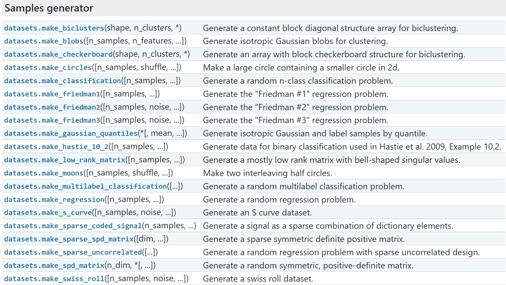

# scikit-learn

## scikit-learn库自身提供两类数据集：

* 自带的小数据集（Toy Dataset）
* 在线真实世界数据集（Real world datasets）

# 1. 自带的小数据集（Toy Dataset）

scikit-learn库安装时，自带小数据集会随之拷贝到scikit-learn的安装目录中，通过系统资源管理器可以直接查看。
.png)

这些数据集的简单说明如下表，具体信息可参考[官方文档](https://scikit-learn.org/stable/datasets/toy_dataset.html)。

|  数据集名称   | 调用方式                 | 数据内容说明                                                                                                | 适用算法 |
|:--------:|:---------------------|:------------------------------------------------------------------------------------------------------|:-----|
| 波士顿房价数据集 | load_boston()        | 数据集包含506条记录<br>每条记录包含城镇犯罪率、一氧化氮浓度、住宅平均房间数、到中心区域的加权距离等13个特征，以及自住房平均房价。                                 | 回归   |
|  鸢尾花数据集  | load_iris()          | 数据集包含150条<br>记录共分为3类，每类50个记录。每个记录有4个关于花外形的特征。                                                         | 分类   |
|  糖尿病数据集  | load_diabetes()      | 数据集包含442条记录<br>每个记录包含Age、Sex、Body mass index等10个特征，Target为一年后患疾病的定量指标。                                | 回归   |
| 手写数字数据集  | load_digits()        | 数据集包含1797条记录<br>每个记录有64个特征，对应到一个8x8像素点组成的矩阵，每一个值是其灰度值， target值是0-9。                                   | 分类   |
| 体能训练数据集  | load_linnerud()      | 数据集包含data和target两个数据集,都是20条记录<br>每个记录有3个特征，data的特征包括Chins、Situps、Jumps，target的特征包括Weight、Waist、Pulse。 | 回归   |
|  红酒数据集   | load_wine()          | 数据集包含178条记录<br>代表了红酒的三个档次（分别有59，71，48条记录），以及与之对应的13个特征。                                               | 分类   |
|  乳腺癌数据集  | load_breast_cancer() | 数据集包含569条记录<br>威斯康辛州记录的569个病人的乳腺癌恶性/良性（1/0）类别型数据，以及与之对应的30个特征的生理指标数据。                                 | 分类   |

# 2. 在线真实世界数据集（Real world datasets）

scikit-learn库还提供了一些真实世界大规模数据集，默认在调用时从源站下载数据。这些数据集的简单说明如下表，具体信息可参考[官方文档](https://scikit-learn.org/stable/datasets/real_world.html)。

|         数据集名称          | 调用方式                                                    | 数据内容说明                                                                                          |
|:----------------------:|:--------------------------------------------------------|:------------------------------------------------------------------------------------------------|
|     Olivetti人脸数据集      | fetch_olivetti_faces()                                  | 此数据集包含 1992 年 4 月至 1994 年 4 月在剑桥 AT&T 实验室拍摄的400张人脸图像。<br>共40个不同的被试者，每个被试者10幅不同的照片。              |
|      20个新闻组文档数据集       | fetch_20newsgroups()<br>fetch_20newsgroups_vectorized() | 数据集包含18000多篇新闻文章，均匀分为20个不同主题的新闻组集合。                                                             |
|        名人人脸数据集         | fetch_lfw_people()<br>fetch_lfw_pairs()                 | 一个面部照片数据集，集包含从网络收集的13,000多张共5000多位名人面部图像，每人超过两张照片。<br>每张照片都标记有图中人物的名字。                          |
|       森林覆盖类型数据集        | fetch_covtype()                                         | 该数据集中的样本对应于美国30×30m的森林样本，每个样本有54个特征，有七种类别的覆盖类型                                                  |
| 路透社语料库第一卷（RCV1）<br>数据集 | fetch_rcv1()                                            | 一个超过80万手动分类的新闻热线故事档案，由路透社有限公司提供，用于研究目的。                                                         |
|       网络入侵检测数据集        | fetch_kddcup99()                                        | 由麻省理工学院林肯实验室提供的数据集，包含采集来的9个星期的网络连接数据。<br>每个连接记录包含了41个特征和1个类标识。<br>标识用来表示该条连接记录是正常的,或是某个具体的攻击类型。 |
|        加州住房数据集         | fetch_california_housing()                              | 加利福尼亚的房价数据，总计20640个样本，每个样本8个属性表示，以及房价作为target。                                                  |

fetch_\*()函数和load_\*()函数相同（只是多了下载过程，依赖网络，速度慢），返回的数据类型都是datasets.base.Bunch，本质上是一个字典，它的键值对可用通过对象的属性方式访问。主要包含以下属性：

* data：特征数据数组
* target：标签数组
* DESCR：数据描述
* feature_names：特征名
* target_names：标签名

此外，数据集目录可以通过datasets.get_data_home()获取，clear_data_home(data_home=None)可删除所有下载数据。

```python
from sklearn.datasets import load_iris, get_data_home
import pandas as pd

print(get_data_home())
iris_data = load_iris()  # 以字典形式返回数据全部信息
iris_data.data  # 获取数据集数据，数组形式
iris_data.DESCR  # 获取数据集描述，字符串
iris_data.feature_names  # 获取数据的特征名
iris_data.target_names  # 获取数据的分类名
iris_data.target  # 获取分类数据，数组形式
# 可转换为DataFrame
iris_df = pd.DataFrame(iris_data.data, columns=iris_data.feature_names)
iris_df.head()
```

# 3. 随机生成数据集

scikit-learn库提供了一系列随机样本生成器，可根据用户要求快速生成随机模拟样本数据，用户可在此基础上进行数据分析与算法验证。

相关函数见下图，具体请参考[官网](https://scikit-learn.org/stable/modules/classes.html#module-sklearn.datasets)，此处不做详细说明。



```python
from sklearn import datasets
import pandas as pd
import seaborn as sns
import matplotlib.pyplot as plt

# 生成多类单标签数据集，为每个类分配一个或多个正态分布的点集，提供了为数据添加噪声的方式，包括维度相关性，无效特征以及冗余特征等    
sample_data, sample_target = datasets.make_classification(n_samples=400,  # 样本数
                                                          n_features=2,  # 总特征数
                                                          n_informative=2,  # 信息特征数
                                                          n_redundant=0,  # 冗余特征数
                                                          n_repeated=0,  # 重复特征数
                                                          n_classes=2,  # 类数
                                                          n_clusters_per_class=2,  # 每类簇数
                                                          random_state=0)  # 随机数种子
print(sample_data.shape)
print(sample_target.shape)
# 拼接转换为DataFrame
sample_df = pd.DataFrame(sample_data, columns=['feat_1', 'feat_2'])
sample_df['target'] = sample_target
print(sample_df.head())
plt.subplots_adjust(wspace=0.5)  # 设置子图间距
plt.subplot(121)
sns.scatterplot(x='feat_1', y='feat_2', data=sample_df, hue='target')  # 绘制样本散点图
plt.subplot(122)
sns.kdeplot(x='feat_1', data=sample_df)  # 绘制feat_1核密度图，观察是否正态分布
plt.show()

```

# 4. 样本图片

Scikit-learn还嵌入了一些由其作者在知识共享许可下发布的JPEG图像示例。可通过下面两个函数加载使用。

* load_sample_images()： 加载所有示例图像以进行图像处理。

* load_sample_image（image_name）：加载指定文件名单个示例图像的 numpy 数组。

```python
from sklearn.datasets import load_sample_image
import matplotlib.pyplot as plt

img = load_sample_image('china.jpg')
plt.imshow(img)
```

# 5. 从[OpenML](http://openml.org)下载数据集

OpenML网站是一个用于机器学习数据和实验的公共存储库，它允许每个人上传开放的数据集，可以通过sklearn.datasets.fetch_openml()
函数来从openml.org下载数据集。

.png)

下面的代码可从OpenML下载data_id为61的iris数据集（依赖网络，速度慢）。

```python
from sklearn.datasets import fetch_openml

iris_data = fetch_openml(data_id=61)
```

# 6. 从外部数据集加载

网上有许多提供数据集的网站，可下载后通过pandas或Numpy导入使用。常用网站有：

Google数据集搜索：https://datasetsearch.research.google.com/

kaggle：https://www.kaggle.com/datasets

阿里天池：https://tianchi.aliyun.com/dataset

百度飞桨：https://aistudio.baidu.com/aistudio/datasetoverview

和鲸社区：https://www.heywhale.com/home/dataset

DC竞赛：https://www.datacastle.cn/dataset_list.html

DF竞赛：https://www.datafountain.cn/datasets

考虑到网络因素，一般除自带小数据集和随机样本生成器外，其他数据都建议外部自行下载并导入。
