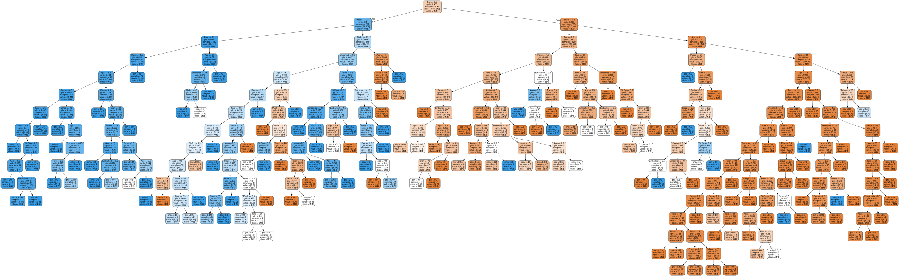

# 分类

分类（Classification）即确定数据对象的所属类别。分类和回归的区别在于输出变量的类型。定量输出称为回归，或者说是连续变量预测；定性输出称为分类，或者说是离散变量预测。

Scikit-learn库提供了事务分类识别的机器学习模型，可以模仿人对事物的判断意识，根据预先的分类依据，对新事物归类。分类属于监督学习，是定性问题，需要基于数据集，作出二分类或者多分类的选择。

常见的实现模型包括逻辑回归、SVM、K近邻、朴素贝叶斯、决策树、随机森林等，常用于垃圾邮件检测、图像识别等。

下面将结合经典数据集“Titanic乘客数据集”，介绍一些常用分类模型的使用，相关算法的数学原理治理不做详细讲解。

# 1. 数据集准备


文件“Titanic.csv”中包含Titanic乘客的相关信息，数据字典如下表：

| **字段**    | **含义**                   | **字段** | **含义**       |
| :-----------: | -------------------------- | :--------: | -------------- |
| PassengerId | 乘客ID                     | SibSp    | 堂兄弟/妹个数  |
| Survived    | 获救情况（二分类，因变量） | Parch    | 父母与小孩个数 |
| Pclass      | 乘客等级(1/2/3等舱位)      | Ticket   | 船票信息       |
| Name        | 乘客姓名                   | Fare     | 票价           |
| Sex         | 性别                       | Cabin    | 客舱           |
| Age         | 年龄                       | Embarked | 登船港口       |


```python
# 读取并观察数据
import pandas as pd

titanic_data = pd.read_csv('/data/bigfiles/Titanic.csv', index_col='PassengerId')
titanic_data.info()
```

数据集中Age、Fare、Embarked列存在缺失数据，采用不同的方案进行填充。此处使用简单的统计数据进行填充，对于缺失数据较多的Age列，也可考虑使用多元线性回归进行年龄预测。


```python
# 求数据集年龄中位数填充缺失值
imputed_age = float(titanic_data['Age'].dropna().median())
titanic_data['Age'].fillna(imputed_age, inplace=True)
# 求数据集Embarked的众数填充缺失值
imputed_embarked = titanic_data['Embarked'].dropna().mode()[0]
titanic_data['Embarked'].fillna(imputed_embarked, inplace=True)
# 求数据集Fare的平均值填充缺失值
imputed_fare = titanic_data['Fare'].dropna().mean()
titanic_data['Fare'].fillna(imputed_fare, inplace=True)
titanic_data.info()
```

将分类属性sex、Embarked转换为分类数值。


```python
# 性别转换为整数
titanic_data['Sex'] = titanic_data['Sex'].map({'female': 0, 'male': 1})
# Embarked转换为整数
titanic_data['Embarked'] = titanic_data['Embarked'].map({'S': 0, 'C': 1, 'Q': 2})
```

将Age、Fare列按值分成5个区间，用类别数字替换原始值。


```python
# 年龄分段转换为整数
titanic_data.loc[titanic_data['Age'] <= 16, 'Age'] = 0
titanic_data.loc[(titanic_data['Age'] > 16) & (titanic_data['Age'] <= 32), 'Age'] = 1
titanic_data.loc[(titanic_data['Age'] > 32) & (titanic_data['Age'] <= 48), 'Age'] = 2
titanic_data.loc[(titanic_data['Age'] > 48) & (titanic_data['Age'] <= 64), 'Age'] = 3
titanic_data.loc[titanic_data['Age'] > 64, 'Age'] = 4
titanic_data['Age'] = titanic_data['Age'].astype(int)
# 根据Fare值的频率，分成五个区间
titanic_data['FareBand'] = pd.qcut(titanic_data['Fare'], 5)
print(titanic_data['FareBand'].unique())
print()
fare_section = sorted([item.right for item in titanic_data['FareBand'].unique()])
print(fare_section)
# fare分段转换为整数
titanic_data.loc[titanic_data['Fare'] <= fare_section[0], 'Fare'] = 0
titanic_data.loc[(titanic_data['Fare'] > fare_section[0]) & 
                 (titanic_data['Fare'] <= fare_section[1]), 'Fare'] = 1
titanic_data.loc[(titanic_data['Fare'] > fare_section[1]) & 
                 (titanic_data['Fare'] <= fare_section[2]), 'Fare'] = 2
titanic_data.loc[(titanic_data['Fare'] > fare_section[2]) & 
                 (titanic_data['Fare'] <= fare_section[3]), 'Fare'] = 3
titanic_data.loc[titanic_data['Fare'] > fare_section[3], 'Fare'] = 4
titanic_data['Fare'] = titanic_data['Fare'].astype(int)
titanic_data.head()
```

删除Name、Ticket、Cabin列和刚新增的FareBand列。


```python
#数据集删除PassengerId、Name、Ticket、Cabin列和刚新增的FareBand
titanic_data.drop(['Ticket', 'Cabin', 'Name', 'FareBand'], 
             axis=1, inplace=True)
titanic_data.head()
```

使用scikit_learn库的函数划分训练集和测试集。


```python
from sklearn.model_selection import train_test_split  # 数据集分类器，于划分训练集和测试集

x = titanic_data.loc[:, 'Pclass':'Embarked']  # 特征集
y = titanic_data['Survived']  # 结果集
# 对数据集进行划分，test_size参数设置为0.3，随机选取取其中30%的数据作为测试集，70%为训练集
x_train, x_test, y_train, y_test = train_test_split(x, y, test_size=0.3)
print(x_train.shape, x_test.shape)
print(y_train.shape, y_test.shape)
```

# 2. 逻辑回归

首先使用前面介绍过的逻辑回归模型进行分类任务。


```python
from sklearn.linear_model import LogisticRegression  # 逻辑回归
from sklearn.metrics import classification_report, roc_auc_score  # 评估预测结果

lr_model = LogisticRegression()        # 实例化逻辑回归模型
lr_model.fit(x_train, y_train)         # 模型训练
pred_lr = lr_model.predict(x_test)     # 模型预测
# 结合结果测试集评价模型效果
print(classification_report(y_test, pred_lr))
print('AUC：', roc_auc_score(y_test, pred_lr))
```

# 3. 决策树模型

决策树是一种机器学习的模型算法，该算法通过对样本数据进行学习，还原出样本数据中隐藏的分类判断的规则，该判决规则是树形结构，简称决策树。

决策树是树状结构，它的每个叶结点对应着一个分类，非叶结点对应着在某个属性上的划分，根据样本在该属性上的不同取值将其划分为若干子集。

.png)

构造决策树的核心问题是在每一步如何选择恰当的属性对样本做拆分。决策树方法在分类、预测、规则提取等领域有广泛应用。

决策树模型既可以做分类分析，也可以做回归分析，分别对应的模型为分类决策树模型（DecisionTreeClassifier）及回归决策树模（DecisionTreeRegressor）。
这里只简介分类决策树模型的使用。


```python
from sklearn.tree import DecisionTreeClassifier  # 决策树

dtree_model = DecisionTreeClassifier()       # 实例化逻辑回归模型
dtree_model.fit(x_train, y_train)            # 模型训练
pred_dtree = dtree_model.predict(x_test)     # 模型预测
# 结合结果测试集评价模型效果
print(classification_report(y_test, pred_dtree))
print('AUC：', roc_auc_score(y_test, pred_dtree))
```


```python
!pip install graphviz
```


```python
import graphviz
from sklearn.tree import export_graphviz

feature_name = ['Pclass', 'Sex', 'Age', 'SibSp', 'Parch', 'Fare', 'Embarked']
dot_data = export_graphviz(dtree_model
                                ,out_file = None
                                ,feature_names= feature_name
                                ,class_names=['遇难', '幸存']
                                ,filled=True
                                ,rounded=True
                                )
graph = graphviz.Source(dot_data)
graph.save('titanic_tree.dot') #保存决策树
```

上面的代码可导出模型的决策树，此时保存的决策树是一个dot文件，可转换成图片。


在决策树模型中，通过如下代码可知道各个特征变量的重要程度，即哪些特征变量在模型中起的作用更大。这些特征重要性之和为1。


```python
features = x.columns  # 获取特征名称
importances = dtree_model.feature_importances_  # 获取特征重要性

# 通过DataFrame展示，根据重要性进行降序排列
importances_data = pd.DataFrame(zip(features, importances), columns=['特征名', '重要性']).T
importances_data.sort_values('重要性', axis=1, inplace=True, ascending=False)
importances_data
```

在机器学习中，因为训练集和测试集划分数据是随机的，所以可重复地使用数据评估模型的有效性，并选出最好的模型，该做法称之为交叉验证。交叉验证有三种方法：简单交叉验证、K折交叉验证和留一交叉验证，其中K折交叉验证应用较多。K折交叉验证是指将数据集随机等分为K份，每次选取K-1份为训练集训练模型，然后用剩下的1份作为测试集。重复K次后，可得到K个模型，再将这K个模型的平均测试效果作为最终的模型效果。

通常，如果训练数据集相对较小，则增大K值，保证每次迭代过程中用于模型训练的数据量；如果训练集相对较大，则减小K值，减小计算成本，提高性能。


```python
from sklearn.model_selection import cross_val_score

# 设置cv为6，即分为6份
acc_k = cross_val_score(dtree_model, x, y, cv=6)
print(acc_k,f'\n平均准确率：{acc_k.mean():.4f}')
# 也可设置scoring参数为roc_auc，将AUC值作为评分
auc_k = cross_val_score(dtree_model, x, y, scoring='roc_auc', cv=6)
print(auc_k,f'\n平均AUC：{auc_k.mean():.4f}')
```

GridSearch网格搜索是一种穷举搜索的调参手段。将遍历所有的候选参数，循环建立模型并对模型的有效性和准确性进行评估，选取表现最好的参数作为最终结果。


```python
from sklearn.model_selection import GridSearchCV

# 指定决策树分类器中各个参数的范围
parameters = {'max_depth': range(10,50), 'criterion':['gini', 'entropy'], 'min_samples_split':range(2,20)}
# 构建决策树分类器
new_dtree_model = DecisionTreeClassifier()  # 因为要进行参数调优,不传具体参数值
# 网格搜索
grid_search_auc = GridSearchCV(new_dtree_model, parameters, scoring='roc_auc', cv=6)
grid_search_auc.fit(x_train, y_train)
# 获得参数的最优值
grid_search_auc.best_params_
```

应用的到的参数值，构建模型，可发现调优后的模型效果的确有优化。


```python
# 根据多参数调优的结果来重新搭建模型
auc_best_dtree_model = DecisionTreeClassifier(criterion='gini', max_depth=36, min_samples_split=19)
auc_best_dtree_model.fit(x_train, y_train) 

# 观察评价数值的变化
print('调优前：')
print(classification_report(y_test, dtree_model.predict(x_test)))
print('AUC：', roc_auc_score(y_test, dtree_model.predict(x_test)))
print('基于AUC调优后：')
print(classification_report(y_test, auc_best_dtree_model.predict(x_test)))
print('AUC：', roc_auc_score(y_test, auc_best_dtree_model.predict(x_test)))
```

# 4. 朴素贝叶斯模型

朴素贝叶斯（Naive Bayes）分类是贝叶斯分类中最简单最常见的一种分类方法，这类算法均以贝叶斯定理为基础。朴素贝叶斯算法的核心思想是通过考虑特征概率来预测分类，即对于给出的待分类样本，求解在此样本出现的条件下各个类别出现的概率，认为此待分类样本属于概率最大的那个类别。


```python
from sklearn.naive_bayes import GaussianNB

gnb_model = GaussianNB()              # 实例化高斯朴素贝叶斯模型
gnb_model.fit(x_train,y_train)        # 模型训练
pred_gnb = gnb_model.predict(x_test)  # 模型预测
# 结合结果测试集评价模型效果
print(classification_report(y_test, pred_gnb))
print('AUC：', roc_auc_score(y_test, pred_gnb))
```

理论上，朴素贝叶斯模型与其他分类方法相比具有最小的误差率。但是实际上并非总是如此，这是因为朴素贝叶斯模型假设属性之间相互独立，这个假设在实际应用中往往是不成立的，在属性个数比较多或者属性之间相关性较大时，分类效果不好。

# 5. K近邻模型

K近邻是一个理论上比较成熟的方法，也是最简单的机器学习算法之一，其基本思想就是“物以类聚，人以群分”。它根据距离函数计算待分类样本X和每个训练样本的距离（作为相似度），选择与待分类样本距离最小的K个样本作为X的K个最近邻，最后以X的K个最近邻中的大多数样本所属的类别作为X的类别。如何度量样本之间的距离（或相似度）是KNN算法的关键步骤之一。常见的相似度度量方法包括欧氏距离、余弦相似度、皮尔逊相似系数、汉明距离、杰卡德相似系数等。

.png)


```python
from sklearn.neighbors import KNeighborsClassifier  # K最近邻

knn_model = KNeighborsClassifier(weights='distance')    # 实例化KNN模型
knn_model.fit(x_train,y_train)        # 模型训练
pred_knn = knn_model.predict(x_test)  # 模型预测
# 结合结果测试集评价模型效果
print(classification_report(y_test, pred_knn))
print('AUC：', roc_auc_score(y_test, pred_knn))
```

# 6. 随机森林模型

随机森林顾名思义，是用随机的方式建立一个森林，森林里面有很多的决策树组成，随机森林的每一棵决策树之间是没有关联的。在得到森林之后，当有一个新的输入样本进入的时候，采用类似于“民主投票”的Bagging算法，让森林中的每一棵决策树分别进行一下判断，投票这个样本应该属于哪一类（对于分类算法），然后按少数服从多数的原则决定这个样本为那一类。

.png)


```python
from sklearn.ensemble import RandomForestClassifier  # 随机森林

rf_model = RandomForestClassifier()    # 实例化随机森林模型
rf_model.fit(x_train,y_train)          # 模型训练
pred_rf = rf_model.predict(x_test)     # 模型预测
# 结合结果测试集评价模型效果
print(classification_report(y_test, pred_rf))
print('AUC：', roc_auc_score(y_test, pred_rf))
```

# 7. SVM（支持向量机）模型

一种对线性和非线性数据进行分类的方法。SVM 使用一种非线性映射，把原始训练数据映射到较高的维上，在新的维上，搜索最佳分离超平面。最佳分离超平面即以最大间隔把两类样本分开的超平面，也称之为最大间隔超平面。两类样本分别分割在该超平面的两侧；两侧距离超平面最近的样本点到超平面的距离被最大化了。

.png)

找到了最优的超平面（中间直线），要求这条线距离圆圈和三角都有足够的空间。选出距离该线最近的圆圈和三角各一个，所有其他的点，都计算和这2个点所在的平行线的距离和方向，来判断分到圆圈区域还是三角区域。


```python
from sklearn.svm import SVC  # 支持向量机分类模型

svc_model = SVC()                     # 实例化SVC模型
svc_model.fit(x_train,y_train)        # 模型训练
pred_svc = svc_model.predict(x_test)   # 模型预测
# 结合结果测试集评价模型效果
print(classification_report(y_test, pred_svc))
print('AUC：', roc_auc_score(y_test, pred_svc))
```

SVM如果在低维空间找不到合适的超平面，那就升维到更高维度去寻找超平面，如果不加限制和约束，极容易发生维度爆炸。随着维度的增加，数据量也急剧增大，处理速度会大幅降低。所以SVM引入核函数，可在低维空间里面去评估n维空间下超平面的效果，减少维度计算，提高分类效率。
.png)


# 8. AdaBoost模型

AdaBoost算法 (Adaptive Boosting) 是一种有效而实用的Boosting算法，它以一种高度自适应的方法顺序地训练弱学习器。AdaBoost根据前一次的分类效果调整数据的权重，上一个弱学习器中错误分类样本的权重会在下一个弱学习器中增加，正确分类样本的权重会相应减少，并且在每一轮迭代时会向模型加入一个新的弱学习器。不断重复调整权重和训练弱学习器的过程，直到误分类数低于预设值或迭代次数达到指定最大迭代次数时，将会得到一个强分类器。
.png)


```python
from sklearn.ensemble import AdaBoostClassifier

ab_model = AdaBoostClassifier()       # 实例化AdaBoost模型
ab_model.fit(x_train,y_train)        # 模型训练
pred_ab = ab_model.predict(x_test)   # 模型预测
# 结合结果测试集评价模型效果
print(classification_report(y_test, pred_ab))
print('AUC：', roc_auc_score(y_test, pred_ab))
```

# 9. GBDT模型

GBDT（Gradient Boosting Decision Tree），全名叫梯度提升决策树，是一种迭代的决策树算法。它通过构造一组弱的学习器，并把多颗决策树的结果累加起来作为最终的预测输出。该算法将决策树与集成思想进行了有效的结合。

GBDT算法则将损失函数的负梯度作为残差的近似值，不断使用残差迭代和拟合回归树最终生成强学习器。简单来说，AdaBoost算法是调整权重，而GBDT算法则是拟合残差。


```python
from sklearn.ensemble import GradientBoostingClassifier

gb_model =  GradientBoostingClassifier()       # 实例化GBDT模型
gb_model.fit(x_train,y_train)        # 模型训练
pred_gb = gb_model.predict(x_test)   # 模型预测
# 结合结果测试集评价模型效果
print(classification_report(y_test, pred_gb))
print('AUC：', roc_auc_score(y_test, pred_gb))
```
