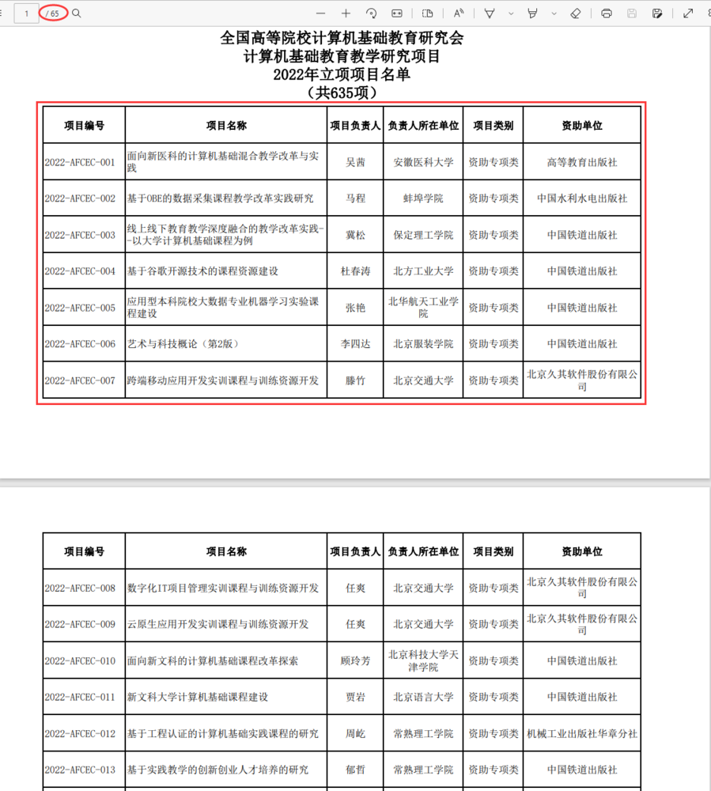

# pdf文件文本与表格读取

## 读取分析pdf文件中表格数据




```python
import pdfplumber


def read_pdf(file):
    """接收文件名为参数，输出文件页数"""
    with pdfplumber.open(file) as pdf:
        print(len(pdf.pages))  # 输出文件页数


if __name__ == '__main__':
    filename = '/data/bigfiles/全国高等院校计算机基础教育研究会计算机基础教育教学研究项目2022年立项项目名单.pdf'
    read_pdf(filename)

```


```python
import pdfplumber


def read_pdf(file):
    """接收文件名为参数，查看首页结构，观察输出结果"""
    with pdfplumber.open(file) as pdf:
        print(pdf.pages[0].extract_tables())  # 输出文件页数


if __name__ == '__main__':
    filename = '/data/bigfiles/全国高等院校计算机基础教育研究会计算机基础教育教学研究项目2022年立项项目名单.pdf'
    read_pdf(filename)

```

从输出结果看，每页上的数据是一个三维列表，第一层只有一个元素，所以可以用pdf.pages[0].extract_tables()[0]获取每页转为的二维列表类型的数据


```python
import pdfplumber


def read_pdf(file):
    """接收文件名为参数，查看首页结构，观察输出结果"""
    with pdfplumber.open(file) as pdf:
        print(pdf.pages[0].extract_tables()[0])  # 输出文件页数


if __name__ == '__main__':
    filename = '/data/bigfiles/全国高等院校计算机基础教育研究会计算机基础教育教学研究项目2022年立项项目名单.pdf'
    read_pdf(filename)

```

遍历pdf上每一页，将每页上的数据中去除标题行后加入到一个二维列表


```python

import pdfplumber


def read_pdf(file):
    """接收文件名为参数，读pdf文件每而上的表格中的数据，返回二维列表"""
    context_ls = [['项目编号', '项目名称', '项目负责人', '负责人所在单位', '项目类别', '资助单位']]  # 创建只包含标题行的二维列表
    with pdfplumber.open(file) as pdf:
        for i in range(len(pdf.pages)):  # 数字为pdf页数
            context_ls = context_ls + pdf.pages[i].extract_tables()[0][1:]  # 读第i页上的表格中去除标题行的数据部分
    return context_ls


if __name__ == '__main__':
    filename = '/data/bigfiles/全国高等院校计算机基础教育研究会计算机基础教育教学研究项目2022年立项项目名单.pdf'
    txt = read_pdf(filename)
    print(txt)
```

发现有些数据中有换行符，去除这些换行符，方便后续的统计分析


```python
import pdfplumber


def read_pdf(file:str)->list:
    """接收文件名为参数，读pdf文件每而上的表格中的数据，返回二维列表"""
    context_ls = [['项目编号', '项目名称', '项目负责人', '负责人所在单位', '项目类别', '资助单位']]  # 创建只包含标题行的二维列表
    with pdfplumber.open(file) as pdf:
        for i in range(len(pdf.pages)):  # 数字为pdf页数
            context_ls = context_ls + pdf.pages[i].extract_tables()[0][1:]  # 读第i页上的表格中去除标题行的数据部分
    return context_ls


def cleaning_data(context_ls:list)->list:
    """接收二维列表为参数，清除数据项中包含的换行符，返回二维列表"""
    for lst in context_ls:
        for i in range(len(lst)):
            if '\n' in lst[i]:
                lst[i]=lst[i].replace('\n', '')
    return context_ls
    

if __name__ == '__main__':
    filename = '/data/bigfiles/全国高等院校计算机基础教育研究会计算机基础教育教学研究项目2022年立项项目名单.pdf'
    data_ls = read_pdf(filename)
    data_clean_ls = cleaning_data(data_ls)
    print(data_clean_ls)
```

## 读取pdf中的文本


```python
import pdfplumber


def read_pdf(file):
    """接收文件名为参数，读pdf文件每而上的表格中的数据，返回二维列表"""
    text_str = ''
    with pdfplumber.open(file) as pdf:
        for i in range(len(pdf.pages)):  # 数字为pdf页数
            text_str = text_str + pdf.pages[i].extract_text()  # 读第i页上的表格
    return text_str

if __name__ == '__main__':
    filename = '/data/bigfiles/湿地保护法2021.pdf'
    txt = read_pdf(filename)
    print(txt)
```


```python

```
