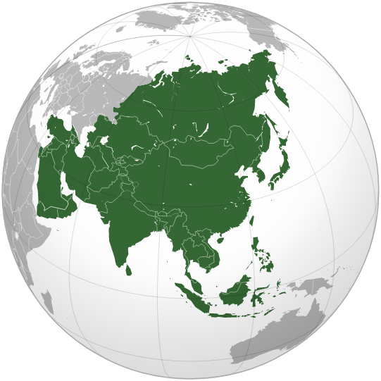

# 世界互联网用户分析


```python
import seaborn as sns
import numpy as np
import pandas as pd
import matplotlib.pyplot as plt


x0 = pd.read_csv("/data/bigfiles/world_internet_user.csv", encoding='latin-1')
x0.head(3)
# print(x0.head(3))
```

## 1. 数据预处理 Data Preprocessing


```python
x0.shape
```


```python
x0.columns

```


```python
x0['Country'].tolist()
```


```python
owo = x0.duplicated().any() # True
```


```python
x0.isnull().values.any()
```


```python
x0.isnull().sum()
```


```python
x0.fillna(0)
```


```python
x0['Region'].value_counts()
```


```python
x0.Region.value_counts().plot(kind='bar')
plt.show()
```


```python
regions = ('Africa', 'America', 'Europe', 'Asia', 'Oceania', 'Middle East')
counts = (58, 55, 53, 35, 27, 14)
colors = ('#ADD8E6','#FFF5EE', '#FFD51F', '#E67F0D', '#D53032')
plt.pie(
    counts,
    labels=regions,
    autopct='%1.1f%%',
    colors=colors,
    shadow=True
) 
plt.show()
```

## 2. 重命名特定列平顺性处理 Renaming Specific Columns for Comfort Process


```python
x0 = x0.rename({'Internet Users': 'Internet_Users', '% of Population':'Population_Percentage'}, axis=1)
d = x0.drop(0) #Dropping unnecessary index and row
```

## 2.1 描述数据Describe Data


```python
d.describe()
```

## 2.2 绘制箱形图 Boxplot


```python
b1 = ['Population']

boxplot = d.boxplot(b1)  
plt.xticks(rotation=90)
plt.title("Population Distribution")
plt.show()
```


```python
b2 = ['Internet_Users']

boxplot = d.boxplot(b2)  
plt.xticks(rotation=90)
plt.title("Internet Users")
plt.show()
```


```python
b3 = ['Population_Percentage']

boxplot = d.boxplot(b3)  
plt.xticks(rotation=90)
plt.title("Population percentage")
plt.show()
```

## 2.3 绘制热图 Heatmap


```python
sns.heatmap(d.corr(), annot=True, cmap='YlGnBu'); # heatmaps shows correlation between numerical data
```

## 2.4 两两关系图 Pairplot


```python
sns.pairplot(d, kind='scatter', hue=None); #pairplot for understanding distribution and correlation
```

## 2.5 数据集中互联网用户最多的国家 Country with Most Internet Users From Dataset


```python
d[d['Internet_Users'] == d['Internet_Users'].max()] #Showing the max() result
```

## 2.6 数据集中互联网用户最少的国家 Country With Least Internet Users From Dataset


```python
d[d['Internet_Users'] == d['Internet_Users'].min()] #Showing the min() result
```

## 2.7  地理空间可视化活页 Folium for Geospatial Visualization


```python
!pip install folium
```


```python
import os
import folium #Folium Features


fullJsonString = None
with open('/data/bigfiles/china.json', 'r') as f:
    fullJsonString = f.read().encode('ascii', errors='ignore')
    

crm = folium.Map(location=[35, 100], zoom_start=4)

folium.Choropleth(
    '/data/bigfiles/china.json',
    name='China regions',
    fill_opacity=0.1,
    line_opacity=0.2,
).add_to(crm)

folium.LayerControl().add_to(crm)

crm
```

## 2.8 中国 China 

2022年1月，中国有10.2亿互联网用户。2022年初，中国互联网普及率为总人口的70.9%。Kepios分析显示，2021至2022年间，中国互联网用户增加了3590万（+3.6%）。
Source: https://datareportal.com/reports/digital-2022-china

.png)

## 3. 互联网用户最多的地区 Region with Most Internet Users


```python
riu = x0.groupby(['Region'])['Internet_Users'].agg(lambda x: x.unique().sum()/x.nunique())
riu
```


```python
regions_iu = ('Asia', 'America', 'Middle East', 'Europe', 'Oceania', 'Africa')
counts_1 = (8.38, 1.62, 1.527, 1.41, 1.19, 1.03)

colors = ('#ADD8E6','#FFF5EE', '#FFD51F', '#E67F0D', '#D53032', '#00FF00')
plt.pie(
    counts_1,
    labels=regions_iu,
    autopct='%1.1f%%',
    colors=colors,
    shadow=True
) 
plt.show()
```

Asia region has the most internet users
亚洲地区拥有最多的互联网用户


## 4 结论 Conclusion

截至2022年，有49.5亿活跃互联网用户（DataReportal，2022）。与2021的数据相比，这标志着1.92亿年的同比增长。全球活跃互联网用户的增长率为4%，是总人口增长率（1%）的四倍。
Source: https://id.oberlo.com/blog/internet-statistics



```python
/data/bigfiles/world-countries.json
/data/bigfiles/china-provinces.json
/data/bigfiles/world_internet_user.csv
/data/bigfiles/china.json

```
