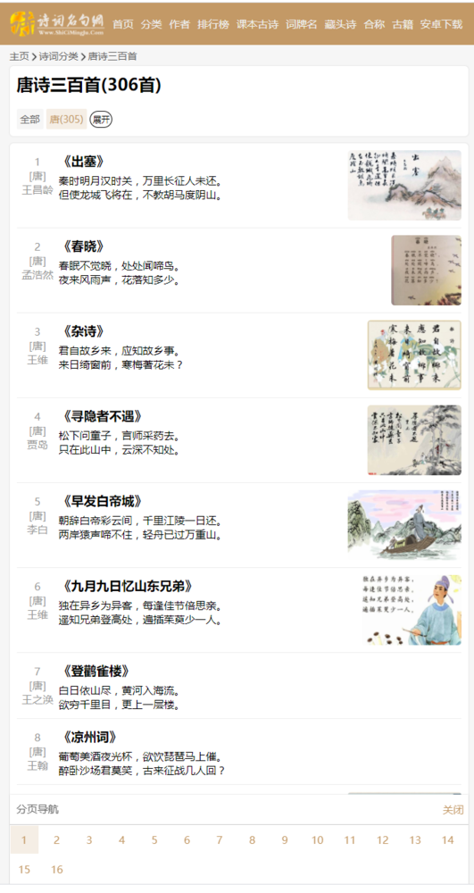

# 爬取唐诗

起始页面URL  
https://www.shicimingju.com/shicimark/tangshisanbaishou_1_0__1.html  
终止页面URL  
https://www.shicimingju.com/shicimark/tangshisanbaishou_16_0__1.html  
查看网址，可以发现，改变tangshisanbaishou_1_0__1.html中tangshisanbaishou_（*）_0__1.html 星号位置的数字，设置从1到16，便可以获得全部页面的URL。  
即  


```python
for i in range(1, 17):
    url = 'http://www.shicimingju.com/shicimark/tangshisanbaishou_' + str(i) + '_0__0.html'
```



以第一个页面为例：


```python
import requests
from bs4 import BeautifulSoup


url = 'http://www.shicimingju.com/shicimark/tangshisanbaishou_1_0__0.html'
r = requests.get(url)
demo = r.text  # 服务器返回响应
soup = BeautifulSoup(demo, "html.parser")
print(soup)
```

查看解析结果：


```python
<!DOCTYPE html>

<html lang="zh">
<head>
<meta charset="utf-8"/>
<title>唐诗三百首(306首)_诗词分类_诗词名句网</title>
<meta content="width=device-width,user-scalable=no" name="viewport">
<meta content="" name="description"/>
<link href="/public/css/www_v3.css" rel="stylesheet"/>
<link href="/public/css/font_576092_m2icqcebp7evzpvi.css" rel="stylesheet"/>
<script src="/public/js/device.js"></script>
<script src="/public/js/jq.js"></script>
<script src="/public/js/www_v3.js"></script>
</meta></head>
<body>
<div id="top_bar">
<div id="top_bar_main">
<div id="top_left">
<a href="/"></a>
<div id="top_left_menu">
<ul>
<li><a href="/">首页</a></li>
<li><a href="/shicimark">分类</a></li>
<li><a href="/category/all">作者</a></li>
<li><a href="/paiming">排行榜</a></li>
<li><a href="/cate?cate_id=4">课本古诗</a></li>
<li><a href="/cipai/index.html">词牌名</a></li>
<li><a href="/cangtoushi/index.html">藏头诗</a></li>
<li><a href="/hecheng/index.html">合称</a></li>
<li><a href="/book/">古籍</a></li>
<li><a href="/app/">安卓下载</a></li>
</ul>
</div>
<div style="clear: both"></div>
</div>
<div id="top_right">
<div id="top_right_nav">
<ul>
<li><a data-cate="all" href="javascript:void(0)">综合</a> </li>
<li><a data-cate="zuozhe" href="javascript:void(0)">作者</a> </li>
<li><a data-cate="title" href="javascript:void(0)">标题</a> </li>
<li><a data-cate="shiju" href="javascript:void(0)">诗句</a> </li>
<li><a data-cate="first" href="javascript:void(0)">句首</a> </li>
<li><a data-cate="end" href="javascript:void(0)">句尾</a> </li>
<li><a data-cate="book" href="javascript:void(0)">古籍</a> </li>
<li><a data-cate="chengyu" href="javascript:void(0)">成语</a> </li>
</ul>
</div>
<div id="input_div">
<input autocomplete="off" id="search_input" name="kw" placeholder="" type="text" value=""/>
<a href="javascript:doSearch();"></a>
<div style="clear: both"></div>
</div>
<div class="card" id="tip_result">
<ul>
</ul>
<div id="tip_content">
</div>
</div>
</div>
<div style="clear: both;"></div>
</div>
</div>
<div id="nav-top"><a href="/">主页</a><span class="nav-arrow"></span><a href="/shicimark/">诗词分类</a><span class="nav-arrow"></span><a href="/shicimark/tangshisanbaishou.html">唐诗三百首</a></div>
<div id="main">
<div id="main_left">
<div class="card">
<h1>唐诗三百首(306首)</h1>
<div class="filter-container">
<a class="current-filter" href="/shicimark/tangshisanbaishou.html">全部</a>
<a href="/shicimark/tangshisanbaishou_1_0__1.html">唐(305)</a>
<a href="javascript:filter_show_more()" id="filter_show_more">展开</a>
</div>
<div class="filter-hide" style="height: 1px;background: #eee;margin: 5px 0"></div>
<div class="filter-container filter-hide">
<a class="current-filter" href="/shicimark/tangshisanbaishou.html">全部</a>
<a href="/shicimark/tangshisanbaishou_1_1__0.html">李白(33)</a>
<a href="/shicimark/tangshisanbaishou_1_2__0.html">韩翃(3)</a>
...
<a href="/shicimark/tangshisanbaishou_1_448__0.html">邱为(1)</a>
<a href="/shicimark/tangshisanbaishou_1_484__0.html">朱庆馀(1)</a>
</div>
</div>
<div class="card shici_card">
<div>
<div class="list_num_info">
                    1                    <br/>
                    [唐]
                    <br/>
                    王昌龄
</div>

<div class="shici_list_main">
    <h3><a href="/chaxun/list/2973.html">《出塞》</a> </h3>
    <div class="shici_content">
                            秦时明月汉时关，万里长征人未还。<br/>但使龙城飞将在，不教胡马度阴山。                                            </div>
    </div>
    
    <div class="shici_list_pic">
    <a href="/chaxun/list/2973.html"></a>
    </div>
    <div style="clear: both"></div>
</div>

<div style="background: #eee;height: 1px;margin: 10px 0;"></div>
<div>

<div class="list_num_info">
                    2                    <br>
                    [唐]
                    <br/>
                    孟浩然                </br>
</div>

<div class="shici_list_main">
	<h3><a href="/chaxun/list/3020.html">《春晓》</a> </h3>
    
    <div class="shici_content">
                            春眠不觉晓，处处闻啼鸟。<br/>夜来风雨声，花落知多少。                                            </div>
    </div>
    
    <div class="shici_list_pic">
    <a href="/chaxun/list/3020.html"></a>
    </div>
	<div style="clear: both"></div>
</div>

<div style="background: #eee;height: 1px;margin: 10px 0;"></div>
<div>
<div class="list_num_info">
                    3                    <br>
                    [唐]
                    <br/>
                    王维                </br></div>
<div class="shici_list_main">
<h3><a href="/chaxun/list/3025.html">《杂诗》</a> </h3>
<div class="shici_content">
                        君自故乡来，应知故乡事。<br/>来日绮窗前，寒梅著花未？                                            </div>
</div>
<div class="shici_list_pic">
<a href="/chaxun/list/3025.html"></a>
</div>
<div style="clear: both"></div>
</div>
<div style="background: #eee;height: 1px;margin: 10px 0;"></div>
<div>
<div class="list_num_info">
                    4                    <br/>
                    [唐]
                    <br/>
                    贾岛                </div>
<div class="shici_list_main">
<h3><a href="/chaxun/list/3035.html">《寻隐者不遇》</a> </h3>
<div class="shici_content">
                        松下问童子，言师采药去。<br/>只在此山中，云深不知处。                                            </div>
</div>
<div class="shici_list_pic">
<a href="/chaxun/list/3035.html"></a>
</div>
<div style="clear: both"></div>
</div>
<div style="background: #eee;height: 1px;margin: 10px 0;"></div>
<div>
<div class="list_num_info">
                    5                    <br>
                    [唐]
                    <br/>
                    李白                </br></div>
<div class="shici_list_main">
<h3><a href="/chaxun/list/3045.html">《早发白帝城》</a> </h3>
<div class="shici_content">
                        朝辞白帝彩云间，千里江陵一日还。<br/>两岸猿声啼不住，轻舟已过万重山。                                            </div>
</div>
<div class="shici_list_pic">
<a href="/chaxun/list/3045.html"></a>
</div>
<div style="clear: both"></div>
</div>
<div style="background: #eee;height: 1px;margin: 10px 0;"></div>
<div>
<div class="list_num_info">
                    6                    <br>
                    [唐]
                    <br/>
                    王维                </br></div>
<div class="shici_list_main">
<h3><a href="/chaxun/list/3055.html">《九月九日忆山东兄弟》</a> </h3>
<div class="shici_content">
                        独在异乡为异客，每逢佳节倍思亲。<br/>遥知兄弟登高处，遍插茱萸少一人。                                            </div>
</div>
<div class="shici_list_pic">
<a href="/chaxun/list/3055.html"></a>
</div>
<div style="clear: both"></div>
</div>
<div style="background: #eee;height: 1px;margin: 10px 0;"></div>
<div>
<div class="list_num_info">
                    7                    <br>
                    [唐]
                    <br/>
                    王之涣                </br></div>
<div class="shici_list_main">
<h3><a href="/chaxun/list/3165.html">《登鹳雀楼》</a> </h3>
<div class="shici_content">
                        白日依山尽，黄河入海流。<br/>欲穷千里目，更上一层楼。                                            </div>
</div>
<div style="clear: both"></div>
</div>
<div style="background: #eee;height: 1px;margin: 10px 0;"></div>
<div>
<div class="list_num_info">
                    8                    <br>
                    [唐]
                    <br/>
                    王翰                </br></div>
<div class="shici_list_main">
<h3><a href="/chaxun/list/3179.html">《凉州词》</a> </h3>
<div class="shici_content">
                        葡萄美酒夜光杯，欲饮琵琶马上催。<br/>醉卧沙场君莫笑，古来征战几人回？                                            </div>
</div>
<div style="clear: both"></div>
</div>
<div style="background: #eee;height: 1px;margin: 10px 0;"></div>
<div>
<div class="list_num_info">
                    9                    <br>
                    [唐]
                    <br/>
                    杜牧                </br></div>
<div class="shici_list_main">
<h3><a href="/chaxun/list/3261.html">《赤壁》</a> </h3>
<div class="shici_content">
                        折戟沉沙铁未销，自将磨洗认前朝。<br/>东风不与周郎便，铜雀春深锁二乔。                                            </div>
</div>
<div class="shici_list_pic">
<a href="/chaxun/list/3261.html"></a>
</div>
<div style="clear: both"></div>
</div>
<div style="background: #eee;height: 1px;margin: 10px 0;"></div>
<div>
<div class="list_num_info">
                    10                    <br>
                    [唐]
                    <br/>
                    朱庆余                </br></div>
<div class="shici_list_main">
<h3><a href="/chaxun/list/3271.html">《近试上张籍水部》</a> </h3>
<div class="shici_content">
                        洞房昨夜停红烛，待晓堂前拜舅姑。<br/>妆罢低声问夫婿，画眉深浅入时无？                                            </div>
</div>
<div style="clear: both"></div>
</div>
<div style="background: #eee;height: 1px;margin: 10px 0;"></div>
<div>
<div class="list_num_info">
                    11                    <br>
                    [唐]
                    <br/>
                    益嘉运                </br></div>
<div class="shici_list_main">
<h3><a href="/chaxun/list/3281.html">《春怨》</a> </h3>
<div class="shici_content">
                        打起黄莺儿，莫教枝上啼。<br/>啼时惊妾梦，不得到辽西。                                            </div>
</div>
<div style="clear: both"></div>
</div>
<div style="background: #eee;height: 1px;margin: 10px 0;"></div>
<div>
<div class="list_num_info">
                    12                    <br>
                    [唐]
                    <br/>
                    西鄙人                </br></div>
<div class="shici_list_main">
<h3><a href="/chaxun/list/3286.html">《哥舒歌》</a> </h3>
<div class="shici_content">
                        北斗七星高，哥舒夜带刀。<br/>至今窥牧马，不敢过临洮。                                            </div>
</div>
<div style="clear: both"></div>
</div>
<div style="background: #eee;height: 1px;margin: 10px 0;"></div>
<div>
<div class="list_num_info">
                    13                    <br>
                    [唐]
                    <br/>
                    张祜                </br></div>
<div class="shici_list_main">
<h3><a href="/chaxun/list/3291.html">《宫词》</a> </h3>
<div class="shici_content">
                        故国三千里，深宫二十年。<br/>一声何满子，双泪落君前。                                            </div>
</div>
<div style="clear: both"></div>
</div>
<div style="background: #eee;height: 1px;margin: 10px 0;"></div>
<div>
<div class="list_num_info">
                    14                    <br>
                    [唐]
                    <br/>
                    王维                </br></div>
<div class="shici_list_main">
<h3><a href="/chaxun/list/3296.html">《山中送别》</a> </h3>
<div class="shici_content">
                        山中相送罢，日暮掩柴扉。<br/>春草明年绿，王孙归不归。                                            </div>
</div>
<div class="shici_list_pic">
<a href="/chaxun/list/3296.html"></a>
</div>
<div style="clear: both"></div>
</div>
<div style="background: #eee;height: 1px;margin: 10px 0;"></div>
<div>
<div class="list_num_info">
                    15                    <br/>
                    [唐]
                    <br/>
                    杜甫                </div>
<div class="shici_list_main">
<h3><a href="/chaxun/list/3301.html">《八阵图》</a> </h3>
<div class="shici_content">
                        功盖三分国，名成八阵图。<br/>江流石不转，遗恨失吞吴。                                            </div>
</div>
<div style="clear: both"></div>
</div>
<div style="background: #eee;height: 1px;margin: 10px 0;"></div>
<div>
<div class="list_num_info">
                    16                    <br/>
                    [唐]
                    <br/>
                    王维                </div>
<div class="shici_list_main">
<h3><a href="/chaxun/list/3306.html">《相思》</a> </h3>
<div class="shici_content">
                        红豆生南国，春来发几枝。<br/>愿君多采撷，此物最相思。                                            </div>
</div>
<div class="shici_list_pic">
<a href="/chaxun/list/3306.html"></a>
</div>
<div style="clear: both"></div>
</div>
<div style="background: #eee;height: 1px;margin: 10px 0;"></div>
<div>
<div class="list_num_info">
                    17                    <br>
                    [唐]
                    <br/>
                    王维                </br></div>
<div class="shici_list_main">
<h3><a href="/chaxun/list/3311.html">《鹿柴》</a> </h3>
<div class="shici_content">
                        空山不见人，但闻人语响。<br/>返景入深林，复照青苔上。                                            </div>
</div>
<div class="shici_list_pic">
<a href="/chaxun/list/3311.html"></a>
</div>
<div style="clear: both"></div>
</div>
<div style="background: #eee;height: 1px;margin: 10px 0;"></div>
<div>
<div class="list_num_info">
                    18                    <br>
                    [唐]
                    <br/>
                    李白                </br></div>
<div class="shici_list_main">
<h3><a href="/chaxun/list/3316.html">《黄鹤楼送孟浩然之广陵》</a> </h3>
<div class="shici_content">
                        故人西辞黄鹤楼，烟花三月下扬州。<br/>孤帆远影碧空尽，唯见长江天际流。                                            </div>
</div>
<div class="shici_list_pic">
<a href="/chaxun/list/3316.html"></a>
</div>
<div style="clear: both"></div>
</div>
<div style="background: #eee;height: 1px;margin: 10px 0;"></div>
<div>
<div class="list_num_info">
                    19                    <br>
                    [唐]
                    <br/>
                    柳宗元                </br></div>
<div class="shici_list_main">
<h3><a href="/chaxun/list/3341.html">《江雪》</a> </h3>
<div class="shici_content">
                        千山鸟飞绝，万径人踪灭。<br/>孤舟蓑笠翁，独钓寒江雪。                                            </div>
</div>
<div class="shici_list_pic">
<a href="/chaxun/list/3341.html"></a>
</div>
<div style="clear: both"></div>
</div>
<div style="background: #eee;height: 1px;margin: 10px 0;"></div>
<div>
<div class="list_num_info">
                    20                    <br>
                    [唐]
                    <br/>
                    张继                </br></div>
<div class="shici_list_main">
<h3><a href="/chaxun/list/3346.html">《枫桥夜泊》</a> </h3>
<div class="shici_content">
                        月落乌啼霜满天，江枫渔火对愁眠。<br/>姑苏城外寒山寺，夜半钟声到客船。                                            </div>
</div>
<div class="shici_list_pic">
<a href="/chaxun/list/3346.html"></a>
</div>
<div style="clear: both"></div>
</div>
<div style="background: #eee;height: 1px;margin: 10px 0;"></div>
</div>
<div id="flag"></div>
<div id="list_nav">
<div id="list_nav_title">分页导航<a href="javascript:void(0)" id="hide_all_nav" style="float: right">关闭</a> <div style="clear: both"></div></div>
<div id="list_nav_all" style="display: none">
<a class="list_nav_current" href="/shicimark/tangshisanbaishou.html">1</a>
<a href="/shicimark/tangshisanbaishou_2_0__0.html">2</a>
...
<a href="/shicimark/tangshisanbaishou_16_0__0.html">16</a>
</div>
<div id="list_nav_part">
...
</div>
</div>
</div>
<div id="main_right">
<div class="card hc_other">
<div class="aside_title">诗词分类</div>
<ul>
<li><a href="/shicimark/tianyuanshi.html">田园诗</a></li>
<li><a href="/shicimark/sonbieshi.html">送别诗</a></li>
...
<li><a href="/shicimark/laodong.html">劳动</a></li>
<li><a href="/shicimark/zhuangzhinanchou.html">壮志难酬</a></li>
<div style="clear: both"></div>
</ul>
</div>
</div>
<div style="clear: both;"></div>
</div><a href="javascript:toTop();"><div id="toTop">顶部</div></a>
<div id="footer">
<div id="footer_main">
<div id="bottom_nav">
...
                        Copyright © 2010-2020 <a href="http://www.miibeian.gov.cn" target="_blank">晋ICP备20006382号-1</a> 邮箱：
                    </div>
</div>
</div><script>
var _hmt = _hmt || [];
(function() {
  var hm = document.createElement("script");
  hm.src = "https://hm.baidu.com/hm.js?6181c6e4531be00fa696eb631fbd2a4b";
  var s = document.getElementsByTagName("script")[0];
  s.parentNode.insertBefore(hm, s);
})();
</script>
</body>
</html>

```

单独查看一首诗的信息


```python
<div class="list_num_info">
                    18                    <br>
                    [唐]
                    <br/>
                    李白                </br>
</div>
<div class="shici_list_main">
	<h3><a href="/chaxun/list/3316.html">《黄鹤楼送孟浩然之广陵》</a> </h3>
	<div class="shici_content">
                        故人西辞黄鹤楼，烟花三月下扬州。<br/>
						孤帆远影碧空尽，唯见长江天际流。
	</div>
</div>
```
从解析内容上看，所有诗的序号、朝代和作者信息都在<div class="list_num_info">中，诗的名字信息在<div class="shici_list_main">中，诗的内容信息在<div class="shici_list_main">中的<div class="shici_content">中，用soup.find_all(class_='list_num_info')、soup.find_all(class_='shici_list_main')。获取这部分信息。

```python
import requests
from bs4 import BeautifulSoup


url = 'http://www.shicimingju.com/shicimark/tangshisanbaishou_1_0__0.html'
r = requests.get(url)
demo = r.text  # 服务器返回响应
soup = BeautifulSoup(demo, "html.parser")
# print(soup)
html1 = soup.find_all(class_='list_num_info')
for text in html1:
    print(text.get_text())
```

查看输出：
                    1                    
                    [唐]
                    
                    王昌龄                

                    2                    
                    [唐]
                    
                    孟浩然                

                    3                    
                    [唐]
                    
                    王维                

                    4                    
                    [唐]
                    
                    贾岛                

                    5                    
                    [唐]
                    
                    李白                

                    6                    
                    [唐]
                    
                    王维                

                    7                    
                    [唐]
                    
                    王之涣                

                    8                    
                    [唐]
                    
                    王翰                

                    9                    
                    [唐]
                    
                    杜牧                

                    10                    
                    [唐]
                    
                    朱庆余                

                    11                    
                    [唐]
                    
                    益嘉运                

                    12                    
                    [唐]
                    
                    西鄙人                

                    13                    
                    [唐]
                    
                    张祜                

                    14                    
                    [唐]
                    
                    王维                

                    15                    
                    [唐]
                    
                    杜甫                

                    16                    
                    [唐]
                    
                    王维                

                    17                    
                    [唐]
                    
                    王维                

                    18                    
                    [唐]
                    
                    李白                

                    19                    
                    [唐]
                    
                    柳宗元                

                    20                    
                    [唐]
                    
                    张继                

```python
import requests
from bs4 import BeautifulSoup


url = 'http://www.shicimingju.com/shicimark/tangshisanbaishou_1_0__0.html'
r = requests.get(url)
demo = r.text  # 服务器返回响应
soup = BeautifulSoup(demo, "html.parser")
# print(soup)
html1 = soup.find_all(class_='shici_list_main')
for text in html1:
    print(text.get_text())
```

查看输出：
《出塞》 

                        秦时明月汉时关，万里长征人未还。但使龙城飞将在，不教胡马度阴山。                                            


《春晓》 

                        春眠不觉晓，处处闻啼鸟。夜来风雨声，花落知多少。                                            


《杂诗》 

                        君自故乡来，应知故乡事。来日绮窗前，寒梅著花未？                                            


《寻隐者不遇》 

                        松下问童子，言师采药去。只在此山中，云深不知处。                                            


《早发白帝城》 

                        朝辞白帝彩云间，千里江陵一日还。两岸猿声啼不住，轻舟已过万重山。                                            


《九月九日忆山东兄弟》 

                        独在异乡为异客，每逢佳节倍思亲。遥知兄弟登高处，遍插茱萸少一人。                                            


《登鹳雀楼》 

                        白日依山尽，黄河入海流。欲穷千里目，更上一层楼。                                            


《凉州词》 

                        葡萄美酒夜光杯，欲饮琵琶马上催。醉卧沙场君莫笑，古来征战几人回？                                            


《赤壁》 

                        折戟沉沙铁未销，自将磨洗认前朝。东风不与周郎便，铜雀春深锁二乔。                                            


《近试上张籍水部》 

                        洞房昨夜停红烛，待晓堂前拜舅姑。妆罢低声问夫婿，画眉深浅入时无？                                            


《春怨》 

                        打起黄莺儿，莫教枝上啼。啼时惊妾梦，不得到辽西。                                            


《哥舒歌》 

                        北斗七星高，哥舒夜带刀。至今窥牧马，不敢过临洮。                                            


《宫词》 

                        故国三千里，深宫二十年。一声何满子，双泪落君前。                                            


《山中送别》 

                        山中相送罢，日暮掩柴扉。春草明年绿，王孙归不归。                                            


《八阵图》 

                        功盖三分国，名成八阵图。江流石不转，遗恨失吞吴。                                            


《相思》 

                        红豆生南国，春来发几枝。愿君多采撷，此物最相思。                                            


《鹿柴》 

                        空山不见人，但闻人语响。返景入深林，复照青苔上。                                            


《黄鹤楼送孟浩然之广陵》 

                        故人西辞黄鹤楼，烟花三月下扬州。孤帆远影碧空尽，唯见长江天际流。                                            


《江雪》 

                        千山鸟飞绝，万径人踪灭。孤舟蓑笠翁，独钓寒江雪。                                            


《枫桥夜泊》 

                        月落乌啼霜满天，江枫渔火对愁眠。姑苏城外寒山寺，夜半钟声到客船。                                            

到这里，我们已经获得了想要的诗的信息，接下来要做的就是过滤掉无用的空格、回车、[]和《》，再把数据加入到列表便可以了。


```python
import requests
from bs4 import BeautifulSoup


numbers = []
dynasties = []
poets = []
names = []
poems = []


for i in range(1, 17):
    url = 'http://www.shicimingju.com/shicimark/tangshisanbaishou_' + str(i) + '_0__0.html'

    r = requests.get(url)
    demo = r.text  # 服务器返回响应

    soup = BeautifulSoup(demo, "html.parser")
    # print(soup)
    """
    demo 表示被解析的html格式的内容
    html.parser表示解析用的解析器
    """

    html1 = soup.find_all(class_='list_num_info')
    for text in html1:
        print(text)
        text = text.get_text().replace('\n', '').replace(' ', '').replace('[', '|').replace(']', '|')
        text = text.split('|')
        numbers.append(text[0])
        dynasties.append(text[1])
        poets.append(text[2])
```


```python
import requests
from bs4 import BeautifulSoup


url = 'http://www.shicimingju.com/shicimark/tangshisanbaishou_1_0__0.html'
r = requests.get(url)
demo = r.text  # 服务器返回响应
soup = BeautifulSoup(demo, "html.parser")
# print(soup)
html1 = soup.find_all(class_='list_num_info')
for text in html1:
    text = text.get_text().replace('\n', '').replace(' ', '').replace('[', '|').replace(']', '|')
    text = text.split('|')
    print(text)
```
['1', '唐', '王昌龄']
['2', '唐', '孟浩然']
['3', '唐', '王维']
['4', '唐', '贾岛']
['5', '唐', '李白']
['6', '唐', '王维']
['7', '唐', '王之涣']
['8', '唐', '王翰']
['9', '唐', '杜牧']
['10', '唐', '朱庆余']
['11', '唐', '益嘉运']
['12', '唐', '西鄙人']
['13', '唐', '张祜']
['14', '唐', '王维']
['15', '唐', '杜甫']
['16', '唐', '王维']
['17', '唐', '王维']
['18', '唐', '李白']
['19', '唐', '柳宗元']
['20', '唐', '张继']

```python
import requests
from bs4 import BeautifulSoup


url = 'http://www.shicimingju.com/shicimark/tangshisanbaishou_1_0__0.html'
r = requests.get(url)
demo = r.text  # 服务器返回响应
soup = BeautifulSoup(demo, "html.parser")
# print(soup)
html1 = soup.find_all(class_='shici_list_main')
for text in html1:
    text = text.get_text().replace('\n', '').replace(' ', '').replace('[', '|').replace(']', '|')
    text = text.split('|')
    print(text)
```

查看输出：
['《出塞》秦时明月汉时关，万里长征人未还。但使龙城飞将在，不教胡马度阴山。']
['《春晓》春眠不觉晓，处处闻啼鸟。夜来风雨声，花落知多少。']
['《杂诗》君自故乡来，应知故乡事。来日绮窗前，寒梅著花未？']
['《寻隐者不遇》松下问童子，言师采药去。只在此山中，云深不知处。']
['《早发白帝城》朝辞白帝彩云间，千里江陵一日还。两岸猿声啼不住，轻舟已过万重山。']
['《九月九日忆山东兄弟》独在异乡为异客，每逢佳节倍思亲。遥知兄弟登高处，遍插茱萸少一人。']
['《登鹳雀楼》白日依山尽，黄河入海流。欲穷千里目，更上一层楼。']
['《凉州词》葡萄美酒夜光杯，欲饮琵琶马上催。醉卧沙场君莫笑，古来征战几人回？']
['《赤壁》折戟沉沙铁未销，自将磨洗认前朝。东风不与周郎便，铜雀春深锁二乔。']
['《近试上张籍水部》洞房昨夜停红烛，待晓堂前拜舅姑。妆罢低声问夫婿，画眉深浅入时无？']
['《春怨》打起黄莺儿，莫教枝上啼。啼时惊妾梦，不得到辽西。']
['《哥舒歌》北斗七星高，哥舒夜带刀。至今窥牧马，不敢过临洮。']
['《宫词》故国三千里，深宫二十年。一声何满子，双泪落君前。']
['《山中送别》山中相送罢，日暮掩柴扉。春草明年绿，王孙归不归。']
['《八阵图》功盖三分国，名成八阵图。江流石不转，遗恨失吞吴。']
['《相思》红豆生南国，春来发几枝。愿君多采撷，此物最相思。']
['《鹿柴》空山不见人，但闻人语响。返景入深林，复照青苔上。']
['《黄鹤楼送孟浩然之广陵》故人西辞黄鹤楼，烟花三月下扬州。孤帆远影碧空尽，唯见长江天际流。']
['《江雪》千山鸟飞绝，万径人踪灭。孤舟蓑笠翁，独钓寒江雪。']
['《枫桥夜泊》月落乌啼霜满天，江枫渔火对愁眠。姑苏城外寒山寺，夜半钟声到客船。']

将两部分内容合并到一个列表中，完整代码为：


```python
import requests
from bs4 import BeautifulSoup
import pandas as pd


poem_title = []
poem_content = []
poems = []

for i in range(1, 17):
    url = 'http://www.shicimingju.com/shicimark/tangshisanbaishou_' + str(i) + '_0__0.html'
    r = requests.get(url)
    demo = r.text  # 服务器返回响应
    soup = BeautifulSoup(demo, "html.parser")
    # print(soup)
    title = soup.find_all(class_='list_num_info')

    for text in title:
        text = text.get_text().replace('\n', '').replace(' ', '').replace('[', '|').replace(']', '|')
        text = text.split('|')
        poem_title.append(text)


    content = soup.find_all(class_='shici_list_main')
    for text in content:
        text = text.get_text().replace('\n', '').replace(' ', '')
        text = text.replace('展开全文', '').replace('收起', '').replace('《', '').replace('》', '|')
        text = text.split('|')
        poem_content.append(text)


for i in range(len(poem_title)):
    poems.append(poem_title[i] + poem_content[i])

print(poems)
poems_df = pd.DataFrame(poems, columns=['序号', '朝代', '作者','诗名', '诗句', ''])
poems_df.to_csv('./唐诗三百首.csv', index=False)

```

查看输出
[['1', '唐', '王昌龄', '出塞', '秦时明月汉时关，万里长征人未还。但使龙城飞将在，不教胡马度阴山。'], 
 ['2', '唐', '孟浩然', '春晓', '春眠不觉晓，处处闻啼鸟。夜来风雨声，花落知多少。'], 
 ...
 ['306', '唐', '柳宗元', '晨诣超师院读禅经', '汲井漱寒齿，清心拂尘服。闲持贝叶书，步出东斋读。真源了无取，妄迹世所逐。遗言冀可冥，缮性何由熟。道人庭宇静，苔色连深竹。日出雾露馀，青松如膏沐。澹然离言说，悟悦心自足。']]序号,朝代,作者,诗名,诗句,
1,唐,王昌龄,出塞,秦时明月汉时关，万里长征人未还。但使龙城飞将在，不教胡马度阴山。,
2,唐,孟浩然,春晓,春眠不觉晓，处处闻啼鸟。夜来风雨声，花落知多少。,


...
305,唐,常建,宿王昌龄隐居,清溪深不测，隐处唯孤云。松际露微月，清光犹为君。茅亭宿花影，药院滋苔纹。余亦谢时去，西山鸾鹤群。,
306,唐,柳宗元,晨诣超师院读禅经,汲井漱寒齿，清心拂尘服。闲持贝叶书，步出东斋读。真源了无取，妄迹世所逐。遗言冀可冥，缮性何由熟。道人庭宇静，苔色连深竹。日出雾露馀，青松如膏沐。澹然离言说，悟悦心自足。,
