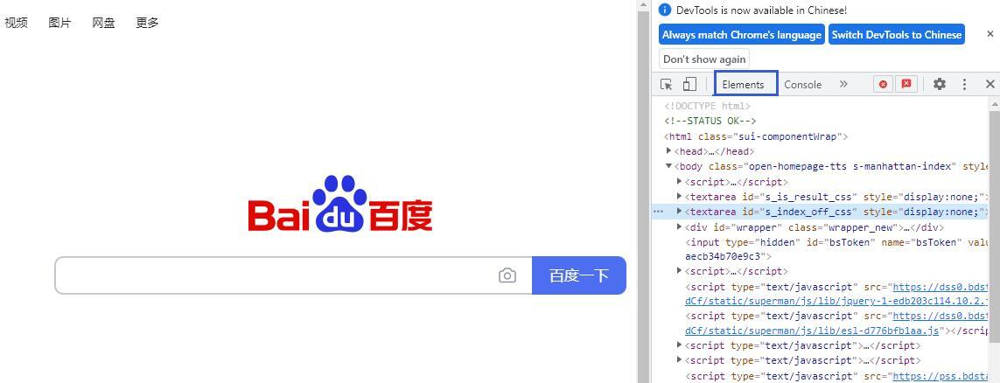

# 2. HTML语言简介

我们看到的网页是浏览器将HTML语言描述的文本文件解析之后呈现的结果。HTML称为超文本标记语言，通过标签可将文本、声音和图片等内容组织起来。也就是说，互联网上的数据都是隐藏在这些源代码中，为了获取其中的数据，需要分析网页的结构，了解数据存储方式和位置，从而才能编写爬虫程序获取数据。
一般来说，在网页的空白处点击鼠标右键，在弹出的快捷菜单中点击“查看网页源代码”就可以看到网页的源代码。但这种方式不便于分析数据在源代码中所处的位置。谷歌浏览器提供了一个开发者工具，能更直观的标示出网页内容和源代码的对应关系，帮助定位数据位置。

例如，在谷歌浏览器在打开百度首页，然后按【F12】键或用快捷键【Ctrl+Shift+l】即可开启开发者工具，界面如图12-1所示。窗口左侧正常显示网页，右侧显示源代码，默认显示“Elements”选项卡，源代码中用“<>”括起来的文本称为“Elements”对象或网页元素，大部分数据就存放在这些“Elements”对象中。

单击开发者工具左上角的元素选择工具，再将鼠标移动到网页窗口的任意元素上，该元素会被突出显示，单击元素，则源代码中存放该数据的代码会被展开和选中，可以帮助用户快速定位数据。
这个网页结构比较复杂，下面我们创建一个简单的网页学习HTML的基本元素。在Pycharm中，点击“File”菜单，选择“New”，在弹出界面中单击“HTML File”并输入一个主文件名并回车，系统会自动补全“.html”扩展名，创建一个HTML网页文件。Pycharm会自动生成网页的基本框架的源代码，源代码由一系列成对出现的包含在“<>”中的标签和包围在标签中的数据组成。其中<html>和</html>表示其中的代码是HTML语言，<head>和</head>之间的数据主要用于网页的描述，如“<title>爬虫练习</title>”表示这个网页的标题是“爬虫学习”，<body>和</body>之间放置这个网页的上呈现的数据和呈现形式的代码。

<!DOCTYPE html>              <!--网页声明，告诉浏览器用html规范解释当前文档-->
<html lang="en">             <!--声明这是一个HTML文档-->
<head>                       <!--定义文档头部-->
    <meta charset="UTF-8">   <!--描述文档属性-->
    <title>爬虫练习</title>   <!--定义文档标题-->
</head>                      <!--文档头部结束标签-->
<body>                       <!--定义文档主体，包含文档所有内容-->

</body>                      <!--文档主体结束标签-->
</html>                      <!--HTML文档结束标签-->

除了这些标签外，常用的HTML标签还有以下几种：
1. 
标签

 可定义文档中的区块，可以把文档分割为独立的、不同的部分来显示内容，可用width和height定义块的宽度和高度。也可以用 id 或 class 来标记 
，使标签的作用更加有效。可以对同一个 
 元素应用 class 或 id 属性。这两者的主要差异是，class 用于元素组，而 id 用于标识单独的唯一的元素。例如在<body>和</body>之间插入下面三行代码就可以定义一个区块用于显示一条新闻的标题。

<!--定义一个区块-->

  各地贯彻十九届六中全会精神纪实

2. <ul><ol>和<li>标签<ul>和<ol>标签用于定义无序列表和有序列表，<li>用于列表标签之下，用于定义列表中的一项。下述代码可在前面定义的区块中定义一个包含2项的无序列表和一个包含2项的有序列表。

    <ul>  <!--定义一个无序列表-->
        <li>各地贯彻十九届六中全会精神纪实</li>
        <li>数读十九届六中全会精神</li>
    </ul>
    <ol>  <!--定义一个有序列表-->
        <li>研究人员称发现“德尔塔克戎”毒株</li>
        <li>奥密克戎为何在天津破防</li>
    </ol>

浏览器解析后将在网页上显示以下内容：
● 各地贯彻十九届六中全会精神纪实
● 数读十九届六中全会精神
1. 研究人员称发现“德尔塔克戎”毒株
2. 奥密克戎为何在天津破防
3. <h1> 到 <h6> 标签
 <h> 标签可定义标题，<h1> 定义一级标题。<h6> 定义最小的标题。
4. <a> 标签
<a> 标签定义超链接，<a> 元素最重要的属性是 href 属性，它指示链接的目标，用于从一网页链接到href 指定的位置。
5. 
标签

 标签定义段落，不设置样式时，
标签的内容在网页中显示为一行。
6. 标签
标签可以将网页元素放在一行中显示，可以为 span 应用 id 或 class 属性，这样既可以增加适当的语义，又便于对 span 应用样式或精确获取其中的数据。
7.  标签
 标签用于创建一个图像的占位空间，用于从网页中链接图像， 标签有两个必需的属性：src 属性 和 alt 属性。src 属性用于指定图片的地址，alt 属性用于指定无法正常加载图片时的替换文本。
8.<table> 标签
<table> 标签定义 HTML 表格，简单的 HTML 表格由 <table> 元素以及一个或多个表示行的 <tr>、表示表头单元格的<th> 或标准单元格的的<td> 元素组成。

<table border="1">
    <tr>
        <th>序号</th>
        <th>标题</th>
    </tr>
    <tr>
        <td>1</td>
        <td>数读十九届六中全会精神</td>
    </tr>
    <tr>
        <td>2</td>
        <td>各地贯彻十九届六中全会精神纪实</td>
    </tr>
</table>
