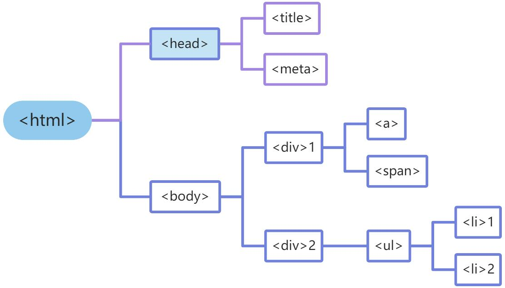

# 7. XPath表达式

## 7.1 定位标签

lxml 是一个功能强大的模块，其etree类可以将网页源代码实例化为一个etree对象，支持使用XPath表达式进行标签的定位，从而获取数据。创建etree对象后的网页可以视为树形结构，标签做为树的节点，标签之间为平级或上下级关系，通地上级能定位到下级。XPath表达式描述了从一个节点到国一个节点的路径，通过标签的属性或名称定位到上级标签，再通过路径定位到该标签的任意下级标签。



使用XPath进行数据解析首先需要对etree对象进行实例化。对于本地HTML文档，使用parse()函数进行etree对象的实例化。对于爬虫从网上获取到的网页源代码字符串，使用HTML()函数进行实例化。


```python
from lxml import etree
import requests  # 导入requests模块


headers = {'User-Agent':
           'Mozilla/5.0 (Windows NT 10.0; Win64; x64) AppleWebKit/537.36 (KHTML, like Gecko) Chrome/98.0.4758.9 Safari/537.36'}
url = 'https://www.shicimingju.com/shicimark/songcisanbaishou.html'
response = requests.get(url=url, timeout=1.0)
html = etree.HTML(response.text)  # <Element html at 0x1fedd5a0700>
```

完成对象的实例化后，就可以用XPath表达式定位标签并提取数据了。

1. 标签名定位

“/”表示一个层级，“//”表示多个层级，将数据所在标签一直向上回溯到树的根标签，也就是“html”之间的所有标签做为层级关系字符串，做为XPath()的参数即可获取最底层标签下面的数据。例如“/html/body/div/div/div/h1”可获取h1下面的数据“宋词三百首(300首)”。
也可以用“//”表示当前标签节点之上的每一级标签节点，对应的XPath表达式为“//h1”。


```python
from lxml import etree
import requests  # 导入requests模块


headers = {'User-Agent':
           'Mozilla/5.0 (Windows NT 10.0; Win64; x64) AppleWebKit/537.36 (KHTML, like Gecko) Chrome/98.0.4758.9 Safari/537.36'}
url = 'https://www.shicimingju.com/shicimark/songcisanbaishou.html'
response = requests.get(url=url, timeout=1.0)
# print(response.text)
html = etree.HTML(response.text)  # <Element html at 0x1fedd5a0700>
print(html.xpath('/html/body/div/div/div/h1')[0].text)
# 宋词三百首(300首)
```

2. 索引定位

etree对象的每一个层级都是一个包含所有标签节点的列表，如果同一层级中有多个同名的标签节点，使用列表切片就能定位到所需的标签节点，即通过索引定位。


```python
from lxml import etree
import requests  # 导入requests模块


headers = {'User-Agent':
           'Mozilla/5.0 (Windows NT 10.0; Win64; x64) AppleWebKit/537.36 (KHTML, like Gecko) Chrome/98.0.4758.9 Safari/537.36'}
url = 'https://www.shicimingju.com/shicimark/songcisanbaishou.html'
response = requests.get(url=url, timeout=1.0)
# print(response.text)
html = etree.HTML(response.text)  # <Element html at 0x1fedd5a0700>

print(html.xpath('///*[@id="main_left"]/div[2]/div[1]/div[2]/h3/a')[0].text)
# 《渔家傲·塞下秋来风景异》
```

3. 属性定位

在复杂的网页中，每个标签都有属性，此时可以通过属性定位。下面代码中“//”表示多个顶层，处于XPath表达式的开头代表从任意层级开始定位；“*”代表任何标签，“[@class="shici_content"]”代表定位class属性值为"shici_content"的任意标签，使用这种方法可以定位到指定属性的任意标签。不满足要求时还可以配合用“or”、“and”等逻辑运算来进行更精确的定位。


```python
from lxml import etree
import requests  # 导入requests模块


headers = {'User-Agent':
           'Mozilla/5.0 (Windows NT 10.0; Win64; x64) AppleWebKit/537.36 (KHTML, like Gecko) Chrome/98.0.4758.9 Safari/537.36'}
url = 'https://www.shicimingju.com/shicimark/songcisanbaishou.html'
response = requests.get(url=url, timeout=1.0)
# print(response.text)
html = etree.HTML(response.text)  # <Element html at 0x1fedd5a0700>

print(html.xpath('//*[@class="shici_content"]')[0].text)
# 塞下秋来风景异，衡阳雁去无留意。四面边声连角起。千嶂里，长烟落日孤城闭。
```

## 7.2 提取文本内容

定位到标签节点后，可以在XPath表达式后面添加“/text()”来提取该节点的直系文本内容，添加“//text()”提取该节点下的所有文本内容，添加“/@属性名”来提取该 节点的指定属性值。


```python
from lxml import etree
import requests  # 导入requests模块


headers = {'User-Agent':
           'Mozilla/5.0 (Windows NT 10.0; Win64; x64) AppleWebKit/537.36 (KHTML, like Gecko) Chrome/98.0.4758.9 Safari/537.36'}
url = 'https://www.shicimingju.com/shicimark/songcisanbaishou.html'
response = requests.get(url=url, timeout=1.0)
# print(response.text)
html = etree.HTML(response.text)  # <Element html at 0x1fedd5a0700>


print(html.xpath('//*[@class="shici_content"]/text()'))
print(html.xpath('//*[@class="shici_content"]//text()'))
```

XPath表达式可以使用谷歌浏览器的开发者工具的快捷菜单命令快速获取。在谷歌浏览器中打开网页，再打开开发者工具，在“Elements”选项卡下的源代码中右击要获取XPath表达式的标签，在弹出快捷菜单中执行“Copy>Copy XPath”，即可复制该 标签的XPath表达式。例如“《醉花阴·薄雾浓云愁永昼》”所在标签的表达式为“//*[@id="main_left"]/div[2]/div[3]/div[2]”，复制出来就可以在爬虫代码中使用了。


```python
from lxml import etree
import requests  # 导入requests模块


headers = {'User-Agent':
           'Mozilla/5.0 (Windows NT 10.0; Win64; x64) AppleWebKit/537.36 (KHTML, like Gecko) Chrome/98.0.4758.9 Safari/537.36'}
url = 'https://www.shicimingju.com/shicimark/songcisanbaishou.html'
response = requests.get(url=url, timeout=1.0)
# print(response.text)
html = etree.HTML(response.text)  # <Element html at 0x1fedd5a0700>

text_lst = html.xpath('//*[@id="main_left"]/div[2]/div[3]/div[2]//text()')
print(text_lst)  # 得到包含醉花阴诗句的列表
```


```python
from lxml import etree
import requests  # 导入requests模块


headers = {'User-Agent':
           'Mozilla/5.0 (Windows NT 10.0; Win64; x64) AppleWebKit/537.36 (KHTML, like Gecko) Chrome/98.0.4758.9 Safari/537.36'}
url = 'https://www.shicimingju.com/shicimark/songcisanbaishou.html'
response = requests.get(url=url, timeout=1.0)
# print(response.text)
html = etree.HTML(response.text)  # <Element html at 0x1fedd5a0700>


text_lst = html.xpath('//*[@id="main_left"]/div[2]//text()')
text_lst = [x.strip() for x in text_lst if x.strip() and x.strip() not in ['展开全文''收起']]
# 去除文本中的空行、空字符串、'展开全文'和'收起'
print(text_lst)  # 得到页面上全部诗句的列表
```

.png)

```python
from lxml import etree
import requests  # 导入requests模块

poem = []
headers = {'User-Agent':
           'Mozilla/5.0 (Windows NT 10.0; Win64; x64) AppleWebKit/537.36 (KHTML, like Gecko) Chrome/98.0.4758.9 Safari/537.36'}
for i in range(1, 16):  # 宋词共有15页，修改URL中的序号
    url = 'https://www.shicimingju.com/shicimark/songcisanbaishou_' + str(i) + '_0__0.html'
    response = requests.get(url=url, timeout=1.0)
    html = etree.HTML(response.text)  # <Element html at 0x1fedd5a0700>
    # 获取当前网页上的所有宋词文本
    text_lst = html.xpath('//*[@id="main_left"]/div[2]//text()')
    text_lst = [x.strip() for x in text_lst if x.strip() and x.strip() not in ['展开全文','收起']]
    # 去除文本中的空行、空字符串、'展开全文'和'收起'
    poem = poem + text_lst  # 将全部页面上文本合并到一个列表
    for line in poem:
        print(line)  # 输出查看全部宋词文本
```

输出
1
[宋]
范仲淹
《渔家傲·塞下秋来风景异》
塞下秋来风景异，衡阳雁去无留意。四面边声连角起。千嶂里，长烟落日孤城闭。
浊酒一杯家万里，燕然未勒归无计，羌管悠悠霜满地。人不寐，将军白发征夫泪。
2
[宋]
李清照
《醉花阴·薄雾浓云愁永昼》
薄雾浓云愁永昼，瑞脑消金兽。
佳节又重阳，玉枕纱厨，半夜凉初透。
东篱把酒黄昏后，有暗香盈袖。
莫道不销魂，帘卷西风，人比黄花瘦。
......
300
[]
聂冠卿
《多丽(李良定公席上赋)》
想人生，美景良辰堪惜。闻其间、赏心乐事，就中难事并得。况东城、凤台沙苑，泛清波、浅照金碧。露洗华桐，烟霏丝柳，绿阴摇曳，荡春一色。画堂迥、玉簪琼佩，高会尽词客。清欢久、重然绛蜡，别就瑶席。
有翩若轻鸿体态，暮为行雨标格。逞朱唇、缓歌妖丽，似听流莺乱花隔。慢舞萦回，娇鬟低亸，腰肢纤细困无力。忍分散、彩云归后，何处更寻觅。休辞醉，明月好花，莫谩轻掷。