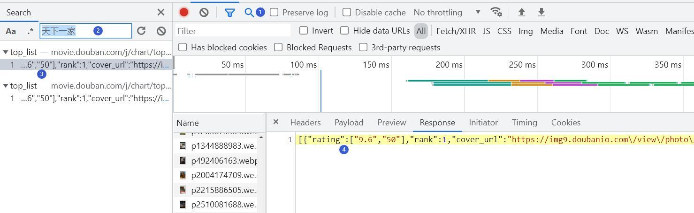

# 4. request模块

前面介绍了在浏览器中获取和查看网页的源代码，为了实现数据的自动获取，可以应用第三方库request，这个模块可以模拟浏览器发起HTTP或HTTPS协议的网络请求，从而实现利用python程序自动获取网页源代码的目的。request模块中发䞷多络请求的方法有get()和post()，get()的功能是向服务器发起获取网页的请求，该函数只获取资源，不会在服务器中执行修改操作。post()的功能是向服务器传送数据，服务器根据这些数据作出响应，post()函数经常 被用于模拟用户登录。

## 4.1 get()函数参数

### 1. headers

用于设置请求头信息，为防止爬取数据，很多服务器会对发起的请求进行身份验证，主要手段就是查看请求头中的“User-Agent”中描述请求方身份的信息。不同浏览器的“User-Agent”值不同，可以利用开发者工具查看请求头信息。打开开发者工具并切换到Network选项卡，单击“All”并刷新页面，在“Name”窗格会显示加载的数据包，单击主页的数据包，切换至“Headers”选项卡，在“Request Headers”下有一个名为“User-Agent”的参数，服务器就是通过这个参数值判断请求方的身份。

服务器对User-Agent信息进行识别后，若判定请求不是由浏览器发起的，就不会返回正确的页码源代码。因此，爬虫为了将自己模拟成浏览器，就需要在get()函数发起请求时加上headers参数，并为该参数设置合适的值。

.png)


```python
import requests  # 导入requests模块


# 网页头，模拟浏览器行为
headers = {'User-Agent': 'Mozilla/5.0 (Windows NT 10.0; Win64; x64) AppleWebKit/537.36 (KHTML, like Gecko) Chrome/100.0.4878.0 Safari/537.36'}
url = 'https://movie.douban.com/j/chart/top_list'
response = requests.get(url=url, headers=headers)

```

### 2. params

params参数用于在发送请求时携带动态参数，将用户参数发送给服务器，供服务器获取相关网页。

### 3. timeout

用于设置请求超时的时间。由于网络或其他原因，并不是每次请求都会被服务器接收到，如果一段时间内服务器还未返回响应结果，requests会重复发起请求，爬虫程序可能会挂起很长时间来等待响应结果的返回。适当设置参数值可以请求超时时抛出异常。


```python
import requests  # 导入requests模块

response = requests.get(url='https://www.baidu.com', timeout=1.0)
print(response.text)
```

### 4. proxies

用于设置代理服务器，网站会限制在短时间内发起大量请求的IP，为规避这种反爬手段，可使用代理服务代替实际的IP地址发起请求。

一些设计好后内容就不再变化的网页称为静态网页，这类网页上的数据是最容易获取的，可以用get()获取网页对象，再用text属性获取网页的源代码文本，再对文本进行解析获取其中的数据。


```python
import requests  # 导入requests模块

# 用get()方法请求url指定的网页，服务器返回一个响应对象，命名为response
response = requests.get(url='https://www.baidu.com')
print(response.text)         # text属性以文本的方式返回请求对象
# <!--STATUS OK--><html> <head><body link=#0000cc>...</body> </html>
```

get()响应对象分响应头和响应体两部分，例如响应头包含响应状态码、日期、内容类型和编码格式等信息。响应体包含了符串形式的网页源代码。响应对象的text属性可以以字符串形式提取响应对象中的网页源代码，输出响应对象的text属性值可以确定网页源代码是否成功获取到。


```python
import requests  # 导入requests模块

# 用get()方法请求url指定的网页，返回响应对象response
response = requests.get(url='https://www.baidu.com')
print(response)              # 返回对象<Response [200]> 
print(response.status_code)  # 返回状态码200
print(response.encoding)     # 返回自动解码得到的编码ISO-8859-1 
print(response.raw)          # 获取来自服务器的原始套接字响应
# <urllib3.response.HTTPResponse object at 0x0000023A8AD411B0>
print(response.headers)      # 获取响应头
# {'Cache-Control': 'private, no-cache, ... 'Transfer-Encoding': 'chunked'}
print(response.content)      # 以字节的方式返回请求对象
# b'<!DOCTYPE html>\r\n<!--STATUS OK--><html>...</body> </html>\r\n'
```

## 4.2 动态网页数据获取

动态网页是指服务器返回一个网页模板，数据通过其他方式填充到模板指定位置，想获取的数据一般在返回的数据中。一般来说，随浏览器滚动条下拉，网页上加载更多数据的就是动态加载，也可以利用开发者工具定位目标数据所在的数据包，再根据数据包的类型判断数据是否是动态加载。

在谷歌浏览器中打开豆瓣电影排行榜网站，在页面上的分类栏目中单击“音乐”分类，打开音乐类电影页面。按F12打开开发者工具，切换到Network选项卡，单击All按钮，按F5刷新页面，在左侧Name窗格中找到主页面的数据包（一般是第一个）并单击，在Name窗格切换到Response选项卡，按【Ctrl+F】调出搜索框，输入要爬取的数据，例如输入页面上第一条记录“天下一家”并回车，若搜索关键词存在于源代码中，就能在源代码中定位到该关键词，这里可以看到搜索结果为“0”，表明在源代码中没有该关键词，说明此网页上的数据是动态加载的。
此时单击开发者工具上方的放大镜图标，打开搜索框，输入关键词“天下一家”并回车，在搜索结果中单击数据包，即可定位到包含该 关键词的数据包。



然后就可以编写代码来爬取网页上的数据了。


```python
import requests  # 导入requests模块

# 网页头，模拟浏览器行为
headers = {'User-Agent':
           'Mozilla/5.0 (Windows NT 10.0; Win64; x64) AppleWebKit/537.36 (KHTML, like Gecko) Chrome/98.0.4758.9 Safari/537.36'}
url = 'https://movie.douban.com/j/chart/top_list'
# 浏览器传递参数，'limit': '2'表示只返回前2条数据，修改数字可以得到更多数据
data = {'type_name': '音乐', 
        'type': '14', 
        'interval_id': '100:90', 
        'action': '', 
        'start': '0', 
        'limit': '2'}
# 用get方法对网址发起请求并获取响应对象
response = requests.get(url=url, headers=headers, params=data)
result_json = response.json()  # 获取响应对象中JSON格式数据
print(result_json) 
```

可以得到排行榜前两条影片的数据：


```python
[{'rating': ['9.6', '50'], 'rank': 1,
  'cover_url': 'https://img9.doubanio.com/view/photo/s_ratio_poster/public/p2666794825.jpg', 'is_playable': False,
  'id': '3921776', 'types': ['音乐'], 'regions': ['美国'], 'title': '天下一家',
  'url': 'https://movie.douban.com/subject/3921776/', 'release_date': '1985-01-28', 'actor_count': 42,
  'vote_count': 967, 'score': '9.6',
  'actors': ['迈克尔·杰克逊', '雷·查尔斯', '简·方达', '莱昂纳尔·里奇', '达利尔·豪尔', '马龙·杰克逊', '鲍勃·迪伦', 'La Toya Jackson', '迪昂妮·沃威克',
             'Ruth Pointer', '艾尔·贾诺', '布鲁斯·斯普林斯汀', '兰迪·杰克逊', '肯尼·罗杰斯', '休易·路易斯', '韦伦·詹宁斯', '杰弗里·奥斯本', 'Anita Pointer',
             'Steve Perry', '约翰·欧兹', 'Dan Hill', '蒂托·杰克逊', '蒂娜·特纳', '昆西·琼斯', '黛安娜·罗斯', '比利·乔', '斯蒂夫·旺达', '辛迪·劳帕',
             '丹·艾克罗伊德', 'Lindsey Buckingham', 'Sheila E.', '杰基·杰克逊', '史摩基·罗宾逊', 'June Pointer', '保罗·西蒙', '威利·纳尔逊',
             '鲍勃·吉尔道夫', '金·卡恩丝', '肯尼·洛金斯', '哈里·贝拉方特', '詹姆斯·英格拉姆', '贝特·米德勒'], 'is_watched': False},
 {'rating': ['9.4', '50'], 'rank': 2,
  'cover_url': 'https://img2.doubanio.com/view/photo/s_ratio_poster/public/p2329626263.jpg', 'is_playable': False,
  'id': '20326557', 'types': ['剧情', '爱情', '音乐'], 'regions': ['法国'], 'title': '巴黎圣母院',
  'url': 'https://movie.douban.com/subject/20326557/', 'release_date': '1998', 'actor_count': 7, 'vote_count': 11854,
  'score': '9.4', 'actors': ['海伦娜·赛加拉', '加劳', '丹尼尔·拉沃伊', '布鲁诺·佩尔蒂埃', '帕特里克·费欧里', '拉克·默维尔', '朱丽叶·泽纳缇'],
  'is_watched': False}]

```

获取电影封面图片：


```python
img_url = result_json[0]['cover_url']  # 用列表索引和字典键索引从爬取的数据中取得封面的url地址
response = requests.get(url=img_url)   # 获取图片数据的响应对象
content = response.content             # content属性可提取图片的二进制字节码
with open('天下一家.jpg','wb') as fp:   # 以写二进制模式创建文件对象
    fp.write(content)                  # 将图片写入文件对象中
```


```python


```
