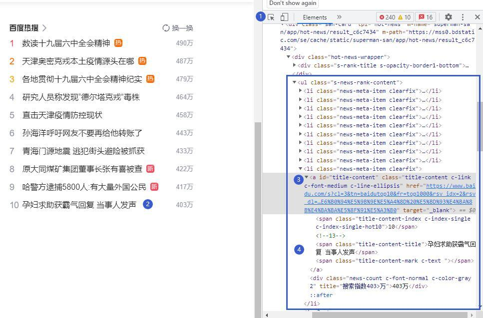

# 3. 网页结构
在百度首页上按F12打开开发者工具，可以快速获取百度热搜中的数据在源代码中的存放位置。单击开发者工具左上角的元素选择工具，鼠标移到百度页面上部，可以看到这个区域的内容来自id="head_wrapper" 的<div>。  
鼠标移到百度热搜区域，可以看到，排名前十的热搜新闻数据来自class="hot-news-wrapper"的<div >，<div>中有一个class="s-news-rank-content"的无序列表<ul >，列表中有10项class="news-meta-item clearfix"的项<li >，每项中用一个class="title-content-title"的<span>存放一条热点新闻标题，其中用一个<a>标签放置该条新闻的链接信息。  
热点新闻网页结果如图12-2所示。

如果能够获取class="title-content-title"的<span>中的文本就可以获取新闻标题，获取<a>标签中的href值就可以获取新闻的链接。

```python

```
